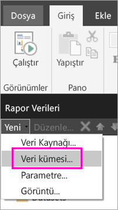
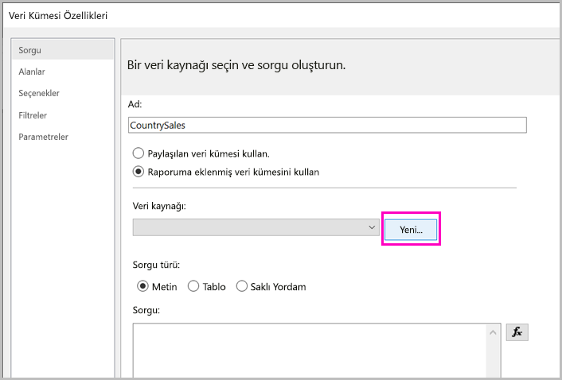
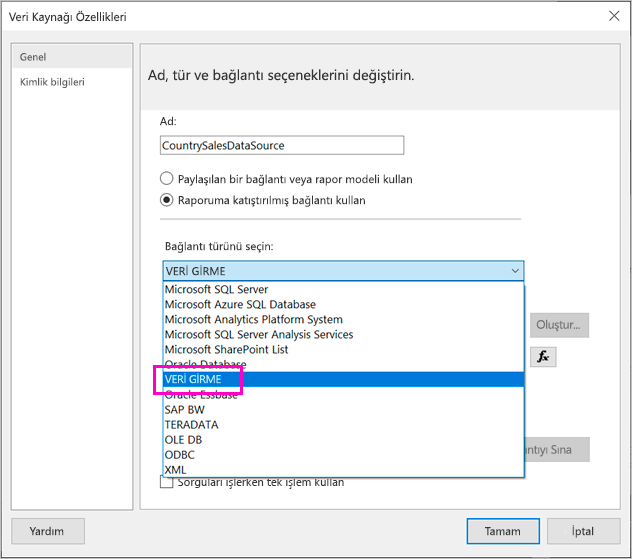
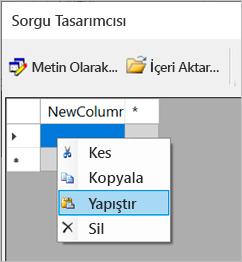
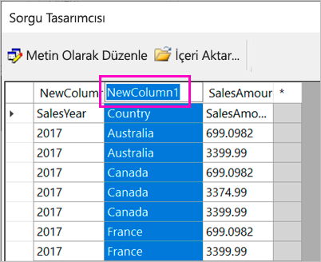
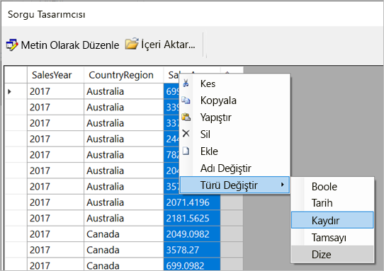
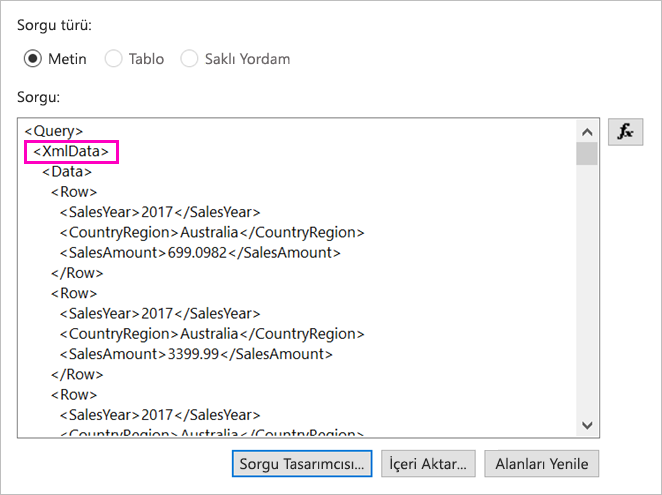
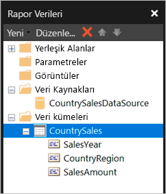

# <a name="enter-data-directly-in-a-paginated-report-in-report-builder---power-bi"></a>Rapor Oluşturucusu'nda verileri doğrudan sayfalandırılmış bir rapora girme - Power BI

[!INCLUDE [applies-to](../includes/applies-to.md)] [!INCLUDE [yes-service](../includes/yes-service.md)] [!INCLUDE [yes-paginated](../includes/yes-paginated.md)] [!INCLUDE [yes-premium](../includes/yes-premium.md)] [!INCLUDE [no-desktop](../includes/no-desktop.md)] 

Bu makalede, Microsoft Power BI Rapor Oluşturucusu’nun yeni sürümünde sağlanan ve verileri doğrudan RDL raporuna eklenmiş bir veri kümesi olarak girmenize olanak tanıyan özelliği öğreneceksiniz.  Bu özellik, Power BI Desktop'a benzer. Verileri doğrudan raporunuzdaki veri kümesine yazabilir veya Microsoft Excel gibi başka bir programdan yapıştırabilirsiniz. Verileri girerek veri kümesini oluşturduktan sonra, bunu aynı oluşturduğunuz diğer eklenmiş veri kümeleri gibi kullanabilirsiniz. Ayrıca, birden çok tablo ekleyebilir ve bir tabloyu diğeri için filtre olarak kullanabilirsiniz. Bu özellik rapor parametreleri gibi raporunuzda kullanmanız gerekebilecek küçük, statik veri kümelerinde özellikle kullanışlıdır.
 
## <a name="prerequisites"></a>Önkoşullar

- Verileri doğrudan bir sayfalandırılmış rapora girmek için [Power BI Rapor Oluşturucusu’nu indirip yükleyin](https://aka.ms/pbireportbuilder). 
- Sayfalandırılmış raporunuzu Power BI hizmetine kaydetmek için, [Power BI Pro hesabınız](../fundamentals/service-self-service-signup-for-power-bi.md) ve [Power BI Premium kapasitesindeki](../admin/service-premium-what-is.md) bir çalışma alanına yazma erişiminiz olmalıdır.
- Sayfalandırılmış raporunuzu bir rapor sunucusuna kaydetmek için, [RsReportServer.config dosyasını düzenleme](#upload-the-paginated-report-to-a-report-server) izinleriniz olmalıdır.

## <a name="create-a-data-source-and-dataset"></a>Veri kaynağı ve veri kümesi oluşturma

Rapor Oluşturucusu'nu indirip yükledikten sonra, raporunuza eklenmiş bir veri kaynağı ve veri kümesi yerleştirmek için kullandığınız iş akışının aynısını izlersiniz. Aşağıdaki yordamda, **Veri Kaynakları**'nın altında yeni bir seçenek görürsünüz: **Verileri Girin**.  Bu veri kaynağını raporda tek bir kez ayarlamanız yeterlidir. Bundan sonra, girilen verilerden (ayrı veri kümeleri olarak) hepsi bu tek veri kaynağını kullanan birden çok tablo oluşturabilirsiniz.

1. **Rapor Verileri** bölmesinde **Yeni** > **Veri Kümesi**’ni seçin.

    

1. **Veri Kümesi Özellikleri** iletişim kutusunda **Raporumda katıştırılmış veri kümesini kullan**'ı seçin.

1. **Veri kaynağı**'nın yanında **Yeni**'yi seçin.

    

1. **Veri Kaynağı Özellikleri** iletişim kutusunda **Raporumda katıştırılmış bağlantıyı kullan**'ı seçin.
2. **Bağlantı türünü seçin** kutusunda **VERİ GİR** > **Tamam**'ı seçin.

    

1. **Veri Kümesi Özellikleri** iletişim kutusuna dönüp **Sorgu Tasarımcısı**'nı seçin.
2. **Sorgu Tasarımcısı** bölmesinde, sağ tıklayıp verilerinizi tabloya yapıştırın.

    

1. Sütun adlarını ayarlamak için, her **NewColumn** öğesine çift tıklayın ve sütun adını yazın.

    

1. İlk satır özgün verilerden sütun başlıklarını içeriyorsa, sağ tıklayın ve bunları silin.
    
9. Varsayılan olarak, her sütunun veri türü Dize'dir. Veri türünü değiştirmek için, sütun başlığına sağ tıklayın > **Türü Değiştir**'e tıklayın ve bunu Tarih veya Kayan gibi farklı bir veri türüne ayarlayın.

    

1. Tabloyu oluşturmayı bitirdiğinizde **Tamam**'ı seçin.  

    Oluşturulan sorgu bir XML veri kaynağıyla görebileceğiniz sorguyla aynıdır. Arka planda, güvenli veri sağlayıcısı olarak XML kullanıyoruz.  Bu senaryoya da olanak tanımak için bunun amacını yeniden belirledik.

    

12. **Veri Kümesi Özellikleri** iletişim kutusunda **Tamam**'ı seçin.

13. Veri kaynağınızı ve veri kümenizi **Rapor Verileri** bölmesinde görürsünüz.

    

Raporunuzdaki veri görselleştirmeleri için, veri kümenizi temel olarak kullanabilirsiniz. Ayrıca bir veri kümesi daha ekleyebilir ve bunun için aynı veri kaynağını kullanabilirsiniz.

## <a name="design-the-report"></a>Raporu tasarlama

Artık bir veri kaynağına ve veri kümesine sahip olduğunuza göre raporunuzu oluşturabilirsiniz. Aşağıdaki yordam, önceki bölümdeki verileri temel alan basit bir rapor oluşturur.

1. **Ekle** menüsündeki **Tablo** > **Tablo Sihirbazı** seçeneğini belirleyin.

    :::image type="content" source="media/paginated-reports-enter-data/paginated-table-wizard.png" alt-text="Tablo Sihirbazı seçeneğini belirleme işleminin ekran görüntüsü.":::

1. Yeni oluşturduğunuz veri kümesini ve ardından **İleri**’yi seçin.

    :::image type="content" source="media/paginated-reports-enter-data/paginated-choose-dataset.png" alt-text="Veri kümesi seçme iletişim kutusunun ekran görüntüsü.":::

2.  Alanları düzenle sayfasında gruplandırma ölçütü olarak kullanmak istediğiniz alanları **Kullanılabilir alanlar** kutusundan **Satır grupları** kutusuna sürükleyin. Bu örnekte:

    - CountryRegion
    - SalesYear

3.  Toplamak istediğiniz alanları **Kullanılabilir alanlar** kutusundan **Değerler** kutusuna sürükleyin. Bu örnekte:

    - SalesAmount

    Varsayılan olarak, Rapor Oluşturucusu **Değerler** kutusundaki alanları toplar, ancak başka bir toplama da seçebilirsiniz.

    :::image type="content" source="media/paginated-reports-enter-data/paginated-select-aggregation.png" alt-text="Arasından seçim yapabileceğiniz farklı toplamaların ekran görüntüsü.":::
 
1. **İleri**’yi seçin.
4.  **Düzeni seçin** sayfasında, tüm varsayılan ayarları koruyun ama **Grupları genişlet/daralt**'ı temizleyin. Genel olarak, grupları genişletip daraltmak harika bir yöntemdir, ancak biz şu anda tüm verileri görmek istiyoruz.

5.  **Sonraki** > **Son** seçeneğini belirleyin. Tablo tasarım yüzeyinde görüntülenir.

    :::image type="content" source="media/paginated-reports-enter-data/paginated-design-view-matrix.png" alt-text="Tasarım görünümündeki raporun ekran görüntüsü.":::

### <a name="run-the-report"></a>Raporu çalıştırma

Gerçek değerleri görmek ve raporun önizlemesini görüntülemek için raporu çalıştırın.

1. **Giriş** şeridinde **Çalıştır**’ı seçin.

    :::image type="content" source="media/paginated-reports-enter-data/paginated-run-report.png" alt-text="Giriş şeridinde Çalıştır seçeneğini belirleme işleminin ekran görüntüsü.":::

    Artık değerleri görürsünüz. Matrisin Tasarım görünümünde gördüğünüzden daha fazla satır vardır!  Sayfayı biçimlendirebilir veya yerel bilgisayarınıza kaydetmeden ya da hizmete yayımlamadan önce varsayılan ayarları kullanmaya karar verebilirsiniz.

1. Raporunuzun yazdırıldığında nasıl görüneceğini görmek için **Yazdırma Düzeni**’ni seçin.

    :::image type="content" source="media/paginated-reports-enter-data/paginated-select-print.png" alt-text="Yazdırma Düzeni seçeneğini belirleme işleminin ekran görüntüsü.":::

    Artık yazdırılmış bir sayfada nasıl görüneceğini görebilirsiniz.

    :::image type="content" source="media/paginated-reports-enter-data/paginated-print-layout.png" alt-text="Raporun yazdırma görünümündeki ekran görüntüsü.":::

## <a name="upload-the-paginated-report-to-the-power-bi-service"></a>Power BI hizmetinde sayfalandırılmış raporu karşıya yükleme

Artık sayfalandırılmış raporlar Power BI hizmetinde desteklendiği için, sayfalandırılmış raporunuzu Premium kapasiteye yükleyebilirsiniz. Ayrıntılar için bkz. [Sayfalandırılmış raporu karşıya yükleme](paginated-reports-save-to-power-bi-service.md).

## <a name="upload-the-paginated-report-to-a-report-server"></a>Sayfalandırılmış raporu rapor sunucusuna yükleme

Sayfalandırılmış raporunuzu Power BI Rapor Sunucusu'na, SQL Server Reporting Services 2016 veya 2017 rapor sunucusuna da yükleyebilirsiniz. Bunu yapmadan önce, aşağıdaki öğeyi ek veri uzantısı olarak RsReportServer.config dosyanıza eklemeniz gerekir. Herhangi bir sorunla karşılaşma olasılığına karşı, değişikliği yapmadan önce RsReportServer.config dosyanızı yedekleyin.

```xml
<Extension Name="ENTERDATA" Type="Microsoft.ReportingServices.DataExtensions.XmlDPConnection,Microsoft.ReportingServices.DataExtensions">
    <Configuration>
        <ConfigName>ENTERDATA</ConfigName>
    </Configuration>
</Extension>
```

Dosyayı düzenledikten sonra, yapılandırma dosyasındaki veri sağlayıcıları listesi şöyle görünmelidir:


İşte bu kadar. Artık bu yeni işlevselliği kullanan raporları rapor sunucunuzda yayımlayabilirsiniz.

## <a name="next-steps"></a>Sonraki adımlar

- [Power BI Premium’da sayfalandırılmış raporlar nelerdir?](paginated-reports-report-builder-power-bi.md)
- [Power BI Rapor Sunucusu nedir?](../report-server/get-started.md)
