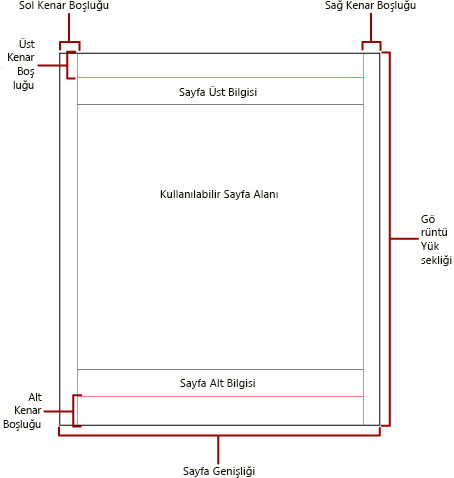
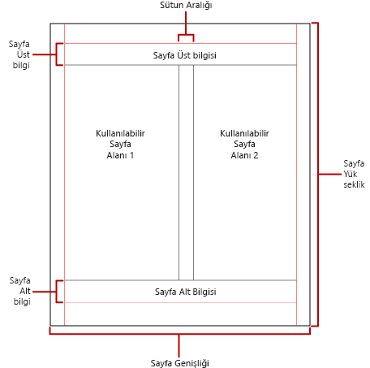

# Power BI sayfalandırılmış raporlarında sayfalandırma

[!INCLUDE [applies-to](../includes/applies-to.md)] [!INCLUDE [yes-service](../includes/yes-service.md)] [!INCLUDE [yes-paginated](../includes/yes-paginated.md)] [!INCLUDE [yes-premium](../includes/yes-premium.md)] [!INCLUDE [no-desktop](../includes/no-desktop.md)] 

 *Sayfalandırma* , bir raporda yer alan sayfa sayısını ve rapor öğelerinin bu sayfalardaki yerleşimini ifade eder. Power BI sayfalandırılmış raporlardaki sayfalandırma, raporu görüntüleyip teslim etmek için kullandığınız işleme uzantısına göre farklılık gösterir. Rapor, bir rapor sunucusunda çalıştırıldığında HTML işleyici kullanılır. HTML, belirli bir sayfalandırma kuralları kümesini takip eder. Örneğin aynı raporu PDF'ye aktarırsanız, farklı bir kural kümesinin kullanıldığı PDF işleyicisini kullanırsınız. Dolayısıyla rapor farklı sayfalandırılır. Power BI sayfalandırılmış raporlarında sayfalandırmayı denetleyen kuralları anlamanız gerekir. Bundan sonra raporunuzu vermek için kullanmayı planladığınız işleyici için iyileştirdiğiniz, okuması kolay bir raporu başarıyla tasarlayabilirsiniz.  
  
 Bu konu başlığı altında, fiziksel sayfa boyutunun ve rapor düzeninin, sabit sayfa sonu oluşturucuların raporu işleme biçimi üzerindeki etkisi ele alınır. Fiziksel sayfa boyutu ile kenar boşluklarını değiştirmeye ve raporu sütunlara ayırmaya yönelik özellikleri ayarlayabilirsiniz. Bunun için **Rapor Özellikleri** bölmesini, **Özellikler** bölmesini veya **Sayfa Düzeni** iletişim kutusunu kullanın. **Rapor Özellikleri** bölmesine rapor gövdesinin dışındaki mavi alana tıklayarak erişin. Giriş sekmesinde **Çalıştır** ’a tıklayıp Çalıştır sekmesinde **Sayfa Düzeni** seçeneğine tıklayarak **Sayfa Düzeni** iletişim kutusuna erişin.  
  
> [!NOTE]  
>  Raporu bir sayfa genişliğinde olacak şekilde tasarlamanıza rağmen rapor birden fazla sayfa genişliğinde işlendiyse, rapor gövdesinin genişliğinin (kenar boşlukları dahil) fiziksel sayfa boyutu genişliğinden büyük olup olmadığını denetleyin. Raporunuza boş sayfaların eklenmesini önlemek için kapsayıcının köşesini sola sürükleyerek kapsayıcı boyutunu azaltabilirsiniz.  

## Rapor gövdesi  
 Rapor gövdesi, tasarım yüzeyinde boşluk olarak gösterilen dikdörtgen kapsayıcıdır. İçinde bulunan rapor öğelerini barındırmak için büyüyüp küçülebilir. Rapor gövdesi fiziksel sayfa boyutunu yansıtmaz. Gerçekten de, rapor gövdesi birden çok rapor sayfasını kapsayacak şekilde fiziksel sayfa boyutunun sınırları ötesinde büyütülebilir. Bazı işleyiciler, sayfanın içeriğine bağlı olarak büyüyen veya küçülen raporları işler. Bu biçimlerde işlenen raporlar, Web tarayıcısında görüntüleme gibi amaçlarla ekran tabanlı görüntülemeye yönelik olarak iyileştirilir. Microsoft Excel, Word, HTML ve MHTML gibi bu işleyiciler, gerekli durumlarda dikey sayfa sonları ekler.  
  
 Rapor gövdesini kenarlık rengi, kenarlık stili ve kenarlık genişliği gibi denetimlerle biçimlendirebilirsiniz. Arka plan rengi ve arka plan görüntüsü de ekleyebilirsiniz.  
  
## Fiziksel sayfa  
 Fiziksel sayfa boyutu kağıt boyutudur. Raporda belirttiğiniz kağıt boyutu raporun işlenme biçimini denetler. Sabit sayfa sonu biçimleriyle işlenen raporlar, sayfa sonlarını fiziksel sayfanın boyutuna göre yatay ve dikey olarak ekler. Bu sayfa sonları, sabit sayfa sonu dosya biçiminde yazdırıldığında veya görüntülendiğinde iyileştirilmiş bir okuma deneyimi sağlar. Değişebilir sayfa sonu biçimleriyle işlenen raporlar, sayfa sonlarını fiziksel boyuta göre yatay olarak ekler. Bir kez daha belirtmek gerekirse, Web tarayıcısında görüntülenirken sayfa sonları iyileştirilmiş bir okuma deneyimi sağlar.  
  
 Sayfa boyutu, varsayılan olarak 8,5 x 11 inçtir (21,59 x 27,94 santimetre). Ancak, bu boyutu **Rapor Özellikleri** bölmesinden, **Sayfa Düzeni** iletişim kutusundan veya **Özellikler** bölmesindeki PageHeight ve PageWidth özelliklerini değiştirerek ayarlayabilirsiniz. Sayfa boyutu, rapor gövdesinin içeriklerine uyum sağlayacak şekilde büyümez veya küçülmez. Raporun tek bir sayfada görünmesini istiyorsanız, rapor gövdesindeki tüm içeriklerin fiziksel sayfaya sığması gerekir. Sabit sayfa sonlu biçimi kullanıyorsanız ve içerikler sığmıyorsa, rapora ek sayfa eklenmesi gerekir. Rapor gövdesi fiziksel sayfanın sağ kenarından dışarı taşarsa, sayfa sonu yatay olarak eklenir. Rapor gövdesi fiziksel sayfanın alt kenarından dışarı taşarsa, sayfa sonu dikey olarak eklenir.  
  
 Raporda tanımlanan fiziksel sayfa boyutunu geçersiz kılabilirsiniz. Raporu dışarı aktarmak için kullandığınız işleyicinin Cihaz Bilgileri ayarlarını kullanarak fiziksel sayfa boyutunu belirtin. Tam liste için SQL Server Reporting Services belgelerindeki [İşleme Uzantıları için Cihaz Bilgisi Ayarları](/sql/reporting-services/device-information-settings-for-rendering-extensions-reporting-services) bölümüne bakın.  
  
### Kenar boşlukları

Kenar boşlukları, fiziksel sayfa boyutlarının kenarından içeri doğru, belirtilen kenar boşluğu ayarına göre Rapor Sunucusu tarafından çizilir. Bir rapor öğesi kenar boşluğu alanına uzanırsa, çakışan alanın işlenmemesi için bu öğe kırpılır. Kenar boşluğu boyutlarını sayfanın yatay veya dikey genişliğinin sıfıra eşit olmasına neden olacak şekilde belirtirseniz, kenar boşlukları varsayılan olarak sıfır değerine ayarlanır. Kenar boşluklarını, **Rapor Özellikleri** bölmesinde veya **Sayfa Düzeni** iletişim kutusunda belirtebilir veya **Özellikler** bölmesinde TopMargin, BottomMargin, LeftMargin ve RightMargin özelliklerini değiştirerek ayarlayabilirsiniz. Raporda tanımlanan kenar boşluğu boyutunu geçersiz kılmak için, raporu dışarı aktarmak amacıyla kullandığınız işleyiciye yönelik Cihaz Bilgisi ayarlarını kullanarak kenar boşluğu boyutunu belirtin.  
  
 *Kullanılabilir sayfa alanı* fiziksel sayfanın kenar boşlukları, sütun aralığı, sayfa üst bilgisi ve alt bilgisi için ayrılan alanlardan sonra kalan alanıdır. Kenar boşlukları yalnızca raporları sabit sayfa sonu işleyici biçimlerinde işlediğinizde ve yazdırdığınızda uygulanır. Aşağıdaki görüntü, fiziksel sayfanın kenar boşluklarını ve kullanılabilir sayfa alanını gösterir.  
  
 
  
### Bülten stili sütunlar  

 Raporunuz, bir gazetedeki sütunlar gibi sütunlara bölünebilir. Sütunlar, aynı *fiziksel* sayfada işlenen *mantıksal* sayfalar olarak değerlendirilir. Sütunlar, soldan sağa ve yukarıdan aşağıya yönde düzenlenirler, her sütunun arasında bulunan boşlukla ayrılırlar. Rapor birden fazla sütuna bölünmüşse her fiziksel sayfa dikey olarak sütunlara bölünür. Her sütun bir mantıksal sayfa olarak kabul edilir. Örneğin, fiziksel sayfada iki sütunun olduğunu varsayalım. Raporunuzun içeriği önce ilk sütunu, sonra da ikinci sütunu doldurur. Rapor ilk iki sütuna tamamen sığmazsa, sonraki sayfada yer alan ilk ve ikinci sütunları doldurur. Sütunlar, tüm rapor öğeleri işlenene kadar soldan sağa ve yukarıdan aşağıya yönde doldurulmaya devam eder. Sütun boyutlarını yatay veya dikey genişliğin sıfıra eşit olmasına neden olacak şekilde belirtirseniz, sütun boşlukları varsayılan olarak sıfır değerine ayarlanır.  
  
 Sütunları, **Rapor Özellikleri** bölmesinde veya **Sayfa Düzeni** iletişim kutusunda belirtebilir veya **Özellikler** bölmesinde TopMargin, BottomMargin, LeftMargin ve RightMargin özelliklerini değiştirerek ayarlayabilirsiniz. Tanımlanmamış bir kenar boşluğu boyutu kullanmak için, raporu dışarı aktardığınız işleyiciye yönelik Cihaz Bilgisi ayarlarını kullanarak kenar boşluklarını belirtin. Sütunlar yalnızca raporları PDF veya Resim biçimlerinde işleyip yazdırdığınızda uygulanır. Aşağıdaki görüntü, sütunlu bir sayfanın kullanılabilir sayfa alanını gösterir.  
  

  
## Sayfa sonları ve sayfa adları

 Raporda sayfa adları olduğunda rapor daha okunabilir olabilir ve verileri daha kolayca denetlenip dışarı aktarılabilir. Rapor Oluşturucusu şu öğelere yönelik özellikler sağlar:

- reports
- tablo, matris ve liste veri bölgeleri
- gruplar
- Rapordaki dikdörtgenler sayfalandırmayı denetlemek, sayfa numaralarını sıfırlamak ve sayfa sonlarında yeni rapor sayfası adları sağlamak için kullanılır. 
 
Bu özellikler, raporların işlendiği biçimden bağımsız olarak raporları geliştirebilir. Bunlar, özellikle raporları Excel çalışma kitaplarına dışarı aktarırken yararlıdır.

> [!NOTE]
> Tablo, matris ve liste veri bölgelerinin tümü arka planda aynı türden veri bölgesidir: *Tablix*. Bu nedenle, bu adla karşılaşabilirsiniz. 

 InitialPageName özelliği raporun ilk sayfasının adını sağlar. Raporunuz sayfa sonları için sayfa adları içermiyorsa, sayfa sonları tarafından oluşturulan tüm yeni sayfalar için ilk sayfa adı kullanılır. İlk sayfa adı kullanmanız gerekli değildir.  
  
 İşlenen rapor, sayfa sonunun neden olduğu yeni sayfa için bir yeni sayfa adı sağlayabilir. Sayfa adını sağlamak için bir tablo, matris, liste, grup veya dikdörtgenin PageName özelliğini ayarlarsınız. Sayfa sonlarında sayfa adlarını belirtmeniz gerekmez. Belirtmezseniz, bunun yerine InitialPageName’in değeri kullanılır. InitialPageName özelliği de boşsa, yeni sayfanın adı olmaz.  
  
 Tablo, matris ve liste veri bölgeleri, gruplar ile dikdörtgenler sayfa sonlarını destekler.  
  
 Sayfa sonu aşağıdaki özellikleri içerir:  
  
- **BreakLocation** özelliği, sayfa sonunun etkinleştirildiği rapor öğesi için sayfa sonunun konumunu (başta, sonda veya hem başta hem de sonda) sağlar. Gruplarda, BreakLocation grupların arasında da yer alabilir.  
  
- **Disabled** özelliği, rapor öğesine bir sayfa sonunun uygulanıp uygulanmadığını gösterir. Bu özelliğin değeri True olduğunda sayfa sonu yoksayılır. Bu özellik, rapor çalıştırıldığında ifadeleri temel alarak sayfa sonlarını dinamik bir şekilde devre dışı bırakmak için kullanılır.  
  
- **ResetPageNumber** özelliği, sayfa sonu oluştuğunda sayfa numarasının 1’e sıfırlanıp sıfırlanmayacağını gösterir. Bu özelliğin değeri True olduğunda sayfa numarası sıfırlanır.  
  
 BreakLocation özelliğini **Tablix Özellikleri** , **Dikdörtgen Özellikleri** veya **Grup Özellikleri** iletişim kutularında ayarlayabilirsiniz. Ancak Disabled, ResetPageNumber ve PageName özelliklerini Rapor Oluşturucusu Özellikleri bölmesinde ayarlamanız gerekir. Özellikler bölmesi kategoriye göre düzenlendiyse, özellikleri **PageBreak** kategorisinde bulabilirsiniz. Gruplar için **PageBreak** kategorisi **Group** kategorisinin içinde yer alır.  
  
 Disabled ve ResetPageNumber özelliklerinin değerlerini ayarlamak için sabitlerin yanı sıra basit ve karmaşık ifadeleri de kullanabilirsiniz. Ancak, BreakLocation özelliği ile ifade kullanamazsınız. İfadeleri yazma ve kullanma hakkında daha fazla bilgi edinmek için bkz. [Power BI Rapor Oluşturucusu’ndaki ifadeler](report-builder-expressions.md).  
  
 Raporunuzda, **Globals** koleksiyonunu kullanarak mevcut sayfa adlarına veya sayfa numaralarına başvuran ifadeleri yazabilirsiniz. Daha fazla bilgi için, Rapor Oluşturucusu ve Reporting Services belgelerindeki [Yerleşik Genel Değişkenler ve Kullanıcı Başvuruları](/sql/reporting-services/report-design/built-in-collections-built-in-globals-and-users-references-report-builder) bölümüne bakın.
  
### Excel çalışma sayfası sekmelerini adlandırma

 Bu özellikler, raporları Excel çalışma kitapları olarak dışarı aktardığınızda yararlı olur. Raporu dışarı aktarırken çalışma sayfası sekmesi için bir varsayılan ad belirtmek amacıyla InitialPage özelliğini, her çalışma sayfası için farklı adlar sağlamak amacıyla da sayfa sonlarını ve PageName özelliğini kullanın. Sayfa sonuyla tanımlanan her yeni rapor sayfası, PageName özelliğinin değeriyle adlandırılan farklı bir çalışma sayfasına aktarılır. PageName özelliği boş olmasına rağmen raporun ilk sayfa adı bulunuyorsa, Excel çalışma kitabındaki tüm çalışma sayfaları aynı adı (ilk sayfa adını) kullanır.  
  
 Raporlar Excel’e aktarıldığında bu özelliklerin nasıl çalıştığı hakkında daha fazla bilgi edinmek için, Rapor Oluşturucusu ve Reporting Services belgelerindeki [Microsoft Excel’e Aktarma](/sql/reporting-services/report-builder/exporting-to-microsoft-excel-report-builder-and-ssrs) bölümüne bakın.  
  
## Sonraki adımlar

- [Power BI hizmetinde sayfalandırılmış rapor görüntüleme](../consumer/paginated-reports-view-power-bi-service.md)
- [Sayfalandırılmış raporları yazdırırken boş sayfalardan kaçınma](../guidance/report-paginated-blank-page.md)
- Başka bir sorunuz mu var? [Power BI Topluluğu'na başvurun](https://community.powerbi.com/)
