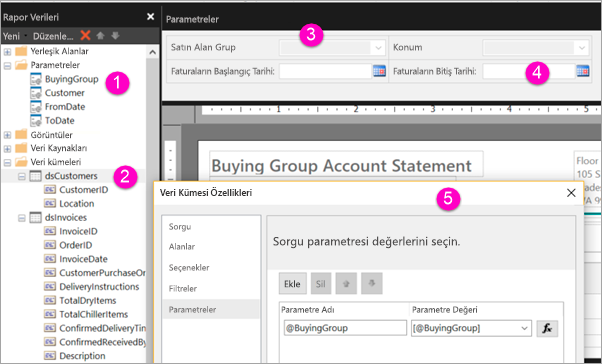

# Power BI hizmetinde sayfalandırılmış raporlar için parametreler oluşturma

Bu makalede, Power BI hizmetinde sayfalandırılmış raporlar için parametreler oluşturma hakkında bilgi edineceksiniz.  Rapor parametresi, rapor verilerini seçmenin ve raporu sunusunu çeşitlendirmenin bir yolunu sağlar. Varsayılan bir değer veya kullanılabilir değerlerin bir listesini sağlayabilirsiniz ve seçiminiz raporu okuyanlar tarafından değiştirilebilir.  

Aşağıdaki çizimde Tasarım görünümü, @BuyingGroup, @Customer, @FromDate ve @ToDate parametreleri ile birlikte bir rapor için Power BI Rapor Oluşturucusu’nda gösterilmektedir. 
  

  
1.  Rapor Verileri bölmesindeki rapor parametreleri.  
  
2.  Veri kümesindeki parametrelerden biri ile birlikte tablo.  
  
3.  Parametreler bölmesi. Parametrelerin düzenini parametreler bölmesinde özelleştirebilirsiniz. 
  
4.  @FromDate ve @ToDate parametreleri **DateTime** veri türüne sahiptir. Raporu görüntülerken, metin kutusuna bir tarih girebilir veya takvim denetiminden bir tarih seçebilirsiniz. 

5.  **Veri Kümesi Özellikleri** iletişim kutusundaki parametrelerden biri.  

  
## Rapor parametresi oluşturma veya düzenleme  
  
1.  Sayfalandırılmış raporunuzu Power BI Rapor Oluşturucusu'nda açın.

1. **Rapor Verileri** bölmesinde **Parametreler** düğümüne sağ tıklayın > **Parametre Ekle**’yi seçin. **Rapor Parametresi Özellikleri** iletişim kutusu açılır.  
  
2.  **Ad** alanına parametre için bir ad girin ya da varsayılan adı kabul edin.  
  
3.  **İstem** alanına, kullanıcı raporu çalıştırdığında parametre metin kutusunun yanında görünecek metni yazın.  
  
4.  **Veri türü** alanında parametre değeri için veri türünü seçin.  
  
5.  Parametre boş bir değer içeriyorsa **Boş değere izin ver**’i seçin.  
  
6.  Parametre bir null değer içeriyorsa **Null değere izin ver**’i seçin.  
  
7.  Kullanıcının bir parametre için birden fazla değer seçmesine izin vermek için **Birden çok değere izin ver**’i seçin.  
  
8.  Görünürlük seçeneğini ayarlayın.  
  
    -   Parametreyi raporun üst kısmındaki araç çubuğunda göstermek için **Görünür**’ü seçin.  
  
    -   Araç çubuğunda gösterilmemesi için parametreyi gizlemek istiyorsanız **Gizli**’yi seçin.  
  
    -   Parametreyi gizlemek ve rapor yayımlandıktan sonra rapor sunucusunda değiştirilmeye karşı korumak için **İç**’i seçin. Bu durumda rapor parametresi yalnızca rapor tanımında görüntülenebilir. Bu seçenek için bir varsayılan değer ayarlamanız ya da parametrenin bir null değeri kabul etmesine izin vermeniz gerekir.  
  
9. **Tamam**’ı seçin. 

## Önemli noktalar ve sorun giderme

- Veri kaynağınız olarak Power BI veri kümesini veya Analysis Services modelini kullanıyorsanız, DAX sınırlamalarına göre tek istekte 1.000'den fazla parametre değeri geçiremezsiniz. 

 
## Sonraki adımlar

Parametrelerin Power BI hizmetinde nasıl göründüğünü görmek için bkz. [Sayfalandırılmış raporlar için parametreleri görüntüleme](../consumer/paginated-reports-view-parameters.md).

Sayfalandırılmış raporlardaki parametreler hakkında ayrıntılı bilgi için bkz. [Power BI Rapor Oluşturucusu'nda rapor parametreleri](report-builder-parameters.md).
