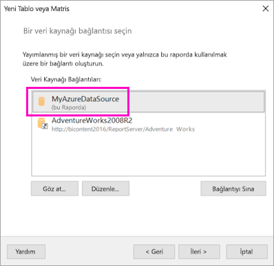
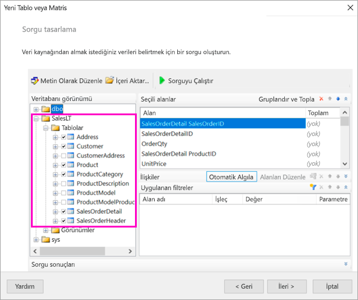
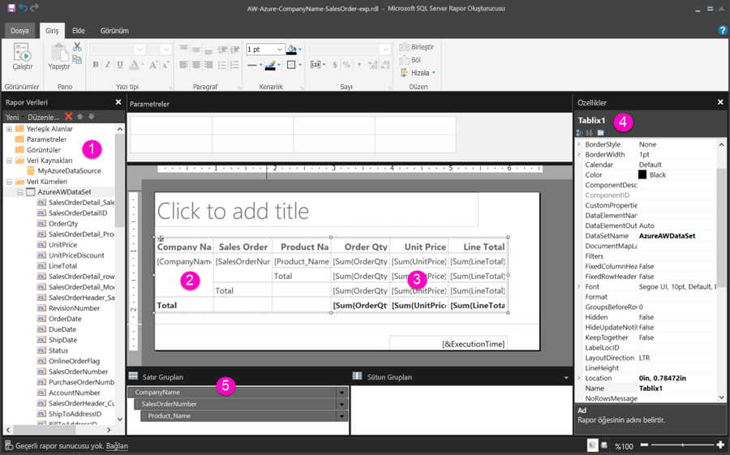
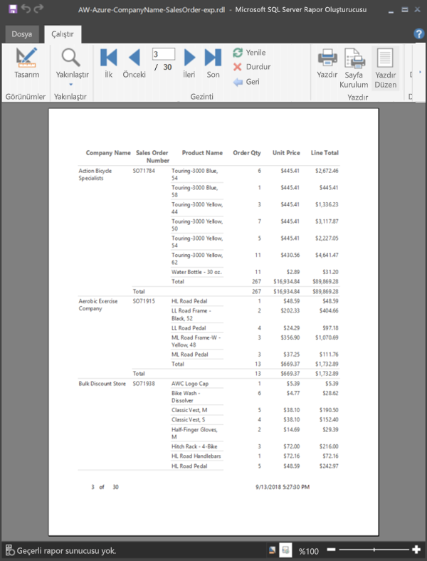

# Öğretici: Sayfalandırılmış rapor oluşturma ve bu raporu Power BI hizmetine yükleme

Bu öğreticide, örnek bir Azure SQL veritabanına bağlanırsınız. Ardından Power BI Rapor Oluşturucusu'ndaki sihirbazı kullanarak birden çok sayfaya yayılmış bir tablosu olan sayfalandırılmış raporu oluşturursunuz. Sayfalandırılmış raporu Power BI hizmetinde Premium kapasitedeki bir çalışma alanına yüklersiniz.

Bu öğreticide tamamladığınız adımlar şunlardır:

> [!div class="checklist"]
> * Azure örnek veritabanını oluşturma.
> * Power BI Rapor Oluşturucusu'nda sihirbaz yardımıyla bir matris oluşturma.
> * Raporu her sayfada başlık, sayfa numaraları ve sütun başlıklarıyla biçimlendirme.
> * Para birimini biçimlendirme.
> * Raporu Power BI hizmetine yükleme.

Azure aboneliğiniz yoksa başlamadan önce [ücretsiz bir hesap](https://azure.microsoft.com/free/?WT.mc_id=A261C142F) oluşturun.
 
## Önkoşullar  

Sayfalandırılmış rapor oluşturmanın önkoşulları şunlardır:

- [Power BI Rapor Oluşturucusu'nu Microsoft İndirme Merkezi'nden](https://go.microsoft.com/fwlink/?linkid=2086513) yükleyin. 

- [Azure portalda Azure SQL veritabanı örneği oluşturma](https://docs.microsoft.com/azure/sql-database/sql-database-get-started-portal) hızlı başlangıcını izleyin. Değeri **Genel bakış** sekmesinin **Sunucu adı** kutusuna kopyalayın ve kaydedin. Azure'da oluşturduğunuz kullanıcı adını ve parolayı unutmayın.

Sayfalandırılmış raporunuzu Power BI hizmetine yüklemeye yönelik önkoşullar şunlardır:

- [Power BI Pro lisansına](../admin/service-admin-licensing-organization.md) ihtiyacınız vardır.
- Hizmette [Power BI Premium kapasitesinde](../admin/service-premium-what-is.md) bir çalışma alanınız olmalıdır. Çalışma alanı adının yanında  bulunur.

## Sihirbazla matris oluşturma
  
1.  Bilgisayarınızdan Power BI Rapor Oluşturucusu'nu başlatın.  
  
     **Kullanmaya Başlama** iletişim kutusu açılır.  
  
     
  
1.  Sol bölmede **Yeni Rapor**'un seçili olduğundan emin olun ve sağ bölmede **Tablo ve Matris Sihirbazı**'nı seçin.  
  
4.  **Veri kümesi seçin** sayfasında **Veri kümesi oluştur** > **İleri**'yi seçin.  

    
  
5.  **Bir veri kaynağı bağlantısı seçin** sayfasında **Yeni**'yi seçin. 

    
  
     **Veri Kaynağı Özellikleri** iletişim kutusu açılır.  
  
6.  Veri kaynağını istediğiniz gibi adlandırabilir, karakterleri ve alt çizgileri kullanabilirsiniz. Bu öğreticide, **Ad** kutusuna **AzureVeriKaynağım** yazın.  
  
7.  **Bağlantı türünü seçin** kutusunda **Microsoft Azure SQL Veritabanı**'nı seçin.  
  
8.  **Bağlantı dizesi** kutusunun yanında **Oluştur**'u seçin. 

    

9. **Azure'da:** Azure portalına gidin ve **SQL veritabanları**'nı seçin.

1. Bu makalenin **Önkoşullar** bölümünde, "Azure portalda Azure SQL veritabanı örneği oluşturma" hızlı başlangıcında oluşturduğunuz Azure SQL veritabanını seçin.

1. **Genel bakış** sekmesinde, **Sunucu adı** kutusundaki değeri kopyalayın.

2. **Rapor Oluşturucusu'nda**: Kopyaladığınız sunucu adını **Bağlantı Özellikleri** iletişim kutusundaki **Sunucu adı**'nın altına yapıştırın. 

1. **Sunucuda oturum açın** bölümünde **SQL Server Kimlik Doğrulaması kullan**'ın seçildiğinden emin olun, sonra Azure'da örnek veritabanı için oluşturduğunuz kullanıcı adını ve parolayı yazın.

1. **Veritabanına bağlan** bölümünde, aşağı açılan oku seçtikten sonra Azure'da oluşturduğunuz veritabanı adını seçin.
 
    

1. **Bağlantıyı Sına**'yı seçin. **Test sonuçları** olarak **Sınama bağlantısı başarılı** iletisini görürsünüz.

1. **Tamam** > **Tamam**'ı seçin. 

   Şimdi Rapor Oluşturucusu, **Bağlantı dizesi** kutusunda az önce oluşturduğunuz bağlantı dizesini görüntüler. 

    

1. **Tamam**’ı seçin.
  
9. **Bir veri kaynağı bağlantısı seçin** sayfasında, az önce oluşturduğunuz veri kaynağı bağlantısının altında "(bu Raporda)" ifadesini görürsünüz. Bu veri kaynağını > **İleri**'yi seçin.  

    

10. Kutuya aynı kullanıcı adını ve parolayı yazın. 
  
10. **Sorgu tasarla** sayfasında SalesLT'yi genişletin, Tables'ı genişletin ve şu tabloları seçin:

    - Adres
    - Müşteri
    - Ürün
    - ProductCategory
    - SalesOrderDetail
    - SalesOrderHeader

     **İlişkiler** > **Otomatik Algıla** seçili olduğundan, Rapor Oluşturucusu bu tablolar arasındaki ilişkileri algılar. 
    
    
 
1.  **Sorgu Çalıştır**'ı seçin. Rapor Oluşturucusu **Sorgu sonuçları**'nı görüntüler. 
 
     

18. **İleri**’yi seçin. 

19. **Veri kümesi seçin** sayfasında, az önce oluşturduğunuz veri kümesini > **İleri**'yi seçin.

    

1. **Alanları düzenle** sayfasında, bu alanları **Kullanılabilir alanlar** kutusundan **Satır grupları** kutusuna sürükleyin:

    - CompanyName
    - SalesOrderNumber
    - Product_Name

1. Bu alanları **Kullanılabilir alanlar** kutusundan **Değerler** kutusuna sürükleyin:

    - OrderQty
    - UnitPrice
    - LineTotal

    Rapor Oluşturucusu, **Değerler** kutusundaki alanların otomatik olarak toplanmasını sağlar.

    

24. **Düzeni seçin** sayfasında, tüm varsayılan ayarları koruyun ama **Grupları genişlet/daralt**'ı temizleyin. Genel olarak, grupları genişletme/daraltma özelliği çok yararlıdır ama bu kez tablonun birden çok satıra kaydırılmasını istiyorsunuz.

1. **Sonraki** > **Son** seçeneğini belirleyin. Tablo tasarım yüzeyinde görüntülenir.
 
## Oluşturduklarınız

Şimdi bir dakika duralım ve sihirbazın sonuçlarına göz atalım.

1. Rapor Verileri bölmesinde, eklenmiş Azure veri kaynağını ve bunu temel alan eklenmiş veri kümesini görürsünüz (her ikisini de siz oluşturdunuz). 

2. Tasarım yüzeyinin genişliği 6 inç kadardır. Tasarım yüzeyinde, sütun başlıklarının ve yer tutucu değerlerin görüntülendiği matrisi görürsünüz. Matrisin altı sütunu vardır ve yalnızca beş satır uzunluğunda görünür. 

3. Order Qty, Unit Price ve Line Total sütunlarının hepsi toplamdır ve her satır grubunun bir alt toplamı vardır. 

    Hala gerçek veri değerlerini görmüyorsunuz. Bunları görmek için raporu çalıştırmanız gerekir.

4. Özellikler bölmesinde, seçimi matrisin adı Tablix1'dir. Rapor Oluşturucusu'nda *Tablix*, verileri satırlar ve sütunlar halinde görüntüleyen bir veri bölgesidir. Bu bir tablo veya matris olabilir.

5. Gruplandırma bölmesinde, sihirbazda oluşturduğunuz üç satır grubunu görürsünüz: 

    - CompanyName
    - Satış Siparişi
    - Ürün Adı

    Bu matrisin sütun grubu yoktur.

### Raporu çalıştırma

Gerçek değerleri görmek için raporu çalıştırmanız gerekir.

1. **Giriş** araç çubuğunda **Çalıştır**'ı seçin.

   Artık değerleri görürsünüz. Matrisin Tasarım görünümünde gördüğünüzden çok daha fazla satırı vardır! Rapor Oluşturucusu'nda sayfa **1** / **2?** gösterildiğine dikkat edin. Rapor Oluşturucusu raporu mümkün olan en kısa sürede yükler, dolayısıyla bir kerede yalnızca birkaç sayfaya yetecek kadar veri alır. Soru işareti, Rapor Oluşturucusu'nun henüz tüm verileri yüklemediğini gösterir.

   

2. **Yazdırma Düzeni**'ni seçin. Yazdırdığınızda raporun biçimi böyle olacaktır. Rapor Oluşturucusu artık raporun 33 sayfa olduğunu biliyordur ve alt bilgiye otomatik olarak tarih ve saat eklemiştir.

## Raporu biçimlendirme

Artık 33 sayfaya kaydırılmış bir matris içeren bir raporunuz vardır. Şimdi de başka bazı özellikler ekleyelim ve görünümünü geliştirelim. Ne duruma geldiğini görmek isterseniz, her adımdan sonra raporu çalıştırabilirsiniz.

- Değişiklik yapmaya devam edebilmek için, Şeridin **Çalıştır** sekmesinde **Tasarım**'ı seçin.  

### Sayfa genişliğini ayarlama

Normalde, sayfalandırılmış raporlar yazdırma için biçimlendirilir ve normal bir sayfa 8 1/2 X 11 inç boyutlarında olur. 

1. Tasarım yüzeyini 7 inç genişliğe getirmek için cetveli sürükleyin. Varsayılan kenar boşlukları her yanda 1 inçtir, dolayısıyla yan kenar boşluklarının daha dar olması gerekir.

1. Tasarım yüzeyinin çevresindeki gri alana tıklayarak **Rapor** özelliklerini görüntüleyin.

    Özellikler bölmesini görmüyorsanız, **Görünüm** sekmesi > **Özellikler**'e tıklayın.

2. **Kenar Boşlukları**'nı genişletin ve 1 inç olan **Sol** ile **Sağ** değerlerini 0,75 inç olarak değiştirin. 

    
  
### Rapor başlığı ekleme  

1. Sayfanın en üstündeki **Başlık eklemek için tıklayın** sözcüklerini seçin ve **Şirkete Göre Satışlar** yazın.  

2. Başlık metnini seçin ve Özellikler bölmesinde, **Yazı Tipi**'nin altındaki **Renk** değerini **Mavi** olarak değiştirin.
  
### Sayfa numarası ekleme

Raporun alt bilgisinde bir tarih ve saat damgası olduğunu gördünüz. Alt bilgiye sayfa numarası da ekleyebilirsiniz.

1. Tasarım yüzeyinin en altında, alt bilgide sağ tarafta [&ExecutionTime] ifadesini görürsünüz. 

2. Rapor Verileri bölmesinde Yerleşik Alanlar klasörünü genişletin. **Sayfa Numarası**'nı alt bilginin sol tarafına, [&ExecutionTime] ile aynı yüksekliğe sürükleyin.

3. [&PageNumber] kutusunun sağ tarafını sürükleyerek kutuyu kare haline getirin.

4. **Ekle** sekmesinde **Metin Kutusu**'nu seçin.

5. [&PageNumber] kutusunun sağına tıklayın, "/" yazın ve ardından metin kutusunu kare haline getirin.

6. **Genel Toplam Sayfa Sayısı**'nı alt bilgiye, "/" işaretinin sağ tarafına sürükleyin, ardından sağ tarafını sürükleyerek bunu da kare haline getirin.

    

### Tabloyu genişletme  

Şimdi matrisi sayfanın genişliğini dolduracak kadar genişletebilir ve adların fazla kaydırılmaması için metin sütunlarının daha geniş olmasını sağlayabilirsiniz. 
 
1. Matrisi seçin, sonra Şirket Adı sütununu seçin.

3. Şirket Adı sütununun sağ kenarında, matrisin üst kısmındaki gri çubuğun üzerine gelin. Sütunun sonu 1 3/8 inç noktasına gelene kadar sağa doğru sürükleyin. 

    

4. Sütunun sonu 3 3/4 inç noktasına gelene kadar Ürün Adı sütununun sağ kenarını sürükleyin.   

Artık matris yazdırma alanına yakın bir genişliğe ulaşmıştır.

### Para birimini biçimlendirme

Raporu çalıştırdığınızda dolar tutarlarının henüz para birimi olarak biçimlendirilmediğini fark edebilirsiniz.

1. Sol üstteki [Sum(OrderQty)] hücresini seçin, Shift tuşunu basılı tutun ve sağ alttaki [Sum(LineTotal)] hücresini seçin.

    

2. **Giriş** sekmesinde dolar işareti ( **$** ) para birimi simgesini seçin ve ardından **Yer tutucu stilleri**'nin yanındaki oku  > **Örnek Değerler**'i seçin.
 
    

    Şimdi değerlerin para birimi olarak biçimlendirildiğini görürsünüz.

    

### Her sayfaya sütun başlıkları ekleme

Raporu Power BI hizmetinde yayımlamadan önce bir biçimlendirme geliştirmesi daha yapalım ve sütun başlıklarının raporun her sayfasında gösterilmesini sağlayalım.

1. Gruplandırma bölmesindeki üst çubuğun sağ ucunda aşağı açılan oku > **Gelişmiş Mod**'u seçin.

    

2. **Satır Grupları**'nda üstteki **Statik** çubuğu seçin. Matriste Şirket Adı hücresinin seçili olduğunu görürsünüz.

   

3. **Özellikler** bölmesinde, **Tablix Üyesi**'nin özelliklerini görürsünüz. **KeepWithGroup** özelliğini **After** ve **RepeatOnNewPage** özelliğini **True** olarak ayarlayın.

    

    Artık raporu çalıştırabilir ve nasıl göründüğüne bakabilirsiniz.

5. **Giriş** sekmesinde **Çalıştır**'ı seçin.

6. Henüz seçilmediyse, **Yazdırma Düzeni**'ni seçin. Şimdi raporda 29 sayfa vardır. Birkaç sayfayı kaydırın. Para biriminin biçimlendirildiğini, her sayfada sütun başlıklarının olduğunu ve her sayfada raporun alt bilgisinde sayfa numaralarıyla tarih ve saat damgasının yer aldığını görürsünüz.
 
    

7. Raporu bilgisayarınıza kaydedin.
 
##  Raporu hizmete yükleme

Bu sayfalandırılmış raporu oluşturduğunuza göre, artık raporu Power BI hizmetine yükleyebilirsiniz.

1. Gezinti bölmesindeki Power BI hizmetinde (`https://app.powerbi.com`) **Çalışma alanları** > **Çalışma alanı oluştur**’u seçin.

2. Çalışma alanınızı **Azure AW** olarak adlandırın (veya başka bir benzersiz ad kullanın). Şimdilik tek üye sizsiniz. 

3. **Gelişmiş**'in yanındaki oku seçin ve **Ayrılmış kapasite**'yi açın. 

    

    Bunu açamazsanız, Power BI yöneticinizden ayrılmış Premium kapasiteye çalışma alanı ekleme izni istemelisiniz.

4. **Bu çalışma alanı için kullanılabilir bir ayrılmış kapasite** seçin ve gerekirse > **Kaydet**'i seçin.
    
    

    Çalışma alanı Premium kapasitede değilse, raporunuzu karşıya yüklemeyi denediğinizde "Sayfalandırılmış rapor karşıya yüklenemiyor" iletisini görürsünüz. Çalışma alanını taşımak için Power BI yöneticinize başvurun.

1. Yeni çalışma alanınızda **Veri Al**'ı seçin.

2. **Dosyalar** kutusunda **Al**'ı seçin.

3. **Yerel Dosya**'yı seçin, dosyayı kaydettiğiniz yere gidin > **Aç**'ı seçin.

   Power BI dosyanızı içeri aktarır ve siz dosyayı Uygulama listesi sayfasındaki **Raporlar**'ın altında görürsünüz.

    

4. Görüntülemek için raporu seçin.

5. Hata alırsanız, kimlik bilgilerinizi yeniden girmeniz gerekebilir. **Yönet** simgesini seçin.

    

6. **Kimlik bilgilerini düzenle**'yi seçin ve Azure veritabanını oluşturduğunuzda Azure'da kullandığınız kimlik bilgilerini girin.

    

7. Artık sayfalandırılmış raporunuzu Power BI hizmetinde görüntüleyebilirsiniz.

    

## Sonraki adımlar

[Power BI Premium’da sayfalandırılmış raporlar nelerdir?](paginated-reports-report-builder-power-bi.md)
