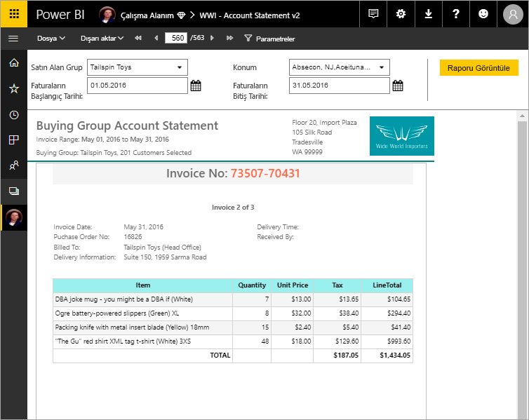

# Power BI Premium’da sayfalandırılmış raporlar nelerdir?

*Sayfalandırılmış raporlar*, yazdırılmak veya paylaşılmak üzere tasarlanmıştır. *Sayfalandırılmış* olarak adlandırılmalarının nedeni, bir sayfaya düzgün yerleştirilecek şekilde biçimlendirilmiş olmalarıdır. Tablo birden fazla sayfaya yayılsa bile tüm verileri bir tabloda gösterirler. Rapor sayfası düzenini tam olarak denetleyebileceğinizden, bunlar *piksel düzeyinde hassas* olarak da anılırlar. Power BI Report Builder, sayfalandırılmış raporlar yazmaya yarayan bağımsız bir araçtır. Sayfalandırılmış raporlar, SQL Server Reporting Services’ta uzun süredir standart rapor biçimi olan RDL rapor teknolojisini temel alır. 

Sayfalandırılmış raporlar genellikle çok sayıda sayfadan oluşur. Örneğin bu raporun 563 sayfası vardır. Her biri tam olarak her fatura için bir sayfa olacak ve üst bilgiler ile alt bilgiler tekrarlanacak şekilde düzenlenmiştir.

Rapor Oluşturucusu'nda raporunuzun önizlemesini görebilir, ardından `https://app.powerbi.com` Power BI hizmetinde yayımlayabilirsiniz. Hizmette bir rapor yayımlamak için Power BI Pro lisansı gereklidir. Sayfalandırılmış raporları Çalışma Alanım bölümünüzde veya Power BI Premium kapasitesi içindeki çalışma alanlarında yayımlayıp paylaşabilirsiniz. Ayrıca, sayfalandırılmış raporların Power BI yönetici portalının [Premium kapasiteler bölümünde](../admin/service-admin-premium-workloads.md#paginated-reports) bir Power BI yöneticisi tarafından etkinleştirilmesi gerekir. 

## Power BI raporlarını ve sayfalandırılmış raporları karşılaştırma

Sayfalandırılmış raporların en büyük avantajlarından biri, ne kadar uzun olduğu fark etmeksizin tüm verileri bir tabloda yazdırabilme özelliğidir. Power BI raporuna bir tablo yerleştirdiğinizi düşünün. Tablodaki bazı satırları sayfada görürsünüz, gerisini görmek için ise kaydırma çubuğunu kullanırsınız. Bu sayfayı yazdırır veya PDF’ye dışarı aktarırsanız yalnızca sayfada gördüğünüz satırlar yazdırılır. 

Şimdi aynı tabloyu sayfalandırılmış bir rapora yerleştirdiğinizi varsayalım. Bu raporu yazdırdığınızda veya PDF’ye dışarı aktardığınızda, sayfalandırılmış rapor bu tablodaki her satırı yazdırmak için gereken sayıda sayfayı içerir. 

Aşağıdaki videoda, Microsoft En Değerli Profesyonel - Veri Platformu Yöneticisi Peter Myers ve Baş Program Yöneticisi Chris Finlan benzer bir tablonun iki rapor biçiminde yazdırılmasını gösteriyor. 

<iframe width="560" height="315" src="https://www.youtube.com/embed/jXTiYJKw1Rs?list=PL1N57mwBHtN1icIhpjQOaRL8r9G-wytpT" frameborder="0" allowfullscreen></iframe>

Bu video, [Bir Günlük Kursla Power BI Sayfalandırılmış Raporları](../learning-catalog/paginated-reports-online-course.md) adlı, sekiz modülden oluşan video temelli kursun bir parçasıdır. Bu kurs, sizin gibi rapor yazarlarını Power BI sayfalandırılmış raporları oluşturmak, yayımlamak ve dağıtmak için gereken teknik bilgilerle donatmak üzere tasarlanmıştır.

## Power BI Rapor Oluşturucusu'nda rapor oluşturma

Sayfalandırılmış raporlar, Power BI Rapor Oluşturucusu adlı kendi tasarım aracına sahiptir. Bu yeni araç, daha önce Power BI Rapor Sunucusu veya SQL Server Reporting Services (SSRS) için sayfalandırılmış raporlar oluştururken kullandığınız araçlarla aynı temeli paylaşır. Şirket içinde SSRS 2016 ve 2017 veya Power BI Rapor Sunucusu için oluşturduğunuz sayfalandırılmış raporlar, Power BI hizmeti ile uyumludur. Power BI hizmeti geriye dönük uyumluluğa sahip olduğu için raporlarınızı ileriye taşıyabilir ve önceki sürümlerdeki sayfalandırılmış raporları yükseltebilirsiniz. Rapor özelliklerinin tamamı başlatma sırasında kullanılamaz. Ayrıntılar için bu makaledeki [Sınırlamalar ve önemli noktalar](#limitations-and-considerations) bölümüne bakın.
     
## Çeşitli veri kaynaklarından rapor

Tek bir sayfalandırılmış raporun birkaç farklı veri kaynağı olabilir. Power BI raporlarının aksine, temel alınan bir veri modeli yoktur. Power BI hizmetindeki sayfalandırılmış raporların ilk sürümünde, raporun içinde yerleşik veri kaynakları ve veri kümeleri oluşturursunuz. Şimdilik paylaşılan veri kaynaklarını veya paylaşılan veri kümelerini kullanamazsınız. Yerel bilgisayarınızdaki Rapor Oluşturucusu'nda raporları oluşturursunuz. Bir rapor şirket içi verilere bağlanıyorsa raporu Power BI hizmetine yükledikten sonra bir ağ geçidi oluşturmanız ve veri bağlantısını yönlendirmeniz gerekir. Şu anda bağlanabileceğiniz veri kaynakları şunlardır:

- Azure SQL Veritabanı ve Veri Ambarı (Temel ve oAuth)
- Azure Analysis Services (SSO yoluyla)
- Ağ geçidi üzerinden SQL Server
- Ağ geçidi üzerinden SQL Server Analysis Services
- Power BI Veri Kümeleri
- Oracle
- Teradata

## Raporunuzu tasarlama  

### Matris, grafik ve serbest biçimli düzenleri olan sayfalandırılmış raporlar oluşturma

Tablo raporları, sütun tabanlı veriler için idealdir. Çapraz veya PivotTable raporları gibi matris raporlar, özetlenmiş veriler için idealdir. Grafik raporları, verileri grafiksel biçimde sunar ve serbest biçimli *liste* raporları, fatura gibi neredeyse diğer her şeyi sunabilir. 
  
Rapor Oluşturucusu sihirbazlarından biri ile başlayabilirsiniz. Tablo, Matris ve Grafik sihirbazları, yerleşik veri kaynağı bağlantısı ve yerleşik veri kümesi oluşturma işlemlerinde size yol gösterir. Ardından, alanları sürükleyip bırakarak bir veri kümesi sorgusu oluşturun, bir düzen ve stil seçin ve raporunuzu özelleştirin.  
  
Harita sihirbazı ile coğrafi veya geometrik bir arka plana göre toplu verileri gösteren raporlar oluşturun. Harita verileri bir Transact-SQL sorgusundaki uzamsal veriler ya da bir Environmental Systems Research Institute, Inc. (ESRI) şekil dosyaları olabilir. Ayrıca bir Microsoft Bing harita parçası arka planı da ekleyebilirsiniz.  

### Raporunuza daha fazla bilgi ekleme

Verileri filtreleyerek, gruplandırarak ve sıralayarak ya da formül veya ifade ekleyerek verilerinizi değiştirin. Verileri görsel bir biçimde özetlemek için grafikler, ölçerler, mini grafikler ve göstergeler ekleyin.  Özelleştirilmiş görünümler için verileri filtrelemek üzere parametreler ve filtreler kullanın. Dış içerikler de dahil olmak üzere görüntüleri ve diğer kaynakları ekleyin ya da başvurun.  

Raporun kendisinden her metin kutusu, görüntü, tablo ve grafiğe kadar bir sayfalandırılmış raporun içindeki her şey, raporun tam olarak istediğiniz gibi görünmesi için ayarlayabileceğiniz bir dizi özelliğe sahiptir.

## Rapor tanımı oluşturma

Sayfalandırılmış rapor tasarlarken aslında bir *rapor tanımı* oluşturursunuz. Bu rapor tanımı, verileri içermez. Verilerin nereden alınacağını, hangi verilerin alınacağını ve verilerin nasıl görüntüleneceğini belirtir. Raporu çalıştırdığınızda, rapor işlemcisi belirttiğiniz rapor tanımını alır, verileri alır ve raporu oluşturmak için rapor düzeni ile birleştirir. Rapor tanımını `https://app.powerbi.com` Power BI hizmetine, Çalışma Alanım bölümünüze veya iş arkadaşlarınızla paylaşılan bir çalışma alanına yükleyin. Rapor veri kaynağı şirket içindeyse, raporu karşıya yükledikten sonra veri kaynağı bağlantısını bir ağ geçidinden geçecek şekilde yeniden yönlendirin. 

## Sayfalandırılmış raporunuzu görüntüleme
Power BI hizmetindeki sayfalandırılmış raporunuzu bir tarayıcıda ve aynı zamanda Power BI mobil uygulamalarında görüntülersiniz. Power BI hizmetinde raporu HTML, MHTML, PDF, XML, CSV, TIFF, Word ve Excel gibi biçimlerde dışarı aktarabilirsiniz. Ayrıca, diğer kişilerle paylaşabilirsiniz.  

## Raporunuza abonelik oluşturma

Artık Power BI hizmetinde sayfalandırılmış raporlar için kendinize ve başkalarına e-posta abonelikleri ayarlayabilirsiniz. Bu işlem genel olarak Power BI hizmetinde raporlara ve panolara abone olmakla aynıdır. Abonelikleri ayarlarken ne sıklıkta e-posta almak istediğinizi seçersiniz: günlük, haftalık veya saatlik. Abonelik, tüm rapor çıkışının bulunduğu bir PDF eki içerir.

Ayrıntılar için [Kendinizi ve başkalarını Power BI hizmetinde sayfalandırılmış raporlara abone yapma](../consumer/paginated-reports-subscriptions.md) makalesine bakın. 

## Sınırlamalar ve önemli noktalar

İlk sürümde desteklenmeyen bazı diğer özellikler şunlardır:

- Rapor sayfalarını veya görselleri Power BI panolarına sabitleme. Bir Power BI Rapor Sunucusu veya Reporting Services rapor sunucusunda şirket içi sayfalandırılmış bir rapordan Power BI panosuna görselleştirmeleri yine sabitleyebilirsiniz. Daha fazla bilgi için bkz. [Reporting Services öğelerini Power BI panolarına sabitleme](https://docs.microsoft.com/sql/reporting-services/pin-reporting-services-items-to-power-bi-dashboards).
- Belge Haritaları.
- Detaylandırma raporları.  Detaylandırma senaryoları için sayfalandırılmış raporlarla birlikte URL parametrelerini kullanmayı düşünebilirsiniz.
- Paylaşılan veri kaynakları ve paylaşılan veri kümeleri.

 
## Sonraki adımlar

- [Power BI Rapor Oluşturucusu'nu Microsoft İndirme Merkezi'nden yükleme](https://aka.ms/pbireportbuilder)
- [Öğretici: Sayfalandırılmış rapor oluşturma](paginated-reports-quickstart-aw.md)
- [Çevrimiçi kurs: Bir Gündeki Power BI Sayfalandırılmış Raporları](../learning-catalog/paginated-reports-online-course.md)
- [Verileri doğrudan sayfalandırılmış bir rapora girme](paginated-reports-enter-data.md)
- [Öğretici: Uygulamaya müşterileriniz için sayfalandırılmış Power BI raporları ekleme](../developer/embedded/embed-paginated-reports-customers.md)
