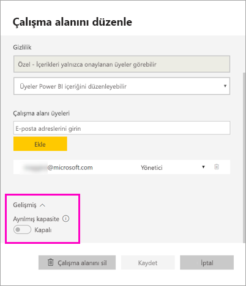
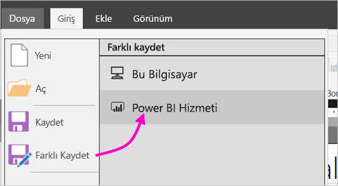
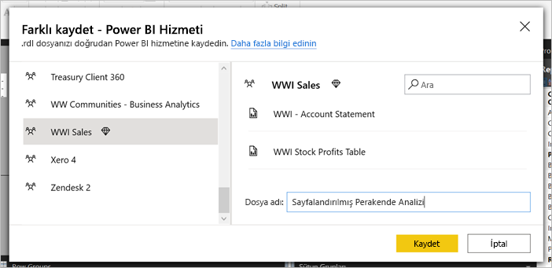
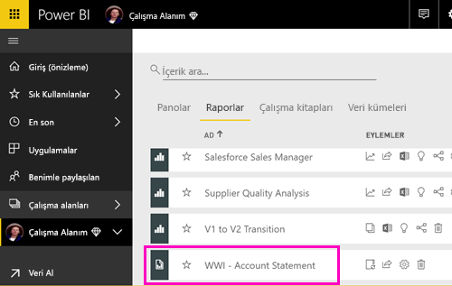
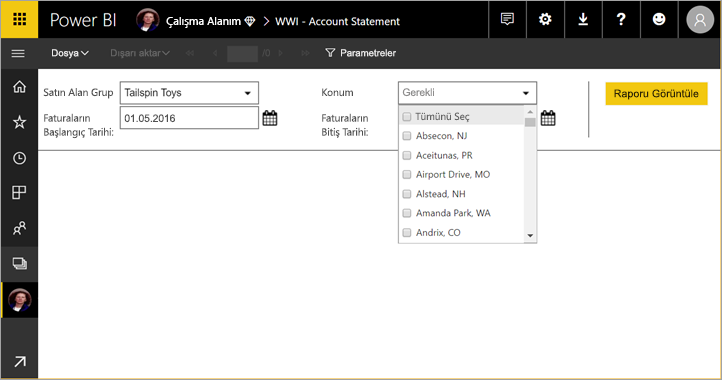
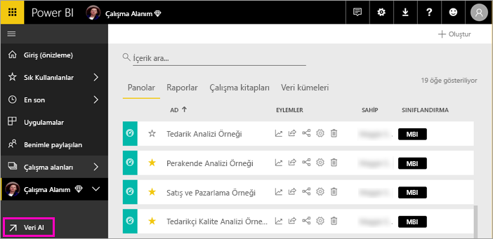
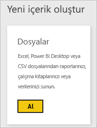
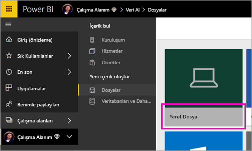
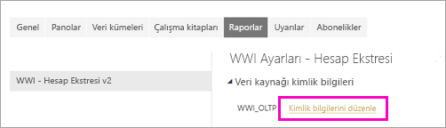
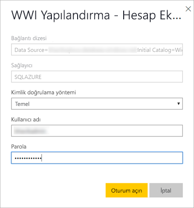

# Power BI hizmetinde sayfalandırılmış rapor yayımlama

Bu makalede, sayfalandırılmış bir raporu yerel bilgisayarınızdan yükleyerek Power BI hizmetinde yayımlama hakkında bilgi edineceksiniz. Sayfalandırılmış raporları Çalışma Alanım’a veya Premium kapasitede olan başka bir çalışma alanına yükleyebilirsiniz. Çalışma alanı adının yanında  elmas simgesini arayın. 

Rapor veri kaynağınız şirket içindeyse, raporu karşıya yükledikten sonra bir ağ geçidi oluşturmanız gerekir. Bu makalenin ilerleyen kısımlarındaki [Ağ geçidi oluşturma](#create-a-gateway) bölümüne bakın.

## Çalışma alanını Premium kapasiteye ekleme

Çalışma alanı adının yanında baklava simgesi  yoksa, çalışma alanını bir Premium kapasiteye eklemeniz gerekir. 

1. **Çalışma Alanları**’nı seçin, çalışma alanı adının yanındaki üç noktayı ( **...** ) ve sonra **Çalışma alanını düzenle**’yi seçin.

    

1. **Çalışma alanını düzenle** iletişim kutusunda **Gelişmiş**’i genişletin, ardından **Ayrılmış kapasite**’yi **Açık** seçeneğine sürükleyin.

    

   Bunu değiştirmeniz mümkün olmayabilir. Mümkün değilse, çalışma alanınızı bir Premium kapasiteye eklemek üzere size atama haklarını vermesi için Power BI Premium kapasite yöneticinize başvurun.

## Report Builder'dan sayfalandırılmış rapor yayımlama

1. Rapor Oluşturucusu'nda sayfalandırılmış raporunuzu oluşturun ve yerel bilgisayarınıza kaydedin.

1. Report Builder'ın **Dosya** menüsünde **Farklı kaydet**'i seçin.

    

    Henüz Power BI'da oturum açmadıysanız bu aşamada oturum açmanız veya hesap oluşturmanız gerekir. Report Builder'ın sağ üst köşesinde **Oturum aç**'ı seçip gerekli adımları tamamlayın.

2. Sol taraftaki çalışma alanları listesinden adının yanında elmas simgesi  bulunan çalışma alanlarından birini seçin. **Dosya adı** kutusuna bir ad yazıp **Kaydet**'i seçin. 

    

4. Power BI hizmetini bir tarayıcıda açın ve sayfalandırılmış raporu yayımlamak istediğiniz Premium çalışma alanına göz atın. **Raporlar** sekmesinde raporunuzu görebilirsiniz.

    

5. Power BI hizmetinde açmak için sayfalandırılmış raporu seçin. Parametreleri varsa, raporu görüntüleyebilmeniz için bunları seçmeniz gerekir.

    

6. Raporunuzun veri kaynağı şirket içi ortamdaysa bu veri kaynağına erişim sağlama amacıyla [ağ geçidi oluşturma](#create-a-gateway) hakkında bilgi edinin.

## Power BI hizmetinden sayfalandırılmış rapor yükleme

İsterseniz işlemi Power BI hizmetinden başlatabilir ve sayfalandırılmış raporu karşıya yükleyebilirsiniz.

1. Rapor Oluşturucusu'nda sayfalandırılmış raporunuzu oluşturun ve yerel bilgisayarınıza kaydedin.

1. Power BI hizmetini bir tarayıcıda açın ve raporu yayımlamak istediğiniz Premium çalışma alanına göz atın. Adın yanındaki elmas simgesine  dikkat edin. 

1. **Veri Al**’ı seçin.

    

1. **Dosyalar** kutusunda **Al**'ı seçin.

    

1. **Yerel dosya**’yı seçin > sayfalandırılmış rapora göz atın > **Aç**’ı seçin.

    

1. **Devam** > **Kimlik bilgilerini düzenle**’yi seçin.

    

1. Kimlik bilgilerinizi yapılandırın > **Oturum aç**’ı seçin.

    

   **Raporlar** sekmesinde raporunuzu görebilirsiniz.

    

1. Power BI hizmetinde açmak için seçin. Parametreleri varsa, raporu görüntüleyebilmeniz için bunları seçmeniz gerekir.
 
    

6. Raporunuzun veri kaynağı şirket içi ortamdaysa bu veri kaynağına erişim sağlama amacıyla [ağ geçidi oluşturma](#create-a-gateway) hakkında bilgi edinin.

## Ağ geçidi oluşturma

Diğer tüm Power BI raporlarında olduğu gibi, rapor veri kaynağı şirket içindeyse verilere erişmek için bir ağ geçidi oluşturmanız veya bir ağ geçidine bağlanmanız gerekir.

1. Rapor adının yanındaki **Yönet**’i seçin.

   

1. Ayrıntılı bilgi ve sonraki adımlar için şu Power BI hizmeti makalesine bakın: [Şirket içi veri ağ geçidi nedir?](../service-gateway-onprem.md)

### Ağ geçidi sınırlamaları

Ağ geçitleri şu anda çok değerli parametreleri desteklememektedir.

## Sonraki adımlar

- [Power BI hizmetinde sayfalandırılmış rapor görüntüleme](../consumer/paginated-reports-view-power-bi-service.md)
- [Power BI Premium’da sayfalandırılmış raporlar nelerdir?](paginated-reports-report-builder-power-bi.md)
- [Öğretici: Uygulamaya müşterileriniz için sayfalandırılmış Power BI raporları ekleme](../developer/embed-paginated-reports-customers.md)

