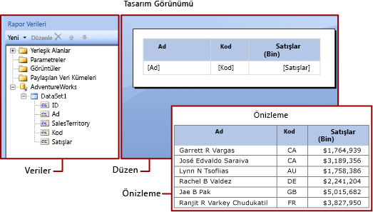

# Power BI Rapor Oluşturucusu’ndaki ifadeler
  İfadeler Power BI Report Builder sayfalandırılmış raporlarında verileri almak, hesaplamak, görüntülemek, gruplandırmak, sıralamak, filtrelemek parametreleştirmek ve biçimlendirmek için yaygın olanak kullanılır. 
  
  Birçok rapor öğesi özelliği ifadeye ayarlanabilir. İfadeler raporunuzun içeriğini, tasarımını ve etkileşimini denetlemenize yardımcı olur. İfadeler Microsoft Visual Basic'te yazılır, rapor tanımına kaydedilir ve raporu çalıştırdığınızda rapor işlemcisi tarafından işlenir.  
  
 Doğrudan çalışma sayfalarında verilerle çalıştığınız Microsoft Office Excel gibi uygulamalardan farklı olarak, raporda verilerin yer tutucuları olan ifadelerle çalışırsınız. Hesaplanan ifadelerden gerçek verileri görmek için raporun önizlemesine bakmalısınız. Raporu çalıştırdığınızda rapor işlemcisi tablolar ve grafikler gibi rapor verilerini ve rapor düzeni öğelerini birleştirirken her ifadeyi hesaplar.  
  
 Siz raporu tasarlarken rapor öğeleri için birçok ifade sizin için ayarlanır. Örneğin rapor tasarım yüzeyinde veri bölmesindeki bir alanı tablo hücresine sürüklediğinizde, metin kutusu değeri alan için basit bir ifadeye ayarlanır. Aşağıdaki resimde, Rapor Verileri bölmesinde veri kümesinin ID, Name, SalesTerritory, Code ve Sales alanları görüntülenir. Tabloya üç alan eklenmiştir: [Name], [Code] ve [Sales]. Tasarım yüzeyindeki [Name] gösterimi temel `=Fields!Name.Value` ifadesini temsil eder.  
  

  
 Raporun önizlemesini görüntülerken rapor işlemcisi tablo veri bölgesini veri bağlantısından gelen gerçek verilerle birleştirir ve sonuç kümesindeki her satır için tabloda bir satır görüntüler.  
  
 İfadeleri el ile girmek için tasarım yüzeyinde bir öğe seçin, sonra kısayol menülerini ve iletişim kutularını kullanarak öğenin özelliklerini ayarlayın. ***(fx)*** düğmesini veya açılan listede `<Expression>` değerini gördüğünüzde, ifade için özellik ayarlayabileceğinizi anlarsınız. 
  
##   Basit ve karmaşık ifadeleri anlama  
 İfadeler eşittir işaretiyle (=) başlar ve Microsoft Visual Basic'te yazılır. İfadelerde sabitlerin, işleçlerin, yerleşik değerlere (alanlar, koleksiyonlar ve işlevler) ve dış veya özel kodlara başvuruların bir bileşimi bulunabilir.  
  
 İfadeleri kullanarak birçok rapor öğesi özelliğinin değerini ayarlayabilirsiniz. En yaygın özellikler metin kutularının ve yer tutucu metinlerin değerleridir. Genellikle, metin kutusu tek bir ifade içeriyorsa bu ifade metin kutusu özelliğinin değeridir. Metin kutusu birden çok ifade içeriyorsa, her ifade metin kutusundaki yer tutucu metnin değeridir.  
  
 Varsayılan olarak ifadeler rapor tasarım yüzeyinde *basit* veya *karmaşık ifadeler* olarak gösterilir.  
  
-   **Basit** Basit ifade yerleşik koleksiyondaki tek bir öğeye, örneğin veri kümesi alanına, parametreye veya yerleşik alana başvuru içerir. Tasarım yüzeyinde basit ifade köşeli ayraç içinde gösterilir. Örneğin `[FieldName]` temel `=Fields!FieldName.Value` ifadesine karşılık gelir. Siz rapor düzenini oluştururken ve öğeleri Rapor Verileri bölmesinden tasarım yüzeyine sürüklerken basit ifadeler sizin için otomatik olarak oluşturulur. Farklı yerleşik koleksiyonları temsil eden semboller hakkında daha fazla bilgi için bkz. [Basit İfadeler için Ön Ek Sembollerini Anlama](#DisplayText).  
  
-   **Karmaşık** Karmaşık ifadeler birden çok yerleşik başvuruya, işlece veya işlev çağrısına başvurular içerir. İfade değeri birden çok basit başvuru içerdiğinde, karmaşık bir ifade <\<Expr>> olarak gösterilir. İfadeyi görüntülemek için üzerine gelin ve araç ipucunu kullanın. İfadeyi düzenlemek için **İfade** iletişim kutusunda açın.  
  
 Aşağıdaki şekilde hem metin kutuları hem de yer tutucu metinler için tipik basit ve karmaşık ifadeler gösterilir.  
  
 
  
 İfadeler için metin yerine örnek değerler görüntülemek isterseniz, metin kutusuna veya yer tutucu metne biçimlendirme uygulayın. Aşağıdaki şekilde örnek değerleri göstermeye geçen rapor tasarım yüzeyi gösterilir:  
  
  

##  Basit ifadelerdeki ön ek sembollerini anlama  

Basit ifadelerde başvurunun bir alan, parametre, yerleşik koleksiyon veya ReportItems koleksiyonu olduğunu belirtmek için semboller kullanılır. Aşağıdaki tabloda görüntü ve ifade metni örnekleri gösterilir:  
  
|Öğe|Görüntü metni örneği|İfade metni örneği|  
|----------|--------------------------|-----------------------------|  
|Veri kümesi alanları|`[Sales]`   `[SUM(Sales)]`   `[FIRST(Store)]`|`=Fields!Sales.Value`   `=Sum(Fields!Sales.Value)`   `=First(Fields!Store.Value)`|  
|Rapor parametreleri|`[@Param]`   `[@Param.Label]`|`=Parameters!Param.Value`   `=Parameters!Param.Label`|  
|Yerleşik alanlar|`[&ReportName]`|`=Globals!ReportName.Value`|  
|Görüntü metninde kullanılan değişmez karakterler|`\[Sales\]`|`[Sales]`|  
  
##   Karmaşık ifadeler yazma  
 İfadelerde yerleşik koleksiyonlardaki işlevlere, işleçlere, sabitlere, alanlara, parametrelere, öğelere ve eklenmiş özel kodlara veya özel derlemelere başvurular bulunabilir.  
  
 Aşağıdaki tabloda ifadeye ekleyebileceğiniz başvuru türleri listelenir:  
  
|Başvurular|Açıklama|Örnek|  
|----------------|-----------------|-------------|  
|Sabitler|Yazı tipi renkleri gibi sabit değerler gerektiren özellikler için etkileşimli olarak erişebileceğiniz sabitleri açıklar.|`="Blue"`|  
|İşleçler|İfadedeki başvuruları birleştirirken kullanabileceğiniz işleçleri açıklar. Örneğin **&** işleci dizeleri birleştirmek için kullanılır.|`="The report ran at: " & Globals!ExecutionTime & "."`|  
|Yerleşik Koleksiyonlar|İfadeye ekleyebileceğiniz `Fields`, `Parameters` ve `Variables` gibi yerleşik koleksiyonları açıklar.|`=Fields!Sales.Value`   `=Parameters!Store.Value`   `=Variables!MyCalculation.Value`|  
|Yerleşik Rapor ve Toplama İşlevleri|İfadeden erişebileceğiniz `Sum` veya `Previous` gibi yerleşik işlevleri açıklar.|`=Previous(Sum(Fields!Sales.Value))`|  
|Rapor Oluşturucusu'ndaki İfadelerde Özel Kod ve Derleme Başvuruları |Bir dış derlemeden yerleşik `xref:System.Math` ve `xref:System.Convert` CLR sınıflarına, diğer CLR sınıflarına, Visual Basic çalışma zamanı kitaplık işlevlerine veya yöntemlere nasıl erişebileceğinizi açıklar.   Raporunuza eklenmiş olan veya derleyip hem rapor istemcisine hem de rapor sunucusuna özel derleme olarak yüklediğiniz özel koda nasıl erişebileceğinizi açıklar.|`=Sum(Fields!Sales.Value)`   `=CDate(Fields!SalesDate.Value)`   `=DateAdd("d",3,Fields!BirthDate.Value)`   `=Code.ToUSD(Fields!StandardCost.Value)`|  
   
##   Doğrulama ifadeleri  
 Belirli bir rapor öğesi özelliği için ifade oluştururken, ifadeye ekleyebileceğiniz başvurular rapor öğesi özelliğinin kabul edebileceği değerlere ve özelliğin değerlendirildiği kapsama bağlıdır. Örnek:  
  
-   Varsayılan olarak, [Sum] ifadesi ifadenin değerlendirildiği sırada kapsam içinde kalan verilerin toplamını hesaplar. Tablo hücresi için kapsam, satır ve sütun grubu üyeliklerine bağlıdır. 
  
-   Font özelliğinin değeri bir yazı tipi adı olarak değerlendirilmelidir.  
  
-   İfade söz dizimi tasarım zamanında doğrulanır. İfade kapsamı doğrulaması raporu yayımladığınızda gerçekleşir. Gerçek verilere bağlı olan doğrulama için, hatalar ancak çalışma zamanında algılanabilir. Bu ifadelerden bazıları işlenen raporda hata iletisi olarak #Hata üretir. 

## Sonraki adımlar

- [Power BI Premium’da sayfalandırılmış raporlar nelerdir?](paginated-reports-report-builder-power-bi.md)
