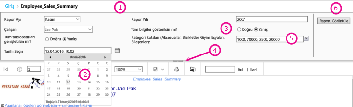
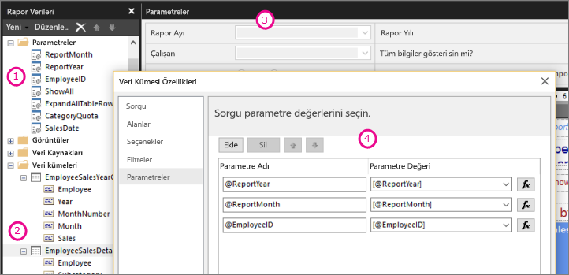

# Power BI Rapor Oluşturucusu’nda Rapor parametreleri

Bu konu başlığında, Power BI Report Builder’ın rapor parametrelerine, ayarlayabileceğiniz özelliklere ve çok daha fazlasına yönelik yaygın kullanımlar açıklanır. Rapor parametreleri, rapor verilerini denetleme, ilgili raporları birbirine bağlama ve rapor sunumunu çeşitlendirme olanağı tanır. Rapor parametrelerini, Rapor Oluşturucusu’nda oluşturduğunuz sayfalandırılmış raporlarda kullanabilirsiniz.

##  Parametrelerin yaygın kullanımları

 Parametrelerin en yaygın kullanım şekillerinden bazıları aşağıda verilmiştir.  
  
**Sayfalandırılmış rapor verilerini denetleme**
  
- Değişkenleri içeren veri kümesi sorguları yazarak veri kaynağındaki rapor verilerini filtreleyin.  
  
- Sayfalandırılmış rapordaki verileri özelleştirmeleri için kullanıcılara değer belirtme olanağı tanıyın. Örneğin, satış verilerinde başlangıç tarihi ve bitiş tarihi için iki parametre sağlayın.  
  
**Rapor sunumunu değiştirme**
  
- Bir raporun görünümünün özelleştirilmesine yardımcı olmak için kullanıcılara değerleri belirtme olanağı tanıyın. Örneğin, bir tablodaki tüm iç içe geçmiş satır gruplarının genişletileceğini mi yoksa daraltılacağını mı belirtmek için bir Boole parametresi sağlayın.  
  
- Parametreleri bir ifadeye ekleyerek kullanıcıların rapor verilerini ve görünümünü özelleştirmesine olanak tanıyın.  
  
##  Parametreleri olan bir raporu görüntüleme

Parametreleri olan bir raporu görüntülediğinizde, rapor görüntüleyici araç çubuğunda her parametre gösterilir, böylece değerleri etkileşimli bir şekilde belirtebilirsiniz. Aşağıdaki çizimde @ReportMonth, @ReportYear, @EmployeeID, @ShowAll, @ExpandTableRows, @CategoryQuota ve @SalesDate parametreleri ile bir raporun parametre alanı gösterilmektedir.  

  
1. **Parametreler bölmesi** Rapor görüntüleyici araç çubuğunda bir istem ya da her parametre için varsayılan bir değer gösterilir. Parametrelerin düzenini parametreler bölmesinde özelleştirebilirsiniz.  
  
2. **@SalesDate parametresi**@SalesDate parametresi, **DateTime** veri türüdür. Metin kutusunun yanında Tarihi Seçin istemi görünür. Tarihi değiştirmek için metin kutusuna yeni bir tarih girin veya takvim denetimini kullanın.  
  
3. **@ShowAll parametresi**@ShowAll parametresi, **Boole** veri türüdür. **True** veya **False**’u belirtmek için radyo düğmelerini kullanın.  
  
4. **Parametre Alanı tanıtıcısını Göster veya Gizle** Parametreler panosunu göstermek veya gizlemek için rapor görüntüleyici araç çubuğunda bu oka tıklayın.  
  
5. **@CategoryQuota parametresi**@CategoryQuota parametresi **Float** veri türü olduğu için sayısal bir değer alır.  @CategoryQuota birden çok değere izin verecek şekilde ayarlanır.  
  
6. **Raporu Görüntüle** Parametre değerlerini girdikten sonra raporu çalıştırmak için **Raporu Görüntüle**’ye tıklayın. Tüm parametreler varsayılan değerlere sahipse rapor ilk görünümde otomatik olarak çalışır.  
  
##  Parametreleri oluşturma

Rapor parametrelerini birkaç farklı yöntemle oluşturabilirsiniz.
  
> [!NOTE]
>  Tüm veri kaynakları parametreleri desteklemez.
  
**Veri kümesi sorgusu veya parametreleri olan saklı yordam**
  
 Değişkenleri içeren bir veri kümesi sorgusu veya giriş parametrelerini içeren bir veri kümesi saklı yordamı ekleyin. Her değişken veya giriş parametresi için bir veri kümesi parametresi ve her veri kümesi parametresi için bir rapor parametresi oluşturulur.  
  

  
 Rapor Oluşturucusu’ndan alınan bu görüntü şunları gösterir:  
  
1.  Rapor Verileri bölmesindeki rapor parametreleri.  
  
2.  Parametreleri olan veri kümesi.  
  
3.  Parametreler bölmesi.  
  
4.  Veri Kümesi Özellikleri iletişim kutusunda listelenen parametreler.  
  
**El ile parametre oluşturma**
  
El ile parametre oluşturmak için Rapor Verileri bölmesine gidin. Rapor parametrelerini, kullanıcının bir raporun içeriklerini veya görünümünü özelleştirmek için değerleri etkileşimli bir şekilde girebilmesine olanak tanıyacak şekilde yapılandırabilirsiniz. Rapor parametrelerini, kullanıcının önceden yapılandırılmış değerleri değiştirme imkanının olmadığı bir şekilde de yapılandırabilirsiniz.  
  
> [!NOTE]  
>  Parametreler sunucuda bağımsız olarak yönetildiği için, ana rapor yeni parametre ayarlarıyla yeniden paylaşılırsa ayarlar rapordaki mevcut parametre ayarlarının üzerine yazılmaz.  

### Parametre değerleri

 Rapordaki parametre değerlerini seçmeye yönelik ayarlar aşağıda verilmiştir.  
  
- Bir açılan listeden tek parametre değeri seçin.  
  
- Bir açılan listeden çoklu parametre değeri seçin.  
  
- Bir açılan listeden bir parametre için değer seçin. Bu, farklı bir parametre için açılan listede kullanılabilir olan değerleri belirler. Bunlar geçişli parametrelerdir. Geçişli parametreler, binlerce değeri yönetilebilir bir sayıya indirerek parametre değerlerini başarıyla filtrelemenize olanak tanır. Daha fazla bilgi için bkz. [Sayfalandırılmış raporlarda basamaklı parametreleri kullanma](../guidance/paginated-report-cascading-parameter.md).
  
- Parametre için varsayılan değer oluşturulduğu için, ilk olarak parametre değeri seçme zorunluluğu olmadan raporu çalıştırın.  
  
##  Rapor parametresi özellikleri

 Rapor Özellikleri iletişim kutusunu kullanarak rapor parametresi özelliklerini değiştirebilirsiniz. Aşağıdaki tablo, her parametre için ayarlayabileceğiniz özellikleri özetler:  
  
|Özellik|Açıklama|  
|--------------|-----------------|  
|Ad|Parametre için büyük/küçük harfe duyarlı bir ad yazın. Ad harf ile başlamalıdır ve harf, rakam ve bir alt çizgi (_) içerebilir. Ad boşluk içeremez. Otomatik olarak oluşturulan parametrelerde, ad parametreyle veri kümesi sorgusunda eşleşir. Varsayılan olarak, el ile oluşturulan parametreler ReportParameter1’e benzerdir.|  
|Sor|Rapor görüntüleyici araç çubuğunda, parametrenin yanında çıkan metin.|  
|Veri türü|Rapor parametresi, aşağıdaki veri türlerinden biri olmalıdır:   **Boole**. Kullanıcı, bir radyo düğmesinden True veya False seçimi yapar.   **DateTime**. Kullanıcı, bir takvim denetiminden tarih seçer.   **Tamsayı**. Kullanıcı, değerleri bir metin kutusuna yazar.   **Float**. Kullanıcı, değerleri bir metin kutusuna yazar.   **Metin**. Kullanıcı, değerleri bir metin kutusuna yazar.   Bir parametre için kullanılabilecek değerler tanımlandığında, veri türü **DateTime** olsa bile kullanıcı değerleri açılan listeden seçer.|  
|Boş değere izin ver|Parametrenin değeri bir boş dize veya boş değer olabiliyorsa bu seçeneği belirleyin.   Bir parametre için geçerli değerleri belirtirseniz ve boş değerin bunlardan biri olmasını istiyorsanız, bunu belirttiğiniz değerler arasına eklemeniz gerekir. Bu seçeneğin belirlenmesi, kullanılabilir değerler için otomatik olarak bir boş değer eklemez.|  
|Null değere izin ver|Parametrenin değeri null olabilirse bu seçeneği belirleyin.   Bir parametre için geçerli değerleri belirtirseniz ve null’un bunlardan biri olmasını istiyorsanız, null’u belirttiğiniz değerler arasına eklemeniz gerekir. Bu seçeneğin belirlenmesi, null değerini kullanılabilen değerler arasına otomatik olarak eklemez.|  
|Birden çok değere izin ver|Kullanıcılarınızın seçim yapabileceği bir açılan liste oluşturmaya yönelik kullanılabilir değerler sağlayın. Bu, veri kümesi sorgusunda sadece geçerli değerlerin gönderilmesini sağlamak için iyi bir yöntemdir.   Parametrenin değeri, açılan listede gösterilen birden çok değer olabilirse bu seçeneği belirleyin. Null değerlere izin verilmez. Bu seçenek belirlendiğinde, bir parametrenin açılan listesinde bulunan değerlerin listesine onay kutuları eklenir. Listenin en üstünde **Tümünü Seç** için onay kutusu yer alır. Kullanıcılar, istedikleri değerleri denetleyebilir.   Değerleri sağlayan veriler hızla değişirse kullanıcının gördüğü liste güncel olmayabilir.|  
|Görünür|Çalıştırıldığında rapor parametresini raporun üstünde görüntülemek için bu seçeneği belirleyin. Bu seçenek, kullanıcıların çalışma zamanında parametre değerlerini seçmesine olanak tanır.|  
|Gizli|Yayımlanan raporda rapor parametresini gizlemek için bu seçeneği belirleyin. Rapor parametresi değerleri bir rapor URL’sinde, abonelik tanımında veya rapor sunucusunda yine de ayarlanabilir.|  
|İç|Rapor parametresini gizlemek için bu seçeneği belirleyin. Paylaşılan raporda, rapor parametresi yalnızca rapor tanımında görüntülenebilir.|  
|Kullanılabilir değerler|Bir parametre için kullanılabilecek değerleri belirttiyseniz, geçerli değerler her zaman bir açılan liste olarak görünür. Örneğin, bir **DateTime** parametresi için kullanılabilecek değerleri sağlarsanız, parametre bölmesinde takvim denetiminin yerine tarihin seçilmesine olanak tanıyan bir açılan liste görünür.   Bir değerler listesinin raporlarda ve alt raporlarda tutarlı olmasını sağlamak için veri kaynağında, bir veri kaynağı ile ilişkilendirilmiş veri kümelerindeki tüm sorgular için tek işlem kullanma seçeneğini ayarlayabilirsiniz.   **Güvenlik Notu** **Metin** veri türünde bir parametre içeren tüm raporlarda kullanılabilir değerler listesini (geçerli değerler listesi olarak da bilinir) kullandığınızdan ve raporu çalıştıran tüm kullanıcıların yalnızca rapordaki verileri görüntülemek için gereken izinlerinin bulunduğundan emin olun.|  
|Varsayılan Değerler|Bir sorgudan veya statik listeden varsayılan değerler ayarlama.   Her parametrenin varsayılan değeri olduğunda, rapor ilk görünümde otomatik olarak çalışır.|  
|Gelişmiş|Bu parametrenin rapordaki verileri doğrudan veya dolaylı olarak etkileyip etkilemeyeceğini belirten **UsedInQuery** değeri için rapor tanımı özniteliğini ayarlayın.   **Ne zaman yenileneceğini otomatik olarak belirleme**  Rapor işlemcisinin bu değer için bir ayar belirlemesini istediğinizde bu seçeneği belirleyin. Rapor işlemcisi, bu parametreye doğrudan veya dolaylı başvurusu olan bir veri kümesi sorgusu algılarsa veya raporun alt raporları varsa bu değer **True** olur.   **Her zaman yenile**  Rapor parametresi bir veri kümesi sorgusunda veya parametre ifadesinde doğrudan ya da dolaylı olarak kullanılıyorsa bu seçeneği belirleyin. Bu seçenek, **UsedInQuery** değerini True olarak ayarlar.   **Asla yenileme**  Rapor parametresi bir veri kümesi sorgusunda veya parametre ifadesinde doğrudan ya da dolaylı olarak kullanılmıyorsa bu seçeneği belirleyin. Bu seçenek, **UsedInQuery** değerini False olarak ayarlar.   **Dikkat** **Asla Yenileme** özelliğini dikkatle kullanın. Rapor sunucusunda, rapor verileri ve işlenmiş raporlar için önbellek seçeneklerini ve anlık görüntü raporlarının parametre seçeneklerini kolayca denetlemek için **UsedInQuery** kullanılır. **Asla Yenileme** özelliğini yanlış ayarlarsanız, yanlış rapor verilerinin veya raporların önbelleğe alınmasına veya anlık görüntü raporu verilerinin tutarsız olmasına sebep olabilirsiniz. |  
  
##   Veri kümesi sorgusu  
 Veri kümesi sorgusundaki verileri filtrelemek için, sonuç kümesine eklenecek veya bu kümeden çıkarılacak değerleri belirtilerek alınan verileri sınırlayan bir sınırlama yan tümcesi ekleyebilirsiniz.  
  
 Parametreli sorgu oluşturmayı kolaylaştırmak için veri kaynağı için sorgu tasarımcısını kullanın.  
  
-   Transact-SQL sorguları için, farklı veri kaynakları, parametrelere yönelik farklı söz dizimlerini destekler. Sorguda konum veya ad ile tanımlanan parametrelerin aralıklarını destekleyin. İlişkisel sorgu tasarımcısında parametre tabanlı sorgu oluşturmak için bir filtrenin parametre seçeneğini belirlemeniz gerekir.   
  
-   Microsoft SQL Server Analysis Services gibi çok boyutlu bir veri kaynağını temel alan sorgular için, sorgu tasarımcısında belirttiğiniz bir filtreyi temel alarak parametre oluşturulup oluşturulmayacağını belirleyebilirsiniz. 
  
##   Yayımlanan bir rapor için parametre yönetimi  
 Bir rapor tasarladığınızda, rapor parametreleri rapor tanımında kaydedilir. Bir rapor paylaştığınızda, rapor parametreleri rapor tanımından ayrı olarak kaydedilir ve yönetilir.  
  
 Yayımlanan bir rapor için şunları kullanabilirsiniz:  
  
-   **Rapor parametresi özellikleri.** Rapor parametresi değerlerini, rapor tanımından bağımsız olarak rapor sunucusunda doğrudan değiştirin.  
  
-   **Rapor abonelikleri.** Abonelikler aracılığıyla verileri filtrelemek ve raporları teslim etmek için parametre değerleri belirtebilirsiniz. 
  
 Rapor tanımını tekrar yayımlarsanız, yayımlanan rapor için parametre özellikleri korunur. Rapor tanımı aynı rapor olarak tekrar yayımlanırsa ve parametre adları ve veri türleri aynı kalırsa, özellik ayarlarınız korunur. Rapor tanımına parametre ekleyip parametreleri silerseniz veya mevcut bir parametrenin veri türünü veya adını değiştirirseniz, yayımlanan rapordaki parametre özelliklerini değiştirmeniz gerekebilir.  
  
 Tüm parametreler tüm durumlarda değiştirilemez. Bir rapor parametresi, veri kümesi sorgusundan varsayılan bir değer alırsa, o değer yayımlanan bir rapor için değiştirilemez ve rapor sunucusunda üzerinde değişiklik yapılamaz. Çalışma zamanında kullanılan değer, sorgu çalıştığında belirlenir. İfade tabanlı parametrelerde ise bu, ifade değerlendirildiğinde gerçekleşir.  
  
 Rapor çalıştırma seçenekleri parametrelerin işlenme şeklini olumsuz etkileyebilir. Anlık görüntü olarak çalışan bir rapor, sorgu parametre için varsayılan değerleri içermedikçe bir sorgudan türetilmiş parametreleri kullanamaz.  
  
##   Abonelik için parametreler  
 Bir isteğe bağlı veya anlık görüntü için abonelik tanımlayıp, abonelik işleme sırasında kullanılacak parametre değerlerini belirtebilirsiniz.  
  
-   **İsteğe bağlı rapor.**  İsteğe bağlı bir raporda, raporda listelenen her parametre için yayımlanan değerden farklı bir parametre değeri belirtebilirsiniz. Örneğin, geçerli gün, hafta veya ay için müşteri hizmetleri isteklerini döndürmek amacıyla bir *Zaman Aralığı* kullanan Çağrı Merkezi raporunuzun olduğunu varsayalım. Raporun varsayılan parametre değeri **bugün** olarak ayarlandıysa, haftalık veya aylık rakamları içeren bir rapor oluşturmak için aboneliğiniz farklı bir parametre değeri (**hafta** veya **ay** gibi) kullanabilir.  
  
## Sonraki adımlar

- [Power BI Premium’da sayfalandırılmış raporlar nelerdir?](paginated-reports-report-builder-power-bi.md)  
- [Sayfalandırılmış raporlarda basamaklı parametreleri kullanma](../guidance/paginated-report-cascading-parameter.md)
