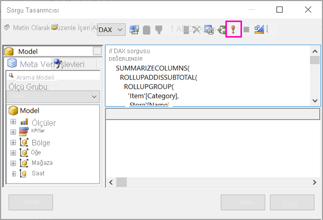

# Power BI paylaşılan veri kümesini temel alan bir sayfalandırılmış rapor oluşturma

[!INCLUDE [applies-to](../includes/applies-to.md)] [!INCLUDE [yes-service](../includes/yes-service.md)] [!INCLUDE [yes-paginated](../includes/yes-paginated.md)] [!INCLUDE [yes-premium](../includes/yes-premium.md)] [!INCLUDE [yes-desktop](../includes/yes-desktop.md)] 

Power BI Desktop’ta oluşturduğunuz bir veri kümesini, Power BI Rapor Oluşturucusu sayfalandırılmış raporları için veri kaynağı olarak kullanabilirsiniz. Şöyle bir senaryo düşünün: Power BI Desktop’ta bir Power BI raporu oluşturdunuz. Veri modelini tasarlamak için çok zaman harcadınız, sonra da çeşitli harika görsellerle çok güzel bir Power BI raporu oluşturdunuz. Raporunuzda birçok satır içeren bir matris bulunur, bu nedenle satırların hepsini görmek için kaydırmanız gerekir. Rapor okuyucularınız bu matristeki tüm satırları gösterecek bir rapor yazdırabilmek ister. Bir Power BI sayfalandırılmış raporu, sayfa üst bilgileriyle alt bilgileri ve tasarladığınız kusursuz bir sayfa düzenine sahip, birden çok sayfada çalışan bir tablo veya matrisi yazdırarak bunu başarabilir. Bu rapor, Power BI Desktop raporunu tamamlayıcı niteliktedir. Bunların tam olarak aynı verileri temel almasını ve tutarsızlık olmamasını istediğiniz için aynı veri kümesini kullanırsınız.

Veri kümesinin Premium kapasitedeki bir çalışma alanında olması ve sizin bu çalışma alanının bir üyesi olmanız gerekmez. Veri kümesi için [Oluşturma izninizin](../connect-data/service-datasets-build-permissions.md) olması yeterlidir. Sayfalandırılmış raporunuzu yayımlamak için Power BI Pro lisansına sahip olmanız gerekir. Ayrıca, Premium kapasitedeki bir çalışma alanı için en az bir Katkıda Bulunan rolünüzün olması gerekir.

## Gerekenler

Power BI Rapor Oluşturucusu’ndaki bir paylaşılan veri kümesi kullanmanız için gereken ve gerekli olmayan şeylerin bir listesi verilmiştir.

- Power BI Rapor Oluşturucusu. [Power BI Rapor Oluşturucusu’nu indirin ve yükleyin](https://aka.ms/pbireportbuilder).
- Bir Power BI veri kümesine erişmek istiyorsanız, veri kümesi için Oluşturma izninizin olması gerekir. [Oluşturma izni](../connect-data/service-datasets-build-permissions.md) hakkında bilgi edinin.
- Rapor Oluşturucusu’nda sayfalandırılmış rapor oluşturmak için Power BI Pro lisansına sahip olmanız gerekmez. 
- Sayfalandırılmış raporunuzu yayımlamak için Power BI Pro lisansına sahip olmanız gerekir. Ayrıca, Premium kapasitedeki bir çalışma alanı için en az bir Katkıda Bulunan rolünüzün olması gerekir. 
- İsteğe bağlı: Bu makaleyi izlemek isterseniz, Power BI Desktop [Perakende Analizi Örneği .pbix](https://download.microsoft.com/download/9/6/D/96DDC2FF-2568-491D-AAFA-AFDD6F763AE3/Retail%20Analysis%20Sample%20PBIX.pbix) dosyasını indirin, bu dosyayı Power BI Desktop’ta açın ve çok sayıda sütun içeren bir tablo ekleyin. **Biçim** bölmesinde **Toplamlar** seçeneğini kapatın. Ardından Power BI hizmetindeki bir çalışma alanında yayımlayın.

    

## Power BI veri kümesine bağlanma

1. Power BI Rapor Oluşturucusu'nu açın.
1. Power BI hesabınızda oturum açmak için Rapor Oluşturucusu’nun sağ üst köşesinde bulunan **Oturum aç** ’ı seçin.
1. Rapor Verileri bölmesinde **Yeni** > **Power BI Veri Kümesi Bağlantısı** seçeneğini belirleyin.

    

    > [!NOTE]
    > Rapor Oluşturucusu Tablo, Matris veya Grafik sihirbazlarını kullanarak bir Power BI veri kümesi için veri kaynağı veya veri kümesi oluşturamazsınız. Bunları oluşturduktan sonra, bunları temel alan tablolar, matrisler veya grafikler oluşturmak için sihirbazları kullanabilirsiniz.

1. Bulunduğu veri kümesini ya da çalışma alanını arayın veya bulun > **Seçin**.
    Rapor Oluşturucusu veri kümesi adını doldurur.

    
    
1. Veri kümesi, Rapor Verileri bölmesindeki Veri Kaynakları altında listelenir.

    

    Aynı sayfalandırılmış rapordaki birden çok Power BI veri kümesine ve diğer veri kaynaklarına bağlanabildiğinizi unutmayın.

## Veri kümesi için DAX sorgusunu alma

Power BI raporunuzdaki ve Rapor Oluşturucusu raporunuzdaki verilerin aynı olması için veri kümesine bağlanmak yeterli değildir. Aynı zamanda bu veri kümesinde oluşturulan sorguya de ihtiyacınız vardır.

### Video: DAX sorgusunu alma

Aşağıdaki videoda Chris Finlan, sayfalandırılmış raporunuz için ihtiyacınız olan DAX sorgusunu nasıl alacağınızı göstermektedir.

<iframe width="400" height="450" src="https://www.youtube.com/embed/NfoOK4QRkhI" frameborder="0" allowfullscreen></iframe>

### DAX sorgusunu alma adımları

Sorguyu almak için gerekli adımlar aşağıda verilmiştir.

1. Power BI Desktop’ta Power BI raporunu (.pbix) açın.
1. Raporunuzda, sayfalandırılmış raporunuzda olmasını istediğiniz tüm verileri içeren bir tablonuz olduğundan emin olun. Tablonun şu iki gereksinimi karşılaması gerekir:
    - Matris veya farklı bir görsel değil, düz bir tablo olması gerekir. Tablo değilse şimdi bir tabloya dönüştürün, ardından gelen Performans Analizi adımlarını izleyin ve ardından istediğiniz görsele geri dönüştürün.
    - Sayısal alanlarınız için *önceden tanımlanmış ölçüleri* kullanmanız gerekir. Bu ölçülerin yanında bir hesap makinesi simgesi vardır. [Ölçü oluşturma](../transform-model/desktop-measures.md) hakkında bilgi edinin. 

        

1. **Görünüm** şeridinde **Performans Analizi** ’ni seçin.

    

1. **Performans Analizi** bölmesinde **Kaydı başlat** ve ardından **Görselleri yenile** ’yi seçin.

    

1. Tablo adının yanındaki artı işaretini ( **+** ) genişletin ve **Sorguyu kopyala** ’yı seçin. Sorgu, Power BI Rapor Oluşturucusu’ndaki veri kümesi için gereken DAX formülüdür.

    

## Sorguyu içeren veri kümesini oluşturun

1. Power BI Rapor Oluşturucusu'na geri dönün.
1. **Veri Kaynakları** altındaki veri kümesine sağ tıklayın ve **Veri Kümesi Ekle** 'yi seçin.

    

1. Veri Kümesi Özellikleri’nde veri kümesine bir ad verin ve **Sorgu Tasarımcısı** 'nı seçin.

4. **DAX** ’in seçili olduğundan emin olun ve **Tasarım Modu** simgesinin seçimini kaldırın.

    

1. Üstteki kutuda, Power BI Desktop’tan kopyaladığınız sorguyu yapıştırın.

    > [!NOTE]
    > Sorgunuzda TOPN işlevi varsa bu işlevi sorgudan silin.

1. Sorgunuzun çalıştığından emin olmak için **Sorguyu Yürüt** (kırmızı ünlem işareti,!) seçeneğini belirleyin. 

    

    Sorgunun sonuçlarını alttaki kutuda görürsünüz.

    

1. **Tamam** ’ı seçin.

    Sorgunuzu **Veri Kümesi Özellikleri** iletişim kutusunun **Sorgu** penceresinde görürsünüz.

    

1. **Tamam** ’ı seçin.

    Yeni veri kümenizi artık Rapor Verileri bölmesinde alanlarının listesiyle birlikte görürsünüz.

    

## Raporda tablo oluşturma

Tablo oluşturmanın hızlı bir yolu Tablo Sihirbazı'nı kullanmaktır.

1. **Ekle** şeridindeki **Tablo** > **Tablo Sihirbazı** seçeneğini belirleyin.

    

1. DAX sorgusuyla oluşturduğunuz veri kümesini > **İleri** 'yi seçin.

    

1. Düz bir tablo oluşturmak için **Kullanılabilir alanlar** ’da istediğiniz alanları seçin. İstediğiniz ilk alanı seçip SHIFT tuşuna basılı tutarak ve son alanı seçerek birden çok alanı tek seferde seçebilirsiniz.

    

1. Alanları **Değerler** kutusuna sürükleyin > **İleri**.

    

1. İstediğiniz düzen seçeneklerini belirleyin > **İleri**.

1. **Son** 'u seçin.
    Tablonuzu Tasarım Görünümü’nde görürsünüz.

    

1. **Başlık eklemek için tıklayın** ’ı seçin ve bir başlık ekleyin.

1. Raporunuzu önizlemek için **Çalıştır** ’ı seçin.

    

1. Raporunuzun nasıl yazdırılacağını görmek için **Yazdırma Düzeni** ’ni seçin. 

    Bu rapor düzeninin üzerinde uğraşılması gerekiyor. Sütun ve kenar boşlukları tabloyu iki sayfa genişliğinde yaptığından rapor 54 sayfa içeriyor.

    

## Raporu biçimlendirme

Tablonuzu bir sayfaya sığacak hale getirmek için birkaç biçimlendirme seçeneğiniz vardır. 

1. Özellikler bölmesinde sayfa kenar boşluklarını daraltabilirsiniz. Özellikler bölmesini göremiyorsanız, **Görünüm** şeridinde **Özellikler** onay kutusunu seçin.

1. Tablo veya başlık yerine raporu seçin.
1. **Rapor Özellikleri** bölmesindeki **Sayfa** altında, **Kenar Boşlukları** 'nı genişletin ve her birini **0.75in** olarak değiştirin.

    

1. Sütunları da daha dar yapabilirsiniz. Sütun kenarlığını seçin ve sağ tarafı sola doğru sürükleyin.

    

1. Diğer bir seçenek de sayı değerlerinin iyi biçimlendirildiğinden emin olmaktır. Sayı değeri olan bir hücre seçin. 
    > [!TIP]
    > SHIFT tuşuna basılı tutup diğer hücreleri seçerek tek seferde birden çok hücreyi biçimlendirebilirsiniz.

    

1. **Giriş** şeridindeki **Sayı** bölümünde, **Varsayılan** biçimi **Para Birimi** gibi sayısal bir biçim olarak değiştirin.

    

1. Hücredeki biçimlendirmeyi görebilmeniz için **Yer Tutucu** stilini **Örnek Değerler** olarak değiştirin. 

    

1. Uygunsa, **Sayı** bölümünde daha fazla alan kazanmak için ondalık sayıları küçültün.

### Boş sayfalardan kurtulma

Kenar boşluklarını ve tablo sütunlarını daha dar yapmış olsanız bile, diğer tüm sayfalar boş olmuş olabilir. Neden mi? Matematiksel nedenlerden dolayı. 

Ayarladığınız sayfa kenar boşluklarını ve rapor *gövdesinin* genişliğini eklediğinizde, sonucun rapor biçiminin genişliğinden küçük olması gerekir.

Örneğin, raporunuzun 8,5" X 11" biçiminde olduğunu ve kenar boşluklarının her birini 0,75 olarak ayarladığınızı varsayalım. İki kenar boşluğu birlikte 1,5" yapar, bu nedenle gövde 7" genişliğinden küçük olmalıdır.

1. Rapor tasarım yüzeyinin sağ kenarını seçin ve cetveldeki istenen sayıdan daha az olacak şekilde sürükleyin. 

    > [!TIP]
    > **Gövde** özelliklerinde daha doğru bir şekilde ayarlayabilirsiniz. **Boyut** altında **Genişlik** özelliğini ayarlayın.

    

1. Raporunuzu önizlemek için **Çalıştır** 'ı seçin ve boş sayfalardan kurtulduğunuzdan emin olun. Bu rapor artık başlangıçtaki 54 sayfa yerine yalnızca 26 sayfa içeriyor. Başarılı!

    

## Sınırlamalar ve önemli noktalar 

- Analysis Services ile Canlı Bağlantı kullanan veri kümeleri için, paylaşılan bir veri kümesi yerine temel alınan Analysis Services bağlantısını kullanarak doğrudan bağlanabilirsiniz.
- Yükseltilen veya Sertifikalı onaylama içeren veri kümeleri kullanılabilir veri kümeleri listesinde görünür, ancak bu şekilde işaretlenmez. 
- Power BI paylaşılan veri kümelerini temel alan sayfalandırılmış raporları "Veriler Uygulamaya Aittir" senaryosuna ekleyemezsiniz.

## Sonraki adımlar

- [Power BI Premium’da sayfalandırılmış raporlar nelerdir?](paginated-reports-report-builder-power-bi.md)
