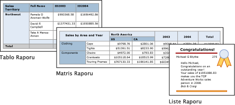

# Power BI Rapor Oluşturucusu'ndaki tablolar, matrisler ve listeler

[!INCLUDE [applies-to](../includes/applies-to.md)] [!INCLUDE [yes-service](../includes/yes-service.md)] [!INCLUDE [yes-paginated](../includes/yes-paginated.md)] [!INCLUDE [yes-premium](../includes/yes-premium.md)] [!INCLUDE [no-desktop](../includes/no-desktop.md)] 

Rapor Oluşturucusu'nda tablolar, matrisler ve listeler, satır ve sütunlar halinde düzenlenmiş hücrelerde sayfalandırılmış rapor verilerinin görüntülendiği *veri bölgeleridir*. Hücreler normalde metin, tarih ve sayı gibi metin verileri içerir ama ölçerler, grafikler ve resim gibi rapor öğeleri de içerebilir. Tablolar, matrisler ve listeler hep birlikte *tablix* veri bölgeleri olarak adlandırılır.  
  
 Tablo, matris ve liste şablonları, verilerin hücrelerde görüntülenebildiği esnek bir kılavuz olan tablix veri bölgesi üzerinde oluşturulur. Tablo ve matris şablonlarında hücreler satır ve sütunlar halinde düzenlenmiştir. Şablonlar temeli oluşturan genel tablix veri bölgesinin çeşitlemeleri olduğundan, verileri şablon biçimlerinin bileşimiyle görüntüleyebilir ve raporunuzu oluştururken tablo, matris veya listeyi değiştirip başka bir veri gölgesinin özelliklerini içermesini sağlayabilirsiniz. Örneğin, bir tablo ekler ve bunun ihtiyaçlarınızı karşılamadığını fark ederseniz, sütun grupları ekleyip tabloyu matrise dönüştürebilirsiniz.  
  
 Tablo ve matris veri bölgelerine iç içe tablolar, matrisler, listeler, grafikler ve ölçerlerin eklenmesiyle karmaşık veri ilişkileri gösterilebilir. Tablolar ve matrisler tablo düzenindedir ve verileri tek bir veri kaynağı üzerinde oluşturulmuş tek veri kümesinden gelir. Tablolarla matrislerin başlıca farklı tablolarda yalnızca satır grupları bulunabilirken matrislerin satır grupları ve sütun grupları içermesidir.  
  
 Listeler biraz daha farklıdır. Bunlar serbest düzeni destekler ve her biri farklı veri kümelerindeki verileri kullanan birden çok eş tablo veya matris içerebilir. Listeler, fatura gibi formlar için de kullanılabilir.  
  
 Aşağıdaki resimlerde bir tablo, matris ve liste içeren basit raporlar gösterilir.  

  
##   Tablolar  
 Ayrıntılı verileri görüntülemek, verileri satır gruplarında düzenlemek veya her ikisini de yapmak için tabloyu kullanın. Tablo şablonu bir tablo başlık satırı ve veriler için ayrıntı satırı olan üç sütundan oluşur. Aşağıdaki şekilde tasarım yüzeyinde seçilmiş ilk tablo şablonu gösterilir:  

  
 Verileri tek alana göre, birden çok alana göre veya kendi ifadenizi yazarak gruplandırabilirsiniz. İç içe gruplar veya bağımsız, bitişik gruplar oluşturabilir ve gruplandırılmış veriler için toplam değerleri görüntüleyebilir veya toplamları gruplara ekleyebilirsiniz. Örneğin, tablonuzda **Kategori** adlı bir satır grubu varsa, hem her grup için birer alt toplam hem de rapor için genel toplam ekleyebilirsiniz. Tablonun görünümünü geliştirmek ve üzerinde durulmasını istediğiniz verileri vurgulamak için hücreleri birleştirebilir, verilere ve tablo başlıklarına biçimlendirme uygulayabilirsiniz.  
  
 Başlangıçta ayrıntı verilerini veya gruplandırılmış verileri gizleyebilir ve kullanıcının ne kadar veri gösterileceğini etkileşimli olarak seçebilmesi için detaya gitme düğmeleri ekleyebilirsiniz.  
  
##   Matrisler  
 Toplam veri özetlerini PivotTable veya çapraz tabloya benzer biçimde satırlar ve sütunlar halinde gruplandırılmış olarak görüntülemek için matris kullanın. Gruplardaki satır ve sütunları sayısı, her satır ve sütun grubundaki benzersiz değerlerin sayısına göre belirlenir. Aşağıdaki şekilde tasarım yüzeyinde seçilmiş ilk matris şablonu gösterilir:  

 
 Satır ve sütun gruplarında verileri birden çok alana veya ifadeye göre gruplandırabilirsiniz. Çalışma zamanında rapor verileri ve veri bölgeleri birleştirildiğinde, sütun grupları için sütunlar ve satır grupları için satırlar eklendikçe matris sayfada yatay ve dikey olarak büyür. Matris hücrelerinde, kapsamı hücrenin ait olduğu satır ve sütun gruplarının kesişimi olarak belirlenen toplam değerler görüntülenir. Örneğin matrisinizin satış toplamını görüntüleyen bir satır grubu (Kategori) ve iki sütun grubu (Bölge ve Yıl) varsa, raporda Kategori grubundaki her değer için satış toplamlarının yer aldığı iki hücre görüntülenir. Hücrelerin kapsamı iki kesişim noktasıdır: Kategori ve Bölge ile Kategori ve Yıl. Matris iç içe ve bitişik gruplar içerebilir. İç içe grupların üst-alt ilişkisi ve bitişik grupların eş ilişkisi vardır. Matrisin içindeki iç içe satır ve sütun gruplarının herhangi bir düzeyine veya tüm düzeylerine alt toplamlar ekleyebilirsiniz.  
  
 Matris verilerinin daha okunabilir olmasını sağlamak ve üzerinde durulmasını istediğiniz verileri vurgulamak için hücreleri birleştirebilir veya yatay ve dikey olarak bölebilir ve verilerle grup başlıklarına biçimlendirme uygulayabilirsiniz.  
  
 Başlangıçta ayrıntı verilerini gizleyen detaya gitme düğmeleri de ekleyebilirsiniz; kullanıcı iki durumlu düğmelere tıklayarak ihtiyacına göre daha çok veya daha az ayrıntı görüntüleyebilir.  
  
##   Listeler  
 Serbest biçimli bir düzen oluşturmak için liste kullanın. Kılavuz düzeniyle sınırlı değilsiniz ama listenin içine serbestçe alanları yerleştirebilirsiniz. Birçok veri kümesi alanı görüntülemek için veya gruplandırılmış verilerde yan yana birden çok veri bölgesi görüntülemeye yönelik bir kapsayıcı olarak listeyi kullanabilirsiniz. Örneğin bir çalışan veya hasta kaydında yapabileceğiniz gibi liste için bir grup tanımlayabilir; tablo, grafik ve resim ekleyebilir; her grup değeri için değerleri tablo ve grafik biçiminde görüntüleyebilirsiniz.  

  
##   Verileri hazırlama  
 Tablo, matris ve liste veri bölgelerinde bir veri kümesinden veriler görüntülenir. Verileri, veri kümesinin verilerini alan sorguda ya da tablo, matris veya listedeki özellikleri ayarlamak yoluyla hazırlayabilirsiniz.  
  
 Rapor veri kümelerini alırken kullandığınız Transact-SQL gibi sorgu dilleri, verilerin yalnızca bir alt kümesini içerecek şekilde filtreler uygulayarak, null veya boş değerleri raporun daha okunabilir olmasını sağlayan sabitlerle değiştirerek, verileri sıralayarak ve gruplandırarak verileri hazırlayabilir.  
  
 Verileri raporun tablo, matris veya liste veri bölgesinde hazırlamayı seçerseniz, veri bölgesinde veya veri bölgesi içindeki hücrelerde özellikleri ayarlarsınız. Verileri filtrelemek veya sıralamak isterseniz, veri bölgesinde özellikleri ayarlayın. Örneğin verileri sıralamak için sıralama ölçütü olarak kullanılacak sütunları ve sıralama yönünü belirtirsiniz. Alana alternatif bir değer sağlamak isterseniz, alanı görüntüleyen hücre metninin değerlerini ayarlarsınız. Örneğin, alan boş veya null olduğunda Boşluk görüntülemek için değeri ayarlamak üzere bir ifade kullanırsınız.  
  
##   Tablo, matris veya listeyi oluşturma ve yapılandırma  
 Raporunuza tablolar veya matrisler eklerken Tablo ve Matris Sihirbazı'nı kullanabilir veya bunları Rapor Oluşturucusu'nun sağladığı şablonlardan el ile oluşturabilirsiniz. Listeler liste şablonundan el ile oluşturulur.  
  
 Sihirbaz, tablo veya matrisi hızla oluşturmanız ve yapılandırmanız için size yol gösterir. Sihirbazı tamamladıktan sonra veya tablix veri bölgelerini sıfırdan oluşturuyorsanız, bunları daha fazla yapılandırabilir ve ayarlayabilirsiniz. Veri bölgelerindeki sağ tıklatma menülerinden ulaşılan iletişim kutularıyla sayfa sonları, üst bilgilerle alt bilgilerin tekrarlanabilirliği ve görünürlüğü, görüntü seçenekleri, filtreler ve sıralama için en sık kullanılan özellikler kolayca ayarlanabilir. Ama tablix veri bölgesi daha birçok ek seçenek sağlar; bunları yalnızca Rapor Oluşturucusu'nun Özellikler bölmesinde ayarlayabilirsiniz. Örneğin tablo, matris veya listenin veri kümesi boş olduğunda bir ileti görüntülenmesini istiyorsanız, Özellikler bölmesindeki NoRowsMessage tablix özelliğinde ileti metnini belirtirsiniz.  
  
##   Tablix şablonlarını değiştirme  
 İlk tablix şablonu seçiminizle sınırlı değilsiniz. Gruplar, toplamlar ve etiketleri eklerken tablix tasarımınızı değiştirmek isteyebilirsiniz. Örneğin bir tabloyla başlayıp sonra ayrıntılar satırını silebilir ve sütun grupları ekleyebilirsiniz.  
  
 Herhangi bir tablix özelliği ekleyerek tabloyu, matrisi veya listeyi geliştirmeye devam edebilirsiniz. Tablix özellikleri satırlarda ve sütunlarda ayrıntı verilerini ve gruplandırılmış veriler için toplamları görüntülemeyi içerir. İç içe gruplar, bağımsız bitişik gruplar veya özyinelemeli gruplar oluşturabilirsiniz. Gruplandırılmış verileri filtreleyebilir, sıralayabilir ve grup tanımına birden çok grup ifadesi ekleyerek grupları kolayca birleştirebilirsiniz  
  
 Grup için toplamları veya veri bölgesi için genel toplamları da ekleyebilirsiniz. Satırları veya sütunları gizleyerek raporu basitleştirebilir ve bir detaya gitme raporunda olduğu gibi kullanıcının gizli verileri görüntülemeye geçiş yapmasına olanak sağlayabilirsiniz. 

## Sonraki adımlar

- [Power BI Premium’da sayfalandırılmış raporlar nelerdir?](paginated-reports-report-builder-power-bi.md)
