# Bir rapor sayfasının boyutunu değiştirme
[Önceki makalede ve videoda](power-bi-report-display-settings.md), Power BI raporlarındaki sayfaların nasıl görüntüleneceğini denetlemeye ilişkin iki farklı yöntem öğrendiniz: **Görünüm** ve **Sayfa Boyutu**. Sayfa görünümü ve Sayfa Boyutu hem Power BI hizmetinde hem de Power BI Desktop'ta kullanılabilir. Görünüm ve işlevler de hemen hemen aynıdır ancak bu eğitimde biz Power BI hizmetini kullanacağız.

### Önkoşullar
- Power BI hizmeti   
- [Retail Analysis Sample raporu](sample-retail-analysis.md)

## İlk olarak, sayfa görünümü ayarını değiştirelim

1. Raporu Okuma Görünümü'nde veya Düzenleme Görünümü'nde açın ve **New Stores** rapor sekmesini seçin. Varsayılan olarak bu rapor sayfası, **Sayfaya Sığdır** ayarı kullanılarak görüntülenir.  Bu örnekte Sayfaya Sığdır seçeneği kullanılmıştır ve rapor sayfası, kaydırma çubukları olmadan görüntülenmektedir ancak bazı ayrıntılar ve başlıklar okunamayacak kadar küçüktür.

   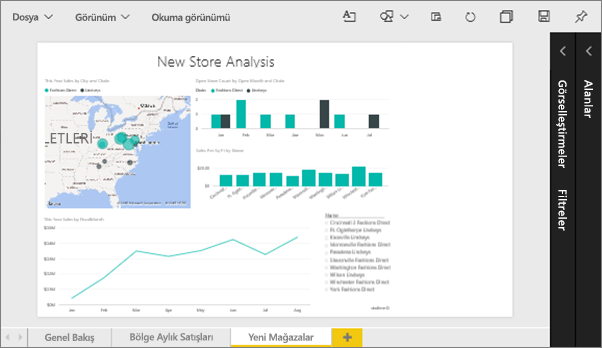
2. Tuvalde herhangi bir görselleştirmenin seçili olmadığından emin olun. **Görünüm**'ü seçin ve görüntüleme seçeneklerini gözden geçirin.

    * Okuma görünümünde, aşağıdaki seçenekleri görürsünüz.

     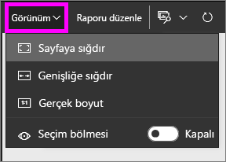
    * Düzenleme görünümü'nde ise aşağıdaki gibi bir menüyle karşılaşırsınız.

    

1. **Gerçek boyut** ayarını kullanarak sayfanın nasıl göründüğüne bakalım.

   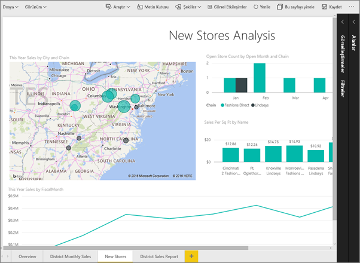

   Pek iyi göründüğü söylenemez. Panoda artık iki kaydırma çubuğu bulunmaktadır.
2. **Genişliğe uydur**'u seçin.

   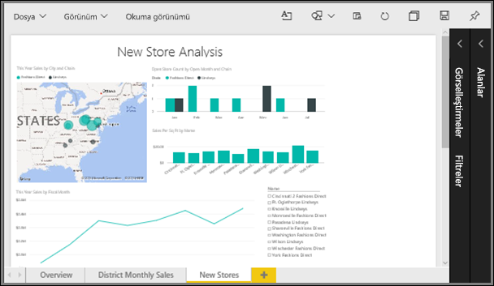

   Artık daha iyi görünüyor. Kaydırma çubukları hâlâ var ancak ayrıntılar daha kolay bir şekilde okunabiliyor.

## Bir rapor sayfasının varsayılan görünümünü değiştirme
Rapor *oluşturucusuysanız* rapor sayfalarınız için varsayılan görünümü değiştirebilirsiniz. Raporunuzu başkalarıyla paylaştığınızda rapor sayfaları, ayarlamış olduğunuz görünüm kullanılarak açılır. Rapor *kullanıcıları* görünümü değiştirebilir ancak rapordan çıktıklarında, yapmış oldukları değişiklikleri kaydedemezler.

1. Raporun **New Stores** sayfasında **Gerçek boyut** görünümüne geri dönün.

   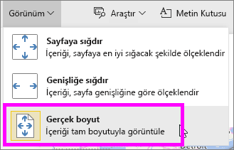

2. **District Monthly Sales** rapor sayfasında Görünüm ayarını **Sayfaya sığdır** olarak belirleyin.

3. **Overview** rapor sayfasında varsayılan Görünüm ayarını değiştirmeyin.

4. Şimdi **Dosya > Kaydet** seçeneğini belirleyerek raporu kaydedin. Raporu daha sonra açtığınızda sayfalar yeni Görünüm ayarları kullanılarak görüntülenir. Hemen deneyelim.

   
3. Üstteki gezinti çubuğunda, geçerli çalışma alanının adını seçerek bu çalışma alanına dönün.  

   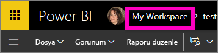
4. **Raporlar** sekmesini ve ardından aynı raporu (Retail Analysis Sample) seçin.

    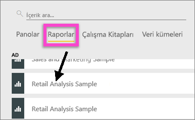
5. Yeni ayarları görmek için raporun tüm sayfalarını açın.

   

## Şimdi *sayfa boyutu* ayarını inceleyelim
Sayfa boyutu ayarları yalnızca [Düzenleme görünümü](service-interact-with-a-report-in-editing-view.md)'nde kullanılabilir. Bu nedenle, sayfa boyutu ayarlarını değiştirebilmeniz için rapora ilişkin düzenleme (*oluşturucu*) izinlerine sahip olmanız gerekir. [Örneklerimizden](sample-datasets.md) herhangi birine bağlandığınızda bu raporlar için *oluşturucu* izinlerine sahip olursunuz.

1. [Perakende Analizi örneğinin](sample-retail-analysis.md) "District monthly sales" sayfasını, Düzenleme Görünümü'nde açın.
2. Tuvalde herhangi bir görselleştirmenin seçili olmadığından emin olun.  **Görsel Öğeler** bölmesinde boya rulosu simgesini  seçin.
3. Sayfa boyutu seçeneklerini görüntülemek için **Sayfa Boyutu** &gt; **Tür**'ü seçin.

   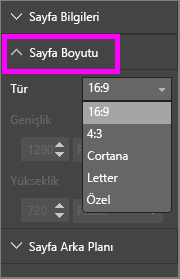
4. **Letter**'ı seçin.  Tuvalde, yalnızca 816 x 1056 piksele (Letter boyutu) sığan içerikler tuvalin beyaz kısmında kalır.

   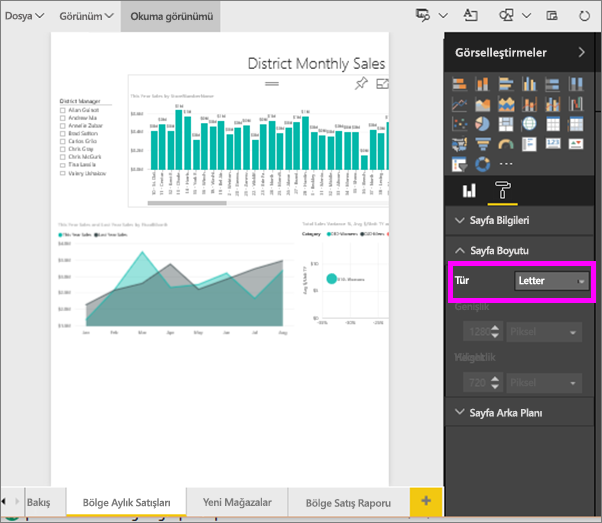
5. **Sayfa boyutu** **16:9** oranını seçin.

   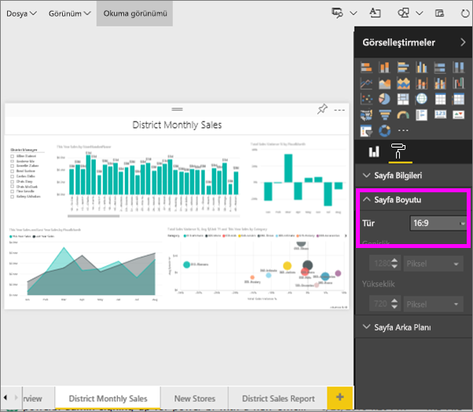

   Rapor sayfası 16:9 oranı kullanılarak görüntülenir. Kullanılan gerçek piksel boyutunu görmek için, gri renkli Genişlik ve Yükseklik alanlarına (1280 x 720) bakın. Rapor tuvalinin etrafında çok fazla boşluk bulunmaktadır. Bunun nedeni, **Görünüm**'ü "Genişliğe uydur" olarak ayarlamış olmamızdır.
7. **Sayfa Boyutu** seçeneklerini incelemeye devam edin.

## Sayfa Görünümü ve Sayfa Boyutu seçeneklerini birlikte kullanma
İş arkadaşlarınızla paylaştığınızda veya başka bir uygulamaya eklediğinizde en iyi şekilde görüntülenecek olan bir rapor oluşturmak için Sayfa Görünümü ve Sayfa Boyutu seçeneklerini birlikte kullanın.

Bu alıştırmada, 500 piksel genişliğinde ve 750 piksel yüksekliğinde alana sahip bir uygulamada görüntülenecek bir rapor oluşturacaksınız.

Önceki adımda, rapor sayfamızın 1280 piksel genişliğinde ve 720 piksel yüksekliğinde görüntülendiğini görmüştük. Bu nedenle, tüm görsellerimizin sığmasını istiyorsak birçok yeniden boyutlandırma ve yeniden düzenleme işlemi yapmamız gerektiğini biliyoruz.

1. Görselleri, geçerli tuval alanının yarısından daha küçük bir alana sığacak şekilde yeniden boyutlandırın ve taşıyın.

    
2. **Sayfa Boyutu** &gt; **Özel**'i seçin.
3. Genişlik değerini 500, Yükseklik değerini ise 750 olarak ayarlayın.

    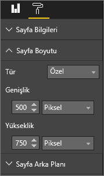
4. En iyi şekilde görünmesi için rapor sayfası üzerinde ince ayarlar yapın. Ayarlamalar yapmak için **Görünüm > Gerçek boyut** ve **Görünüm > Sayfaya sığdır** seçenekleri arasında geçiş yapın.

    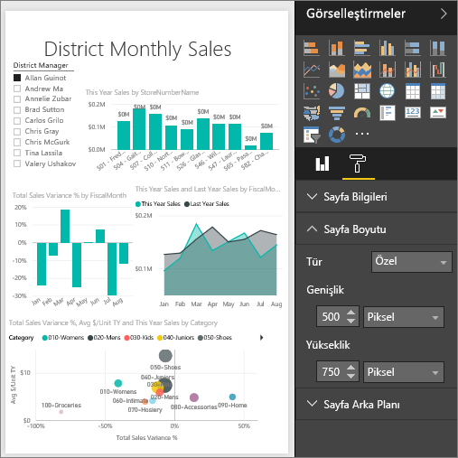

## Sonraki adımlar
[Cortana için rapor oluşturma](service-cortana-answer-cards.md)

[Power BI raporlarında sayfa görüntüleme ayarları](power-bi-report-display-settings.md) konusuna tekrar göz atın

Başka bir sorunuz mu var? [Power BI Topluluğu'na başvurun](http://community.powerbi.com/)
