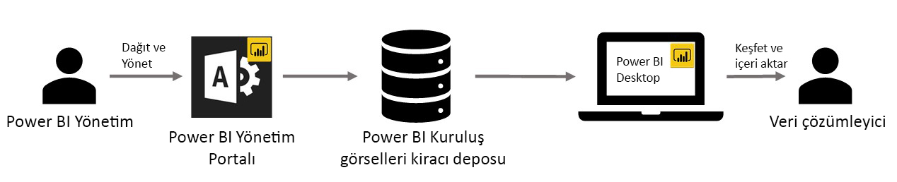

# Power BI’da özel kuruluş görsellerini kullanma

Power BI'da özel görselleri kullanarak size veya aktarmaya çalıştığınız veri bilgilerine göre uyarlanmış, benzersiz türde bir görsel oluşturabilirsiniz. Bu özel görseller genellikle geliştiriciler tarafından, Power BI’daki birçok görselin gereksinimlerini tam olarak karşılamadığı durumlarda oluşturulur. 

Bazı kuruluşlarda özel görseller daha da önemlidir ve bunlar kuruluşa özgü verilerin ya da bilgilerin aktarılması için gerekli olabilir, özel veri gereksinimlerine sahip olabilir ya da özel iş yöntemlerini vurgulayabilir. Bu durumdaki kuruluşların özel görseller geliştirmesi, kuruluş genelinde paylaşması ve bakımlarının düzgün yapıldığından emin olması gerekir. Power BI özel görselleri, kuruluşların tam olarak bunu yapmasına olanak sağlar.

Aşağıdaki resimde, Power BI’daki özel kuruluş görsellerinin yöneticiden başlayıp geliştirme ve bakım aşamalarından geçerek veri analistinde sonlanan akış süreci gösterilmektedir.

Kuruluş görselleri, Power BI yöneticisi tarafından Yönetim portalından dağıtılır ve yönetilir. Görsel kuruluş deposuna dağıtıldıktan sonra kuruluştaki kullanıcılar bunları doğrudan Power BI Desktop’tan kolayca keşfedebilir ve özel kuruluş görsellerini raporlarında içeri aktarabilir.

Oluşturduğunuz raporlarda özel kuruluş görsellerini kullanma hakkında daha fazla bilgi için şu makaleye bakın: [Kuruluş görsellerini raporlarınızda içeri aktarma hakkında daha fazla bilgi edinin](power-bi-custom-visuals.md).

## Özel kuruluş görsellerini yönetme

Kuruluşunuzda özel kuruluş görsellerini yönetme, dağıtma ve yönetme hakkında daha fazla bilgi edinmek için şu makaleye bakın: [Özel kuruluş görsellerinin dağıtımı ve yönetimi hakkında daha fazla bilgi edinin](https://go.microsoft.com/fwlink/?linkid=866790).

> [!WARNING]
> Özel bir görsel, güvenlik veya gizlilik riski taşıyan kod içerebilir. Bir özel görseli kuruluş deposuna dağıtmadan önce görselin yazarına ve kaynağına güvendiğinizden emin olun.

## Önemli noktalar ve sınırlamalar

Bilmeniz gereken birçok önemli nokta ve sınırlama vardır.

Yönetici:

* Eski özel görseller (sürümü tutulan yeni API'leri temel almayan özel görseller gibi) desteklenmez

* Özel bir görsel depodan silinirse, silinen görseli kullanan tüm mevcut raporlar işlenmeyi durdurur. Depodan silme işlemi geri alınamaz. Özel bir görseli geçici olarak devre dışı bırakmak için "Devre dışı bırak" özelliğini kullanın.

Son kullanıcı:

* Özel kuruluş görselleri, kuruluş deposundan içeri aktarılan özel görsellerdir. Tüm özel görsellerde olduğu gibi [PowerPoint’e aktarılamaz](https://docs.microsoft.com/power-bi/consumer/end-user-powerpoint) veya kullanıcı [rapor sayfalarına abone olduğunda](https://docs.microsoft.com/power-bi/consumer/end-user-subscribe) gönderilen e-postalarda görüntülenmez. Bu özellikler yalnızca doğrudan marketten içeri aktarılmış olan [sertifikalı özel görseller](https://docs.microsoft.com/power-bi/power-bi-custom-visuals-certified) için kullanılabilir.

* AppSource marketten edinilen Visio görseli, PowerApps görseli, Harita kutusu görseli ve GlobeMap görseli kuruluş deposu aracılığıyla dağıtılırsa gösterilmez.

## Sorun giderme

Sorun giderme hakkında bilgi için [Power BI özel görsellerinizin sorunlarını giderme](power-bi-custom-visuals-troubleshoot.md) bağlantısını ziyaret edin.

## SSS

Daha fazla bilgi edinmek ve sorularınıza yanıt bulmak için [Power BI özel görselleri hakkında sık sorulan sorular](power-bi-custom-visuals-faq.md#organizational-custom-visuals) bağlantısını ziyaret edin.

Başka bir sorunuz mu var? [Power BI Topluluğu'na başvurun](http://community.powerbi.com/).
