# Power BI'daki özel görseller
Bir Power BI raporu oluştururken veya düzenlerken kullanabileceğiniz çok çeşitli türden görseller bulunmaktadır. Bu görseller, **Görsel Öğeler** bölmesinde sunulur. Bu görseller dizisi, Power BI Desktop'ı indirdiğinizde veya Power BI hizmetini (app.powerbi.com) açtığınızda hazır olarak sunulur.

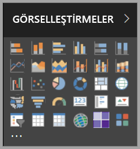

Ancak, kullanabileceğiniz görseller bu görsel dizisiyle sınırlı değildir. Üç nokta simgesini seçtiğinizde başka bir rapor görseli kaynağı daha sunulur: *özel görseller*.

Geliştiriciler, iş kullanıcılarının verilerini işletme için en uygun şekilde görmesine imkan sağlamak için özel görseller SDK’sını kullanarak özel görseller oluşturur. Daha sonra, rapor yazarları bu özel görsel dosyalarını diğer Power BI görselleri gibi kendi raporlarında içeri aktarabilir. Özel görseller Power BI’da 1. sınıf öğelerdir ve filtrelenebilir, vurgulanabilir, düzenlenebilir, paylaşılabilir, vb.

Özel görseller 3 dağıtım kanalı biçiminde olabilir:
* Özel görsel dosyaları
* Kuruluş görselleri
* Market görselleri

## Özel görsel dosyaları

Özel görseller, kendisine sunulan verileri işlemeye yönelik kod içeren paketlerdir. Herkes özel bir görsel oluşturup bunu bir Power BI raporunda içeri aktarılabilen tek bir .pbiviz dosyası olarak paketleyebilir.

> [!WARNING]
> Özel görseller güvenlik veya gizlilik riski taşıyan kodlar içerebilir. Özel görseli raporunuzda içeri aktarmadan önce görselin yazarına ve kaynağına güvendiğinizden emin olun.
> 
> 

## Kuruluş görselleri (Önizleme)

Power BI yöneticileri, kuruluş içinde kullanılmasına onay verdikleri özel görselleri rapor yazarlarının kolayca keşfedip kullanabilmesi için kuruluşlarına özel görseller dağıtabilir. Bu sayede, yönetici kuruluşta dağıtmak üzere belirli özel görselleri seçme konusunda denetimin yanı sıra bu görselleri yönetmenin (örn. sürümü güncelleştirme, devre dışı bırakma/etkinleştirme) kolay bir yoluna sahip olur. Rapor yazarı için kuruluşa özgü görselleri keşfetme ve bu görsellerin güncelleştirilmesi için sorunsuz destek almanın kolay bir yolunu sağlar.

Özel kuruluş görselleri hakkında daha fazla bilgi edinmek için lütfen [kuruluş görselleri hakkında daha fazla bilgi edinin](power-bi-custom-visuals-organization.md).

## Market görselleri

Topluluk üyelerinin yanı sıra Microsoft tarafından genel kamu yararına yönelik olarak özel görsel katkısında bulunulmuş ve bu görseller [AppSource](https://appsource.microsoft.com/en-us/marketplace/apps?product=power-bi-visuals) markette yayımlanmıştır. Bu görseller indirilerek Power BI raporlarına eklenebilir. Bu özel görsellerin tümü, Microsoft tarafından işlevsellik ve kalite testinden geçirilip onaylanmıştır.

AppSource nedir? Basit bir şekilde açıklamak gerekirse, Microsoft yazılımınıza yönelik uygulamaları, eklentileri ve uzantıları bulabileceğiniz yerdir. [AppSource](https://appsource.microsoft.com/en-us/); Power BI, Office 365, Azure, Dynamics 365 ve Cortana gibi ürünlerin milyonlarca kullanıcısının, işlerini hiç olmadığı kadar verimli, bilinçli ve etkileyici bir şekilde gerçekleştirmelerine yardımcı olacak çözümlere bağlanmasını sağlar.

### Sertifikalı görseller

Power BI sertifikalı görseller, kalite konusunda ek olarak sıkı testlerden geçirilmiş olan market görselleridir. Bu görsellerin, [e-posta abonelikleri](https://docs.microsoft.com/en-us/power-bi/service-report-subscribe) ve [PowerPoint'e aktarma](https://docs.microsoft.com/en-us/power-bi/service-publish-to-powerpoint) gibi ek senaryolardaki kullanımları desteklenir.
Sertifikalı özel görsellerin listesini görmek veya kendi özel görselinizi göndermek için bkz. [Sertifikalı özel görseller](https://docs.microsoft.com/en-us/power-bi/power-bi-custom-visuals-certified).

Bir Web geliştiricisi olarak kendi görselleştirmelerinizi oluşturmak ve bunları AppSource'a eklemek mi istiyorsunuz? [Geliştirici Araçlarıyla çalışmaya başlama](https://docs.microsoft.com/en-us/power-bi/service-custom-visuals-getting-started-with-developer-tools) makalesini inceleyin ve [AppSource'ta özel görseller yayımlamayı](https://appsource.microsoft.com/en-us/marketplace/apps?product=power-bi-visuals) öğrenin.

### Bir dosyadan özel bir görseli içeri aktarın

1. Görsel Öğeler bölmesinin alt kısmındaki üç nokta simgesini seçin.

    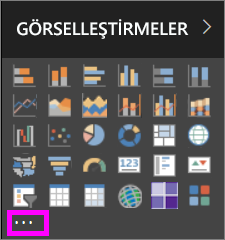

2. Açılan menüden **Dosyadan içeri aktar** seçeneğini belirleyin.

    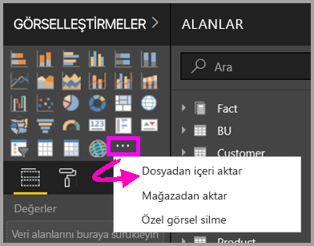

3. Dosyayı aç menüsünden içeri aktarmak istediğiniz .pbiviz dosyasını seçip Aç'ı seçin. Özel görselin simgesi, Görsel Öğeler bölmenizin alt kısmına eklenir ve bu özel görsel artık raporunuzda kullanılmaya hazırdır.

    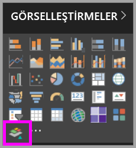

### Kuruluş görsellerini içeri aktarma

1. Görsel Öğeler bölmesinin alt kısmındaki üç nokta simgesini seçin.

    

2. Açılan menüden Marketten içeri aktarın seçeneğini belirleyin.

    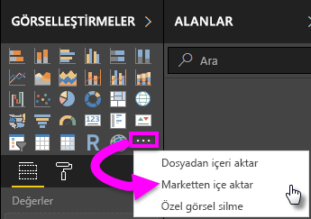

3. Üst sekme menüsünde **KURULUŞUM**’u seçin.

    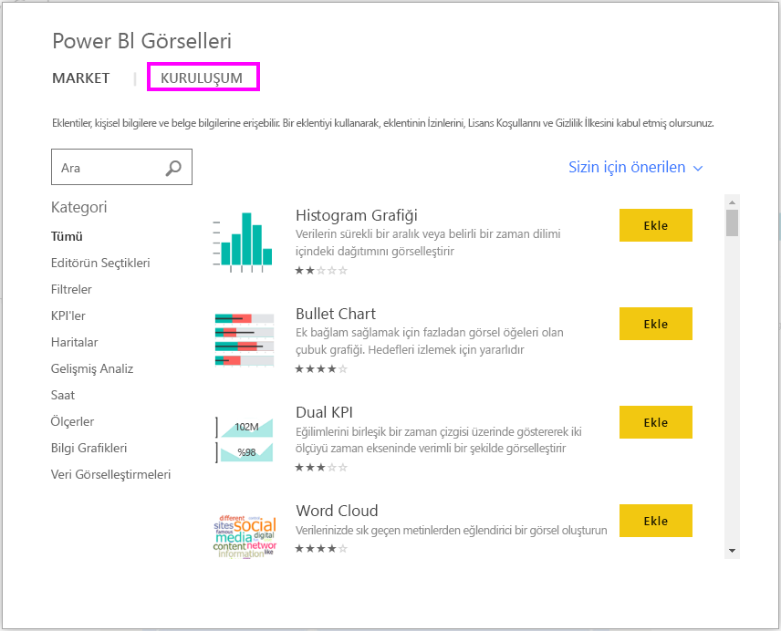

4. İçeri aktaracağınız görseli bulmak için sayfayı aşağı kaydırın.
    
    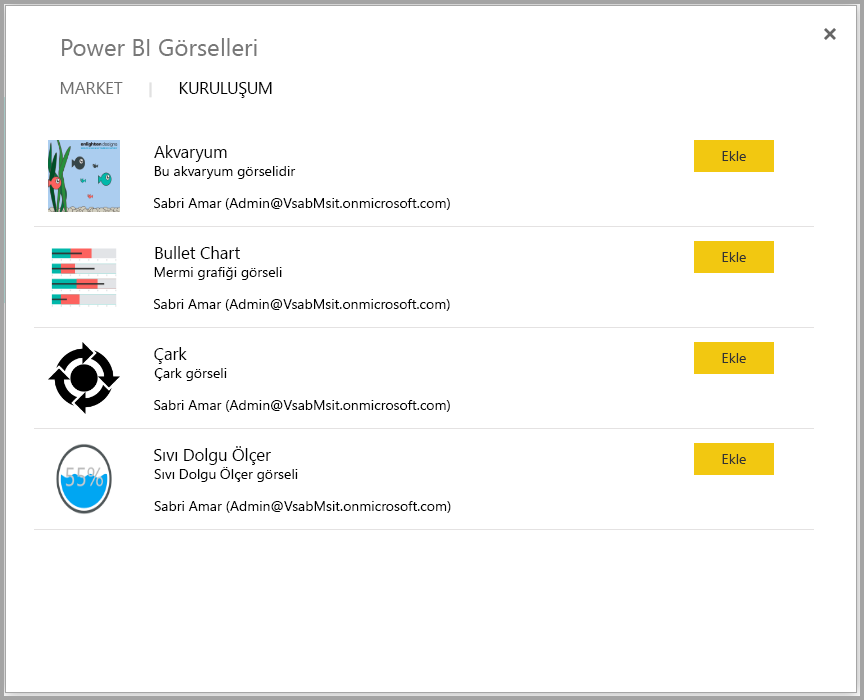

5. **Ekle** düğmesini seçerek özel görseli içeri aktarın. Özel görselin simgesi, Görsel Öğeler bölmenizin alt kısmına eklenir ve bu özel görsel artık raporunuzda kullanılmaya hazırdır.

    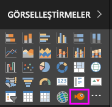
 
## Microsoft AppSource'tan özel görsel indirme veya içeri aktarma
Power BI'dan ve AppSource web sitesinden olmak üzere, özel görselleri indirmenin ve içeri aktarmanın iki yolu vardır.

### Özel görselleri Power BI'dan içeri aktarma

1. Görsel Öğeler bölmesinin alt kısmındaki üç nokta simgesini seçin.

    

2. Açılan menüden **Marketten içeri aktarın** seçeneğini belirleyin.

    

3. İçeri aktaracağınız görseli bulmak için sayfayı aşağı kaydırın.

    

4. Özel görsellerden biri hakkında daha fazla bilgi edinmek için ilgili özel görseli seçip vurgulayın.

    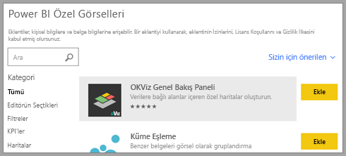

5. Ayrıntılar sayfasında ekran görüntülerini, videoları, ayrıntılı açıklamaları ve daha fazlasını görüntüleyebilirsiniz.

    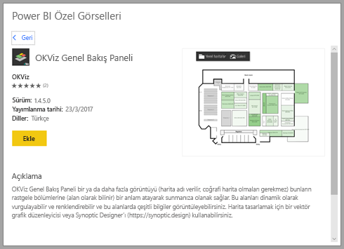

6. İncelemeleri görmek için sayfanın en altına gidin.

    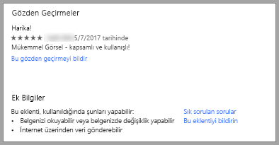

7. Ekle düğmesini seçerek özel görseli içeri aktarın. Özel görselin simgesi, Görsel Öğeler bölmenizin alt kısmına eklenir ve bu özel görsel artık raporunuzda kullanılmaya hazırdır.

    

### Microsoft AppSource'tan özel görsel indirme ve içeri aktarma

1. [Microsoft AppSource](https://appsource.microsoft.com)'a gidin ve **Uygulamalar** sekmesini seçin. 

    

2. Böylece, *Power BI Uygulamaları* da dahil olmak üzere her bir kategorideki sık kullanılan uygulamaları görüntüleyebileceğiniz [Uygulama sonuçları sayfası](https://appsource.microsoft.com/en-us/marketplace/apps) açılır. Ancak, aradığımız şey özel görseller olduğu için sol gezinti listesinden **Power BI visuals** seçeneğini belirleyerek sonuçları daraltalım.

    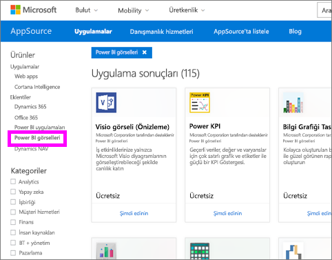

3. AppSource, her özel görsel için bir kutucuk görüntüler.  Her kutucuk, özel görselin bir anlık görüntüsünü içerir ve özel görsele ilişkin kısa bir açıklamayla indirme bağlantısı sunar. Daha fazla ayrıntı görmek için kutucuğu seçin. 

    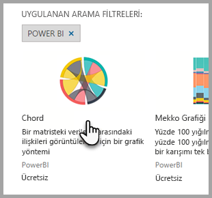

4. Ayrıntılar sayfasında ekran görüntülerini, videoları, ayrıntılı açıklamaları ve daha fazlasını görüntüleyebilirsiniz. **Şimdi edinin** düğmesini seçip Kullanım koşullarını kabul ederek özel görseli indirin. 

    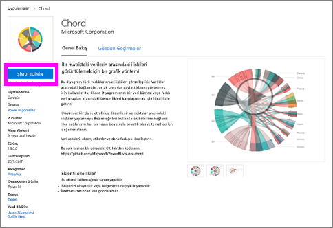

5. Özel görseli indirmek için bağlantıyı seçin.

    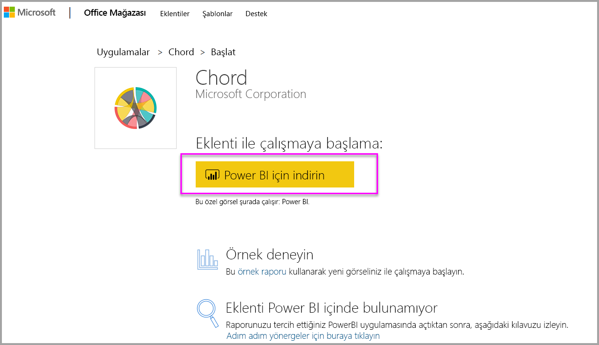

    İndirme sayfası aynı zamanda özel görselin Power BI Desktop'a ve Power BI hizmetine nasıl aktarılacağını anlatan yönergeler de içerir.

    Ayrıca özel görseli içeren ve görselin özelliklerinin sergilendiği örnek bir raporu da indirebilirsiniz.

    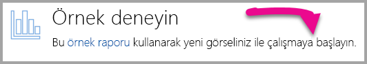

6. .pbiviz dosyasını kaydedin ve Power BI'ı açın.

7. Raporunuzda .pbiviz dosyasını içeri aktarın (Yukarıdaki [Bir dosyadan özel bir görseli içeri aktarın](#import-a-custom-visuals-from-a-file) bölümüne bakın)

## Önemli noktalar ve sorun giderme

- Özel görseller içeri aktarıldığında belirli bir rapora eklenir. Başka bir raporda kullanmak istiyorsanız görseli bu rapora da aktarmanız gerekir. Bir rapor, **Farklı Kaydet** seçeneği kullanılarak özel bir görselle kaydedildiğinde, özel görselin bir kopyası yeni raporla kaydedilir.

- **Görsel Öğeler** bölmesini görmüyorsanız bu, raporu düzenleme izninizin olmadığı anlamına gelir.  Sizinle paylaşılan raporlara değil, yalnızca düzenleyebildiğiniz raporlara özel görsel ekleyebilirsiniz.

Başka bir sorunuz mu var? [Power BI Topluluğu'na başvurun](http://community.powerbi.com/)