# Power BI Filtreler bölmesine ilişkin tura katılın
Bu makalede, raporlardaki Filtreler bölmesine ilişkin ayrıntılı bir bakış sunulmuştur. Bu bölmeyi [Power BI hizmeti Düzenleme Görünümü ve Okuma Görünümü](service-reading-view-and-editing-view.md) ile [Power BI Desktop Rapor görünümü](desktop-report-view.md) içinde görürsünüz.

Power BI'da verileri filtrelemenin birçok yolu vardır ancak öncelikle [Filtreler ve vurgulama hakkında](power-bi-reports-filters-and-highlighting.md) başlıklı makaleyi okumanızı öneririz.

## Raporun Filtreler bölmesiyle çalışma
Power BI Desktop'ta raporlar, Rapor görünümünde açılır. Power BI hizmetinde raporlar, [Düzenleme görünümü veya Okuma görünümü](service-reading-view-and-editing-view.md)'nde açılabilir. Düzenleme görünümünde ve Masaüstü Raporu görünümünde rapor sahipleri [raporlara filtreler ekleyebilir](power-bi-report-add-filter.md) ve eklenen filtreler raporla birlikte kaydedilir. Raporu Okuma görünümünde görüntüleyen kişiler filtrelerle etkileşime geçebilir, ancak rapora yeni filtreler ekleyemez.

Power BI hizmetinde raporlar, Filtreler bölmesinde yaptığınız tüm değişiklikleri korur ve bu değişiklikler, raporun mobil sürümüne taşınır. Filtre bölmesini oluşturanın varsayılanlarına geri döndürmek için en üstteki menü çubuğundan **Varsayılana sıfırla**’yı seçin.     

## Filtreler bölmesini açma
Bir rapor açıldığında, rapor tuvalinin sağ tarafında Filtreler bölmesi görüntülenir. Bölmeyi görmüyorsanız genişletmek için sağ üst köşedeki oku seçin. Power BI hizmetinin Okuma görünümündeyseniz, sağ tarafta yalnızca Filtreler bölmesi bulunur.

Bu örnekte, 6 filtresi bulunan bir görsel seçtik. Rapor sayfasında da filtreler bulunur ve bunlar **Sayfa düzeyi filtreleri** başlığı altında yer alır. Bir [Detaylandırma filtresinin](power-bi-report-add-filter.md) yanı sıra raporun tamamına uygulanmış bir filtre daha bulunur: **FiscalYear** 2013 veya 2014 değeridir.

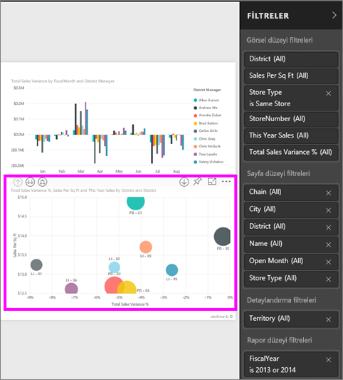

Bazı filtrelerin yanında **Tümü** ifadesi bulunur ve bu, tüm değerlerin söz konusu filtreye dahil edildiği anlamına gelir.  Örneğin, aşağıdaki ekran görüntüsünde **Chain (Tümü)**, bize bu rapor sayfasının tüm mağaza zincirleriyle ilgili verileri içerdiğini gösterir.  Diğer yandan, **FiscalYear 2013 veya 2014 değeridir** rapor düzeyi filtresi, bize raporun yalnızca 2013 ve 2014 mali yıllarına ilişkin verileri içerdiğini gösterir.

Bu raporu görüntüleyen tüm kullanıcılar filtrelerle etkileşime geçebilir.

* Filtrenin üzerine gelip yanındaki oku seçerek ayrıntılarını görüntüleyebilir.
  
   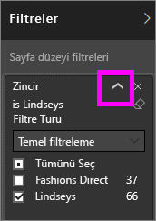
* Filtreyi değiştirebilir (örneğin, **Lindseys** filtresini **Fashions Direct** ile değiştirme).
  
     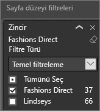

* Üstteki menü çubuğundan **Varsayılana sıfırla**’yı seçerek filtreleri özgün durumuna geri döndürebilir.    
    
    
* Filtre adının yanındaki **x** işaretini seçerek filtreyi silebilir.
  
  Bir filtre silindiğinde listeden kaldırılır ancak rapordan silinmez.  Örneğin, **FiscalYear 2013 veya 2014 değeridir** filtresini silerseniz mali yıl verileri raporda kalmaya devam eder ancak artık yalnızca 2013 ve 2014 yıllarını gösterecek şekilde filtrelenmek yerine verilerin kapsadığı tüm mali yılları gösterir.  Ancak sildiğiniz filtreler listeden kaldırılacağından bu filtreleri artık değiştiremezsiniz. Silgi simgesini  seçerek filtreyi temizlemek daha kullanışlı bir seçenektir.
  
  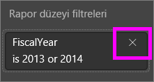

## Düzenleme Görünümü'nde filtreler
Bir rapor, Masaüstünde veya Power BI hizmetinin Düzenleme görünümünde açıldığında, rapor tuvalindeki **Görselleştirme bölmesinin** orta kısmının altında Filtreler bölmesi görüntülenir. Bölmeyi görmüyorsanız genişletmek için sağ üst köşedeki oku seçin.

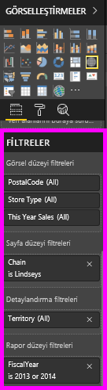.  

Tuvalde hiçbir görsel seçilmediyse Filtreler bölmesi, yalnızca rapor sayfasının veya raporun tamamına uygulanan filtreleri ve detaylandırma filtrelerini (ayarlandıysa) görüntüler. Aşağıdaki örnekte, hiçbir görsel seçilmemiştir ve herhangi bir sayfa düzeyi veya detaylandırma filtresi ayarlanmamıştır ancak bir rapor düzeyi filtresi mevcuttur.  

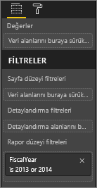  

Tuvalde bir görsel seçilirse yalnızca bu görsele uygulanmış filtreleri de görürsünüz:   

Belirli bir filtreye yönelik seçenekleri görüntülemek için filtre adının yanında bulunan aşağı oku seçin.  Aşağıdaki örnekte, rapor düzeyi filtresi 2013'e ve 2014'e ayarlanmıştır. Bu, bir **temel filtreleme** örneğidir.  Gelişmiş seçenekleri görüntülemek için **Gelişmiş Filtreleme** seçeneğini belirleyin.

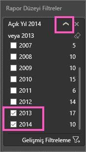

## Bir filtreyi temizleme
 Gelişmiş veya temel filtreleme modunda, filtreyi temizlemek için silgi simgesini  seçin. 

## Filtre ekleme
* Masaüstünde veya Power BI hizmetinin Düzenleme görünümünde bir görsele, sayfaya, detaylandırmaya ya da rapora filtre eklemek için Alanlar bölmesindeki bir alanı seçin ve **Alanları buraya sürükleyin** ifadesiyle gösterilen uygun filtre kutusuna sürükleyin. Bir alan filtre olarak eklendikten sonra, Temel filtreleme ve Gelişmiş filtreleme denetimlerini kullanarak (aşağıda açıklanmıştır) hassas ayarlamalar yapabilirsiniz.

- **Görsel düzeyi filtresi alanına yeni bir alan sürüklemek söz konusu alanın görsele eklenmesini sağlamaz** ancak görseli bu yeni alanla filtrelemenize olanak tanır. Aşağıdaki örnekte, **Chain** alanı görsele yeni bir filtre olarak eklenmiştir. Yalnızca **Chain** alanının bir filtre olarak eklenmesinin, siz Temel veya Gelişmiş filtreleme denetimlerini kullanana kadar görselin değişmesine neden olmadığına dikkat edin.

    

* Görselleştirme oluşturmak için kullanılan tüm alanlar aynı zamanda filtre olarak da kullanılabilir. Öncelikle, bir görseli seçerek etkin hale getirin. Görselde kullanılmakta olan alanlar, Görselleştirmeler bölmesinde ve Filtreler bölmesindeki **Görsel düzeyi filtreleri** başlığı altında yer alır.
  
   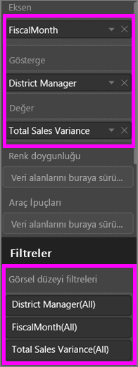  
  
   Temel filtreleme ve Gelişmiş filtreleme denetimlerini kullanarak (aşağıda açıklanmıştır) bu alanlar için hassas ayarlamalar yapabilirsiniz.

## Filtre türleri: metin alanı filtreleri
### Liste modu
Bir onay kutusunun işaretlenmesi ilgili değerin seçilmesini veya seçiminin kaldırılmasını sağlar. Tüm onay kutularının durumunu açık veya kapalı olarak değiştirmek için **Tümü** onay kutusu kullanılabilir. Onay kutuları, söz konusu alan için kullanılabilen tüm değerleri temsil eder.  Siz filtreyi ayarlarken, ifade, seçimlerinizi yansıtacak şekilde güncelleştirilir. 

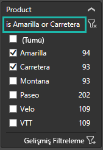

İfadenin artık "Amarilla veya Carretera değeridir" olarak göründüğüne dikkat edin

### Gelişmiş mod
Gelişmiş moda geçmek için **Gelişmiş Filtreleme** seçeneğini belirleyin. Hangi alanların dahil edileceğini belirlemek için açılan menü denetimlerini ve metin kutularını kullanın. **Ve** ile **Veya** arasında seçim yaparak karmaşık filtre ifadeleri oluşturabilirsiniz. İstediğiniz değerleri belirledikten sonra **Filtre Uygula** düğmesini seçin.  

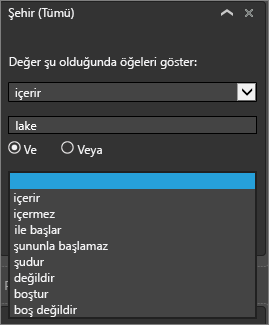

## Filtre türleri: sayısal alan filtreleri
### Liste modu
Değerler sınırlıysa, alanı seçtiğinizde bir liste görüntülenir.  Onay kutuları kullanma ile ilgili yardım için yukarıdaki **Metin alanı filtreleri** &gt; **Liste modu** başlığına bakın.   

### Gelişmiş mod
Değerler sınırsızsa veya bir aralığı temsil ediyorsa alanı seçtiğinizde gelişmiş filtreleme modu açılır. Görmek istediğiniz değer aralığını belirtmek için, açılan menüyü ve metin kutularını kullanın. 

**Ve** ile **Veya** arasında seçim yaparak karmaşık filtre ifadeleri oluşturabilirsiniz. İstediğiniz değerleri belirledikten sonra **Filtre Uygula** düğmesini seçin.

## Filtre türleri: tarih ve saat
### Liste modu
Değerler sınırlıysa, alanı seçtiğinizde bir liste görüntülenir.  Onay kutuları kullanma ile ilgili yardım için yukarıdaki **Metin alanı filtreleri** &gt; **Liste modu** başlığına bakın.   

### Gelişmiş mod
Alan değerleri tarih veya saat temsil ediyorsa Tarih/Saat filtrelerini kullanırken başlangıç/bitiş zamanı belirtebilirsiniz.  

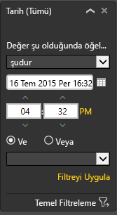

## Sonraki adımlar
[Raporlarda filtreleme ve vurgulama](power-bi-reports-filters-and-highlighting.md)  
[Okuma Görünümü'nde filtreler ve vurgulama ile etkileşim kurma](service-reading-view-and-editing-view.md)  
[Rapor Düzenleme Görünümü'nde filtre oluşturma](power-bi-report-add-filter.md)  
[Rapor görsellerinin birbirini çapraz filtreleme ve çapraz vurgulama şeklini değiştirme](service-reports-visual-interactions.md)

[Power BI'daki raporlar](service-reports.md) hakkında daha fazla bilgi edinin  
[Power BI - Temel Kavramlar](service-basic-concepts.md)

Başka bir sorunuz mu var? [Power BI Topluluğu'na başvurun](http://community.powerbi.com/)

