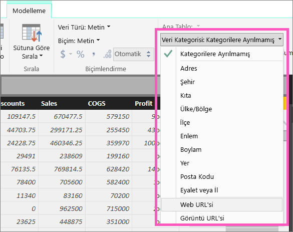
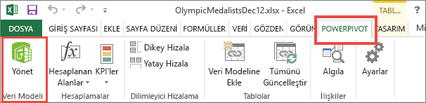
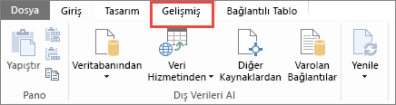
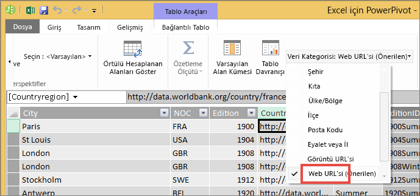

# Tablolardaki köprüler
Bu konu başlığı altında, Power BI Desktop'ın köprü oluşturmak için nasıl kullanılacağı açıklanmaktadır. Oluşturduktan sonra bu köprüleri rapor tablolarınıza ve matrislerinize eklemek için Desktop'ı veya Power BI hizmetini kullanabilirsiniz. 

> **NOT**: [Panolardaki kutucuklar](service-dashboard-edit-tile.md) ve [metin kutuları](service-dashboard-add-widget.md) içinde bulunan köprüler, çalışma sırasında Power BI hizmeti kullanılarak oluşturulabilir. [Raporlardaki metin kutuları](service-add-hyperlink-to-text-box.md) içinde bulunan köprüler, çalışma sırasında Power BI hizmeti ve Power BI Desktop kullanılarak oluşturulabilir.
> 
> 

## Power BI Desktop ile bir tablo veya matris içinde köprü oluşturmak için
Tablolardaki ve matrislerdeki köprüler Power BI Hizmeti ile değil, Power BI Desktop ile oluşturulabilir. Köprüler ayrıca, çalışma kitabı Power BI'a aktarılmadan önce Excel Power Pivot'ta da oluşturulabilir. Her iki yöntem de aşağıda açıklanmıştır.

## Power BI Desktop'ta bir tablo veya matris köprüsü oluşturma
Köprü ekleme yordamı, verileri içeri aktararak mı yoksa DirectQuery bağlantısı kullanarak mı aldığınıza göre değişir. Her iki senaryo da aşağıda açıklanmıştır.

### Power BI'a aktarılan veriler için
1. Köprü, veri kümenizde bir alan olarak mevcut değilse Desktop'ı kullanın ve köprüyü bir [özel sütun](desktop-common-query-tasks.md) olarak ekleyin.
2. Veri görünümündeyken sütunu seçin ve **Modelleme** sekmesinde **Veri Kategorisi** açılan listesini açın.
   
    
3. **Web URL'si** seçeneğini belirleyin.
4. Rapor görünümüne geçin ve Web URL'si olarak kategorilendirilen alanı kullanarak bir tablo veya matris oluşturun. Köprüler mavi renkte ve altı çizili olarak görünür.
   
    
5. Tabloda uzun bir URL'nin görünmesini istemiyorsanız bunun yerine köprü  simgesini gösterebilirsiniz. Matrislerde simge gösteremezsiniz.
   
   * Grafiği seçip etkin duruma getirin.
   * Boya rulosu simgesini  seçin ve Biçimlendirme sekmesini açın.
   * **Değerler** bölümünü genişletin, **URL simgesini** bulun ve **Açık** olarak değiştirin.
6. (İsteğe bağlı) [Desktop'taki raporu Power BI hizmetinde yayımlayın](guided-learning/publishingandsharing.yml#step-2) ve raporu Power BI hizmetinde açın. Köprüler burada da çalışır durumda olacaktır.

### DirectQuery ile bağlanılan veriler için
DirectQuery modunda yeni bir sütun oluşturamazsınız.  Ancak, verileriniz zaten URL içeriyorsa bunları köprülere dönüştürebilirsiniz.

1. Rapor görünümündeyken, URL içeren bir alan kullanarak tablo oluşturun.
2. Sütunu seçin ve **Modelleme** sekmesinde **Veri Kategorisi** açılan listesini açın.
3. **Web URL'si** seçeneğini belirleyin. Köprüler mavi renkte ve altı çizili olarak görünür.
4. (İsteğe bağlı) [Desktop'taki raporu Power BI hizmetinde yayımlayın](guided-learning/publishingandsharing.yml#step-2) ve raporu Power BI hizmetinde açın. Köprüler burada da çalışır durumda olacaktır.

## Excel Power Pivot'ta bir tablo veya matris köprüsü oluşturma
Power BI tablolarınıza ve matrislerinize köprü eklemenin diğer bir yolu da ilgili veri kümesini Power BI'dan aktarmadan veya ilgili veri kümesine Power BI'dan bağlanmadan önce köprüleri bu veri kümesinde oluşturmaktır. Bu örnekte bir Excel çalışma kitabı kullanılmıştır.

1. Çalışma kitabını Excel'de açın.
2. **PowerPivot** sekmesini seçin ve ardından **Yönet** seçeneğini belirleyin.
   
   
3. PowerPivot açıldığında **Gelişmiş** sekmesini seçin.
   
   
4. İmlecinizi, Power BI tablolarında köprüye dönüştürmek istediğiniz URL'leri içeren sütuna yerleştirin.
   
   > **NOT**: URL'ler **http://, https://** veya **www** ile başlamalıdır.
   > 
   > 
5. **Raporlama Özellikleri** grubundaki **Veri Kategorisi** açılan listesinden **Web URL'si** seçeneğini belirleyin. 
   
   
6. Power BI hizmetinden veya Power BI Desktop'tan bu çalışma kitabına bağlanın veya çalışma kitabını içeri aktarın.
7. URL alanını içeren bir tablo görselleştirmesi oluşturun.
   
   

## Sonraki adımlar
[Power BI raporlarındaki görselleştirmeler](power-bi-report-visualizations.md)

[Power BI - Temel Kavramlar](service-basic-concepts.md)

Başka bir sorunuz mu var? [Power BI Topluluğu'na başvurun](http://community.powerbi.com/)

