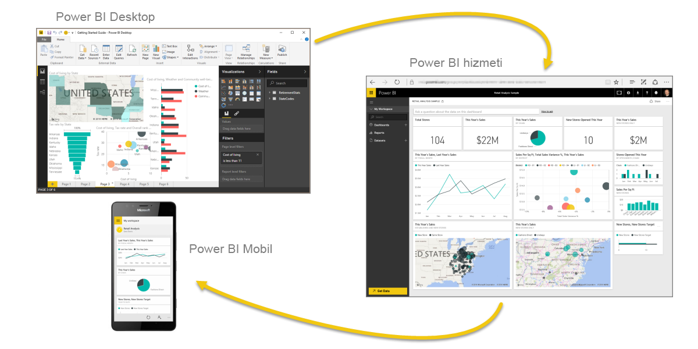
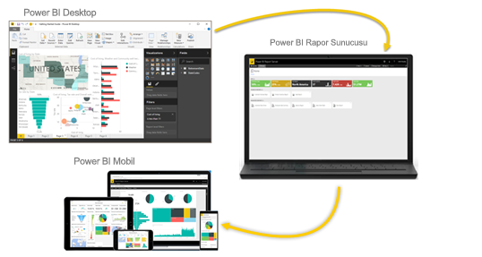

# Power BI nedir?
**Power BI**, birbirinden bağımsız veri kaynaklarınızı tutarlı, görsel olarak sürükleyici ve etkileşimli öngörülere dönüştürmenizi sağlamak için birlikte çalışan yazılım hizmetlerinden, uygulamalardan ve bağlayıcılardan oluşan bir koleksiyondur. Verilerinizin basit bir Excel elektronik tablosu veya bulut tabanlı ve şirket içi hibrit veri ambarlarından oluşan bir koleksiyon olması fark etmeksizin **Power BI**, veri kaynaklarınıza kolayca bağlanmanıza, önemli verileri görselleştirmenize (veya araştırmanıza) ve bunları istediğiniz herkesle paylaşmanıza olanak sağlar.

**Power BI**, Excel elektronik tablolarından veya yerel veritabanlarından hızlı öngörüler oluşturma özelliği ile işlemlerinizi basit ve hızlı şekilde gerçekleştirebilir. Ayrıca, **Power BI** özel geliştirmenin yanı sıra kapsamlı modelleme ve gerçek zamanlı analiz işlemlerinizi gerçekleştirmeye hazır, sağlam ve kurumsal sınıf bir hizmettir. Bu nedenle Power BI, kişisel rapor ve görselleştirme aracınız olabileceği gibi grup projeleri, departmanlar veya tüm şirket için analiz ve karar mekanizması olarak da kullanılabilir.

## Power BI'ın bileşenleri
Power BI; **Power BI Desktop** adlı bir Windows masaüstü uygulamasını, **Power BI hizmeti** adlı bir çevrimiçi SaaS (*Hizmet olarak Yazılım*) hizmetini ve Windows işletim sistemi yüklü telefon ve tabletlerin yanı sıra iOS cihazlarında ve Android cihazlarda kullanılabilen Power BI mobil **uygulamalarını** içerir.

Bu üç bileşen (**Desktop**, **hizmet** ve **Mobil**) kullanıcıların ihtiyaçlarına veya sahip oldukları role uygun iş öngörüleri oluşturmasına, paylaşmasına ve kullanmasına olanak sağlamak için tasarlanmıştır.

## Power BI, rolünüzle nasıl eşleşir?
Power BI'ı nasıl kullandığınız bir projedeki veya ekipteki rolünüze bağlıdır. Başka rollerdeki kullanıcılar Power BI'ı farklı şekillerde kullanabilir ve bu oldukça normaldir.

Örneğin, siz en çok **Power BI hizmetini** kullanırken, sürekli hesaplama yapan ve rapor oluşturan (ardından, Desktop raporlarını sizin de daha sonra görüntüleyebileceğiniz Power BI hizmetinde yayımlayan) iş arkadaşınız **Power BI Desktop**'ı çok daha fazla kullanabilir. Satış departmanındaki başka bir iş arkadaşınız ise satış kotalarındaki ilerlemeyi izlemek ve yeni satış fırsatları hakkında ayrıntılı bilgi edinmek için Power BI telefon uygulamasını daha çok kullanabilir.

Geliştiriciyseniz, Power BI API’lerini kullanarak veri kümelerine veri gönderebilir veya pano ve raporları kendi özel uygulamalarınıza ekleyebilirsiniz. Yeni bir görsel için fikriniz mi var? Kendi başınıza oluşturun ve başkalarıyla paylaşın.  

Bununla birlikte, ne elde etmek istediğinize veya belirli bir proje için sahip olduğunuz role bağlı olarak farklı dönemlerde **Power BI**'ın her bir bileşenini kullanabilirsiniz.

Bir yandan Power BI hizmetindeki gerçek zamanlı bir panoda envanter ve üretim sürecini izlerken diğer yandan kendi ekibiniz için müşteri ilişkilerine yönelik istatistiklerle ilgili raporlar oluşturmak üzere **Power BI Desktop**'ı kullanabilirsiniz. Power BI'ı nasıl kullandığınız, Power BI'ın hangi özelliğinin veya hizmetinin durumunuz için en uygun araç olduğuna göre değişiklik gösterebilir. Ancak, Power BI'ın her bir bileşenini kullanabilirsiniz; onu bu kadar esnek ve etkileyici yapan da budur.

## Power BI'daki iş akışı
Power BI’da ortak bir iş akışı, veri kaynaklarına bağlanarak ve **Power BI Desktop**’ta rapor oluşturarak başlar. Bu rapor daha sonra **Desktop**’tan **Power BI hizmetine** yayımlanır ve **hizmet** ve **mobil** kullanıcılarının raporu *tüketebilmesi* (görüntüleme ve etkileşimde bulunma) için paylaşılır.
Bazı durumlarda, iş arkadaşlarınızın **hizmeti** rapor düzenlemek, pano oluşturmak ve kendi çalışmalarını da paylaşmak için kullanabilmesi amacıyla onlara kendinizinkine benzer izinler vermek isteyebilirsiniz (*creator* izinleri).

Daha yaygın iş akışlarından biri olmasına rağmen her zaman bu yöntemle gerçekleşmez ve üç ana Power BI öğesinin birbirini nasıl tamamladığını gösterir.

Ancak buluta taşınmaya hazır değilseniz ve raporlarınızı bir kurumsal güvenlik duvarının arkasında tutmak istiyorsanız ne olur?  Okumaya devam edin.

## Power BI rapor sunucusu ile şirket içi raporlama
Power BI Rapor Sunucusu'nun sunduğu, kullanıma hazır çok sayıda araç ve hizmeti kullanarak Power BI raporları, mobil raporlar ve sayfalandırılmış raporlar oluşturun, bunları dağıtın ve yönetin.

Power BI Rapor Sunucusu, güvenlik duvarınızın arkasında dağıttığınız ve sonra raporlarınızı bir web tarayıcısında, mobil cihazda veya e-posta olarak görüntülemeyi içeren farklı yöntemlerle doğru kullanıcılara ilettiğiniz bir çözümdür. Power BI Rapor Sunucusu bulutta Power BI ile uyumlu olduğundan, hazır olduğunuzda buluta taşıyabilirsiniz.

## Sonraki adımlar
[Power BI hizmetinde oturum açma, bazı verileri alma ve kullanmayı öğrenme](service-the-new-power-bi-experience.md)   
[Öğretici: Power BI hizmetini kullanmaya başlama](service-get-started.md)
