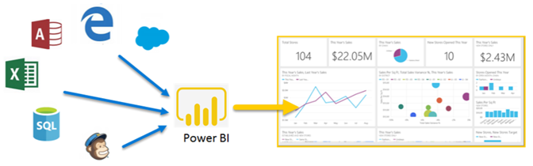

# Power BI nedir?
**Power BI**, birbirinden bağımsız veri kaynaklarınızı tutarlı, görsel olarak sürükleyici ve etkileşimli öngörülere dönüştürmenizi sağlamak için birlikte çalışan yazılım hizmetlerinden, uygulamalardan ve bağlayıcılardan oluşan bir koleksiyondur. Verileriniz bir Excel elektronik tablosu veya bulut tabanlı ve şirket içi hibrit veri ambarları koleksiyonu olabilir. Power BI veri kaynaklarınıza kolayca bağlanmanızı, önemli noktaları görselleştirmenizi ve keşfetmenizi, bunu herkesle veya istediğiniz kişilerle paylaşmanızı sağlar.

Power BI, Excel elektronik tablolarından veya yerel veritabanlarından hızlı öngörüler oluşturma özelliği ile işlemlerinizi basit ve hızlı şekilde gerçekleştirebilir. Ayrıca, Power BI özel geliştirmenin yanı sıra kapsamlı modelleme ve gerçek zamanlı analiz işlemlerinizi gerçekleştirmeye hazır, sağlam ve kurumsal sınıf bir hizmettir. Bu nedenle Power BI, kişisel rapor ve görselleştirme aracınız olabileceği gibi grup projeleri, departmanlar veya tüm şirket için analiz ve karar mekanizması işlevi de görebilir.

## Power BI'ın bileşenleri
Power BI şunlardan oluşur: 
- **Power BI Desktop** adlı bir Windows masaüstü uygulaması
- **Power BI hizmeti** adlı bir çevrimiçi SaaS (*Hizmet olarak Yazılım*) 
- Windows, iOS ve Android cihazlar için Power BI **mobil uygulamalar**

Bu üç bileşen &mdash;Power BI Desktop, hizmet ve mobil uygulamalar&mdash; kullanıcıların ihtiyaçlarına veya sahip oldukları role uygun iş içgörüleri oluşturmasına, paylaşmasına ve kullanmasına olanak sağlamak için tasarlanmıştır.

Dördüncü bir öğe olarak **Power BI Rapor Sunucusu** Power BI raporlarını Power BI Desktop'ta oluşturduktan sonra şirket içi rapor sunucusuna yayımlamanıza olanak tanır. [Power BI Rapor Sunucusu](#on-premises-reporting-with-power-bi-report-server) hakkında daha fazla bilgi edinin.

## Power BI, rolünüzle nasıl eşleşir?
Power BI'ı nasıl kullandığınız bir projedeki veya ekipteki rolünüze bağlıdır. Başka rollerdeki kullanıcılar Power BI'ı farklı şekillerde kullanabilir.

Örneğin, öncelikli olarak **Power BI hizmetini** kullanabilirsiniz. Ancak sürekli hesaplama yapan, iş raporları oluşturan iş arkadaşınız raporları oluşturmak ve sonra da bunları görüntüleyebileceğiniz Power BI hizmetine yayımlamak için **Power BI Desktop**'ı yoğun olarak kullanabilir. Satış departmanındaki başka biri, satış kotalarındaki ilerleme durumu izlemek ve yeni olası müşteri bilgilerinde detaya gitmek için asıl olarak **Power BI telefon uygulamasını** kullanabilir.

Geliştiriciyseniz, Power BI API’lerini kullanarak veri kümelerine veri gönderebilir veya pano ve raporları kendi özel uygulamalarınıza ekleyebilirsiniz. Yeni bir görsel için fikriniz mi var? Kendi başınıza oluşturun ve başkalarıyla paylaşın.  

Bununla birlikte, ne elde etmek istediğinize veya belirli bir proje için sahip olduğunuz role bağlı olarak farklı dönemlerde Power BI'ın her bileşenini kullanabilirsiniz.

Power BI'ı nasıl kullandığınız, Power BI'ın hangi özelliğinin veya hizmetinin sizin durumunuza en uygun araç olduğuna bağlı olabilir. Örneğin, bir yandan Power BI hizmetindeki gerçek zamanlı bir panoda envanter ve üretim sürecini izlerken diğer yandan kendi ekibiniz için müşteri ilişkilerine yönelik istatistiklerle ilgili raporlar oluşturmak üzere Power BI Desktop'ı kullanabilirsiniz. Power BI'ın her bölümü kullanılabilir ve onu bu kadar esnek ve cazip yapan da budur.

Rolünüzle ilgili belgeleri keşfetme:
- [***Tasarımcılar***](desktop-what-is-desktop.md) için Power BI
- [***Tüketiciler***](consumer/end-user-consumer.md) için Power BI
- [***Geliştiriciler***](developer/what-can-you-do.md) için Power BI
- [***Yöneticileri***](service-admin-administering-power-bi-in-your-organization.md) için Power BI

## Power BI'daki iş akışı
Power BI’da ortak bir iş akışı, veri kaynaklarına bağlanarak ve Power BI Desktop’ta rapor oluşturarak başlar. Ardından bu raporu Power BI Desktop'tan Power BI hizmetine yayımlar ve paylaşırsınız. Bu sayede Power BI hizmetindeki ve mobil cihazlardaki son kullanıcılar raporu görüntüleyebilir ve raporla etkileşimli çalışabilir.
Bu yaygın bir iş akışıdır ve üç ana Power BI öğesinin birbirini nasıl tamamladığını gösterir.

Burada ayrıntılı bir [Power BI Desktop ve Power BI hizmeti karşılaştırması](service-service-vs-desktop.md) bulabilirsiniz.

Ancak buluta taşınmaya hazır değilseniz ve raporlarınızı bir kurumsal güvenlik duvarının arkasında tutmak istiyorsanız ne olur?  Okumaya devam edin.

## Power BI rapor sunucusu ile şirket içi raporlama
Power BI Rapor Sunucusu'nun sunduğu, kullanıma hazır çok sayıda araç ve hizmeti kullanarak Power BI raporları, mobil raporlar ve sayfalandırılmış raporlar oluşturun, bunları dağıtın ve yönetin.

Power BI Rapor Sunucusu, güvenlik duvarınızın arkasında dağıttığınız ve sonra raporlarınızı bir web tarayıcısında, mobil cihazda veya e-posta olarak görüntülemeyi içeren farklı yöntemlerle doğru kullanıcılara ilettiğiniz bir çözümdür. Power BI Rapor Sunucusu bulutta Power BI ile uyumlu olduğundan, hazır olduğunuzda buluta taşıyabilirsiniz. 

[Power BI Rapor Sunucusu](report-server/get-started.md) hakkında daha fazla bilgi edinin.

## Sonraki adımlar
- [Hızlı başlangıç: Power BI hizmetini öğrenme](service-the-new-power-bi-experience.md)   
- [Öğretici: Power BI hizmeti ile çalışmaya başlama](service-get-started.md)
- [Hızlı başlangıç: Power BI Desktop'taki verilere bağlanma](desktop-quickstart-connect-to-data.md)
