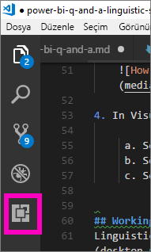
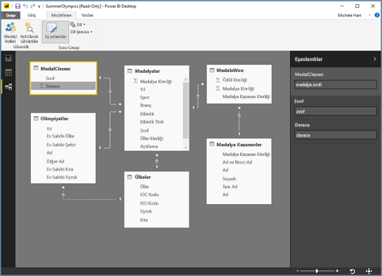
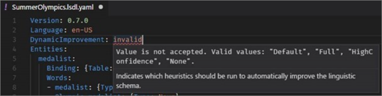

# <a name="edit-qa-linguistic-schema-and-add-phrasings-in-power-bi-desktop"></a>Power BI Desktop'ta Soru-Cevap dil şemasını düzenleme ve ifade ekleme 
Yaygın ifadeler ve doğal dil kullanarak verilerinize soru sorabilmek çok değerli bir olanaktır. Daha da değerlisi, verilerinizin yanıt vermesi. İşte Power BI’daki Soru-Cevap ile bunu yapabilirsiniz. Power BI Soru-Cevap uygulamasına bir soru sorduğunuzda bu uygulama, doğru yanıtı vermek için en yüksek çabayı gösterir. 

Ancak daha da iyi Soru-Cevap etkileşimleri için, yanıtları iyileştirmenin yolları vardır. Bu yollardan biri, dil şemasının düzenlenmesidir. 

Kurumsal veriler her şeyin başıdır.  Veri modeli ne kadar iyiyse, kullanıcıların kaliteli yanıtlar alması o kadar kolay olacaktır. Modeli iyileştirmenin bir yolu, veri kümenizdeki tablo ve sütun adları arasındaki ilişkileri ve terminolojiyi tanımlayıp kategorilere ayıran bir dil şeması eklenmesidir. Dil şemalarınızı Power BI Desktop’ta yönetirsiniz. 

## <a name="what-is-a-linguistic-schema"></a>Dil şeması nedir?
Dil şeması, Soru-Cevap uygulamasının bir veri kümesi içindeki nesneler için anladığı, söz konusu veri kümesiyle ilişkili sözcük türleri, eş anlamlılar ve ifadeler gibi terimleri ve ifadeleri açıklar. Bir veri kümesini içeri aktardığınızda veya bir veri kümesine bağlandığınızda Power BI, veri kümesinin yapısına dayalı bir dil şeması oluşturur. Soru-Cevap uygulamasına bir soru sorduğunuzda bu uygulama, sorunuzun amacını anlamak için verilerdeki ilişkileri ve eşleşmeleri arar. Örneğin, isimleri, fiilleri, sıfatları, ifadeleri ve diğer öğeleri arar. Ayrıca ilişkileri de (örn. hangi sütunların bir fiilin nesnesi olduğunu) arar. 

Büyük ihtimalle sözcük türlerini biliyorsunuzdur (bilmiyorsanız, aşağıya bakın), ancak ifadeler sizin için yeni bir terim olabilir.  İfade, öğeler arasındaki ilişkileri nasıl söylediğinizdir. Örneğin, müşteriler ve ürünler arasındaki ilişkiyi açıklamak için “müşteriler ürünleri satın alır” diyebilirsiniz. Veya müşteriler ve yaş arasındaki ilişkiyi açıklamak için “yaş, müşterilerin kaç yaşında olduğunu belirtir” diyebilirsiniz. Veya müşteriler ve telefon numaraları arasındaki ilişkiyi açıklamak için, “müşterilerin telefon numaraları vardır” diyebilirsiniz.

Bu ifadeler çeşitli şekil ve boyutlarda gelir. Bazıları doğrudan veri modelindeki ilişkilere karşılık gelir. Bazıları, kapsayıcı tablolarla sütunları ilişkilendirir. Bazıları karmaşık ilişkilerde birden fazla tabloyu ve sütunu ilişkilendirir. Her durumda bunlar, gündelik terimleri kullanarak öğelerin nasıl ilişkilendirildiğini açıklar.

Dil şemaları YAML biçiminde kaydedilir. Bu biçim, popüler JSON biçimiyle ilişkilidir ancak daha esnek ve daha kolay okunabilir bir söz dizimi sağlar. Dil şemaları düzenlenebilir, Power BI Desktop’a dışarı ve içeri aktarılabilir.

## <a name="prerequisites"></a>Önkoşullar
- [Soru-Cevap için veri modelinizi geliştirme](desktop-qna-in-reports.md) ile ilgili makaleyi henüz okumadıysanız önce bu makaleyi okumak isteyebilirsiniz. Bu, veri modelinizi tasarlama ve geliştirmeye yönelik birçok ipucunu ve eş anlamlı ekleme ile ilgili önemli bir bölümü içerir.  

- Soru-Cevap iki çerçevede ele alınır.  Birinci çerçeve hazırlık, yani "modelleme"dir.  İkincisi, soru sorma ve verileri keşfetme, yani "kullanma"dır. Bazı şirketlerde, Veri Modelleyicileri veya BT Yöneticileri olarak bilinen çalışanlar, veri kümelerini derleyen, veri modelleri oluşturan ve veri kümelerini Power BI’a yayımlayan kişiler olabilir.  İkinci bir çalışan grubu da bu verileri çevrimiçi "kullanıyor" olabilir.  Başka şirketlerde bu roller birleştirilebilir. 

    Bu konu, veri modelleyicileri içindir. Başka bir deyişle, veri kümesini alıp mümkün olan en iyi Soru-Cevap sonuçlarını sağlamak için veri kümesini iyileştiren kişiler. 

- [Örnek .yaml ve .pbix dosyaları](https://go.microsoft.com/fwlink/?linkid=871858)    
- YAML dosya düzenleyicisi, [Visual Studio Code](https://code.visualstudio.com/) öneririz


### <a name="set-up-an-editor-for-yaml-files"></a>YAML dosyaları için düzenleyici ayarlama
Dil şeması YAML dosyalarını düzenlemek için Visual Studio Code kullanılmasını öneririz. Visual Studio Code, YAML dosyaları için kullanıma hazır destek içerir ve özellikle Power BI dil şeması biçimini doğrulamak için genişletilebilir.
1. [Visual Studio Code](https://code.visualstudio.com/)’u yükleyin.    

2. Daha önce kaydettiğiniz örnek dil şemasını seçin: [YAML dosyası](https://go.microsoft.com/fwlink/?linkid=871858) (SummerOlympics.lsdl.yaml).    
4. **Visual Studio Code** ve **.yaml dosyalarını açmak için her zaman bu uygulamayı kullan** seçeneğini belirleyin.

    

4. Visual Studio Code’da, YAML Support by Red Hat uzantısını yükleyin.    
    a. **Uzantılar** sekmesini (solda en sonda yer alan) seçin veya CTRL+SHIFT+X tuşlarına basın.    
        
    b. "Yaml" ifadesini arayın ve listeden **YAML Support by Red Hat** seçeneğini belirleyin.    
    c. **Yükle > Yeniden Yükle**’yi seçin.


## <a name="working-with-linguistic-schemas"></a>Dil şemalarıyla çalışma
Dil şemaları, Power BI Desktop’ta [İlişki görünümünde](desktop-relationship-view.md) düzenlenebilir, içeri ve dışarı aktarılabilir. Dil şemasını düzenlemenin bir yolu, [eş anlamlıların **Eş Anlamlılar** bölmesine eklenmesidir](desktop-qna-in-reports.md). YAML dosyasını açmanız gerekmez.




 Dil şemasını düzenlemenin başka bir yolu da YAML dosyasının dışarı aktarılıp doğrudan düzenlenmesidir.  Bir dil şeması YAML dosyasını düzenlediğinizde, tablodaki sütunları farklı dilbilgisi öğeleri olarak etiketler ve bir iş arkadaşınızın soruyu oluşturmak için kullanabileceği sözcükleri tanımlarsınız. Örneğin, fiilin öznesi ve nesnesi olan sütunları belirtirsiniz. İş arkadaşlarınızın modelinizdeki tabloları, sütunları ve ölçüleri ifade etmek için kullanabileceği alternatif sözcükleri eklersiniz. 


Dil şemasını düzenleyebilmeniz için önce dil şemasını Power BI Desktop'tan açmanız (dışarı aktarmanız) gerekir. YAML dosyasını aynı konuma geri kaydettiğinizde içeri aktarmış olursunuz.  Ancak bunun yerine diğer YAML dosyalarını da içeri aktarabilirsiniz.  Örneğin, benzer bir veri kümeniz varsa ve önceden birçok sözcük türleri ekleme, ilişkileri tanımlama, ifadeler oluşturma ve eş anlamlılar oluşturma çalışması yaptıysanız. 

Soru-Cevap, daha iyi yanıt sağlamak, otomatik tamamlama işlevini ve soruların özetini sunmak için yaptığınız tüm geliştirmelerle birlikte bu bilgileri kullanır.


## <a name="edit-a-linguistic-schema"></a>Dil şemasını düzenleme
Dil şemanızı Power BI Desktop'tan ilk dışarı aktardığınızda, dosyadaki içeriklerin çoğu veya tümü otomatik olarak Soru-Cevap motoru tarafından oluşturulur. Bu oluşturulan varlıklar, sözcükler (eş anlamlılar), ilişkiler ve tümcecikler bir **Durum: Oluşturuldu** etiketiyle belirtilir ve çoğunlukla bilgilendirme amacıyla dosyaya eklenir ama kendi değişiklikleriniz için kullanışlı bir başlangıç noktası da olabilir. 

> [!NOTE]
> Bu öğreticide yer alan YAML dosyası özel olarak bu öğretici için hazırlanmış olduğundan, **Durum: Oluşturuldu** veya **Durum: Silindi** etiketlerini içermez. Bu etiketleri görmek için, düzenlenmemiş bir .pbix dosyasını İlişki görünümünde açın ve dil şemasını dışarı aktarın.


Dil şeması dosyanızı Power BI Desktop'a geri aktardığınızda, **Durum: Oluşturuldu** olarak işaretlenmiş her şey yok sayılır (ve daha sonra yeniden oluşturulur); dolayısıyla oluşturulan içerikte değişiklik yapmak isterseniz ilgili **Durum: Oluşturuldu** etiketini de kaldırdığınızdan emin olun. Benzer biçimde, oluşturulan herhangi bir içeriği kaldırmak isterseniz, **Durum: Oluşturuldu** etiketini de **Durum: Silindi** olarak değiştirmeniz gerekir. Böylece, dil şeması dosyanızı içeri aktardığınızda bu içerik yeniden oluşturulmaz.

1. Power BI Desktop *İlişki görünümünde* veri kümesini açın. 
2. **Modelleme** sekmesini ve sonra **Dil şemasını dışarı aktar**’ı seçin.
3. Visual Code’u (veya başka bir düzenleyici) seçin.
4. Düzenlemelerinizi yapın ve YAML dosyasını kaydedin.
5. Power BI Desktop'tan **İlişki görünümü > Modelleme sekmesi > Dil Şeması > Dil şemasını içeri aktar** seçeneğini belirleyin.
6. Düzenlenen YAML dosyasını kaydettiğiniz konuma gidip dosyayı seçin. Başarılı iletisi, dil şeması YAML dosyasının başarıyla içeri aktarıldığını size bildirir.

    

### <a name="add-phrasings-to-the-linguistic-schema"></a>Dil şemasına ifadeler ekleme
İfade, öğeler arasındaki ilişkileri nasıl söylediğinizdir. Örneğin, müşteriler ve ürünler arasındaki ilişkiyi açıklamak için “müşteriler ürünleri satın alır” diyebilirsiniz. Veya müşteriler ve yaş arasındaki ilişkiyi açıklamak için “yaş, müşterilerin kaç yaşında olduğunu belirtir” diyebilirsiniz. Veya atletler ve madalyalar arasındaki ilişkiyi açıklamak için “atletler madalya kazanır” diyebilirsiniz.

Bu ifadeler çeşitli şekil ve boyutlarda gelir. Bazıları doğrudan semantik modeldeki ilişkilere karşılık gelir. Bazıları, kapsayıcı tablolarla sütunları ilişkilendirir. Bazıları karmaşık ilişkilerde birden fazla tabloyu ve sütunu ilişkilendirir. Her durumda bunlar, gündelik terimleri kullanarak öğelerin nasıl ilişkilendirildiğini açıklar.

## <a name="where-do-phrasings-come-from"></a>İfadeler nereden gelir?
Power BI, modelin yapısına dayalı olarak dil şemasına otomatik olarak birçok basit ifade ve sütun adlarına dayalı olarak da bazı tahminler ekler. Örnek:
- Çoğu sütun, “ürünlerin açıklamaları olur” gibi basit bir ifadeyle kapsayıcı tablosuyla ilişkilendirilir.
- Model ilişkileri, “siparişlerin ürünleri olur” ve “ürünlerin siparişleri olur” gibi her iki ilişki yönü için varsayılan ifadelerle sonuçlanır.
- Bazı model ilişkileri, sütun adlarına dayalı olarak “siparişler şehirlere sevk edilir” gibi daha karmaşık bir varsayılan ifade alır.

Ancak kullanıcılarınız, Soru-Cevap uygulamasının tahmin edemeyeceği şeyler hakkında birçok farklı şekilde konuşabilir. Bu ifadeler için el ile kendi ifadelerinizi eklemek isteyebilirsiniz.


## <a name="why-should-i-add-phrasings"></a>Neden ifadeler eklemeliyim?
İfade eklemenin birinci nedeni yeni bir terimi tanımlamaktır. Örneğin, "en eski müşterilerin listelenmesini” isteyebilmek istiyorsanız önce “eski” ile ne demek istediğinizi Soru-Cevap uygulamasına öğretmeniz gerekir. “Eski, bir şeyin ne kadar zaman öncesine ait olduğunu belirtir” gibi bir ifade ekleyerek bunu yaparsınız.

İfade eklemenin ikinci nedeni, belirsizliği çözümlemektir. Sözcüklerin birden çok anlamı olduğunda temel anahtar sözcük araması yalnızca belirli bir yere kadar ilerler. Örneğin, “İzmir’e uçuşlar” ifadesi, “İzmir’den uçuşlar” ifadesinden oldukça farklı bir anlama gelir. Ancak “uçuşlar kalkış şehrinden olur” ve “uçuşlar varış şehrine olur” ifadelerini eklemezseniz Soru-Cevap hangisini demek istediğinizi bilmez. Benzer şekilde, Soru-Cevap “Can’ın Meryem’e sattığı arabalar” ve “Can’ın Meryem’den satın aldığı arabalar” arasındaki ayrımı da yalnızca “müşteriler çalışanlardan araba satın alır” ve “çalışanlar müşterilere araba satar” ifadelerini eklediğinizde anlar.

İfade eklemenin son nedeni de farklı bir şekilde ifade etmeyi geliştirmektir. Soru-Cevap uygulamasının size “Müşterileri ve ürünlerini göster” ifadesini çağrıştırması yerine, sorunun nasıl anlaşıldığına bağlı olarak, “Müşterileri ve satın aldıkları ürünleri göster” veya “Müşterileri ve gözden geçirdikleri ürünleri göster” denmesi daha net anlaşılacaktır. Özel ifadeler eklenmesi, farklı bir şekilde ifade etmenin daha belirtik ve anlaşılır olmasını sağlar.


## <a name="what-kinds-of-phrasings-are-there"></a>Ne tür ifadeler vardır?
Farklı türlerdeki ifadeleri anlamak için ilk olarak birkaç temel dilbilgisi terimini hatırlamanız gerekir:
- *İsim*, bir kişi, bir yer veya bir şeydir. 
    - Örnekler: araba, genç, Mert, akış kapasitörü
- *Fiil*, bir eylem veya harekettir. 
    - Örnekler: taramak, patlamak, yemek, çıkarmak
- *Sıfat*, bir ismi niteleyen tanımlayıcı bir sözcüktür. 
    - Örnekler: güçlü, sihirli, altın, çalıntı
- *Edat*, bir isimden önce kullanılan ve ismi önceki bir isim, fiil veya sıfat ile ilişkilendiren bir sözcüktür 
    - Örnekler: için, gibi, kadar
-  *Niteleyici*, bir şeyin özelliği veya niteliğidir.
-  *Ad*, bir kişiyi, hayvanı, yeri veya bir şeyi anımsamamıza, onları ötekilerden ayırmamıza yarayan sözcük ya da sözcük grubu.   


## <a name="attribute-phrasings"></a>Niteleyici ifadeler
Niteleyici ifadeler, Soru-Cevap uygulamasının lokomotifidir. Bir şey, başka bir şeyin niteleyicisi olarak hareket ettiğinde kullanılır. Bunlar basittir ve nettir. Daha incelikli ve daha ayrıntılı bir ifade tanımlamadığınızda iş yükünün çoğunu gerçekleştirir. Niteleyici ifadeler, temel “sahip olmak, içermek, bulunmak, var” fiilleri kullanılarak açıklanır (“ürünlerin kategorileri vardır” ve “ev sahibi ülkelerde, ev sahibi şehirler bulunur”). “-ın”, “için” edatı (“ürünlerin kategorileri”, “ürünler için siparişler”) ve iyelik ekleri (“Can’ın siparişleri) kullanılarak sorular sorulmasına olanak sağlar. Niteleyici ifadeler şu tür sorularda kullanılır:
- Hangi müşterilerin siparişleri var?
- Ev sahibi şehirleri, ülkeye göre artan düzende sırala
- Çay içeren siparişleri göster
- Siparişleri olan müşterileri listele
- Her bir ürünün kategorisi nedir?
- Recep Korhan’ın siparişlerini say    

Power BI, tablo/sütun bağımlılıklarına ve model ilişkilerine göre modelinizde gereken isim ifadelerinin çoğunu otomatik olarak oluşturur. Genellikle bunları sizin oluşturmanız gerekmez.
Aşağıda, bir niteleyici ifadenin dil şemasında nasıl göründüğüne dair bir örnek verilmiştir:

```json
product_has_category:
  Binding: {Table: Products}
  Phrasings:
  - Attribute: {Subject: product, Object: product.category}
```
 
## <a name="name-phrasings"></a>İsim İfadeleri
Veri modelinizde, atlet isimleri ve müşteri isimleri gibi adlandırılmış nesneler içeren bir tablo bulunuyorsa isim ifadeleri faydalı olur. Örneğin, “ürün adları, ürünlerin adlarıdır” ifadesi, sorularda ürün adlarını kullanabilmek için temel bir ifadedir. İsim ifadesi, “adlı” sözcüğünün de fiil olmasını sağlar (örn."Can Aydın adlı müşterileri listele"). Öte yandan, bir isim değerinin belirli bir tablo satırını ifade etmek için kullanılmasına olanak sağlamak amacıyla başka ifadelerle birlikte kullanıldığında bu en çok önemlidir. Örneğin, “Çay satın alan müşteriler” ifadesinde Soru-Cevap uygulaması, “çay” değerinin yalnızca ürün adı sütunundaki bir değeri değil, ürün tablosunun tüm satırını ifade ettiğini söyleyebilir. İsim ifadeleri şu tür sorularda kullanılır:    
- Hangi çalışanların adı Recep Korhan’dır?
- Kimin adı Enes Hanzade’dir?
- Ferit Numan’ın sporu
- Meryem adlı atletlerin sayısı
- Recep Korhan ne satın aldı?

Modelinizdeki isim sütunları için duyarlı bir adlandırma kuralı kullandığınız varsayıldığında (örn. “Ürnİsm” yerine “İsim” veya “Ürünİsmi”), Power BI modelinizde gereken isim ifadelerinin çoğunu otomatik olarak oluşturur, genellikle sizin oluşturmanız gerekmez.

Aşağıda, bir isim ifadesinin dil şemasında nasıl göründüğüne dair bir örnek verilmiştir:

```json
employee_has_name:
  Binding: {Table: Employees}
  Phrasings:
  - Name:
      Subject: employee
      Name: employee.name
```

 
## <a name="adjective-phrasings"></a>Sıfat İfadeleri
Sıfat ifadeleri, modelinizdeki şeyleri açıklamak için kullanılan yeni sıfatları tanımlar. Örneğin, “İstanbul’daki mutlu müşterileri listele” gibi sorular sormak için “mutlu müşteriler, derecelendirmesi 6’dan yüksek olan müşterilerdir” ifadesi gerekir. Farklı durumlarda kullanılacak farklı biçimlerde sıfat ifadeleri vardır.

*Basit sıfat ifadeleri*, “Üretimden kalkan ürünler, durumu = D olan ürünlerdir” gibi bir koşula dayalı olan yeni bir sıfatı tanımlar. Basit sıfat ifadeleri şu tür sorularda kullanılır:
- Üretimden kalkan ürünler hangileridir?
- Üretimden kalkan ürünleri listele
- Altın madalya sahiplerini listele
- Karşılanamayan sipariş ürünleri

Aşağıda, basit bir sıfat ifadesinin, ürün_üretimden_kalkan_bir_üründür dil şemasında nasıl göründüğüne dair bir örnek verilmiştir:

```json
Binding: {Table: Products}
  Conditions:
  - Target: product.discontinued
    Operator: Equals
    Value: true
  Phrasings:
  - Adjective:
      Subject: product
      Adjectives: [discontinued]
```

*Ölçüm sıfatı ifadeleri*, sıfatın ne kadar geçerli olduğuna dair bir sayısal değere dayalı yeni bir sıfatı tanımlar; örn. “uzunluklar, nehirlerin ne kadar uzun olduğunu belirtir” ve “küçük ülke bölgeleri, küçük arazi alanlarına sahiptir”. Ölçüm sıfatı ifadeleri şu tür sorularda kullanılır:
- Uzun nehirleri listele
- En uzun nehirler hangileridir?
- Basketbolda altın madalya kazanan en küçük ülke bölgelerini listele
- Kızılırmak nehrinin uzunluğu nedir?

Aşağıda, basit bir ölçüm sıfatı ifadesinin, nehrin_uzunluğu_şudur dil şemasında nasıl göründüğüne dair bir örnek verilmiştir:

 ```json
Binding: {Table: Rivers}
  Phrasings:
  - Adjective:
      Subject: river
      Adjectives: [long]
      Antonyms: [short]
      Measurement: river.length
```

*Dinamik sıfat ifadeleri*, “renkler, ürünleri açıklar” ve “etkinlikler, etkinlik cinslerine sahiptir” gibi, modeldeki bir sütunda yer alan değerlere dayalı olarak yeni sıfatlardan oluşan bir kümeyi tanımlar. Dinamik sıfat ifadeleri şu tür sorularda kullanılır:
- Kırmızı ürünleri listele
- Hangi ürünler yeşildir?
- Kadınlar için buz pateni etkinliklerini göster
- Etkin olan sorunları say

Aşağıda, dinamik bir sıfat ifadesinin, ürünün_rengi_şudur dil şemasında nasıl göründüğüne dair bir örnek verilmiştir:
```json
Binding: {Table: Products}
  Phrasings:
  - DynamicAdjective:
      Subject: product
      Adjective: product.color
```

 
## <a name="noun-phrasings"></a>İsim ifadeleri
İsim ifadeleri, modelinizdeki şeylerin alt kümelerini açıklayan yeni isimleri tanımlar. Genellikle modele özgü bir ölçüm veya koşul türünü içerir. Örneğin, Olimpiyatlar modelimiz için madalya sahiplerinden şampiyonları, su sporlarından top sporlarını, bireysel sporlardan takım sporlarını, atletlerin yaş kategorilerini (genç, yetişkin, kıdemli) vb. ayırt eden ifadeler eklemek isteyebiliriz. “Yıla göre batanları say” gibi sorular sorabilmemiz için, film veritabanımıza yönelik, “batanlar, net kârı 0’dan düşük olan filmlerdir” isim ifadelerini eklemek isteyebiliriz. Farklı durumlarda kullanılacak iki biçimde isim ifadesi vardır.

*Basit isim ifadesi*, “yükleniciler, tam zamanlı = false olan çalışanlardır” ve ”şampiyon, madalya sayısı >5 olan atlettir” gibi, bir koşula dayalı yeni bir isim tanımlar. Basit isim ifadeleri şu tür sorularda kullanılır:

- Hangi çalışanlar yüklenicidir?
- İstanbul’daki yüklenicileri say
- 2016’da kaç tane şampiyon vardır?

Aşağıda, basit bir isim ifadesinin, çalışan_yüklenicidir dil şemasında nasıl göründüğüne dair bir örnek verilmiştir:

```json
Binding: {Table: Employees}
  Conditions:
  - Target: employee.full_time
    Operator: Equals
    Value: false
  Phrasings:
  - Noun:
      Subject: employee
      Nouns: [contractor]
```

*Dinamik isim ifadesi*, “işler, çalışanların alt kümesini tanımlar” gibi, modeldeki bir sütunda yer alan değerlere dayalı yeni isimlerden oluşan bir kümeyi tanımlar. Dinamik isim ifadeleri şu tür sorularda kullanılır:

- İzmir’deki kasiyerleri listele
- Hangi çalışanlar baristadır?
- 1992’deki hakemleri listele

Aşağıda, dinamik bir isim ifadesinin, çalışanın_işi_vardır dil şemasında nasıl göründüğüne dair bir örnek verilmiştir:

 ```json
Binding: {Table: Employees}
  Phrasings:
  - DynamicNoun:
      Subject: employee
      Noun: employee.job
```

## <a name="preposition-phrasings"></a>Edat ifadeleri
Edat ifadeleri, modelinizdeki şeylerin edatlar kullanılarak nasıl ilişkilendirildiğini açıklamak için kullanılır. Örneğin, “şehirler, ülkelerde bulunu” ifadesi, “Ankara’daki ilçeleri say” gibi soruların anlaşılmasını kolaylaştırır. Bir sütun, coğrafi varlık olarak tanındığında otomatik olarak bazı edat ifadeleri oluşturulur. Edat ifadeleri şu tür sorularda kullanılır:

- Antalya'daki müşterileri say
- Dilbilimciler hakkındaki kitapları listele
- Can Yılmaz hangi şehirdedir?
- Stephen Pinker tarafından kaç kitap yazılmıştır?
 
Aşağıda, bir edat ifadesinin, müşteriler_şu_şehirlerdedir dil şemasında nasıl göründüğüne dair bir örnek verilmiştir:

 ```json
Binding: {Table: Customers}
  Phrasings:
  - Preposition:
      Subject: customer
      Prepositions: [in]
      Object: customer.city
```

 
## <a name="verb-phrasings"></a>Fiil İfadeleri
Fiil ifadeleri, modelinizdeki şeylerin fiiller kullanılarak nasıl ilişkilendirildiğini açıklamak için kullanılır. Örneğin, “müşteriler, ürünleri satın alır” ifadesi, “kim peynir satın aldı?” ve “Can ne satın aldı?” gibi soruların anlaşılmasını kolaylaştırır. Fiil ifadeleri, tüm ifade türleri arasında en esnek olanıdır, çoğu zaman ikiden fazla şeyi birbiriyle ilişkilendirir; örneğin, “çalışanlar, müşterilere ürünler satar”. Fiil ifadeleri şu tür sorularda kullanılır:

- Kim, kime, ne sattı?
- Can’a hangi çalışan çay sattı?
- Meryem tarafından kaç müşteriye çay satıldı?
- Meryem’in Can’a sattığı ürünleri listele.
- Adana çalışanları tarafından İzmir müşterilerine üretimden kalkan hangi ürünler satıldı?

Fiil ifadeleri, edat ifadeleri de içerebilir ve böylece “atletler müsabakalarda madalya kazanır” veya “müşterilere ürünler için para iadesi yapılır” ifadelerinde olduğu gibi esneklik de artar. Edat ifadeleriyle birlikte fiil ifadeleri, aşağıdaki gibi sorularda kullanılır:

- Visa Şampiyonalarında kaç atlet altın madalyaya hak kazandı?
- Hangi müşterilere peynir için para iadesi yapıldı?
- Danell Leyva hangi müsabakada bronz madalya kazandı?

Bir sütunun hem fiil hem de edat içerdiği algılandığında otomatik olarak bazı fiil ifadeleri oluşturulur.

Aşağıda, bir fiil ifadesinin, müşteriler_satış_personelinden_ürün_satın_alır dil şemasında nasıl göründüğüne dair bir örnek verilmiştir:

```json
Binding: {Table: Orders}
  Phrasings:
  - Verb:
      Subject: customer
      Verbs: [buy, purchase]
      Object: product
      PrepositionalPhrases:
      - Prepositions: [from]
        Object: salesperson
```

## <a name="relationships-with-multiple-phrasings"></a>Birden çok ifade ile ilişki
Genellikle, tek bir ilişki birden fazla şekilde açıklanabilir. Bu durumda, tek bir ilişkinin birden fazla ifade şekli olabilir. Bir tablo varlığı ve bir sütun varlığı arasındaki ilişki için hem niteleyici ifade hem de başka bir ifade kullanılabilir. Örneğin, müşteri ve müşteri adı arasındaki ilişkide hem niteleyici ifade (örn. “müşterilerin adları olur”) hem de isim ifadesi (örn. “müşteri adları, müşterilerin adlarıdır”) kullanmak istersiniz; bu durumda her iki soru türünü de sorabilirsiniz.

Aşağıda, iki ifadesi olan bir ilişkinin, müşterinin_adı_vardır dil şemasında nasıl göründüğüne dair bir örnek verilmiştir:

  ```json
Binding: {Table: Customers}
  Phrasings:
    - Attribute: {Subject: customer, Object: customer.name}
    - Name:
        Subject: customer
        Object: customer.name
```

Başka bir örnek de, “müşteriler, çalışanlardan ürünler satın alır” ilişkisine alternatif “çalışanlar, müşterilere ürünler satar” ifadesinin eklenmesi olacaktır. Öznenin -e hali ve “tarafından” edatı, Soru-Cevap uygulaması tarafından otomatik olarak çıkarsandığından, “çalışanlar, **müşterilere** ürünler satar” veya “ürünler, **çalışanlar tarafından** müşterilere satılır” gibi varyasyonlar eklemeniz gerekmediğini unutmayın.

## <a name="considerations-and-troubleshooting"></a>Önemli noktalar ve sorun giderme
Artık .lsdl.yaml dosyasında, dil şeması biçimine uymayan bir değişiklik yaparsanız, sorunları belirtmek için doğrulama dalgalı çizgileri görürsünüz: 




Başka bir sorunuz mu var? [Power BI Topluluğu'na başvurun](http://community.powerbi.com/)
