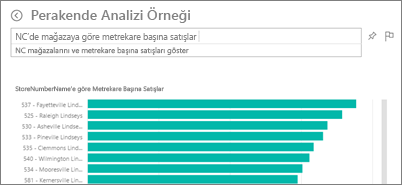
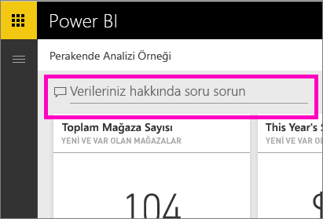

# Power BI hizmetinde ve Power BI Desktop'ta Soru-Cevap özelliği
## Soru-Cevap nedir?
Bazen verilerinize ilişkin cevaplar edinmenin en hızlı yolu doğal dil kullanarak bir soru sormaktır. Örneğin, "What were total sales last year?" (Bu yılki toplam satış rakamları nedir?)  Kullanımı kolay olan doğal dil özelliklerinden yararlanarak verilerinizi araştırmak ve grafikler ile graflar biçiminde cevaplar almak için Soru-Cevap'ı kullanın. Bir arama motorundan farklı olan Soru-Cevap, yalnızca Power BI'daki verilerle ilgili sonuçlar sunar.

Bu makale, Soru-Cevap ile ilgili bilmeniz gereken her şey için bir başlangıç noktası niteliğindedir. Soru-Cevap özelliğinin Power BI hizmetinde (panolar ve raporlar), Power BI Desktop'ta (raporlar), Power BI Embedded'da ve Power BI mobil uygulamalarında nasıl kullanılacağını öğrenmek için aşağıdaki bağlantılardan birini seçin.  

Soruyu sormak yalnızca bir başlangıçtır.  Sorunuzu daraltarak veya genişleterek, dikkate değer yeni bilgiler keşfederek, ayrıntılara yoğunlaşarak ve daha geniş bir görünüm elde etmek için uzaklaştırarak verilerinizde yaptığınız yolculuğun tadını çıkarın. Edindiğiniz öngörülere ve yaptığınız keşiflere inanamayacaksınız.

Bu, gerçekten etkileşimli ve hızlı bir deneyim. Bellek içi bir depolama birimi sayesinde neredeyse anında cevap alırsınız.

##  *Kullanıcılar* için Soru-Cevap
İş arkadaşlarınız sizinle bir pano paylaştığında Soru-Cevap soru kutusunu Power BI hizmetinde (app.powerbi.com) panonun üst kısmında, Power BI mobil uygulamalarında panonun alt kısmında ve Power BI Embedded'da görselleştirmenin üst kısmında görürsünüz. Panonun sahibi size düzenleme izinleri vermediyse verileri araştırmak için Soru-Cevap özelliğini kullanabilirsiniz ancak Soru-Cevap ile oluşturulan görselleştirmeleri kaydedemezsiniz.

## *Oluşturucular* için Soru-Cevap
Power BI raporları *oluşturuyorsanız* veya bir veri kümesi için düzenleme izinlerine sahipseniz Soru-Cevap soru kutusunu Power BI hizmetinde panoda ve Power BI hizmeti ile Power BI Desktop'ta tüm rapor sayfalarında görebilirsiniz. Soru-Cevap özelliğini kullanarak oluşturduğunuz tüm görselleştirmeleri bir panoya veya rapora kaydedebilirsiniz.

Oluşturucular ve veri kümesi sahipleri, Soru-Cevap özelliğini kullanarak verilerini araştırabilmenin yanı sıra [veri kümelerini değiştirerek](service-prepare-data-for-q-and-a.md), [öne çıkan sorular](service-q-and-a-create-featured-questions.md) ekleyerek ve şirket içi canlı bağlantı veri kümeleri için [Soru-Cevap özelliğini etkinleştirip devre dışı bırakarak](service-q-and-a-direct-query.md) kullanıcılar için Soru-Cevap deneyimini geliştirebilir. [Embedded'daki senaryolarda](developer/qanda.md) geliştiriciler şu 2 moddan birini seçebilir: **etkileşimli** ve **yalnızca sonuç**.

## Soru-Cevap, sorularınızı nasıl cevaplıyor?
### Soru-Cevap hangi veri kümelerini kullanmaktadır?
Soru-Cevap, verilere özgü soruları nasıl cevaplıyor? Temel alınan veri kümesindeki tabloların, sütunların ve hesaplanmış alanların adlarını kullanır. Bu nedenle öğelerin sizin tarafınızdan (veya veri kümesi sahibi tarafından) adlandırılması önemlidir!

Örneğin, şu sütunların bulunduğu "Sales" adlı bir Excel tablonuz olduğunu kabul edelim: "Product", "Month", "Units Sold", "Gross Sales" ve "Profit". Bu varlıkların herhangi biriyle ilgili soru sorabilirsiniz.  "show *sales*, "total *profit* by *month*", "sort *products* by *units sold*" ve başka birçok soruyu yönlendirebilirsiniz.

Soru-Cevap özelliğinin sorularınızın cevabını bulması için veri kümenizin düzenli olması gerekir. Bu özellikler Salesforce verileriyle nasıl çalışır? salesforce.com hesabınıza bağlandığınızda Power BI otomatik olarak bir pano oluşturur.  Soru-Cevap özelliğini kullanarak soru sormaya başlamadan önce pano görselleştirmelerinde görüntülenen verilere ve Soru-Cevap açılan menüsünde görüntülenen verilere bakın.

* Görselleştirmenin eksen etiketlerinde ve değerlerinde "sales", "account", "month" ve "opportunities" yazıyorsa rahatlıkla şöyle sorular sorabilirsiniz: "Which *account* has the highest *opportunity*, or show *sales* by month as a bar chart."
* Açılan menüde "salesperson", "state" ve "year" varsa rahatlıkla şöyle sorular sorabilirsiniz: "which *salesperson* had the lowest *sales* in *Florida* in *2013*."

Google Analytics'te web sitesi performans verileri varsa Soru-Cevap özelliğine web sayfasında geçirilen süreyi, benzersiz sayfa ziyareti sayısını ve kullanıcı etkileşim oranlarını sorabilirsiniz. Demografik verileri sorguluyorsanız yaş ve konuma göre hane geliriyle ilgili sorular sorabilirsiniz.

### Soru-Cevap hangi görselleştirmeleri kullanır?
Soru-Cevap görüntülenen verilere en uygun görselleştirmeyi seçer. Bazen temel alınan veri kümeleri belirli bir tür veya kategoride tanımlanmış olur ve bu durum Soru-Cevap özelliğine ilgili verileri görüntüleme konusunda yardımcı olur. Örneğin, verilerin türü tarih olarak tanımlanmışsa çizgi grafik olarak görüntülenme olasılığı yüksektir. Kategorisi şehir olarak belirlenmiş veriler ise genelde harita olarak görüntülenir.

Sorunuza görselleştirme türünü ekleyerek Soru-Cevap özelliğinin o türü kullanmasını sağlayabilirsiniz. Ancak Soru-Cevap özelliğinin, verileri her zaman istediğiniz görselleştirme türünde görüntülemesinin mümkün olmayacağını unutmayın.

Soru-Cevap özelliğinin tanıdığı anahtar sözcükler hakkında bilgi için bkz. [Soru sormaya ilişkin ipuçları](service-q-and-a-tips.md).

## Power BI Soru-Cevap ile ilgili daha fazla ayrıntı için
[Genel Bakış: Power BI panolarında ve raporlarında Soru-Cevap özelliğini kullanma](power-bi-tutorial-q-and-a.md): Soru-Cevap özelliğini kullanmaya yönelik adım adım yönergelerin yanı sıra bu özelliğin nasıl çalıştığına ilişkin bir genel bakış.

[Microsoft Power BI mobil uygulaması](mobile-apps-ios-qna.md): iPad, iPhone ve iPod touch cihazlarındaki iOS için.

[Microsoft Power BI Embedded](developer/qanda.md): Bir uygulamaya Soru-Cevap özelliğini ekleyin.

[Soru-Cevap'ta soru sormaya yönelik ipuçları](service-q-and-a-tips.md): Mümkün olan en iyi sonuçları almak için Soru-Cevap ile nasıl konuşmanız gerektiğini öğrenin.

[Veri kümelerinize öne çıkan sorular ekleyin](service-q-and-a-create-featured-questions.md) ve bu soruların Soru-Cevap tarafından iş arkadaşlarınıza önerilmesini sağlayın.

[Şirket içi veri kümeleriniz için Soru-Cevap özelliğini etkinleştirme](service-q-and-a-direct-query.md): Veri kümesine bağlanmak için bir ağ geçidine ihtiyacınız varsa Power BI ayarlarını kullanarak Soru-Cevap özelliğini etkinleştirebilir veya devre dışı bırakabilirsiniz.

[Eğitim: Power BI hizmetinde Perakende Analizi örneği ile Soru-Cevap özelliğini kullanma](power-bi-visualization-introduction-to-q-and-a.md): Sektör temelli gerçekçi bir eğitimde Soru-Cevap özelliğini kullanın.

[Verilerinizin Soru-Cevap için uygun olmasını sağlama](service-prepare-data-for-q-and-a.md): Veri kümeleri ve veri modelleri mi oluşturuyorsunuz?  O zaman bu konu tam size göre.

Başka bir sorunuz mu var? [Power BI Topluluğu'na başvurun](http://community.powerbi.com/)
