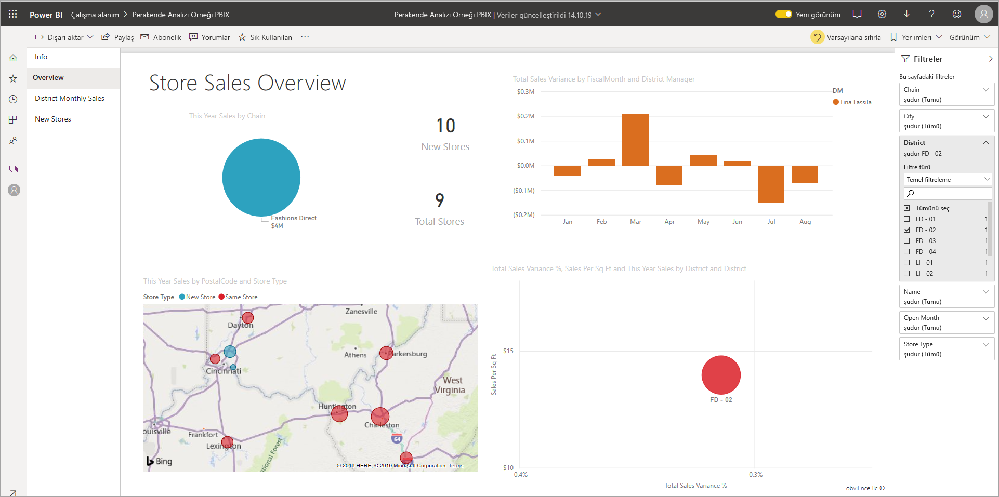
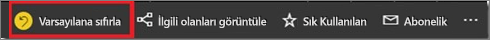
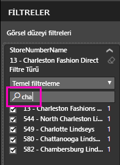
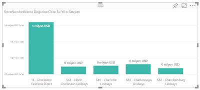
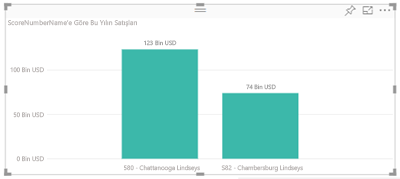

# Power BI'daki raporlara filtre ekleme

Bu makalede Power BI'da bir rapora sayfa filtresi, görselleştirme filtresi, rapor filtresi veya detaylandırma filtresi ekleme adımları anlatılmaktadır. Bu makaledeki örneklerde Power BI hizmeti kullanılmıştır. Adımlar Power BI Desktop ile neredeyse aynıdır.

**Biliyor muydunuz?** Power BI, şu an önizleme aşamasında olan yeni bir filtre deneyimine sahiptir. [Power BI raporlarında yeni filtre deneyimi](power-bi-report-filter-preview.md) hakkında daha fazla bilgi edinin.

Power BI, el ile ve otomatik filtreden detaylandırma ve geçişe kadar farklı türlerde çok çeşitli filtreler sunar. [Farklı türlerde filtreler](power-bi-report-filter-types.md) hakkında bilgi edinin.

## Düzenleme görünümündeki ve Okuma görünümündeki filtrelerin karşılaştırması
Raporlarla etkileşimli çalışmak için kullanabileceğiniz iki görünüm vardır: Okuma görünümü ve Düzenleme görünümü. Kullanabileceğiniz filtreleme özellikleri hangi görünümde olduğunuza bağlıdır. Ayrıntılar için bkz. [Power BI raporlarındaki filtreler ve vurgulama hakkında](power-bi-reports-filters-and-highlighting.md).

Bu makalede rapor **Düzenleme görünümünde** nasıl filtre oluşturabileceğiniz açıklanmaktadır.  Okuma görünümündeki filtreler hakkında daha fazla bilgi için [rapor Okuma görünümünde filtrelerle etkileşim kurma](consumer/end-user-report-filter.md) başlıklı makaleye bakın.

Filtreler *kalıcı* olduğu için, rapordan çıktığınızda Power BI yaptığınız filtre, dilimleyici ve diğer veri görünümü değişikliklerini tutar. Bu nedenle, rapora geri döndüğünüzde kaldığınız yerden devam edebilirsiniz. Filtre değişikliklerinizin kalıcı olmasını istemiyorsanız üst menü çubuğundan **Varsayılana sıfırla**’yı seçin.

## Filtreler bölmesinde filtre düzeyleri
Masaüstü veya Power BI hizmeti kullanılırken, rapor tuvalinin sağ kenarında Filtreler bölmesi görüntülenir. Filtreler bölmesini görmüyorsanız bölmeyi genişletmek için sağ üst köşedeki ">" simgesini seçin.

Rapor için filtreleri üç farklı düzeyde ayarlayabilirsiniz: görsel düzey, sayfa düzeyi ve rapor düzeyi filtreler. Detaylandırma filtreleri de ayarlayabilirsiniz. Bu makalede farklı düzeyler açıklanır.

## Görsele filtre ekleme
Bir görsele görsel düzeyi filtre eklemek için kullanabileceğiniz iki yöntem vardır. 

* Görselleştirme tarafından kullanılan bir alanı filtreleyebilirsiniz.
* Görselleştirme tarafından kullanılmayan bir alan belirleyip söz konusu alanı doğrudan **Görsel düzeyi filtreleri** demetine ekleyebilirsiniz.

Bu örnekte Perakende Analizi örneği kullanılmaktadır. Dilerseniz siz de indirip adımları takip edebilirsiniz. [Perakende Analizi örneğini](sample-retail-analysis.md) indirin.

### Görseldeki alanları filtreleme

1. **Raporu düzenle**’yi seçerek raporunuzu Düzenleme görünümünde açın.
   
   

2. Görsel Öğeler ve Filtreler bölmesini ve Alanlar bölmesini açın (zaten açık değillerse).
   
   
3. Bir görseli seçerek etkin hale getirin. Görsel tarafından kullanılmakta olan tüm alanlar, **Alanlar** bölmesinde yer alır. Bunlar ayrıca **Görsel düzeyi filtreleri** başlığı altındaki **Filtreler** bölmesinde de listelenir.
   
   
4. Bu noktada, görselleştirme tarafından zaten kullanılmakta olan bir alana filtre ekleyeceğiz. 
   
    **Görsel düzeyi filtreleri** alanına gidin ve filtrelemek istediğiniz alanı genişletmek için oku seçin. Bu örnekte **StoreNumberName** alanını filtreleyeceğiz.
     
     
    
    **Temel**, **Gelişmiş** veya **Üst N** filtreleme denetimlerinden birini ayarlayın. Bu örnekte Temel filtrelerde **cha** araması yapacak ve listelenen beş mağazayı seçeceğiz.
     
     
   
    Görsel, yeni filtreyi yansıtacak şekilde değişir. Raporunuzu filtreli olarak kaydederseniz raporu okuyan kişiler görselin filtrelenmiş halini görür ve değerleri seçerek veya temizleyerek Okuma görünümünde filtre ile etkileşim kurabilir.
     
    

### Görselde bulunmayan bir alanla filtreleme

Şimdi de görselleştirmemize bir görsel düzeyinde filtre olarak yeni bir alan ekleyelim.
   
1. Alanlar bölmesinden yeni görsel düzeyi filtresi olarak eklemek istediğiniz alanı seçip **Görsel düzeyi filtreleri alanına** sürükleyin.  Bu örnekte, **Görsel düzeyi filtreleri** demetine **District Manager** öğesini sürükleyip **an** araması yapacak ve listelenen üç yöneticiyi seçeceğiz. 
     
    

    **District Manager** öğesinin görselleştirmenin kendisine *eklenmediğine* dikkat edin. Görselleştirme hâlâ Eksen olarak **StoreNumberName** ve Değer olarak **This Year Sales** alanlarından oluşmaktadır.  
     
    

    Ayrıca görselleştirmenin kendisi de bu işlemden sonra, belirtilen mağazalar için yalnızca bu yöneticilerin bu yılki satışlarını gösterecek şekilde filtrelenmiştir.
     
    

    Raporunuzu bu filtreyle kaydederseniz raporu okuyan kişiler, değerleri seçerek veya temizleyerek Okuma görünümünde **District Manager** filtresiyle etkileşim kurabilir.

## Sayfanın tamamına filtre ekleme

Sayfanın tamamını filtrelemek için sayfa düzeyi bir filtre de ekleyebilirsiniz.

1. **Raporu düzenle**’yi seçerek raporunuzu Düzenleme görünümünde açın.
   
   
2. Görsel Öğeler ve Filtreler bölmesini ve Alanlar bölmesini açın (zaten açık değillerse).
3. Alanlar bölmesinden yeni sayfa düzeyi filtresi olarak eklemek istediğiniz alanı seçip **Sayfa düzeyi filtreleri** alanına sürükleyin.  
4. Filtrelemek istediğiniz değerleri seçip **Temel** veya **Gelişmiş** filtreleme denetimlerini belirleyin.
   
   Sayfadaki tüm görselleştirmeler, yapılan değişikliği yansıtacak şekilde yeniden çizilir.
   
   

    Raporunuzu filtreli olarak kaydederseniz raporu okuyan kişiler, değerleri seçerek veya temizleyerek Okuma görünümünde filtre ile etkileşim kurabilir.

## Detaylandırma filtresi ekleme
Power BI hizmetinde ve Power BI Desktop'ta tedarikçi, müşteri veya üretici gibi belirli bir varlığa odaklanan *hedef* rapor sayfaları oluşturabilirsiniz. Artık kullanıcılar, diğer rapor sayfalarında söz konusu varlığa ilişkin veri noktasına sağ tıklayarak, odaklanılmış sayfada detaylandırma yapabilirler.

### Detaylandırma filtresi oluşturma
Konuyu takip etmek için [Müşteri Kârlılığı örneğini](sample-customer-profitability.md) indirin. İdari işletme alanlarına odaklanan bir sayfa istediğinizi düşünelim.

1. **Raporu düzenle**'yi seçerek raporu Düzenleme görünümünde açın.
   
   

1. Rapora yeni bir sayfa ekleyip sayfayı **Team Executive** olarak adlandırın. Bu sayfa, detaylandırmanın *hedef* sayfası olacaktır.
2. İdari ekibin işletme alanlarına yönelik ana ölçümleri takip eden görselleştirmeleri ekleyin.    
3. Detaylandırma filtreleri bölmesine **Executive > Executive Name** seçeneğini ekleyin.    
   
    
   
    Power BI'ın rapor sayfasına bir geri oku eklediğine dikkat edin.  Geri okunu seçen kullanıcılar, detaylandırma seçeneğini belirlerken bulundukları sayfa olan *kaynak* rapor sayfasına geri dönerler. Geri oku, yalnızca Okuma görünümü'nde çalışır.
   
     

### Detaylandırma filtresini kullanma
Detaylandırma filtresinin nasıl çalıştığını görelim.

1. **Team Scorecard** rapor sayfasına gidin.    
2. Andrew Ma olduğunuzu ve yalnızca verilerinizi gösterecek şekilde filtrelenen Team Executive rapor sayfasını görmek istediğinizi düşünelim.  Detaylandırma menü seçeneğini açmak için sol üstteki alan grafiğinde bulunan herhangi bir yeşil veri noktasına sağ tıklayın.
   
    
3. **Team Executive** adlı rapor sayfasında detaylandırma yapmak için **Detaylandırma > Team Executive** seçeneğini belirleyin. Sayfa, sağ tıkladığınız veri noktası (bu örnekte, Andrew Ma) hakkındaki bilgileri gösterecek şekilde filtrelenir. Yalnızca Detaylandırma filtreleri kutusundaki alan detaylandırma rapor sayfasına geçirilir.  
   
    

## Raporun tamamını filtrelemek için rapor düzeyi bir filtre ekleme

1. **Raporu düzenle**'yi seçerek raporu Düzenleme görünümünde açın.
   
   

2. Henüz açık değillerse Görselleştirmeler ve Filtreler bölmesini ve Alanlar bölmesini açın.
3. Alanlar bölmesinden yeni rapor düzeyi filtresi olarak eklemek istediğiniz alanı seçip **Rapor düzeyi filtreleri** alanına sürükleyin.  
4. Filtre uygulamak istediğiniz değerleri seçin.

    Etkin sayfadaki ve raporda bulunan tüm sayfalardaki görseller, yeni filtreyi yansıtacak şekilde değişir. Raporunuzu filtreli olarak kaydederseniz raporu okuyan kişiler, değerleri seçerek veya temizleyerek Okuma görünümünde filtre ile etkileşim kurabilir.

1. Önceki rapor sayfasına geri dönmek için geri okunu seçin.

## Önemli noktalar ve sorun giderme

- Görsel düzeyi ve sayfa düzeyi filtrenizin farklı sonuçlar döndürebileceği durumlar vardır.  Örneğin, bir görsel düzeyi filtresi eklediğinizde Power BI, toplanan sonuçlarda filtre uygular.  Varsayılan toplama, Toplam'dır ancak [toplama türünü değiştirebilirsiniz](service-aggregates.md).  

    Sonra bir görsel düzeyi filtresi eklediğinizde ise Power BI, toplama yapmadan filtre uygular.  Bu toplama yapmaz çünkü bir sayfada her biri farklı toplama türlerini kullanabilen pek çok görsel olabilir.  Bu nedenle filtre, her bir veri satırına uygulanır.

- Alanlar bölmesini görmüyorsanız rapor [Düzenleme görünümü](service-interact-with-a-report-in-editing-view.md)'nde bulunduğunuzdan emin olun.    
- Filtrelerde çok fazla değişiklik yaptıysanız ve rapor yazarı varsayılan ayarlarına geri dönmek istiyorsanız, üst menü çubuğundan **Varsayılana sıfırla**’yı seçin.

## Sonraki adımlar
[Power BI Filtreler bölmesine ilişkin tura katılın](consumer/end-user-report-filter.md)

[Raporlarda filtreleme ve vurgulama](power-bi-reports-filters-and-highlighting.md)

[Power BI’daki farklı filtre türleri](power-bi-report-filter-types.md)

Başka bir sorunuz mu var? [Power BI Topluluğu'na başvurun](http://community.powerbi.com/)

