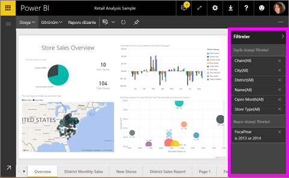
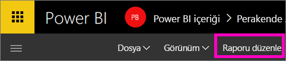
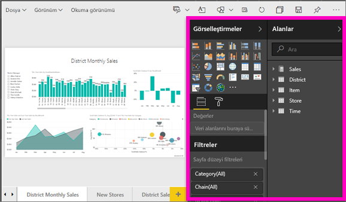
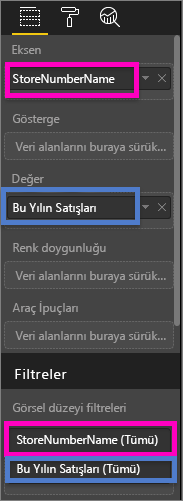
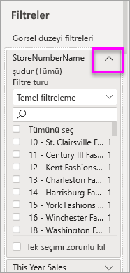
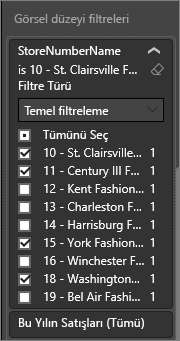
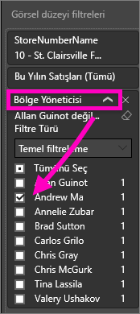
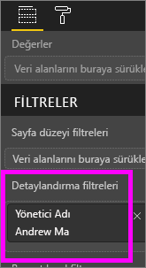
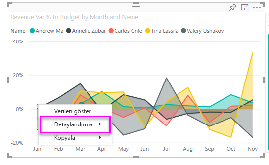
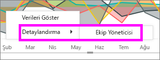

# Bir Power BI raporuna filtre ekleme (Düzenleme görünümü'nde)
> [!TIP]
> Öncelikle [Power BI raporlarındaki filtreler ve vurgulama hakkında](power-bi-reports-filters-and-highlighting.md) başlıklı makaleyi okumanızı öneririz.
> 
> 

## Düzenleme Görünümü'ndeki ve Okuma Görünümü'ndeki rapor filtreleri arasındaki fark nedir?
Raporlarla etkileşim kurmak için kullanabileceğiniz iki mod vardır: [Okuma Görünümü](service-reading-view-and-editing-view.md) ve [Düzenleme Görünümü](service-interact-with-a-report-in-editing-view.md).  Kullanabileceğiniz filtreleme özellikleri hangi modda olduğunuza bağlıdır.

* Düzenleme Görünümü'nde rapor ve sayfa filtrelerinin yanı sıra görsel filtreler ekleyebilirsiniz. Raporu kaydettiğinizde filtreler de birlikte kaydedilir. Okuma Görünümü'nde rapora göz atan kişiler eklediğiniz filtrelerle etkileşim kurabilir ancak kendi değişikliklerini kaydedemez.
* Okuma Görünümü'nde, raporda bulunan herhangi bir rapor, sayfa ve görsel filtreleri ile etkileşim kurabilirsiniz ancak filtre değişikliklerinizi kaydedemezsiniz.

> [!NOTE]
> Bu makalede rapor **Düzenleme Görünümü**'nde nasıl filtre oluşturabileceğiniz açıklanmaktadır.  Okuma Görünümü'ndeki filtreler hakkında daha fazla bilgi için [rapor Okuma Görünümü'nde filtrelerle etkileşim kurma](service-reading-view-and-editing-view.md) başlıklı makaleye bakın.
> 
> 

## Görsel filtreleri, sayfa filtreleri, detaylandırma filtreleri ve rapor filtreleri
Bir **sayfa filtresi**, rapor sayfasındaki tüm görsellere uygulanır. Bir **görsel filtresi**, bir rapor sayfasındaki tek bir görsele uygulanır. Bir **rapor filtresi** ise rapordaki tüm sayfalara uygulanır.

## Belirli bir görselleştirmeye filtre ekleme (başka bir deyişle, görsel filtresi)
Bunu yapmanın 2 yolu vardır: 

* görselleştirme tarafından kullanılmakta olan bir alanı filtreleme
* görselleştirme tarafından kullanılmayan bir alan belirleyip söz konusu alanı doğrudan **Görsel düzeyi filtreleri** demetine ekleme.

### Görselleştirmede bulunan alanları filtreleme
1. [Raporunuzu Düzenleme Görünümü'nde](service-reading-view-and-editing-view.md) açın.
   
   
2. Görsel Öğeler ve Filtreler bölmesini ve Alanlar bölmesini açın (zaten açık değillerse).
   
   
3. Bir görseli seçerek etkin hale getirin. Görsel tarafından kullanılmakta olan tüm alanlar, **Alanlar** bölmesinde tanımlanır. Bunlar ayrıca **Görsel düzeyi filtreleri** başlığı altındaki **Filtreler** bölmesinde de listelenir.
   
   
4. Bu noktada, görselleştirme tarafından kullanılmakta olan bir alana filtre ekleyeceğiz. 
   
   * **Görsel düzeyi filtreleri** alanına gidin ve filtrelemek istediğiniz alanı genişletmek için oku seçin. Bu örnekte, **StoreNumberName** alanını filtreleyeceğiz
     
       
   * **Temel**, **Gelişmiş** veya **Üst N** filtreleme denetimlerinden birini ayarlayın (bkz. [Rapor filtrelerini kullanma](power-bi-how-to-report-filter.md)). Bu örnekte, Temel filtrelemeyi seçip 10, 11, 15 ve 18 sayılarının yanına onay işaretleri koyacağız.
     
       
   * Görsel, yeni filtreyi yansıtacak şekilde değişir. Raporunuzu filtreli olarak kaydederseniz raporu okuyan kişiler, değerleri seçerek veya temizleyerek Okuma Görünümü'nde filtre ile etkileşim kurabilir.
     
      
5. Şimdi de görselleştirmemize bir Görsel düzeyi filtresi olarak yepyeni bir alan ekleyelim.
   
   * Alanlar bölmesinden yeni görsel düzeyi filtresi olarak eklemek istediğiniz alanı seçip **Görsel düzeyi filtreleri alanına** sürükleyin.  Bu örnekte, **Görsel düzeyi filtreleri** demetine **District Manager** öğesini sürükleyip yalnızca Andrew Ma seçeneğini belirleyeceğiz. 
     
      
   * Görselleştirmenin kendisine **District Manager** öğesinin *eklenmediğine* dikkat edin. Görselleştirme hâlâ Eksen olarak **StoreNumberName** ve Değer olarak **This Year Sales** alanlarından oluşmaktadır.  
     
      
   * Ayrıca görselleştirmenin kendisi de bu işlemden sonra, belirtilen mağazalar için yalnızca Andrew'un bu yılki satışlarını gösterecek şekilde filtrelenmiştir.
     
     

## Tüm sayfaya filtre ekleme (başka bir deyişle, sayfa görünümü filtresi)
1. [Raporunuzu Düzenleme Görünümü'nde](service-reading-view-and-editing-view.md) açın.
2. Görsel Öğeler ve Filtreler bölmesini ve Alanlar bölmesini açın (zaten açık değillerse).
3. Alanlar bölmesinden yeni sayfa düzeyi filtresi olarak eklemek istediğiniz alanı seçip **Sayfa düzeyi filtreleri** alanına sürükleyin.  
4. Filtrelemek istediğiniz değerleri seçip **Temel** veya **Gelişmiş** filtreleme denetimlerini belirleyin (bkz. [Rapor filtrelerini kullanma](power-bi-how-to-report-filter.md)).
   
   Sayfada bu filtreden etkilenen tüm görselleştirmeler, yapılan değişikliği yansıtacak şekilde yeniden çizilir. 
   
   

Raporunuzu filtreli olarak kaydederseniz raporu okuyan kişiler, değerleri seçerek veya temizleyerek Okuma Görünümü'nde filtre ile etkileşim kurabilir.

## Detaylandırma filtresi ekleme
Power BI hizmetinde ve Power BI Desktop'ta tedarikçi, müşteri veya üretici gibi belirli bir varlığa odaklanan *hedef* rapor sayfaları oluşturabilirsiniz. Artık kullanıcılar, diğer rapor sayfalarında söz konusu varlığa ilişkin veri noktasına sağ tıklayarak, odaklanılmış sayfada detaylandırma yapabilirler.

### Detaylandırma filtresi oluşturma
Birlikte ilerlemek için, Müşteri Kârlılığı örneğini Düzenleme görünümü'nde açın. İdari işletme alanlarına odaklanan bir sayfa istediğinizi düşünelim.   

1. Rapora yeni bir sayfa ekleyip sayfayı **Team Executive** olarak adlandırın. Bu, detaylandırmanın *hedef* sayfası olacaktır.
2. İdari ekibin işletme alanlarına yönelik ana ölçümleri takip eden görselleştirmeleri ekleyin.    
3. Detaylandırma filtreleri bölmesine **Executive > Executive Name** seçeneğini ekleyin.    
   
    
   
    Power BI'ın rapor sayfasına bir geri oku eklediğine dikkat edin.  Geri okunu seçen kullanıcılar, detaylandırma seçeneğini belirlerken bulundukları sayfa olan *kaynak* rapor sayfasına geri dönerler. Geri oku, yalnızca Okuma görünümü'nde çalışır.
   
     

### Detaylandırma filtresini kullanma
Detaylandırma filtresinin nasıl çalıştığını görelim.

1. **Team Scorecard** rapor sayfasına gidin.    
2. Andrew Ma olduğunuzu ve yalnızca verilerinizi gösterecek şekilde filtrelenen Team Executive rapor sayfasını görmek istediğinizi düşünelim.  Detaylandırma menü seçeneğini açmak için sol üstteki alan grafiğinde bulunan herhangi bir yeşil veri noktasına sağ tıklayın.
   
    
3. **Team Executive** adlı rapor sayfasında detaylandırma yapmak için **Detaylandırma > Team Executive** seçeneğini belirleyin. Sayfa, sağ tıkladığınız veri noktası (bu örnekte, Andrew Ma) hakkındaki bilgileri gösterecek şekilde filtrelenir. Yalnızca Detaylandırma filtreleri kutusundaki alan detaylandırma rapor sayfasına geçirilir.  
   
    

## Tüm rapora filtre ekleme (başka bir deyişle, Rapor filtresi)
1. [Raporunuzu Düzenleme Görünümü'nde](service-reading-view-and-editing-view.md) açın.
2. Görsel Öğeler ve Filtreler bölmesini ve Alanlar bölmesini açın (zaten açık değillerse).
3. Alanlar bölmesinden yeni rapor düzeyi filtresi olarak eklemek istediğiniz alanı seçip **Rapor düzeyi filtreleri** alanına sürükleyin.  
4. Filtrelemek istediğiniz değerleri seçin (bkz. [Rapor filtrelerini kullanma](power-bi-how-to-report-filter.md)).

Etkin sayfadaki ve raporda bulunan tüm sayfalardaki görseller, yeni filtreyi yansıtacak şekilde değişir. Raporunuzu filtreli olarak kaydederseniz raporu okuyan kişiler, değerleri seçerek veya temizleyerek Okuma Görünümü'nde filtre ile etkileşim kurabilir.

1. Önceki rapor sayfasına geri dönmek için geri okunu seçin.

## Sorun giderme
### Görsel düzeyi ve sayfa düzeyi filtrenizin farklı sonuçlar göstermesi neden mümkündür?
Bir görsel düzeyi filtresi eklediğinizde Power BI, toplanan sonuçlarda filtre uygular.  Varsayılan toplama, Toplam'dır ancak [toplama türünü değiştirebilirsiniz](service-aggregates.md).  

Bir görsel düzeyi filtresi eklediğinizde ise Power BI, toplama yapmadan filtre uygular.  Bir sayfada her biri farklı toplama türlerini kullanabilen pek çok görsel olduğu için bunu yapar.  Bu nedenle filtre, her bir veri satırına uygulanır.

Alanlar bölmesini görmüyorsanız rapor [Düzenleme görünümü](service-interact-with-a-report-in-editing-view.md)'nde bulunduğunuzdan emin olun.

## Sonraki adımlar
 [Rapor filtrelerini kullanma](power-bi-how-to-report-filter.md)

  [Raporlarda filtreleme ve vurgulama](power-bi-reports-filters-and-highlighting.md)

[Okuma Görünümü'nde filtreler ve vurgulama ile etkileşim kurma](service-reading-view-and-editing-view.md)

[Rapor görsellerinin birbirini çapraz filtreleme ve çapraz vurgulama şeklini değiştirme](service-reports-visual-interactions.md)

Başka bir sorunuz mu var? [Power BI Topluluğu'na başvurun](http://community.powerbi.com/)

