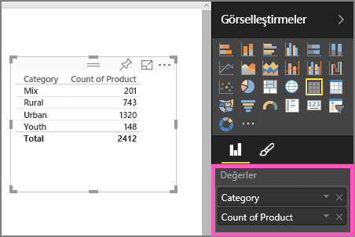
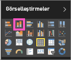

# 1. Bölüm: Bir Power BI raporuna görselleştirme ekleme (Eğitim)
Bu makalede bir raporda görselleştirme oluşturma hakkında özet bilgiler verilmektedir.  Daha ayrıntılı içerik için lütfen [2. Bölüm](power-bi-report-add-visualizations-ii.md)'e bakın. Rapor tuvali üzerinde farklı görsel oluşturma, düzenleme ve biçimlendirme yöntemlerini gösteren Amanda'yı izleyin. Ardından [Satış ve Pazarlama örneğini](sample-datasets.md) kullanarak kendi raporunuzu oluşturun.

<iframe width="560" height="315" src="https://www.youtube.com/embed/IkJda4O7oGs" frameborder="0" allowfullscreen></iframe>

## Rapor açma ve yeni sayfa ekleme
1. Bir [raporu Düzenleme Görünümü'nde](service-reading-view-and-editing-view.md) açın. Bu eğitimde [Satış ve Pazarlama örneği](sample-datasets.md) kullanılmaktadır.
2. Alanlar bölmesi görünmüyorsa ok simgesini seçerek açın. 
   
   
3. [Rapora boş bir sayfa ekleyin](power-bi-report-add-page.md).

## Rapora görselleştirme ekleme
1. **Alanlar** bölmesindeki alanlardan birini seçerek bir görselleştirme oluşturun.  
   
   Sales > Sales $ gibi bir **sayısal alanla başlayın**: Power BI, tek sütunlu bir sütun grafik oluşturur.
   
   
   
   Name veya Product gibi bir **kategori alanıyla başlayın**: Power BI bir Tablo oluşturur ve ilgili alanı **Değerler** kutusuna ekler.
   
   
   
   Geo > City gibi bir **coğrafi alanla başlayın**. Power BI ve Bing Haritalar bir harita görselleştirmesi oluşturur.
   
   
2. Bir görselleştirme oluşturup türünü değiştirin. **Product > Count of Product** ve **Product > Category** seçimlerini yaparak **Değerler** kutusuna ekleyin.
   
   
3. Sütun grafik simgesini seçerek görselleştirmeyi sütun grafik haline getirin.
   
   
4. Raporunuzda oluşturduğunuz görselleştirmeleri [panonuza sabitleyebilirsiniz](service-dashboard-pin-tile-from-report.md). Görselleştirmeyi sabitlemek için raptiye simgesini  seçin.
   
   
5. Artık şunları yapabilirsiniz:
   
   [2. Bölüm: Bir Power BI raporuna görselleştirme ekleme](power-bi-report-add-visualizations-ii.md) bölümüne geçin
   
   Rapordaki [görselleştirmelerle etkileşim kurun](service-reading-view-and-editing-view.md).
   
   [Görselleştirmelerle daha fazlasını yapın](power-bi-report-visualizations.md).
   
   [Raporunuzu kaydedin](service-report-save.md).

## Sonraki adımlar
[Power BI raporlarındaki görselleştirmeler](power-bi-report-visualizations.md) hakkında daha fazla bilgi.

[Power BI'daki raporlar](service-reports.md)

Başka bir sorunuz mu var? [Power BI Topluluğu'na başvurun](http://community.powerbi.com/)

