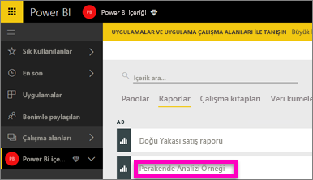
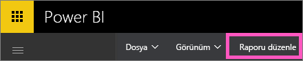
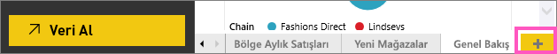
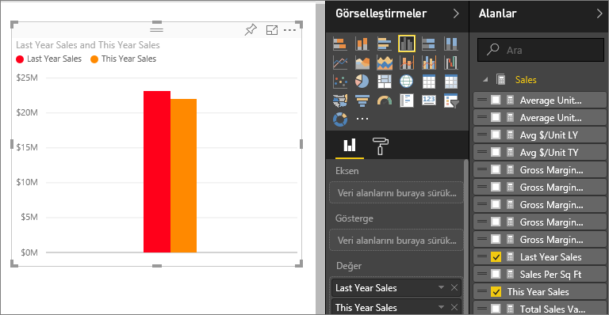
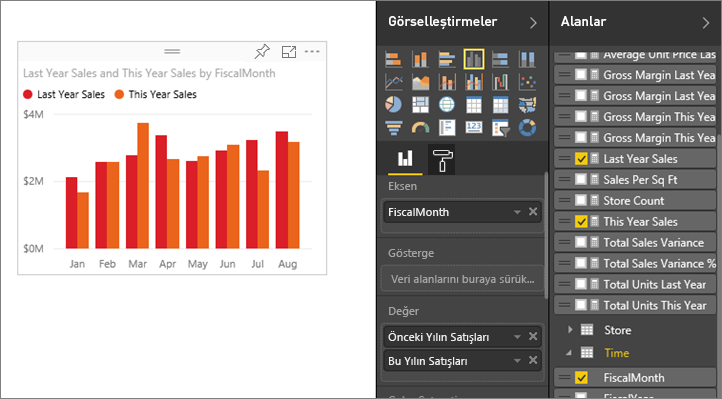
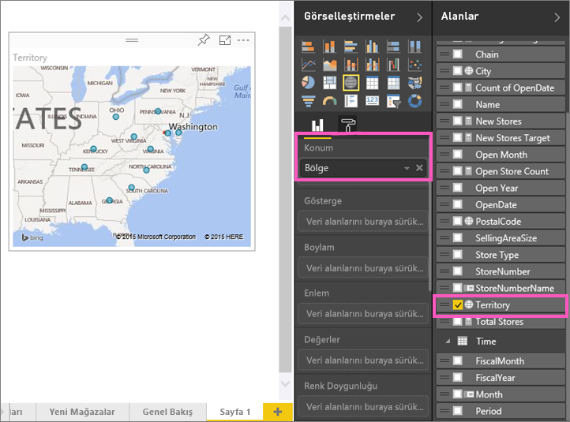
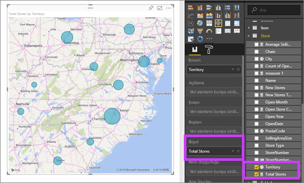
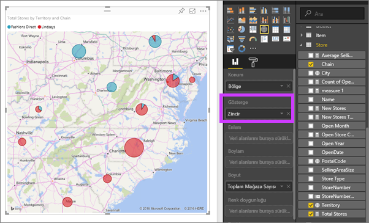

# 2. Bölüm: Bir Power BI raporuna görselleştirme ekleme (Eğitim)
[1. Bölüm](power-bi-report-add-visualizations-ii.md)'de alan adlarının yanında bulunan onay kutularını seçerek temel görselleştirmeler oluşturdunuz.  2. Bölüm'de sürükle bırak işlevini nasıl kullanacağınızı ve her türlü görselleştirmeyi oluşturmak ve değiştirmek için **Alanlar** ve **Görsel Öğeler** bölmelerini tam olarak nasıl kullanabileceğinizi öğreneceksiniz.

### Önkoşullar
- [Bölüm 1](power-bi-report-add-visualizations-ii.md)
- Power BI hizmeti - Power BI hizmeti veya Power BI Desktop kullanılarak, raporlara görsel öğeler eklenebilir. Bu öğretici, Power BI hizmetini kullanır. 
- Perakende Analizi örneği

## Yeni görselleştirme oluşturma
Bu eğitim kapsamında Perakende Analizi veri kümesini derinlemesine inceleyeceğiz ve birkaç anahtar görselleştirme oluşturacağız.

### Bir rapor açın ve boş bir sayfa ekleyin.
1. Perakende Analizi örneğini kaydettiğiniz çalışma alanını açın. **Retail Analysis Sample**'ı seçerek raporu Okuma Görünümü'nde açın.
   
   
2. **Raporu düzenle**'yi seçerek raporu Düzenleme Görünümü'nde açın.
   
   
3. Tuvalin alt kısmında bulunan sarı artı simgesini seçerek [Yeni sayfa ekle](power-bi-report-add-page.md)'yin.
   
   

### Bu yılın satışlarıyla geçen yılın satışlarının karşılaştırılmasının incelendiği bir görselleştirme ekleyin.
1. **Sales** tablosundan, **This Year Sales** > **Değer** ve **Last Year Sales** öğelerini seçin. Power BI, bir sütun grafik oluşturur.  Bu verinin ilginizi çektiğini farz ederek daha derinlemesine inceleyelim. Aylara göre satışların görünümü nasıl?  
   
   
2. Time tablosundan **Month** öğesini **Eksen** alanına sürükleyin.  
   
3. [Görselleştirmeyi değiştirerek](power-bi-report-change-visualization-type.md) bir Alan grafiğine dönüştürün.  Aralarından seçim yapabileceğiniz pek çok görselleştirme türü bulunur. Hangi türü kullanacağınıza karar vermek için [her birinin açıklamasına, en iyi uygulama ipuçlarına ve eğitimlere](power-bi-visualization-types-for-reports-and-q-and-a.md) başvurabilirsiniz. Görsel Öğeler bölmesinden Alan grafiği simgesini seçin.
4. Üç nokta simgesini seçip ardından **Sıralama Ölçütü: Month** seçeneğini belirleyerek görselleştirmeyi sıralayın.
5. Görselleştirmeyi seçerek ve ana hat dairelerinden birini yakalayıp sürükleyerek [görselleştirmeyi yeniden boyutlandırın](power-bi-visualization-move-and-resize.md). Kaydırma çubuğunu ortadan kaldırmak için yeterince geniş ve bir başka görselleştirme eklememiz için alan bırakacak kadar da küçük olmasını sağlayın.
   
   
6. [Raporu kaydedin](service-report-save.md).

### Konuma göre satışları gösteren bir harita görselleştirmesi ekleyin.
1. **Store** tablosundan **Territory** öğesini seçin. Power BI, Territory'nin bir konum olduğunu algılayarak bir harita görselleştirmesi oluşturur.  
   
2. **Total Stores** öğesini Boyut alanına sürükleyin.  
   
3. Bir açıklama ekleyin.  Veriyi mağaza adına göre görmek için **Chain** öğesini Açıklama alanına sürükleyin.  
   

## Sonraki adımlar
* Alanlar bölmesi ile ilgili daha fazla bilgi için bkz. [Rapor düzenleyicisi: Tura katılın](service-the-report-editor-take-a-tour.md).   
* Görselleştirmelerinizi nasıl filtreleyeceğinizi ve vurgulayacağınızı öğrenmek için bkz. [Power BI raporlarındaki filtreler ve vurgulama](power-bi-reports-filters-and-highlighting.md).  
* [Power BI raporlarındaki görselleştirmeler](power-bi-report-visualizations.md) hakkında daha fazla bilgi.  
* Başka bir sorunuz mu var? [Power BI Topluluğu'na başvurun](http://community.powerbi.com/)

