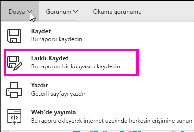
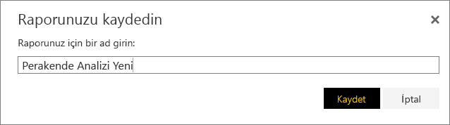
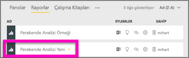

# Mevcut bir rapordan yeni rapor oluşturma (rapor kopyalama)
Veri kümenizle bağlantılı olan ve yeniden kullanmak veya değiştirmek isteyebileceğiniz bir raporunuzun bulunması da olasıdır.  Böyle bir durumda yeni bir rapor için temel oluşturmak üzere söz konusu raporu kopyalamanız yeterlidir.  Bunu gerçekleştirmek için:

1. [Bir raporu açın](service-report-open.md).
2. **Dosya** menüsündeki **Farklı Kaydet** seçeneğini belirleyin.
   
   
3. Yeni rapor için bir ad girin ve **Kaydet**'i seçin.
   
   
   
   Yeni raporun Power BI'daki geçerli çalışma alanınıza kaydedildiğini bildiren Başarılı iletisi ile karşılaşırsınız.
   
   
4. Çalışma alanınızdaki **Raporlar** sekmesine gidin ve yeni raporu seçerek bu raporu açın. İsteğe bağlı olarak; tutmak istemediğiniz görselleri silebilir, diğer görselleri değiştirebilir ve yenilerini ekleyebilirsiniz.
   
   
5. Yeni raporunuzu güncelleştirmenin ve düzenlemenin tadını çıkarın.

## Sonraki Adımlar:
[Yeni görselleştirmeler oluşturma](power-bi-report-add-visualizations-ii.md)

İhtiyacınız olmayan [görselleştirmeleri silme](service-delete.md)

[Power BI Desktop kullanarak rapor oluşturma](desktop-report-view.md)
