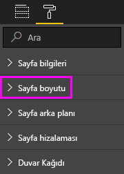

# Power BI raporlarında sayfa görüntüleme ayarları
Rapor düzeninizin kusursuz için çok önemli olduğunun farkındayız. Siz ve arkadaşlarınız bu raporları farklı en boy oranlarına ve boyutlara sahip ekranlarda görüntülemek çünkü bazı durumlarda, bu, zor olabilir. 

Varsayılan ekran görünümü **Sayfaya sığdır**, varsayılan görüntüleme boyutu ise **16:9** şeklindedir. Farklı bir en boy oranı kullanmak veya raporunuzu farklı şekilde sığdırmak istiyorsanız şu iki araçtan faydalanabilirsiniz: ***Sayfa görünümü*** ayarları ve ***sayfa boyutu*** ayarları.

<iframe width="560" height="315" src="https://www.youtube.com/embed/5tg-OXzxe2g" frameborder="0" allowfullscreen></iframe>

## Sayfa görünümü ayarları Power BI hizmetinde ve Power BI Desktop nerede bulacağını
Sayfa görünümü ayarları hem Power BI hizmetinde hem de Power BI Desktop mevcuttur, ancak arabirim biraz farklıdır. Aşağıdaki bölümlerde, her bir Power BI aracında görünüm ayarlarını nerede bulabileceğiniz açıklanmaktadır.

### Power BI Desktop'ta
Rapor görünümü'nde Sayfa görünümü ayarlarını ve telefon düzeni ayarlarını açmak için **Görünüm** sekmesini seçin.

  

### Power BI hizmetinde (app.powerbi.com)
Power BI hizmetinde bir rapor seçin açın ve **görünümü** sol üst menü çubuğundan.

Sayfa görünümü ayarları hem de kullanılabilir [Okuma Görünümü ve düzenleme görünümü](consumer/end-user-reading-view.md). Düzenleme Görünümü'nde rapor sahibi her bir rapor sayfaları için sayfa görünümü ayarları atayabilir ve bu ayarlar raporla birlikte kaydedilir. İş arkadaşlarınızdan biri söz konusu raporu Okuma görünümü'nde açtığında, rapor sayfalarını rapor sahibinin ayarlarını kullanarak görüntüler. İş arkadaşlarınız Okuma Görünümü'nde değiştirebilirsiniz *bazı* , **sayfa görünümü** ayarları, ancak bu değişiklikler kaydedilmez raporu kapattıklarında olduğunda.

## Sayfa görünümü ayarları
İlk sayfa görünümü ayarları kümesi, rapor sayfanızın tarayıcı penceresini göre gösterimini denetler. Şunlardan birini seçin:

* **Sayfaya Sığdır** (varsayılan): İçeriği, sayfaya en iyi sığacak şekilde ölçeklendirilir
* **Genişliğe Uydur**: İçeriği içinde sayfanın genişliğine sığacak şekilde ölçeklendirilir
* **Gerçek Boyut**: İçeriği tam boyutuyla görüntülenir

İkinci sayfa görünümü ayarları denetimleri rapor tuvalindeki nesnelerin konumunu ayarlayın. Şunlardan birini seçin:

* **Kılavuz çizgilerini göster**: Yardımcı olmak için konumlandırmanıza nesneleri rapor tuvalinde getirin.
* **Kılavuza Daya**: İle kullanma **kılavuz çizgilerini göster** tam olarak konumlandırabilir ve nesneleri rapor tuvalinde Hizala. 
* **Nesneleri Kilitle**: Böylece bunlar yeniden boyutlandırılabilir veya taşınamaz tuval üzerindeki tüm nesneleri kilitleyin.
* **Seçim Bölmesi**: **Seçimi** bölmesi, tuval üzerindeki tüm nesneleri listeler. Gösterileceği ve gizlemek için karar verebilirsiniz.

    

## Sayfa boyutu ayarları

**Sayfa boyutu** ayarları yalnızca rapor sahipleri tarafından kullanılabilir. Power BI hizmetinde (app.powerbi.com) raporu açmak için başka bir deyişle [düzenleme görünümü](consumer/end-user-reading-view.md). **Sayfa boyutu** içindeki ayarlardır **görselleştirmeler** bölmesi ve denetimi ekran oranını ve gerçek boyutunu (piksel cinsinden) rapor tuvalinin:   

* 4:3 oranı
* 16:9 oranı (varsayılan)
* Cortana
* Letter
* Özel (piksel cinsinden yükseklik ve genişlik)

## Sonraki adımlar
[Power BI Desktop'taki rapor görünümü](desktop-report-view.md)

[Sayfa görünümü ve kendi Power BI raporlarında sayfa boyutu ayarlarını değiştirme](consumer/end-user-report-view.md)

[Power BI'daki raporlar](consumer/end-user-reports.md) hakkında daha fazla bilgi edinin

[Power BI hizmet tüketicileri için temel kavramlar](consumer/end-user-basic-concepts.md)

Başka bir sorunuz mu var? [Power BI Topluluğu'na başvurun](http://community.powerbi.com/)

