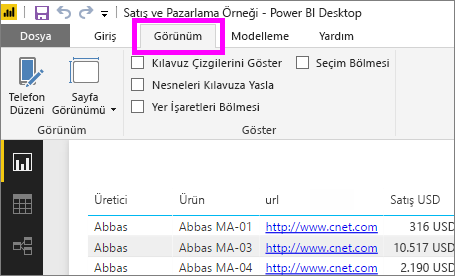
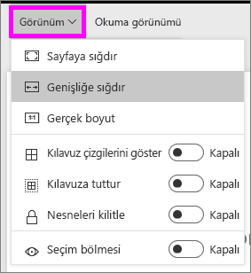
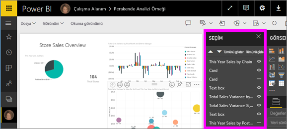
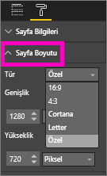

# Power BI raporlarında sayfa görüntüleme ayarları
Rapor düzeninizin kusursuz görünmesinin sizin için çok önemli olduğunun bilincindeyiz. Siz ve iş arkadaşlarınız bu raporları farklı en boy oranlarına ve boyutlara sahip ekranlarda görüntülediğinizden bu, zaman zaman güç olabilir. 

Varsayılan ekran görünümü **Sayfaya sığdır**, varsayılan görüntüleme boyutu ise **16:9** şeklindedir. Farklı bir en boy oranı kullanmak veya raporunuzu farklı şekilde sığdırmak istiyorsanız şu iki araçtan faydalanabilirsiniz: ***Sayfa Görünümü*** ayarları ve ***Sayfa Boyutu*** ayarları.

<iframe width="560" height="315" src="https://www.youtube.com/embed/5tg-OXzxe2g" frameborder="0" allowfullscreen></iframe>

## Power BI hizmetinde ve Power BI Desktop uygulamasında Sayfa görünümü ayarlarının konumu
Sayfa görünümü ayarları hem Power BI hizmetinde hem de Power BI Desktop uygulamasında mevcuttur ancak konumu farklıdır. Aşağıdaki iki bölümde Power BI araçlarında Görünüm ayarlarını nerede bulabileceğiniz açıklanmaktadır.

### Power BI Desktop'ta
Rapor görünümü'nde Sayfa görünümü ayarlarını ve telefon düzeni ayarlarını açmak için **Görünüm** sekmesini seçin.

  

### Power BI hizmetinde (app.powerbi.com)
Power BI hizmetinde bir rapor açın ve sol üst menü çubuğundan **Görünüm**'ü seçin.

Sayfa Görünümü ayarları hem [Okuma Görünümü](service-interact-with-a-report-in-reading-view.md)'nde hem de [Düzenleme Görünümü](service-interact-with-a-report-in-editing-view.md)'nde kullanılabilir. Düzenleme Görünümü'nde, rapor sahibi her bir rapor sayfasına birer sayfa görünümü ayarı atayabilir ve bu ayarlar raporla birlikte kaydedilir. İş arkadaşlarınızdan biri söz konusu raporu Okuma görünümü'nde açtığında, rapor sayfalarını rapor sahibinin ayarlarını kullanarak görüntüler.  İş arkadaşlarınız Okuma görünümü'nde Sayfa görünümü ayarlarının *bazılarını* değiştirebilir ancak bu değişiklikler raporu kapattıklarında kaydedilmez.

##    Sayfa görünümü ayarları
*Sayfa görünümü* ayarlarının ilk bölümü, rapor sayfanızın tarayıcı penceresiyle görüntülenme biçimini denetler.  Şunlardan birini seçin:

* **Sayfaya sığdır** (varsayılan): İçerikler sayfaya en iyi şekilde sığacak biçimde ölçeklendirilir
* **Genişliğe uydur**: İçerikler sayfanın genişliğine sığacak şekilde ölçeklendirilir
* **Gerçek boyut**: İçerikler tam boyutuyla görüntülenir

*Sayfa görünümü* ayarlarının ikinci bölümü, rapor tuvalindeki nesnelerin konumunu denetler

* **Kılavuz çizgilerini göster**: Rapor tuvali üzerindeki nesneleri konumlandırmanıza yardımcı olması için kılavuz çizgilerini açar
* **Kılavuza daya**: **Kılavuz çizgilerini göster** seçeneğiyle birlikte kullanarak nesneleri rapor tuvalinde tam olarak konumlandırabilir ve hizalayabilirsiniz 
* **Nesneleri kilitle**: Tuval üzerindeki tüm nesneleri kilitleyerek taşıma ve yeniden boyutlandırma özelliklerini devre dışı bırakır
* **Seçim bölmesi**: Seçim bölmesi, tuval üzerindeki tüm nesneleri listeleyerek gösterme/gizleme seçeneklerini kullanmanızı sağlar

    

## Sayfa Boyutu ayarları

*Sayfa Boyutu* ayarları yalnızca rapor sahipleri tarafından kullanılabilir. Bunun için Power BI hizmetinde (app.powerbi.com) raporu [Düzenleme görünümü](service-reading-view-and-editing-view.md)'nde açabiliyor olmanız gerekir. Bu ayarlar rapor tuvalinin ekran oranını ve gerçek boyutunu (piksel cinsinden) denetler.   

* 4:3 oranı
* 16:9 oranı (varsayılan)
* Cortana
* Letter
* Özel (piksel cinsinden yükseklik ve genişlik)

## Sonraki Adımlar
[Sahip olduğunuz Power BI raporlarında Sayfa görünümü ve Sayfa boyutu ayarlarını nasıl kullanacağınızı öğrenin](power-bi-change-report-display-settings.md).

[Power BI'daki raporlar](service-reports.md) hakkında daha fazla bilgi edinin

[Power BI - Temel Kavramlar](service-basic-concepts.md)

Başka bir sorunuz mu var? [Power BI Topluluğu'na başvurun](http://community.powerbi.com/)

