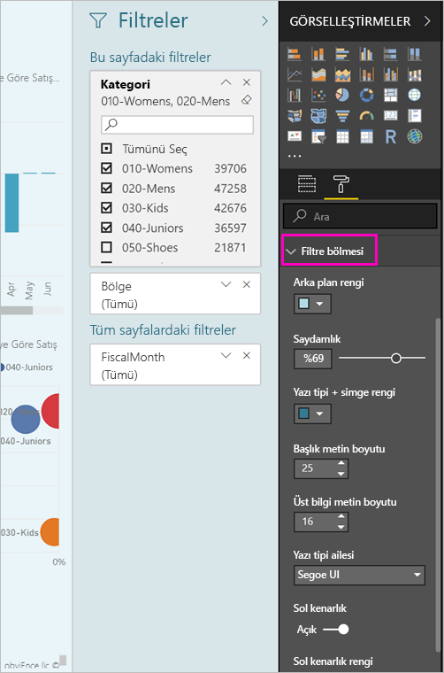

# <a name="the-new-filter-experience-in-power-bi-reports-preview"></a>Power BI raporlarında yeni filtre deneyimi (Önizleme)

Power bı'da filtreleri yeni işlev ve yeni bir tasarım vardır. Yeni filtre deneyimine katılım, raporun geri kalanını gibi aramak için filtreler bölmesini biçimlendirebilirsiniz. Kilitleyebilir ve hatta filtreleri gizle. Raporunuzu tasarlarken, tüm görsel öğeler bölmesindeki eski filtreler bölmesi artık bkz. Bunu, düzenleme ve tek bir filtreler bölmesinde biçimlendirme tüm filtrenizle yaparsınız. 


> [!NOTE]
> Yeni filtre deneyimi önizleme aşamasındadır. Yeni derlemeler daha önce ayarlamış olduğunuz biçimlendirmeyi geçersiz kılabilir.

Bir Rapor Tasarımcısı İşte yeni tek filtreler bölmesinde şunları yapabilirsiniz:

- Filtre uygulamak için alanlar ekleyip yeniden açın. 
- Filtrenin durumu değiştirin.
- Biçimlendirme ve böylece, raporunuzu parçası hissettirir filtreler bölmesi özelleştirebilirsiniz.
- Kullanıcı raporu açtığında Filtreler bölmesinin varsayılan olarak açık mı yoksa daraltılmış mı olacağını tanımlayabilirsiniz.
- Görmek için rapor kullanıcılarının istemediğiniz belirli filtreler ve tüm filtreler Bölmesini Gizle.
- Denetim ve hatta yer işareti görünürlük açın ve durumu Yeni filtreler bölmesi, daraltılmış.
- Kullanıcıların düzenlemesini istemediğiniz filtreleri kilitleyebilirsiniz.

Yeni filtre deneyimiyle rapor kullanıcılarının tüm filtreler ve dilimleyiciler, görsel etkileyen, salt okunur bir listesini görmek için herhangi bir görselin üzerine de gelebilirsiniz.


## <a name="turn-on-the-new-filter-experience"></a>Yeni filtre deneyimini açma 

Yeni deneyimi Power BI Desktop'ta etkinleştirirsiniz. Ardından filtreleri orada veya Power BI hizmetinde (https://app.powerbi.com) değiştirebilirsiniz. Bu yeni filtre deneyimi Önizleme aşamasında olduğundan, önce bu deneyimi Power BI Desktop'ta etkinleştirmeniz gerekir. Raporu Power BI hizmetinde oluşturarak işe başlarsanız, rapor yeni filtreleri içeremez.

### <a name="turn-on-new-filters-for-all-new-reports"></a>Tüm yeni raporlar için yeni filtreleri açma

1. Power BI Desktop'ta **Dosya** > **Seçenekler ve Ayarlar** > **Seçenekler** > **Önizleme Özellikleri**'ni seçin ve sonra da **Yeni filtre deneyimi** onay kutusunu seçin. 
2. Tüm yeni raporlarda yeni filtre deneyimini görmek için Power BI Desktop'ı yeniden başlatın.

Power BI Desktop'ı yeniden başlattıktan sonra, oluşturduğunuz tüm yeni raporlarda varsayılan olarak etkinleştirilir.  

### <a name="turn-on-new-filters-for-an-existing-report"></a>Mevcut bir rapor için yeni filtreleri açma

Yeni filtreleri mevcut raporlar için de etkinleştirebilirsiniz.

1. Power BI Desktop'ta, mevcut raporda **Dosya** > **Seçenekler ve Ayarlar** > **Seçenekler**'i seçin
2. Sol gezinti çubuğundaki altında **geçerli dosya**seçin **rapor ayarlarını**.
3. Altında **deneyimi filtreleme**seçin **güncelleştirilmiş Filtre bölmesini etkinleştirme ve filtreler Bu rapor için görsel üst bilgiyi görüntüler**.

## <a name="view-filters-for-a-visual-in-reading-mode"></a>Okuma modunda bir görselin filtrelerini görüntüleme

Okuma modunda, bir görselin filtre simgesi üzerine gelin ve görseli etkileyen tüm filtreleri, dilimleyicileri, vb. içeren açılan listeyi görüntüleyin. Açılır pencere biçimlendirme filtreler bölmesinde biçimlendirme aynıdır. 


Bu görünümde gösterilen filtre türleri şunlardır: 
- Temel filtreler
- Dilimleyiciler
- Çapraz vurgulama 
- Çapraz filtreleme
- Gelişmiş filtreler
- Üst N filtreler
- Göreli Tarih filtreleri
- Eşitleme dilimleyicileri
- Ekleme/Dışlama filtreleri
- URL aracılığıyla geçirilen filtreler

## <a name="build-the-new-filters-pane"></a>Yeni filtreler bölmesi oluşturun

Yeni filtreler bölmesi etkinleştirdikten sonra bu rapor sayfasının geçerli rapor ayarlarınıza göre varsayılan olarak biçimlendirilmiş sağındaki bakın. Hangi filtreleri eklemek ve yeni bölmede var olan filtreleri güncelleştirmek üzere yapılandırmak için yeni filtreler bölmesini kullanın. Yeni filtreler bölmesi, bir rapor yayımladığınızda, rapor kullanıcılarının görürsünüz gösterir. 

1. Varsayılan olarak, rapor kullanıcılarının filtreler bölmesini görebilirsiniz. Bunları görmesini istemiyorsanız simgelerine yanındaki seçin **filtreleri**.

    

2. Yeni, filtreler bölmesinde oluşturmaya başlamak için ilgi alanları görsel sayfası olarak ya da yeni filtreleri bölmesine sürükleyin veya rapor düzeyi filtreleri.

Bir rapor tuvaline bir görseli eklediğinizde, Power BI otomatik olarak filtreler bölmesinin görsel içindeki her alan için bir filtre ekler. 

## <a name="lock-or-hide-filters"></a>Filtreleri kilitleme veya gizleme

Tek tek filtre kartlarını kilitleyebilir veya gizleyebilirsiniz. Filtreyi kilitlerseniz, rapor kullanıcılarınız filtreyi görebilir ama değiştiremez. Gizlerseniz, kullanıcılar filtreyi hiç göremez. Normalde null değerlerle beklenmeyen değerleri dışlayan veri temizleme filtrelerini gizlemeniz gerektiğinde, filtre kartlarını gizleme özelliği yararlı olur. 

- Yeni filtreler bölmesinde seçin veya temizleyin **Zamknout Filtr** veya **Gizle filtre** filtre kartı simgeleri.

   

Bu ayarlar, açma ve kapatma yeni filtreler bölmesinde açmak gibi değişiklikler rapora yansıtılır bakın. Gizli filtreler, görselin filtre açılan listesinde gösterilmez.

Rapor işaretlerinizi akışı yeni filtreler bölmesi durumu da yapılandırabilirsiniz. Bölmenin açık, kapalı ve görünürlük durumlarının tümüne yer işaretleri eklenebilir.
 
## <a name="format-the-new-filters-pane"></a>Yeni Filtreler bölmesini biçimlendirme

Bu yeni deneyim büyük bir kısmını görünümünü raporunuzun eşleştirmek için filtreler bölmesini biçimlendirebilirsiniz ' dir. Filtreler bölmesi raporundaki her sayfa için farklı şekilde biçimlendirebilirsiniz. Biçimlendirebileceğiniz öğeler şunlardır: 

- Arka plan rengi
- Arka plan saydamlığı
- Açıp kenarlık
- Kenarlık rengi
- Başlık ve üst bilgi yazı tipi, renk ve metin boyutu

Bu öğeleri, uygulanmış (bir değere ayarlanmış) veya kullanılabilir (temizlenmiş) olup olmadıklarına bağlı olarak filtre kartları için de biçimlendirebilirsiniz: 

- Arka plan rengi
- Arka plan saydamlığı
- Kenarlık: açık veya kapalı
- Kenarlık rengi
- Yazı tipi, renk ve metin boyutu
- Giriş kutusu rengi

### <a name="format-the-filters-pane-and-cards"></a>Filtreler bölmesini ve kart biçimlendirme

1. Raporda, raporun kendisine veya arka plana (*duvar kağıdı*) tıklayın ve **Görselleştirmeler** bölmesinde **Biçimlendir**'i seçin. 
    Rapor sayfası, duvar kağıdı ve ayrıca filtreler bölmesini ve filtre kartları biçimlendirme seçenekleri görürsünüz.

        

1. Arka plan, simge ve sol kenarlık rengini rapor sayfasını tamamlayacak şekilde ayarlamak için **Filtre bölmesini** genişletin.

    

1. **Kullanılabilir** ve **Uygulanmış** kart rengini ve kenarlığını ayarlamak için **Filtre kartlarını** genişletin. Kullanılabilir ve uygulanmış kartları farklı renklerde ayarlarsanız, hangi filtrelerin uygulandığı rahatça görülür. 
  
    

## <a name="theming-for-filter-pane"></a>Tema oluşturma için Filtre Bölmesi
Şimdi, tema dosyası ile filtre bölmesini varsayılan ayarlarını değiştirebilirsiniz. Başlamanıza yardımcı olmak için bir tema kod parçacığı aşağıda verilmiştir:

 
```
"outspacePane": [{ 

"backgroundColor": {"solid": {"color": "#0000ff"}}, 

"foregroundColor": {"solid": {"color": "#00ff00"}}, 

"transparency": 50, 

"titleSize": 35, 

"headerSize": 8, 

"fontFamily": "Georgia", 

"border": true, 

"borderColor": {"solid": {"color": "#ff0000"}} 

}], 

"filterCard": [ 

{ 

"$id": "Applied", 

"transparency": 0, 

"backgroundColor": {"solid": {"color": "#ff0000"}}, 

"foregroundColor": {"solid": {"color": "#45f442"}}, 

"textSize": 30, 

"fontFamily": "Arial", 

"border": true, 

"borderColor": {"solid": {"color": "#ffffff"}}, 

"inputBoxColor": {"solid": {"color": "#C8C8C8"}} 

}, 

{ 

"$id": "Available", 

"transparency": 40, 

"backgroundColor": {"solid": {"color": "#00ff00"}}, 

"foregroundColor": {"solid": {"color": "#ffffff"}}, 

"textSize": 10, 

"fontFamily": "Times New Roman", 

"border": true, 

"borderColor": {"solid": {"color": "#123456"}}, 

"inputBoxColor": {"solid": {"color": "#777777"}} 

}] 
```

## <a name="sort-the-filter-pane"></a>Filtre bölmesini sıralama

Özel sıralama işlevselliği yeni filtre bölmesindeki deneyimde bir parçasıdır. Rapor oluşturucular sürükleyip bırakabilirsiniz bunları istenen sırada yeniden düzenlemek için filtreler.


Varsayılan sıralama için filtre olarak alfabetik sıralama kullanılır. Özel sıralama modunu başlatmak için herhangi bir filtre yeni konumuna sürüklemeniz yeterlidir. İçinde Örneğin, görsel düzeyi, sayfa düzeyi ve rapor düzeyi filtresi--uygulama düzeyi filtreler yalnızca sıralayabilirsiniz.

## <a name="filters-pane-scaling"></a>Filtreler bölmesinde ölçeklendirme

Yeni filtreler bölmesi, rapor sayfanızı ve görsellerinizi, ile rapor sayfasını şekilde ölçeklenen ve filtreler bölmesinde düzeltmede kalma oranını birbiriyle.

## <a name="improved-filters-pane-accessibility"></a>Gelişmiş Filtreler bölmesinde erişilebilirlik

Yeni filtreler bölmesi için klavye gezintisi geliştirdik. Filtreler bölmesi her parçasını sekme ve klavye ya da SHIFT + F10 bir bağlam menüsünü açmak için içerik anahtarını kullanın.


## <a name="rename-filters"></a>Filtreler yeniden adlandır
Filtreler bölmesi düzenlerken Başlığı düzenlemek için çift tıklayabilirsiniz. Yeniden adlandırma, son kullanıcılarınız için daha anlamlı için filtre kartı güncelleştirmek istiyorsanız kullanışlıdır. Filtre kartı yeniden adlandırma etkilenebileceğini mu *değil* alanın alanlar listesinde görünen adını yeniden adlandırın. Yalnızca, filtre karttaki kullanılan görünen adını değiştirir.


## <a name="restrict-changes-to-filter-type"></a>Kısıtlama türünü filtrelemek için değişikliklerin

Kullanıcılar, filtre türü değiştirebilir, kontrol etmek için bir seçenek olan rapor ayarlarının altında filtreleme karşılaşırsınız.


## <a name="next-steps"></a>Sonraki adımlar

Yeni filtre deneyimini bir kez deneyin. Bu özellik ve nasıl, gelişmeye devam edebilmemiz için devam, geri bildirimde bulunun [Power BI IDEAS site](https://ideas.powerbi.com/forums/265200-power-bi). 

- [Rapor filtrelerini kullanma](consumer/end-user-report-filter.md)
- [Raporlarda filtreleme ve vurgulama](power-bi-reports-filters-and-highlighting.md)

Başka bir sorunuz mu var? [Power BI Topluluğu'na başvurun](http://community.powerbi.com/)

