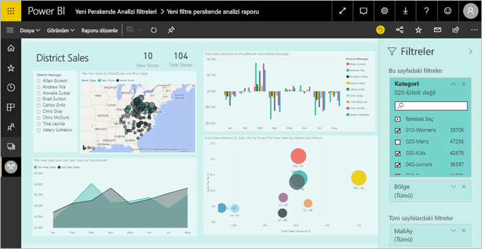
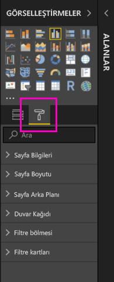
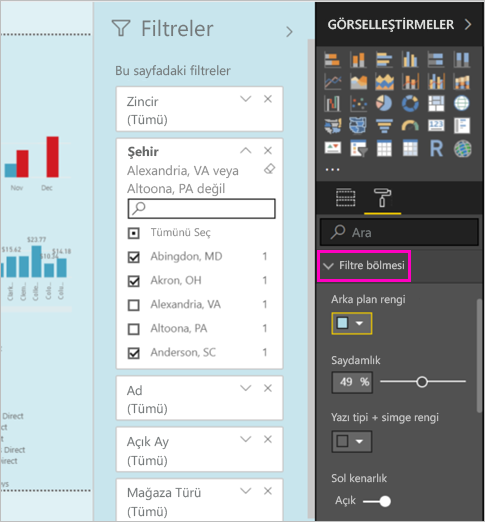
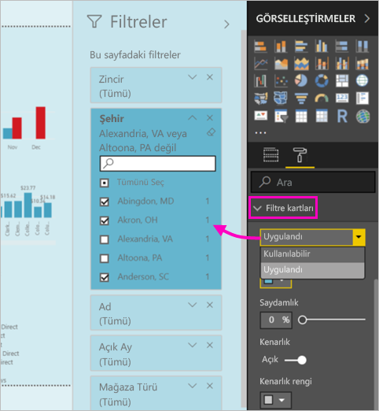
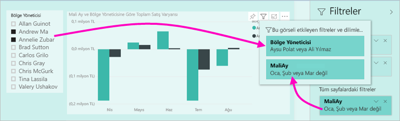

# Power BI raporlarında yeni filtre deneyimi (Önizleme)

Bu makalede yeni filtre deneyimi ayrıntılarıyla açıklanır: Power BI'daki filtrelere yeni işlevsellik ve yeni bir tasarım sağlanıyor. Power BI Desktop'ta veya Power BI hizmetinde rapor tasarlarken, Filtreler bölmesinin raporun tamamına benzemesini ve böyle çalışmasını sağlayabilirsiniz. Yeni deneyimde, eski Filtreler bölmesi filtre düzenleme bölmesi gibi çalışır ve rapor kullanıcılarınız yalnızca yeni Filtre bölmesini görür. 
 

Rapor tasarımcısı olarak, yeni filtrelerle şunları yapabilirsiniz:

- Kullanıcıların belirli bir görseli tam olarak hangi filtrelerin veya dilimleyicilerin etkilediğini öğrenmesi için görsel üst bilgisinde filtrelerin salt okunur bir görünümünü gösterebilirsiniz.
- Filtre bölmesini raporunuzu bir parçası gibi görünecek şekilde biçimlendirebilir ve özelleştirebilirsiniz.
- Kullanıcı raporu açtığında Filtreler bölmesinin varsayılan olarak açık mı yoksa daraltılmış mı olacağını tanımlayabilirsiniz.
- Filtre bölmesinin tamamını veya rapor kullanıcılarının görmesini istemediğiniz belirli filtreleri gizleyebilirsiniz.
- Yeni filtre bölmesinin görünürlüğünü, açık ve daraltılmış durumunu denetleyebilir, hatta buna yer işareti ekleyebilirsiniz.
- Kullanıcıların düzenlemesini istemediğiniz filtreleri kilitleyebilirsiniz.

## Yeni filtre deneyimini açma 

Yeni deneyimi Power BI Desktop'ta etkinleştirirsiniz. Ardından filtreleri orada veya Power BI hizmetinde (https://app.powerbi.com) değiştirebilirsiniz. Bu yeni filtre deneyimi Önizleme aşamasında olduğundan, önce bu deneyimi Power BI Desktop'ta etkinleştirmeniz gerekir. 

### Tüm yeni raporlar için yeni filtreleri açma

1. **Dosya** > **Seçenekler ve Ayarlar** > **Seçenekler** > **Önizleme Özellikleri**'ni seçin ve sonra da **Yeni filtre deneyimi** onay kutusunu seçin. 
2. Tüm yeni raporlarda yeni filtre deneyimini görmek için Power BI Desktop'ı yeniden başlatın.

Power BI Desktop'ı yeniden başlattıktan sonra, oluşturduğunuz tüm yeni raporlarda varsayılan olarak etkinleştirilir.  

### Mevcut bir rapor için yeni filtreleri açma

Yeni filtreleri mevcut raporlar için de etkinleştirebilirsiniz.

1. Mevcut raporda **Dosya** > **Seçenekler ve Ayarlar** > **Seçenekler**'i seçin
2. **Rapor ayarları**'nın altında, **Güncelleştirilmiş filtre bölmesini etkinleştirin ve bu rapor için görsel üst bilgisinde filtreleri gösterin** öğesini seçin.

## Yeni filtre bölmesini oluşturma

Yeni filtre bölmesini etkinleştirdikten sonra, bölmeyi rapor sayfasının sağ tarafında, geçerli rapor ayarlarınıza göre varsayılan olarak biçimlendirilmiş şekilde görürsünüz. Eski filtre bölmesi artık filtre düzenleme bölmesi işlevi görür. Yeni filtre bölmesi, raporunuzu yayımladığınızda rapor kullanıcılarınızın göreceği şekliyle raporu gösterir. Yeni bölmede mevcut raporları güncelleştirebilirsiniz ama hangi filtrelerin ekleneceğini yapılandırmak için eski filtre bölmesini kullanırsınız.

1. Önce rapor kullanıcılarınızın filtre bölmesini görmelerini isteyip istemediğinize karar verin. Görmelerini istiyorsanız, Filtreler'in yanındaki göz simgesini  seçin.

2. Yeni filtre bölmenizi oluşturmaya başlamak için, ilgilendiğiniz alanları görsel, sayfa veya rapor düzeyi filtreleri olarak filtre düzenleme bölmesine sürükleyin. Bunları yeni Filtreler bölmesinde görürsünüz.

    

Rapor tuvaline görsel eklediğinizde, Power BI görseldeki her alan için otomatik olarak bir filtre ekler. Power BI bu otomatik filtreleri salt okunur filtre bölmesine eklemez. Göz simgesini seçerek bunları açıkça eklemeniz gerekir.

 
## Filtreleri kilitleme veya gizleme

Tek tek filtre kartlarını kilitleyebilir veya gizleyebilirsiniz. Filtreyi kilitlerseniz, rapor kullanıcılarınız filtreyi görebilir ama değiştiremez. Gizlerseniz, kullanıcılar filtreyi hiç göremez. Normalde null değerlerle beklenmeyen değerleri dışlayan veri temizleme filtrelerini gizlemeniz gerektiğinde, filtre kartlarını gizleme özelliği yararlı olur. 

- Filtre düzenleme bölmesinde, filtre kartındaki **Filtreyi kilitle** veya **Filtreyi gizle** simgesini seçin veya temizleyin.

   

Filtre düzenleme bölmesinde bu ayarları açtığınız ve kapattığınızda, değişikliklerin yeni filtre bölmesine yansıtıldığını görürsünüz. Gizli filtreler, görselin filtre açılan listesinde gösterilmez.

Ayrıca filtre bölmenizin durumunu, raporunuzun yer işaretleriyle akışa katılacak şekilde yapılandırabilirsiniz. Bölmenin açık, kapalı ve görünürlük durumlarının tümüne yer işaretleri eklenebilir.
 
## Yeni Filtreler bölmesini biçimlendirme

Bu yeni deneyimin önemli bir parçası, artık filtre bölmesini raporunuzun genel görünümüne uyacak şekilde biçimlendirebilmenizdir. Filtre bölmesini, raporun her sayfası için farklı biçimlendirebilirsiniz. Biçimlendirebileceğiniz öğeler şunlardır: 

- Arka plan rengi
- Arka plan saydamlığı
- Filtre bölmesi kenarlığını açma veya kapatma
- Filtre bölmesi kenarlık rengi

Bu öğeleri, uygulanmış (bir değere ayarlanmış) veya kullanılabilir (temizlenmiş) olup olmadıklarına bağlı olarak filtre kartları için de biçimlendirebilirsiniz: 

- Arka plan rengi
- Arka plan saydamlığı
- Kenarlık: açık veya kapalı
- Kenarlık rengi

### Filtreler bölmesi ve kartları için biçimi ayarlama

1. Raporda, raporun kendisine veya arka plana (*duvar kağıdı*) tıklayın ve **Görselleştirmeler** bölmesinde **Biçimlendir**'i seçin. 
    Rapor sayfasını, duvar kağıdını ve ayrıca Filtre bölmesiyle Filtre kartlarını biçimlendirme seçeneklerini görürsünüz.

        

1. Arka plan, yazı tipi, simge ve sol kenarlık rengini rapor sayfasını tamamlayacak şekilde ayarlamak için **Filtre bölmesini** genişletin.

    

1. **Kullanılabilir** ve **Uygulanmış** kart rengini ve kenarlığını ayarlamak için **Filtre kartlarını** genişletin. Kullanılabilir ve uygulanmış kartları farklı renklerde ayarlarsanız, hangi filtrelerin uygulandığı rahatça görülür. 
  
    

## Okuma modunda bir görselin filtrelerini görüntüleme

Okuma modunda, bir görselin üzerine gelebilir ve görseli etkileyen tüm filtreleri, dilimleyicileri, vb. içeren bir açılan liste görebilirsiniz. Açılan listenin biçimlendirmesi, filtre bölmesinin biçimlendirmesiyle aynıdır. 

Bu görünümde gösterilen filtre türleri şunlardır: 
- Temel filtreler
- Dilimleyiciler
- Çapraz vurgulama 
- Çapraz filtreleme
- Gelişmiş filtreler
- Üst N filtreler
- Göreli Tarih filtreleri
- Eşitleme dilimleyicileri
- Ekleme/Dışlama filtreleri
- URL aracılığıyla geçirilen filtreler

## Çok yakında

Önümüzdeki aylarda aşağıdaki geliştirmeleri eklemeyi planlıyoruz:
- Filtre kartlarının sırasını değiştirebilme olanağı
- Rapor oluşturucuları için tek filtre bölmesi deneyimi 
- Daha fazla biçimlendirme seçeneği

Yeni filtre deneyimini bir kez deneyin. Bu özellikle ilgili geri bildirimlerinizi sağlayın ve bu deneyimi geliştirmeye nasıl devam edebileceğimiz konusunda görüşlerinizi bildirin. 

## Sonraki adımlar
[Rapor filtrelerini kullanma](consumer/end-user-report-filter.md)

[Raporlarda filtreleme ve vurgulama](power-bi-reports-filters-and-highlighting.md)

[Okuma Görünümü'nde filtreler ve vurgulama ile etkileşim kurma](consumer/end-user-reading-view.md)

[Rapor görsellerinin birbirini çapraz filtreleme ve çapraz vurgulama şeklini değiştirme](consumer/end-user-interactions.md)

Başka bir sorunuz mu var? [Power BI Topluluğu'na başvurun](http://community.powerbi.com/)

