# <a name="the-new-filter-experience-in-power-bi-reports"></a>Power BI raporlarındaki yeni filtre deneyimi

Power BI'daki filtrelerin yeni işlevleri ve yeni bir tasarımı var. Yeni filtre deneyimine katıldığınızda Filtreler bölmesini raporun geri kalanı gibi görünecek biçimde biçimlendirebilirsiniz. Filtreleri kilitleyebilir, hatta gizleyebilirsiniz. Raporunuzu tasarlarken Görselleştirmeler bölmesinde artık eski Filtreler bölmesini görmeniz gerekmez. Tüm filtre düzenleme ve biçimlendirme işlemlerini tek bir Filtreler bölmesinde gerçekleştirirsiniz. 

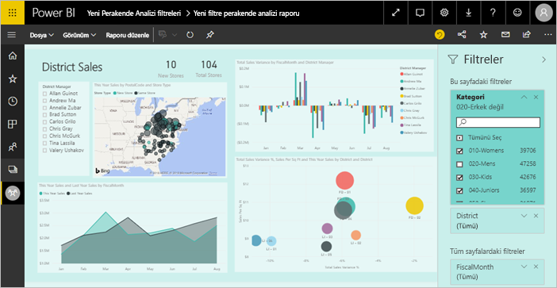

Bir rapor tasarımcısı olarak yeni Filtreler bölmesinde şunları yapabilirsiniz:

- Filtrenin uygulandığı alanları ekleyebilir veya kaldırabilirsiniz. 
- Filtre durumunu değiştirebilirsiniz.
- Filtreler bölmesini raporunuzu bir parçası gibi görünecek şekilde biçimlendirebilir ve özelleştirebilirsiniz.
- Kullanıcı raporu açtığında Filtreler bölmesinin varsayılan olarak açık mı yoksa daraltılmış mı olacağını tanımlayabilirsiniz.
- Filtreler bölmesinin tamamını veya rapor kullanıcılarının görmesini istemediğiniz belirli filtreleri gizleyebilirsiniz.
- Yeni Filtreler bölmesinin görünürlüğünü, açık ve daraltılmış durumunu denetleyebilir, hatta buna yer işareti ekleyebilirsiniz.
- Kullanıcıların düzenlemesini istemediğiniz filtreleri kilitleyebilirsiniz.

Yeni filtre deneyimiyle rapor tüketicileri herhangi bir görselin üzerine gelerek o görseli etkileyen tüm filtrelerin ve dilimleyicilerin salt okunur bir listesini görüntüleyebilir.

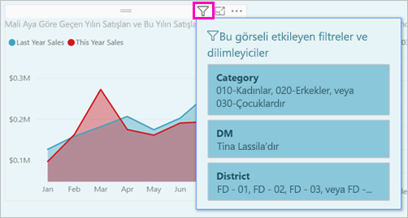

## <a name="turn-on-the-new-filter-experience"></a>Yeni filtre deneyimini açma 

Yeni filtre deneyimi, yeni raporlar için varsayılan olarak açıktır. Mevcut raporlar için yeni deneyimi Power BI Desktop’tan veya Power BI hizmetinden etkinleştirebilirsiniz.

### <a name="turn-on-new-filters-for-an-existing-report-in-power-bi-desktop"></a>Power BI Desktop’ta mevcut olan bir rapor için yeni filtreleri açma

1. Power BI Desktop'ta, mevcut raporda **Dosya** > **Seçenekler ve Ayarlar** > **Seçenekler**'i seçin
2. Sol gezinti çubuğunda, **Geçerli dosya**'nın altından **Rapor ayarları**'nı seçin.
3. **Filtreleme deneyimi**'nin altında **Güncelleştirilmiş filtre bölmesini etkinleştirin ve bu rapor için görsel üst bilgisinde filtreleri gösterin** öğesini seçin.

### <a name="turn-on-new-filters-for-an-existing-report-in-the-service"></a>Hizmette mevcut olan bir rapor için yeni filtreleri açma

Power BI hizmetinde **Yeni görünümü** açtıysanız , yeni filtre deneyimi otomatik olarak açılır. [Power BI hizmetinde yeni görünüm](service-new-look.md) hakkında daha fazla bilgi edinin.

Yeni görünümü açmadıysanız, yine de şu adımları izleyerek yeni filtre deneyimini görebilirsiniz.

1. Power BI hizmetinde, çalışma alanına ilişkin içerik listesinden **Raporlar** sekmesini seçin.
2. Etkinleştirmek istediğiniz raporu bulup **Ayarlar** simgesini ve o rapor için  seçin.
3. **Filtreleme deneyimi**'nin altında **Güncelleştirilmiş filtre bölmesini etkinleştirin ve bu rapor için görsel üst bilgisinde filtreleri gösterin** öğesini seçin.

    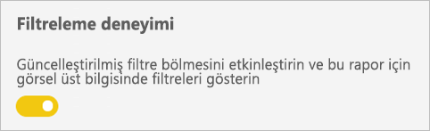

## <a name="view-filters-for-a-visual-in-reading-mode"></a>Okuma modunda bir görselin filtrelerini görüntüleme

Okuma modunda, bir görselin filtre simgesi üzerine gelin ve görseli etkileyen tüm filtreleri, dilimleyicileri, vb. içeren filtre açılan listesini görüntüleyin. Filtre açılan listesinin biçimlendirmesi Filtreler bölmesinin biçimlendirmesiyle aynıdır. 

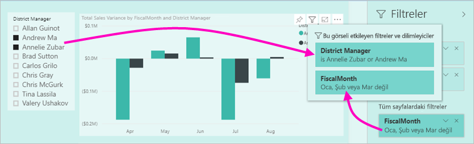

Bu görünümde gösterilen filtre türleri şunlardır: 
- Temel filtreler
- Dilimleyiciler
- Çapraz vurgulama 
- Çapraz filtreleme
- Gelişmiş filtreler
- Üst N filtreler
- Göreli Tarih filtreleri
- Eşitleme dilimleyicileri
- Ekleme/Dışlama filtreleri
- URL aracılığıyla geçirilen filtreler

## <a name="build-the-new-filters-pane"></a>Yeni Filtreler bölmesini oluşturma

Yeni Filtreler bölmesini etkinleştirdikten sonra, bölmeyi rapor sayfasının sağ tarafında, geçerli rapor ayarlarınıza göre varsayılan olarak biçimlendirilmiş şekilde görürsünüz. Hangi filtreleri ekleyeceğinizi yapılandırmak ve yeni bölgede mevcut filtreleri güncelleştirmek için yeni Filtreler bölmesini kullanırsınız. Yeni Filtreler bölmesi, raporunuzu yayımladığınızda rapor kullanıcılarınızın göreceği şekliyle raporu gösterir. 

1. Varsayılan olarak rapor tüketicileriniz Filtreler bölmesini görebilir. Görmelerini istemiyorsanız **Filtreler**’in yanındaki göz simgesini seçin.

    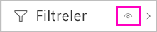

2. Yeni Filtreler bölmenizi oluşturmaya başlamak için, ilgilendiğiniz alanları görsel, sayfa veya rapor düzeyi filtreleri olarak yeni Filtreler bölmesine sürükleyin.

Rapor tuvaline görsel eklediğinizde, Power BI görseldeki her alan için Filtreler bölmesine otomatik olarak bir filtre ekler. 

## <a name="lock-or-hide-filters"></a>Filtreleri kilitleme veya gizleme

Tek tek filtre kartlarını kilitleyebilir veya gizleyebilirsiniz. Filtreyi kilitlerseniz, rapor kullanıcılarınız filtreyi görebilir ama değiştiremez. Gizlerseniz, kullanıcılar filtreyi hiç göremez. Normalde null değerlerle beklenmeyen değerleri dışlayan veri temizleme filtrelerini gizlemeniz gerektiğinde, filtre kartlarını gizleme özelliği yararlı olur. 

- Yeni Filtreler bölmesinde, filtre kartındaki **Filtreyi kilitle** veya **Filtreyi gizle** simgesini seçin veya temizleyin.

   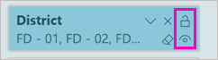

Yeni Filtreler bölmesinde bu ayarları açtığınız ve kapattığınızda, değişikliklerin rapora yansıtıldığını görürsünüz. Gizli filtreler, görselin filtre açılan listesinde gösterilmez.

Ayrıca yeni Filtreler bölmesinin durumunu, raporunuzun yer işaretleriyle akışa katılacak şekilde yapılandırabilirsiniz. Bölmenin açık, kapalı ve görünürlük durumlarının tümüne yer işaretleri eklenebilir.
 
## <a name="format-the-new-filters-pane"></a>Yeni Filtreler bölmesini biçimlendirme

Bu yeni deneyimin önemli bir parçası, Filtreler bölmesini raporunuzun genel görünümüne uyacak şekilde biçimlendirebilmenizdir. Filtreler bölmesini, raporun her sayfası için farklı biçimlendirebilirsiniz. Biçimlendirebileceğiniz öğeler şunlardır: 

- Arka plan rengi
- Arka plan saydamlığı
- Kenarlık açık veya kapalı
- Kenarlık rengi
- Başlık ve üst bilgi yazı tipi, rengi ve metin boyutu

Bu öğeleri, uygulanmış (bir değere ayarlanmış) veya kullanılabilir (temizlenmiş) olup olmadıklarına bağlı olarak filtre kartları için de biçimlendirebilirsiniz: 

- Arka plan rengi
- Arka plan saydamlığı
- Kenarlık: açık veya kapalı
- Kenarlık rengi
- Yazı tipi, renk ve metin boyutu
- Giriş kutusu rengi

### <a name="format-the-filters-pane-and-cards"></a>Filtreler bölmesini ve kartlarını biçimlendirme

1. Raporda, raporun kendisine veya arka plana (*duvar kağıdı*) tıklayın ve **Görselleştirmeler** bölmesinde **Biçimlendir**'i seçin. 
    Rapor sayfasını, duvar kağıdını ve ayrıca Filtreler bölmesiyle Filtre kartlarını biçimlendirme seçeneklerini görürsünüz.

1. Arka plan, simge ve sol kenarlık rengini rapor sayfasını tamamlayacak şekilde ayarlamak için **Filtre bölmesini** genişletin.

    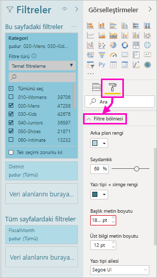

1. **Kullanılabilir** ve **Uygulanmış** kart rengini ve kenarlığını ayarlamak için **Filtre kartlarını** genişletin. Kullanılabilir ve uygulanmış kartları farklı renklerde ayarlarsanız, hangi filtrelerin uygulandığı rahatça görülür. 
  
    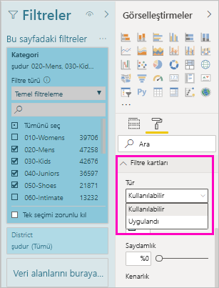

## <a name="theming-for-filter-pane"></a>Filtre bölmesi için tema oluşturma
Artık tema dosyasıyla filtre bölmesinin varsayılan ayarlarını değiştirebilirsiniz. Aşağıda başlangıç yapmanıza yardımcı olacak bir örnek tema kod parçacığı verilmiştir:

 
```
"outspacePane": [{ 

"backgroundColor": {"solid": {"color": "#0000ff"}}, 

"foregroundColor": {"solid": {"color": "#00ff00"}}, 

"transparency": 50, 

"titleSize": 35, 

"headerSize": 8, 

"fontFamily": "Georgia", 

"border": true, 

"borderColor": {"solid": {"color": "#ff0000"}} 

}], 

"filterCard": [ 

{ 

"$id": "Applied", 

"transparency": 0, 

"backgroundColor": {"solid": {"color": "#ff0000"}}, 

"foregroundColor": {"solid": {"color": "#45f442"}}, 

"textSize": 30, 

"fontFamily": "Arial", 

"border": true, 

"borderColor": {"solid": {"color": "#ffffff"}}, 

"inputBoxColor": {"solid": {"color": "#C8C8C8"}} 

}, 

{ 

"$id": "Available", 

"transparency": 40, 

"backgroundColor": {"solid": {"color": "#00ff00"}}, 

"foregroundColor": {"solid": {"color": "#ffffff"}}, 

"textSize": 10, 

"fontFamily": "Times New Roman", 

"border": true, 

"borderColor": {"solid": {"color": "#123456"}}, 

"inputBoxColor": {"solid": {"color": "#777777"}} 

}] 
```

## <a name="sort-the-filter-pane"></a>Filtre bölmesini sıralama

Özel sıralama işlevselliği, yeni filtre bölmesi deneyiminin bir parçasıdır. Rapor oluşturucuları filtreleri sürükleyip bırakarak istedikleri sırada yeniden düzenleyebilirler.


Filtrelerin varsayılan sıralama düzeni alfabetiktir. Özel sıralama modunu başlatmak için herhangi bir filtreyi yeni bir konuma sürüklemeniz yeterlidir. Filtreleri yalnızca uygulandıkları düzey içinde (görsel düzeyi, sayfa düzeyi veya rapor düzeyi filtresi) sıralayabilirsiniz.

## <a name="improved-filters-pane-accessibility"></a>Geliştirilmiş Filtreler bölmesi erişilebilirliği

Yeni Filtreler bölmesinin klavye gezintisini geliştirdik. Filtreler bölmesinin her parçasına Sekme tuşuyla gidebilir ve klavyenizdeki içerik tuşunu kullanarak ya da Shift+F10 tuşlarına basarak içerik menüsünü açabilirsiniz.

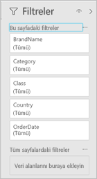

## <a name="rename-filters"></a>Filtreleri yeniden adlandırma
Filtreler bölmesini düzenlerken, başlığa çift tıklayarak başlığı düzenleyebilirsiniz. Son kullanıcılarınızın daha iyi anlayabilmesi için filtre kartını güncelleştirmek istiyorsanız yeniden adlandırma kullanışlıdır. Unutmayın; filtre kartını yeniden adlandırmak alanlar listesindeki alanın görünen adını *değiştirmez*. Yalnızca filtre kartında kullanılan görünen adını değiştirir.

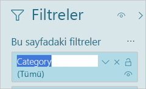

## <a name="restrict-changes-to-filter-type"></a>Filtre türündeki değişiklikleri kısıtlama

Rapor ayarlarının Filtreleme deneyimi bölümünde, kullanıcıların filtre türünü değiştirip değiştiremeyeceğini belirleme seçeneğiniz vardır.

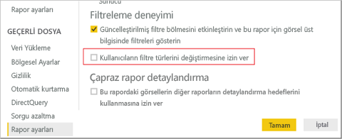

## <a name="next-steps"></a>Sonraki adımlar

Yeni filtre deneyimini bir kez deneyin. [Power BI Ideas sitesinde](https://ideas.powerbi.com/forums/265200-power-bi) bu özellikle ilgili geri bildirimlerinizi sağlayın ve bu deneyimi geliştirmeye nasıl devam edebileceğimiz konusunda görüşlerinizi bildirin. 

- [Rapor filtrelerini kullanma](consumer/end-user-report-filter.md)
- [Raporlarda filtreleme ve vurgulama](power-bi-reports-filters-and-highlighting.md)
- [Power BI’daki farklı filtre türleri](power-bi-report-filter-types.md)

Başka bir sorunuz mu var? [Power BI Topluluğu'na başvurun](http://community.powerbi.com/)

