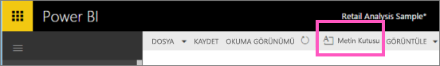
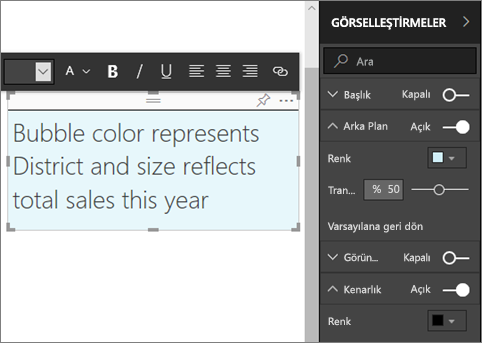
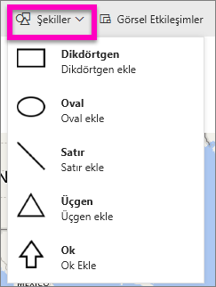
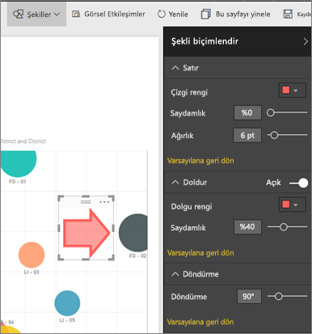

# Power BI raporlarındaki statik içerik
Power BI hizmeti ve Power BI Desktop kullanılarak, raporlara metin kutuları ve şekiller eklenebilir. Her iki durumda da, rapor için düzenleme izinlerine sahip olmanız gerekir. Power BI hizmetinde bir rapor sizinle paylaşıldıysa, düzenleme izinlerine sahip olmazsınız. 

Power BI Desktop kullanarak [rapora statik görüntüler ekleyin](guided-learning/visualizations.yml?tutorial-step=11) ve sonra aşağıdaki adımları izleyerek, bunun yerine Power BI hizmetini kullanmayı deneyin.
> 
> <iframe width="560" height="315" src="https://www.youtube.com/embed/_3q6VEBhGew" frameborder="0" allowfullscreen></iframe>
> 

## Rapora metin kutusu ekleme
1. Bir raporu Düzenleme görünümünde açın.

2. İmlecinizi rapor tuvalinin boş bir alanına yerleştirip **Metin Kutusu** seçeneğini belirleyin.
   
   
2. Metin kutusuna metninizi yazın ve isteğe bağlı olarak yazı tipini, rengi ve metin hizalamasını biçimlendirin. 
   
   
3. Metin kutusunu yerleştirmek için üst kısımdaki gri alanı seçip sürükleyin. Metin kutusunu yeniden boyutlandırmak için ana hat tutamaçlarından herhangi birini seçip sürükleyin. 
   
   

4. Metin kutusu hala seçiliyken, GÖRSEL ÖĞELER bölmesine başka biçimlendirmeler ekleyin. Bu örnekte, arka planı ve kenarlığı biçimlendirdik. Ayrıca, bir metin kutusu için tam bir boyut ve konum oluşturabilirsiniz.  

   

5. Metin kutusunu kapatmak için rapor tuvalindeki herhangi bir boş alanı seçin. 

5. Metin kutusunu bir panoya sabitlemek için raptiye simgesini  seçin. 

## Rapora şekil ekleme
1. İmlecinizi rapor tuvalinin herhangi bir yerine yerleştirip **Şekiller** seçeneğini belirleyin.
   
   
2. Açılan listeden, rapor tuvalinize eklemek üzere bir şekil seçin. Toplam satış varyansının en yüksek olduğu balona dikkat çekmek için bir ok ekleyelim. 
   
   **Şekli biçimlendir** bölmesinde, eklediğiniz şekli özelleştirin. Biz bu örnekte koyu kırmızı kenarlıklı, 90 derece döndürülmüş kırmızı bir ok oluşturduk.
   
   
3. Şekli yerleştirmek için üst kısımdaki gri alanı seçip sürükleyin. Şekli yeniden boyutlandırmak için ise ana hat tutamaçlarından herhangi birini seçip sürükleyin. Metin kutusu için yaptığınız gibi, bir şekil için de tam bir boyut ve konum oluşturabilirsiniz.

> **NOT**: [Canlı bir sayfayı sabitlediğinizde](service-dashboard-pin-live-tile-from-report.md) görsel öğelerden biri olması dışında, şekiller bir panoya sabitlenemez. 
> 
> 

### Sonraki adımlar
[Metin kutularına köprü ekleme](service-add-hyperlink-to-text-box.md)

[Power BI - Temel Kavramlar](service-basic-concepts.md)

Başka bir sorunuz mu var? [Power BI Topluluğu'na başvurun](http://community.powerbi.com/)
