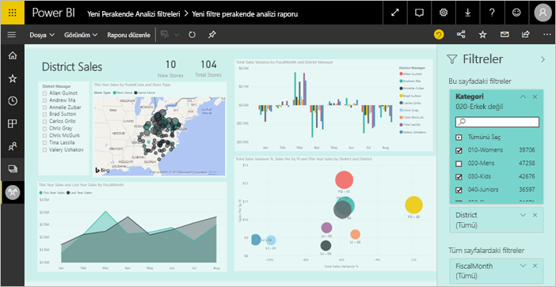
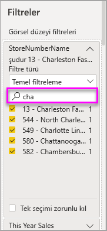

# Power BI raporlarındaki filtreler ve vurgulama
 Bu makalede, Power BI hizmetindeki filtreleme ve vurgulama özellikleri tanıtılmaktadır. Power BI Desktop ile sunulan deneyim de neredeyse aynıdır. *Filtreler*, odaklanmak istedikleriniz dışındaki tüm verileri kaldırır. *Vurgulama*, filtreleme değildir. Bu işlev verileri kaldırmaz, bunun yerine görünen verilerin bir alt kümesini vurgular. Vurgulanmayan veriler görünür kalır ancak gridir.

Power BI'da raporları çok çeşitli yollarla filtreleyebilir ve vurgulayabilirsiniz. Tüm bu bilgilerin tek bir makalede ele alınması karmaşıklık yaratacağından tüm konuyu aşağıdaki şekilde bölümlere ayırmayı tercih ettik:

* Filtrelere ve vurgulamaya giriş (şu anda okuduğunuz makale).
* Power BI Desktop ve Power BI hizmetindeki raporlarda [Düzenleme görünümünde filtre oluşturma ve kullanma](power-bi-report-add-filter.md) Düzenleme izinlerine sahip olmanız halinde raporlarda filtre oluşturabilir, bunları değiştirebilir ve silebilirsiniz.
* Power BI hizmetindeki rapor Okuma görünümünde, [bir rapordaki filtre ve vurgulama görselleri sizinle nasıl paylaşılır](consumer/end-user-interactions.md). Yapabilecekleriniz daha sınırlıdır ancak yine de çok çeşitli filtreleme ve vurgulama seçeneklerine sahip olursunuz.  
* Power BI Desktop ve Power BI hizmetinde [Düzenleme görünümünde kullanılabilir olan filtreleme ve vurgulama denetimlerinin](power-bi-report-add-filter.md) ayrıntılı turu. Bu makale, tarih ve saat, sayısal ve metin gibi filtre türlerini derinlemesine inceler. Temel ve gelişmiş seçenekler arasındaki farkları da ele alır.
* Filtrelerin ve vurgulamanın varsayılan olarak nasıl çalıştığını öğrendikten sonra [bir sayfadaki görselleştirmelerin birbirini filtreleme ve vurgulama şeklini nasıl değiştireceğinizi öğrenebilirsiniz](service-reports-visual-interactions.md)

**Biliyor muydunuz?** Power BI yeni bir filtre deneyimine sahiptir. [Power BI raporlarında yeni filtre deneyimi](power-bi-report-filter.md) hakkında daha fazla bilgi edinin.

## Filtreler bölmesine giriş

Filtreleri **Filtreler** bölmesinden veya doğrudan rapor üzerindeki [dilimleyicilerde seçim yaparak](visuals/power-bi-visualization-slicers.md) uygulayabilirsiniz. Filtreler bölmesi, raporda kullanılan tabloların ve alanların yanı sıra uygulanan filtreleri (varsa ) gösterir. 

Dört tür filtre vardır.

- **Sayfa filtresi**, rapor sayfasındaki tüm görsellere uygulanır     
- **Görsel filtresi**, bir rapor sayfasındaki tek bir görsele uygulanır. Rapor tuvalinde bir görsel seçtiyseniz yalnızca görsel düzeyi filtrelerini görürsünüz.    
- **Rapor filtresi**, rapordaki tüm sayfalara uygulanır    
- **Detaylandırma filtresi**, bir rapordaki tek bir varlığa uygulanır    

Okuma veya Düzenleme görünümünde sayfa, görsel ve rapor filtrelerinde arama yaparak istediğiniz değeri bulabilir ve seçebilirsiniz. 

Filtrenin yanında **Tümü** ifadesinin bulunması, alandaki tüm değerlerin filtreye dahil edilmiş olduğunu gösterir.  Örneğin, aşağıdaki ekran görüntüsünde **Chain (Tümü)** , bu rapor sayfasının tüm mağaza zincirleriyle ilgili verileri içerdiğini gösterir.  Diğer yandan, **FiscalYear 2013 veya 2014 değeridir** rapor düzeyi filtresi, bize raporun yalnızca 2013 ve 2014 mali yıllarına ilişkin verileri içerdiğini gösterir.

## Okuma veya Düzenleme görünümündeki filtreler
Raporlarla etkileşimli çalışmak için kullanabileceğiniz iki mod vardır: [Okuma görünümü](consumer/end-user-reading-view.md) ve Düzenleme görünümü. Kullanabileceğiniz filtreleme özellikleri hangi modda olduğunuza bağlıdır.

* Düzenleme görünümünde, rapor, sayfa, detaylandırma ve görsel filtreler ekleyebilirsiniz. Raporu kaydettiğinizde, mobil uygulamada açsanız bile filtreler raporla birlikte kaydedilir. Okuma görünümünde rapora göz atan kişiler eklediğiniz filtrelerle etkileşim kurabilir ancak yeni filtreler ekleyemez.
* Okuma görünümünde önceden raporda bulunan filtrelerle etkileşim kurabilir ve yaptığınız seçimi kaydedebilirsiniz. Yeni filtre ekleyemezsiniz.

### Okuma görünümündeki filtreler
Bir rapora yalnızca Okuma görünümünde erişim sahibiyseniz Filtreler bölmesi aşağıdaki gibi görünür:

Raporun bu sayfasında altı sayfa düzeyi filtresi ile bir rapor düzeyi filtresi bulunur.

Bir görselde bulunan tüm alanlara filtre uygulanmış olabilir ve rapor yazarı daha fazla filtre ekleyebilir. Aşağıdaki görüntüde, kabarcık grafiğinde altı filtre vardır.

Okuma görünümünde, mevcut filtreleri değiştirerek verileri araştırabilirsiniz. Raporu mobil uygulamada açsanız bile, yaptığınız değişiklikler rapora kaydedilir. Nasıl yapıldığını öğrenmek için [Power BI Filtreler bölmesine ilişkin tura katılın](consumer/end-user-report-filter.md)

Rapordan çıktığınızda filtreleriniz kaydedilir. Filtreleme işlemini geri almak ve rapor yazarı tarafından ayarlanan varsayılan filtreleme, dilimleme, detaylandırma ve sıralamaya geri dönmek için, üst menü çubuğundan **Varsayılana sıfırla**’yı seçin.

### Düzenleme görünümündeki filtreler
Bir rapor için sahip izinleriniz olduğunda ve raporu Düzenleme görünümünde açtığınızda **Filtreler**'in, kullanılabilir birkaç düzenleme bölmesinden yalnızca biri olduğunu görürsünüz.

Okuma görünümünde olduğu gibi raporun bu sayfasında da altı sayfa düzeyi filtresi ile bir rapor düzeyi filtresi bulunur. Kabarcık grafiği seçtiğimizde ise altı görsel düzeyi filtresinin uygulanmış olduğunu görürüz.

Düzenleme görünümünde filtreler ve vurgulama ile daha fazla işlem gerçekleştirebilirsiniz. Özellikle yeni filtreler ekleyebilirsiniz. [Rapora filtre eklemeyi](power-bi-report-add-filter.md) ve çok daha fazlasını öğrenin.

## Anlık vurgulama
Sayfadaki diğer görselleri vurgulamak için bir görseldeki değeri veya eksen etiketini seçin. Vurgulamayı kaldırmak için değeri yeniden seçin veya aynı görselde herhangi bir boş alanı seçin. Vurgulama, veri etkilerini hızla keşfetmenin eğlenceli bir yoludur. [Görsel etkileşimler](service-reports-visual-interactions.md) makalesine giderek bu türdeki çapraz vurgulama işlemlerinin nasıl çalıştığına ilişkin ayrıntılara ulaşabilirsiniz.

## Sonraki adımlar

[Power BI raporlarındaki yeni filtre deneyimi](power-bi-report-filter.md)

[Bir rapora filtre ekleme (Düzenleme görünümünde)](power-bi-report-add-filter.md)

[Rapor filtrelerine ilişkin bir tura katılın](consumer/end-user-report-filter.md)

[Rapor görsellerinin birbirini çapraz filtreleme ve çapraz vurgulama şeklini değiştirme](consumer/end-user-interactions.md)

Başka bir sorunuz mu var? [Power BI Topluluğu'na başvurun](http://community.powerbi.com/)

