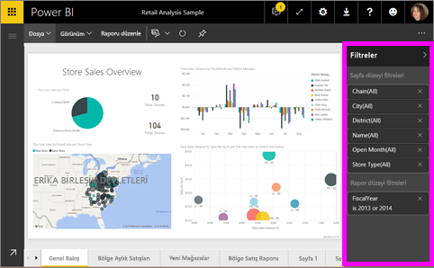
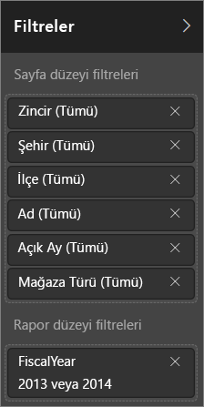
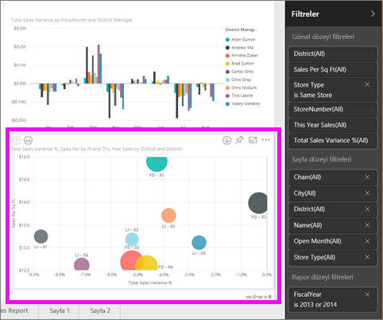
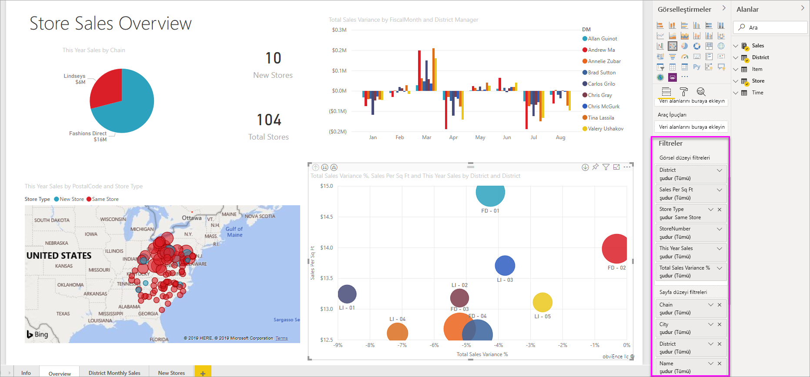

# Power BI raporlarındaki filtreler ve vurgulama hakkında
***Filtreler***, odaklanmak istedikleriniz dışındaki tüm verileri kaldırır.  Verilerin kaldırılması söz konusu olmadığından ***vurgulama***, filtreleme değildir; bunun yerine görünen verilerin bir alt kümesini vurgular. Vurgulanmayan veriler görünür kalır ancak gridir.

Power BI'da raporları çok çeşitli yollarla filtreleyebilir ve vurgulayabilirsiniz. Tüm bu bilgilerin tek bir makalede ele alınması karmaşıklık yaratacağından tüm konuyu aşağıdaki şekilde bölümlere ayırmayı tercih ettik:

* Filtrelere ve vurgulamaya giriş (şu anda okuduğunuz makale)
* [Sahip olduğunuz raporlarda/Düzenleme Görünümü'nde filtre ve vurgulama oluşturup kullanmak](power-bi-report-add-filter.md) için izleyebileceğiniz yollar. Düzenleme izinlerine sahip olmanız halinde raporlarda filtre ve vurgulama oluşturabilir, bunları değiştirebilir ve silebilirsiniz.
* [Sizinle paylaşılan bir raporda veya rapor Okuma Görünümü'nde filtreleri ve vurgulamayı kullanmanızın](service-reading-view-and-editing-view.md) yolları. Yapabilecekleriniz daha sınırlıdır ancak Power BI size yine de çok çeşitli filtreleme ve vurgulama seçenekleri sunar.  
* Filtre türleri (örneğin, tarih ve saat, sayısal, metin) ile temel ve gelişmiş seçenekler arasındaki farka ayrıntılı bakışın da dahil olduğu, [Düzenleme Görünümü'nde kullanılabilen filtre ve vurgulama denetimlerine ilişkin ayrıntılı bir tur](power-bi-how-to-report-filter.md).
* Filtrelerin ve vurgulamanın varsayılan olarak nasıl çalıştığını öğrendiğinize göre artık [bir sayfadaki görselleştirmelerin birbirini filtreleme ve vurgulama şeklini nasıl değiştireceğinizi öğrenebilirsiniz](service-reports-visual-interactions.md)

> [!TIP]
> Power BI, veriler arasındaki ilişkileri nasıl bilir?  Rapor sayfasındaki öğelerin birbiriyle etkileşim kurmasını sağlamak için ilgili [veri modelinde](https://support.office.com/article/Create-a-Data-Model-in-Excel-87e7a54c-87dc-488e-9410-5c75dbcb0f7b?ui=en-US&rs=en-US&ad=US) bulunan farklı tablolar ve alanlar arasındaki ilişkileri kullanır.
> 
> 

## Filtreler bölmesi kullanılarak raporlarda filtreleme ve vurgulamaya giriş
 Bu makalede, Power BI hizmetindeki filtreleme ve vurgulama özellikleri tanıtılmaktadır.  Ancak bu, Power BI Desktop ile neredeyse aynı deneyimi sunar.  

Filtreler ve vurgulama, **Filtreler** bölmesi kullanılarak veya doğrudan rapor üzerinde seçimler yapılarak (geçici, sayfanın en alt kısmına bakın) uygulanabilir. Filtreler bölmesi, raporda kullanılan tabloların ve alanların yanı sıra uygulanan filtreleri (varsa ) gösterir. Filtreler; **Sayfa düzeyi**, **Rapor düzeyi**, **Detaylandırma** ve **Görsel düzeyi** olarak ayrılır.  Rapor tuvalinde görselleştirme seçtiyseniz yalnızca görsel düzeyi filtrelerini görürsünüz.

> [!TIP]
> Filtrenin yanında **Tümü** ifadesi varsa bu, alanın tamamının filtre olarak dahil edildiği anlamına gelir.  Örneğin, aşağıdaki ekran görüntüsünde **Chain (Tümü)**, bize bu rapor sayfasının tüm mağaza zincirleriyle ilgili verileri içerdiğini gösterir.  Diğer yandan, **FiscalYear 2013 veya 2014 değeridir** rapor düzeyi filtresi, bize raporun yalnızca 2013 ve 2014 mali yıllarına ilişkin verileri içerdiğini gösterir.
> 
> 

## Okuma görünümündeki ve Düzenleme görünümündeki filtrelerin karşılaştırması
Raporlarla etkileşim kurmak için kullanabileceğiniz iki mod vardır: [Okuma görünümü ve Düzenleme görünümü](service-reading-view-and-editing-view.md).  Kullanabileceğiniz filtreleme özellikleri hangi modda olduğunuza bağlıdır.

* Düzenleme Görünümü’nde, rapor, sayfa, detaylandırma ve görsel filtreler ekleyebilirsiniz. Raporu kaydettiğinizde, mobil uygulamada açsanız bile filtreler raporla birlikte kaydedilir. Okuma Görünümü’nde rapora göz atan kişiler eklediğiniz filtrelerle etkileşim kurabilir ancak yeni filtreler ekleyemez.
* Okuma Görünümü’nde önceden raporda bulunan filtrelerle etkileşim kurabilir ve yaptığınız seçimi kaydedebilirsiniz.  Ancak yeni filtreler ekleyemezsiniz.

### Okuma Görünümü'nde Filtreler bölmesi
Bir rapora yalnızca Okuma Görünümü'nde erişim sahibiyseniz Filtreler bölmesi aşağıdaki gibi görünür:

Raporun bu sayfasında 6 sayfa düzeyi filtresi ile 1 rapor düzeyi filtresi bulunur.

Herhangi bir görsel düzeyi filtresinin mevcut olup olmadığını görmek için bir görsel seçin. Aşağıdaki görüntüde, kabarcık grafiğinde 6 filtre uygulanmıştır.

Okuma Görünümü'nde, mevcut filtreleri değiştirerek verileri araştırın. Raporu mobil uygulamada açsanız bile, yaptığınız değişiklikler rapora kaydedilir. [Power BI hizmetinde Okuma görünümü ve Düzenleme görünümü](service-reading-view-and-editing-view.md) başlıklı makaleden bu konuda bilgi alabilirsiniz

### Düzenleme Görünümü'nde Filtreler bölmesi
Bir rapor için sahip izinleriniz olduğunda ve raporu Düzenleme Görünümü'nde açtığınızda **Filtreler**'in, kullanılabilir birkaç düzenleme bölmesinden yalnızca biri olduğunu görürsünüz.

Okuma Görünümü'nde olduğu gibi (yukarıda), raporun bu sayfasında 6 sayfa düzeyi filtresi ve 1 rapor düzeyi filtresi bulunduğunu görürüz. Kabarcık grafiği seçtiğimizde ise 6 görsel düzeyi filtresinin uygulanmış olduğunu görürüz.

Ancak Düzenleme Görünümü'nde, filtrelerle ve vurgulamayla yapabileceğimiz çok daha fazla işlem vardır. Temel fark, yeni filtreler ekleyebilmemizdir. [Bir rapora filtre ekleme](power-bi-report-add-filter.md) makalesinde bunun nasıl yapıldığını ve çok daha fazlasını öğrenebilirsiniz

## Geçici filtreleme ve vurgulama
Sayfanın geri kalanını filtrelemek ve vurgulamak için rapor tuvalinde bir alan seçin. Filtreleme ve vurgulamayı kaldırmak için aynı görselde boş bir alan seçin. Bu türdeki filtreleme ve vurgulama işlemleri, veri etkilerini hızla keşfetmenin eğlenceli bir yoludur. [Görsel etkileşimler](service-reports-visual-interactions.md) makalesine giderek bu türdeki çapraz filtreleme ve çapraz vurgulama işlemlerinin nasıl çalıştığına ilişkin ayrıntılara ulaşabilirsiniz.

Rapordan çıktığınızda değişiklikleriniz kaydedilir. Filtrelemenizi geri almak için üstteki menü çubuğundan **Varsayılana sıfırla**’yı seçin.

## Sonraki adımlar
[Filtreler ve vurgulama ile etkileşim kurma (Okuma Görünümü'nde)](service-reading-view-and-editing-view.md)

[Bir rapora filtre ekleme (Düzenleme Görünümü'nde)](power-bi-report-add-filter.md)

[Rapor filtrelerine ilişkin bir tura katılın](power-bi-how-to-report-filter.md)

[Rapor görsellerinin birbirini çapraz filtreleme ve çapraz vurgulama şeklini değiştirme](service-reports-visual-interactions.md)

[Power BI'daki raporlar](service-reports.md) ile ilgili daha fazla bilgi edinin

Başka bir sorunuz mu var? [Power BI Topluluğu'na başvurun](http://community.powerbi.com/)

