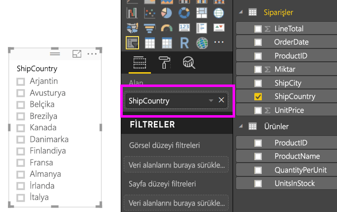
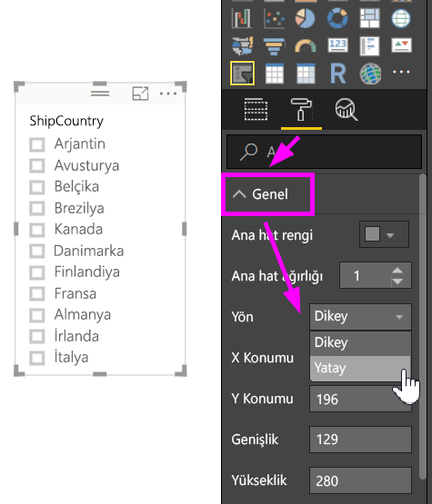
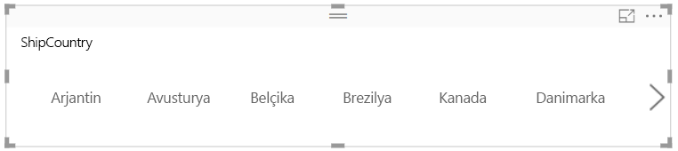
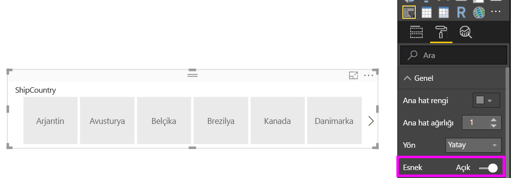
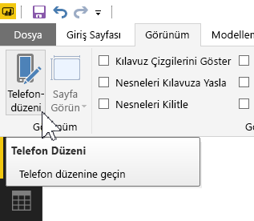
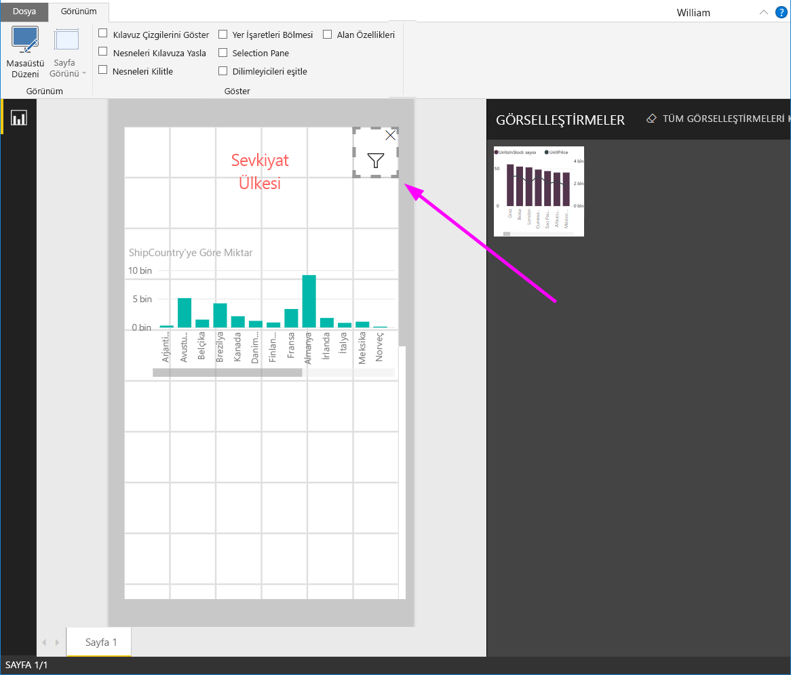

# Power BI’da yeniden boyutlandırabileceğiniz, yanıt veren bir dilimleyici oluşturma

Hızlı yanıt veren dilimleyiciler, yeniden boyutlandırılarak raporunuzdaki herhangi bir alana sığdırılabilir. Hızlı yanıt veren dilimleyicileri yatay, kare veya dikey gibi farklı boyut ve şekillerde yeniden boyutlandırabilirsiniz ve siz bunları yaptığınız sırada dilimleyicideki değerler kendi kendine yeniden düzenlenir. Power BI Desktop’ta ve Power BI hizmetinde yatay dilimleyicilerin ve tarih/aralık dilimleyicilerinin hızlı yanıt vermesini sağlayabilirsiniz. Tarih/aralık dilimleyicileri, bunları parmak ucunuzla daha kolay değiştirebilmeniz için geliştirilmiş dokunma alanlarına da sahiptir. Hızlı yanıt veren dilimleyicileri istediğiniz kadar büyük veya küçük bir boyuta getirebilirsiniz. Ayrıca bunlar, hem Power BI hizmetinde hem de Power BI mobil uygulamalarında otomatik olarak raporlara uyacak şekilde yeniden boyutlandırılır. 

## Dilimleyici oluşturma

Dinamik dilimleyici oluşturmanın ilk adımı basit bir dilimleyici oluşturmaktır. 

1. **Görsel Öğeler** bölmesinde **Dilimleyici** simgesini  seçin.
2. Filtre uygulamak istediğiniz alanı **Alan** seçeneğine sürükleyin.

    

## Yatay dilimleyiciye dönüştürme

1. **Görsel Öğeler** bölmesinde, dilimleyici seçiliyken **Biçim** sekmesini seçin.
2. **Genel** bölümünü genişletin ve **Yönlendirme** için **Yatay**’ı seçin.

     

1.  Muhtemelen daha fazla değer gösterilmesi için daha geniş olmasını istersiniz.

     

## Dilimleyiciyi hızlı yanıt verir hale getirme ve denemeler yapma

Bu adım kolaydır. 

1. **Biçim** sekmesinin **Genel** bölümündeki **Yönlendirme**’nin hemen altında bulunan **Yanıt veriyor** seçeneğini **Açık** konumuna getirin.  

    

1. Artık dilimleyiciyle deneme yapabilirsiniz. Köşeleri sürükleyerek kısaltın, uzatın, genişletin ve daraltın. Yeterince küçültürseniz bir filtre simgesine dönüşür.

    

## Bir telefon raporu düzenine ekleyin

Power BI Desktop’ta bir raporun her sayfası için telefon düzeni oluşturabilirsiniz. Bir sayfada telefon düzeni varsa, bir cep telefonunda portre görünümünde görüntülenir. Aksi takdirde, yatay görünümde görüntülenmesi gerekir. 

1. **Görünüm** menüsünde, select **Telefon Düzeni**’ni seçin.

     
    
1. Telefonlara yönelik raporda yer almasını istediğiniz tüm görsel öğeleri ızgaraya sürükleyin. Hızlı yanıt veren dilimleyiciyi sürükleyerek istediğiniz boyuta getirebilirsiniz; bu örnekte bir filtre simgesine dönüşmüştür.

    

[Power BI mobil uygulamaları için iyileştirilmiş raporlar](desktop-create-phone-report.md) oluşturma hakkında daha fazla bilgi edinin.

## Bir zaman veya aralık dilimleyicisinin hızlı yanıt vermesini sağlama

Aynı adımları izleyerek bir kutucuk veya aralık dilimleyicisinin hızlı yanıt vermesini sağlayabilirsiniz. **Yanıt veriyor** seçeneğini **Açık** konuma getirdiğinizde birkaç şeyi fark edersiniz:

- Görsel öğeler, tuvalde izin verilen boyuta bağlı olarak giriş kutularının sıralamasını iyileştirir. 
- Tuvalde izin verilen boyutuna bağlı olarak dilimleyicinin mümkün olduğunca kullanılabilir hale getirilmesi için veri öğelerinin görüntülenmesi iyileştirilir. 
- Kaydırıcılardaki yeni yuvarlak tutamaçlar, dokunarak etkileşim kurmayı iyileştirir. 
- Bir görsel öğe kullanışlılığını kaybedecek kadar küçüldüğünde, bir görsel öğe türünü temsil eden bir simgeye dönüşür. Bununla etkileşim kurmak için öğeye iki kez dokunarak odak modunda açabilirsiniz. Bu, rapor sayfasında işlevsellik kaybı yaşanmadan yer tasarrufu yapılmasını sağlar.

## Sonraki adımlar

- [Power BI hizmetindeki dilimleyiciler](visuals/power-bi-visualization-slicers.md)
- Başka bir sorunuz mu var? [Power BI Topluluğu'na sorun](http://community.powerbi.com/)