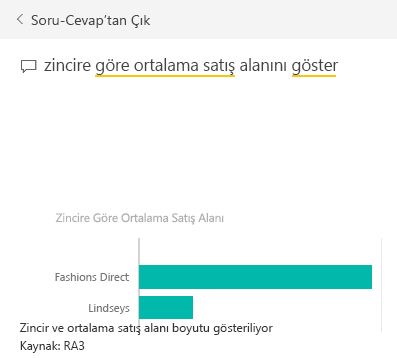
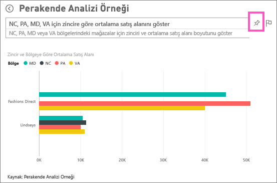

# Öğretici: Görselleştirmeler oluşturmak ve raporları derlemek için Soru-Cevap’ı kullanma
[Soru-Cevap özelliğine genel bakış](consumer/end-user-q-and-a.md) konulu makalede Power BI Soru-Cevap özelliğiyle tanışmanın yanı sıra *kullanıcılar* (kendileriyle paylaşılan panolara ve raporlara sahip olanlar) ile *oluşturucular* (bağlantılı raporlara ve veri kümelerine sahip olanlar) arasındaki farkı öğrendiniz. Bu eğitimin ilk kısmı öncelikli olarak, Power BI hizmeti aracılığıyla panoları kullanan kullanıcılar için tasarlanmıştır. İkinci kısım ise Power BI hizmeti veya Power BI Desktop'ı kullanarak rapor oluşturan kişiler için tasarlanmıştır. [Power BI mobil uygulamalarında Soru-Cevap](consumer/mobile/mobile-apps-ios-qna.md) ve [Power BI Embedded'da Soru-Cevap](developer/qanda.md) konuları ayrı makalelerde ele alınmıştır.

Soru-Cevap, etkileşimli ve eğlenceli bir özelliktir. Bir soruyla başlayıp devamını getirerek görselleştirmelerin ilgi çekici dünyasında kısa bir seyahate çıkabilirsiniz. Görselleştirme oluşturmak, görselleri ayrıntılı olarak incelemek ve bunları panolara sabitlemek için Soru-Cevap özelliğinin nasıl kullanılacağını gösteren Amanda'yı izleyin.

<iframe width="560" height="315" src="https://www.youtube.com/embed/qMf7OLJfCz8?list=PL1N57mwBHtN0JFoKSR0n-tBkUJHeMP2cP" frameborder="0" allowfullscreen></iframe>

## 1. Bölüm: Power BI hizmetindeki (app.powerbi.com) bir panoda Soru-Cevap özelliğini kullanma
Panolar, bir veya daha fazla veri kümesinden sabitlenmiş kutucuklar içerir. Bu nedenle, bu veri kümelerinde bulunan tüm verilerle ilgili sorular sorabilirsiniz. Panonun oluşturulması için hangi raporların ve veri kümelerinin kullanıldığını görmek üzere menü çubuğundan **İlişkilileri görüntüle**'yi seçin.

Soru-Cevap soru kutusu, panonuzun sol üst köşesinde bulunur. Burası, doğal dil kullanarak sorunuzu yazdığınız yerdir. Soru-Cevap, yazdığınız kelimeleri tanıyarak cevabı nerede (hangi veri kümesinde) bulabileceğini belirler. Soru-Cevap ayrıca sorunuzu otomatik tamamlama ve farklı şekilde ifade etme özelliklerinin yanı sıra diğer metin ve görsel desteklerle biçimlendirmenize yardımcı olur.

Sorunuzun cevabı etkileşimli görselleştirme olarak görüntülenir ve soruyu değiştirdiğinizde güncelleştirilir.

1. Bir pano açın ve imlecinizi soru kutusuna yerleştirin. Soru-Cevap özelliği, yazmaya başlamadan önce sorunuzu oluşturmanıza yardımcı olacak önerilerin bulunduğu yeni bir ekran görüntüler. [Temel alınan veri kümelerindeki](service-get-data.md) tabloların adlarının yanı sıra veri kümesi sahibinin [öne çıkan sorular](service-q-and-a-create-featured-questions.md) oluşturmuş olması halinde soruların tamamlanmış hallerini bile görebilirsiniz.

   

   Bu sorulardan birini başlangıç noktası olarak kullanabilir, soruyu değiştirerek aradığınız sonuca ulaşabilirsiniz. İsterseniz yeni soru oluşturmanıza yardımcı olması için tablo adı yazabilirsiniz.

2. Veri kümesi seçenekleri arasından seçim yapın veya kendi sorunuzu yazmaya başlayıp açılan listedeki önerilerden birini seçin.

   

3. Siz bir soru yazarken Soru-Cevap özelliği, cevabınızı görüntülemek için en iyi [görselleştirmeyi](visuals/power-bi-visualization-types-for-reports-and-q-and-a.md) seçer. Siz soruyu değiştirdikçe görselleştirmeler de dinamik olarak değiştirilir.

   

4. Bir soru yazdığınızda Power BI, ilgili panoda kutucuğu bulunan tüm veri kümelerinde en iyi cevabı arar.  Tüm kutucukların kaynağı *datasetA* ise cevabınız *datasetA* kaynağından gelir.  Hem *datasetA* hem de *datasetB* varsa Soru-Cevap, bu 2 veri kümesinden en iyi cevabı almak için arama yapar.

   > [!TIP]
   > Bu nedenle dikkatli olmanızda fayda vardır, *datasetA* kaynağından tek bir kutucuğunuz varsa ve bunu panonuzdan kaldırırsanız Soru-Cevap artık *datasetA* erişimine sahip olmaz.
   >
   >
5. Sonuç içinize sindiğinde sağ üst köşedeki raptiye simgesini seçerek [görselleştirmeyi panoya sabitleyebilirsiniz](service-dashboard-pin-tile-from-q-and-a.md). Sizinle paylaşılmış veya bir uygulamanın parçası olan panoları sabitleyemezsiniz.

   

##    2. Bölüm: Power BI hizmetindeki veya Power BI Desktop'taki bir raporda Soru-Cevap özelliğini kullanma

Soru-Cevap özelliğini kullanarak veri kümenizi keşfetmenin yanı sıra rapor ve panolara görselleştirmeler ekleyebilirsiniz. Bir rapor için tek bir veri kümesi temel alınır. Raporlar tamamen boş olabileceği gibi görselleştirmelerle dolu sayfalar da içerebilir. Bir raporun boş olması, araştırabileceğiniz veri olmadığı anlamına gelmez. Veri kümesi, raporla bağlantılıdır ve bu veri kümesini araştırıp görselleştirmeler oluşturabilirsiniz.  Bir raporun oluşturulması için hangi veri kümesinin kullanıldığını görmek üzere raporu Power BI hizmetinde Okuma görünümü'nde açıp menü çubuğundan **İlişkilileri görüntüle**'yi seçin.

Raporlarda Soru-Cevap özelliğini kullanabilmeniz için söz konusu rapora ve temel alınan veri kümesine ilişkin düzenleme izinlerine sahip olmanız gerekir. [Soru-Cevap Özelliğine Genel Bakış konu başlığında](consumer/end-user-q-and-a.md) bu durumu bir *oluşturucu* senaryosu olarak ele aldık. Ancak, sizinle paylaşılan bir raporu *kullanıyorsanız* Soru-Cevap özelliğini kullanamazsınız.

1. Bir raporu Düzenleme görünümü'nde (Power BI hizmeti) veya Rapor görünümü'nde (Power BI Desktop) açın ve menü çubuğundan **Soru sorun**'u seçin.

    **Desktop**    
    

    **Hizmet**    
    

2. Rapor tuvalinizde bir Soru-Cevap soru kutusu görüntülenir. Aşağıdaki örnekte soru kutusu, başka bir görselleştirmenin üst kısmında görüntülenmektedir. Bunda bir sakınca yoktur ancak soru sormadan önce rapora boş bir sayfa eklemek daha iyi bir seçenek olabilir.

    

3. İmlecinizi soru kutusuna yerleştirin. Siz sorunuzu yazdıkça Soru-Cevap, sorunuzu oluşturmaya yardımcı olmak üzere bazı öneriler görüntüler.

   

4. Siz bir soru yazarken Soru-Cevap özelliği, cevabınızı görüntülemek için en iyi [görselleştirmeyi](visuals/power-bi-visualization-types-for-reports-and-q-and-a.md) seçer. Siz soruyu değiştirdikçe görselleştirmeler de dinamik olarak değiştirilir.

   

5. İstediğiniz görselleştirmeye sahip olduğunuzda ENTER'a basın. Görselleştirmeyi rapora kaydetmek için **Dosya > Kaydet**'i seçin.

6. Yeni görselleştirme ile etkileşim kurun. Görselleştirmeyi nasıl oluşturduğunuz fark etmeksizin aynı etkileşim, biçimlendirme ve özellikleri kullanabilirsiniz.

   

   Görselleştirmeyi Power BI hizmetinde oluşturduysanız [bir panoya da sabitleyebilirsiniz](service-dashboard-pin-tile-from-q-and-a.md).

## Soru-Cevap özelliğine, kullanılacak görselleştirmeleri söyleyin.
Soru-Cevap ile verileriniz hakkında bilgi edinmekle kalmaz Power BI'ın cevabı nasıl görüntüleyeceğini de belirtebilirsiniz. Sorunuzun yanına "as a <visualization type>" eklemeniz yeterlidir.  Örneğin "show inventory volume by plant as a map" ve "show total inventory as a card".  Kendiniz deneyin.

##  Önemli noktalar ve sorun giderme
- Bir veri kümesine canlı bağlantı veya ağ geçidi ile bağlandıysanız Soru-Cevap özelliğinin [söz konusu veri kümesi için etkinleştirilmesi gerekir](service-q-and-a-direct-query.md).

- Bir raporu açtınız ve Soru-Cevap seçeneğini görmüyorsunuz. Power BI hizmetini kullanıyorsanız raporun Düzenleme görünümü'nde açıldığından emin olun. Düzenleme görünümü'nü açamıyorsanız bu, söz konusu rapor için düzenleme izinlerine sahip olmadığınız ve bu raporla Soru-Cevap özelliğini kullanamayacağınız anlamına gelir.

## Sonraki adımlar
[Power BI'daki Soru-Cevap](consumer/end-user-q-and-a.md)  konusuna tekrar göz atın  
[Öğretici: Perakende Analizi örneğiyle Soru-Cevap özelliğini kullanma](power-bi-visualization-introduction-to-q-and-a.md)   
[Soru-Cevap'ta soru sormaya yönelik ipuçları](consumer/end-user-q-and-a-tips.md)   
[Bir çalışma kitabını Soru-Cevap için hazırlama](service-prepare-data-for-q-and-a.md)  
[Soru-Cevap için şirket içi veri kümesi hazırlama](service-q-and-a-direct-query.md)
[Soru-Cevap bölümünden panoya bir kutucuk sabitleme](service-dashboard-pin-tile-from-q-and-a.md)
