# Raporlar ve görseller için en iyi tasarım yöntemleri
<!-- Shared newnav Include -->
[!INCLUDE [newnavbydefault](./includes/newnavbydefault.md)]

## Giriş
Bu incelemede, Power BI'da rapor tasarlamaya ilişkin en iyi yöntemler sunulmaktadır. Planlama ile başlayan incelemede, raporlarınıza ve raporu oluşturan sayfalar ile görsellere uygulayabileceğiniz tasarım ilkelerine yer verilmektedir.  Bu en iyi uygulamaların çoğu pano tasarımı için de geçerlidir.

Bu teknik incelemenin sizin için bir başlangıç noktası olacağını, öğrendiklerinizi kendi raporlarınızda ve görselleştirmelerinize uygulayacağınızı ve community.powerbi.com üzerinden bilgi alışverişine devam edeceğinizi umuyoruz. BI rapor tasarımı ve görselleştirmesi popüler bir konudur ve bu konuyu ayrıntılı şekilde ele alan birçok düşünce lideri, blog yazarı ve web sitesi mevcuttur (bunların bazıları yazının sonunda listelenmiştir).   

> [!NOTE]
> Bu teknik incelemede yapılan öneriler, uygun olduğunda uygulamaya alabileceğiniz yönergeler olarak sunulmuştur. Aşağıda açıklanan tüm ilkelerde genelde "oyunun kuralını bozmak" için geçerli nedenler vardır.
> 
> 

*Bilgi yoğunluğunun altında ezilmemizin nedeni elimizde çok fazla bilgi olması değil, bu bilgileri nasıl kullanabileceğimizi bilmiyor olmamızdır.*
-- Stephen Few

## Ortama ve terimlere bakış
Power BI'da bir raporda bir veya daha fazla sayfa bulunabilir ve sayfaların tamamı birlikte rapor olarak adlandırılır. Raporun temel öğeleri görseller (görselleştirmeler), ayrı görüntüler ve metin kutularıdır. Bireysel veri noktalarından rapor öğelerine ve rapor sayfasının kendisine kadar sayısız biçimlendirme seçeneği mevcuttur.

Rapor planlama aşamasından başlayıp temel rapor tasarım ilkeleriyle devam ettikten sonra görsel tasarım ilkelerini ele alacak ve görsel türleriyle ilgili en iyi yöntemlerle incelemeyi tamamlayacağız.

Power BI raporlarını oluşturma ve kullanma hakkında ayrıntılı kılavuzlar ve yönergeler için **powerbi.com > Learn** (Öğrenme) sayfasını ziyaret edin.

## İlk görselleştirmelerinizi oluşturmadan önce gereksinimlere odaklanın
Rapor oluşturmanın ilk adımı ilk görseli oluşturmak değildir; iyi bir rapor iyi planlamayla başlar.  Çalışma yapacağınız veriler hakkında bilgi sahibi olun ve raporunuzun gereksinimlerini yazın. Kendinize "İşletmenin ihtiyacı nedir, veriler nasıl kullanılacak ve kim tarafından kullanılacak?" sorularını sorun. Önemli sorulardan biri "Okuyucu bu raporu kullanarak hangi kararları almak istiyor?" sorusudur.

Bu sorulara vereceğiniz cevaplar tasarımınıza yön verecektir. Her raporun bir hikayesi vardır. Bu hikayenin işletmenin ihtiyaçlarına uygun olduğundan emin olun. Çarpıcı öngörüler sunan görseller eklemek isteyebilirsiniz ancak bu öngörüler, işletmenin ihtiyaçlarına uygun değilse rapor faydalı olmayacak ve görseller, kullanıcılarınızın dikkatini asıl konudan uzaklaştıracaktır. Ayrıca, karar vermek için gerekli bilgilerin bu verilerden elde edilemediğini de görebilirsiniz. Bu rapor gerekli bilgileri ölçmek için kullanılabilir mi?

Raporlar; izleme, keşfetme, takip etme, tahmin etme, ölçme, yönetme, test etme ve diğer amaçlar doğrultusunda kullanılabilir. Örneğin işletme, performans ölçümü yapan bir satış raporuna ihtiyaç duyuyorsa geçerli satışları inceleyen, bunları önceki yılın ve rakiplerin satışlarıyla karşılaştıran ve uyarı tetikleyen KPI'ler içeren bir rapor tasarlayabilirsiniz.  Raporu okuyanlar muhtemelen satış rakamlarının detayına giderek satışları etkileyen mağaza kapanışlarını veya tedarik zinciri sorunlarını da görmek isteyecektir.  Başka bir detaylandırma seçeneği de mağazaya, bölgeye, ürüne, sezona ve diğer ölçütlere göre satışları incelemektir.

Raporun hedef müşterileri hakkında bilgi sahibi olun ve hem onların aşina olduğu terimleri kullanan hem de müşterinin bilgi düzeyinde ayrıntı sunan bir rapor tasarlayın. Birden fazla müşteri türü mü var? Bir tasarım herkese uygun olmayabilir. Uzmanlık düzeyine göre ayrı rapor sayfaları tasarlayın ve müşterilerin ayrım yapabilmesi için sayfaları net bir şekilde etiketlemeyi unutmayın. Alternatif olarak, müşterilerin sayfaları kendilerine göre özelleştirmesi için dilimleyiciler kullanabilirsiniz. Müşteriyi planlama aşamasına dahil ederek ihtiyaçları kendiniz belirlemek yerine onlardan öğrenin.  Baştan başlamaya ve işlemleri yinelemeye hazır olun.

İşletmenin ihtiyaçlarını, müşterileri ve kullanmak istediğiniz ölçümleri belirledikten sonra bir sonraki adım, hikayeyi anlatmak için doğru görselleri seçme ve bu görselleri mümkün olan en verimli şekilde sunmaktır. Oldukça ayrıntılı olan bu süreç için ilk olarak rapor tasarımının temel ilkelerini ele alacağız.

## Rapor tasarım ilkeleri
Rapor sayfalarındaki yer sınırlıdır ve en zor noktalardan biri, istediğiniz tüm öğeleri bu sınırlı alana sığdırıp bilgilerin kolayca anlaşılır olmasını sağlamaktır. Tasarımın "güzel" görünmesi gerektiğini de unutmayın. Önemli olan nokta güzel ve kullanışlı arasındaki dengeyi bulmaktır.

Şimdi düzen, netlik ve estetik konularını ele alalım.

### Düzen: rapor tuvali
Rapor tuvalindeki alan sınırlıdır.  Tüm öğeleri tek bir rapor sayfasına sığdıramazsanız birden fazla sayfa kullanabilirsiniz.  Rapor sayfaları belirli bir hedef kitleye (İK, BT, Satış, SLT gibi), belirli bir işletme sorusuna (Arızalar kesinti süremizi nasıl etkiliyor?, Pazarlama kampanyamızın Yaklaşım üzerindeki etkisi nedir? gibi) veya devam eden bir hikayeye (genel bakış amaçlı ilk sayfa veya dikkat çeken "kanca", veri hikayesini sürdüren 2. sayfa, hikayenin ayrıntılarını sunan 3. sayfa gibi) yönelik olabilir.  Raporunuzun tamamının tek bir sayfaya sığması çok şanslı olduğunuzu gösterir. Sığmıyorsa içeriği mantıksal parçalara ayırarak birden fazla rapor sayfası oluşturabilirsiniz.  Sayfalara anlamlı ve kullanışlı adlar vermeyi de unutmayın.

Bunu bir sanat galerisini doldurmak gibi düşünün. 50 parça sanat eserini küçük bir odaya doldurup, aynı odaya sandalyeleri yerleştirip her duvarı farklı bir renge boyamak istemezsiniz. Serginin sorumlusu olarak ortak konuya sahip olan parçaları seçer, bir odaya dağıtıp ziyaretçilerin hareket etmesi ve düşünmesi için geniş alan bırakır ve her eseri anlatan bilgi kartları eklersiniz. Modern galerilerin duvarlarının düz renk olmasının da bir nedeni vardır!
Bu makalede, üzerinde çok çalışılması gereken bir rapor örneğiyle başlayacağız.  En iyi yöntemlerimizi ve tasarım ilkelerimizi uyguladıkça raporumuz gelişecek.

**Şekil 1: Bu çirkin rapor sayfasında yapılacak çok iş var**

Yukarıdaki örnekte aşağıda ele alacağımız birçok alan (düzen) sorunu mevcut:

* hizalama, sıralama ve yakınlık kullanımı
* boşluk ve sıralama özelliklerinin kötü kullanımı
* dağınıklık

### Hizalama, sıralama ve yakınlık
Rapor öğelerinin düzeni, kavramayı etkiler ve okuyucuyu rapor sayfasında yönlendirir. Öğeleri yerleştirme ve konumlandırma şekliniz bir hikaye oluşturur.  Hikaye "buradan başlayıp sonra buraya bakın" veya "bu 3 öğe birbiriyle ilgili" şeklinde olabilir.

* Çoğu kültürde kullanıcılar soldan sağa ve yukarıdan aşağı doğru bakar. En önemli öğeyi raporunuzun sol üst köşesine yerleştirin. Görsellerin geri kalanını da mantıksal gezinti sunacak ve bilgilerin kavranmasını sağlayacak şekilde düzenleyin.
* Okuyucunun seçim yapmasını gerektiren öğeleri, seçenekten etkilenecek olan görselleştirmelerin sol tarafına yerleştirin. Dilimleyiciler buna örnek olarak verilebilir.
* Birbiriyle ilgili öğeleri yakın yerleştirin, öğelerin yakın olması birbirleriyle ilgili oldukları anlamına gelir.
* İlişki belirtmenin farklı bir yöntemi ise ilgili öğelerin etrafına çerçeve veya arkasına renkli arka plan eklemektir. Diğer taraftan raporun farklı bölümlerini birbirinden ayırmak için ayırıcı kullanabilirsiniz.
* Rapor sayfasının farklı bölümlerini ayırmak için beyaz alanı kullanın.
* Rapor sayfasını doldurun. Çok fazla beyaz alan kaldığını fark ederseniz görselleştirmelerinizi büyütün veya tuvali küçültün.
* Rapor öğelerinizin boyutunu belirlerken bilinçli olun. Görselleştirmelerin boyutunu boş alana göre ayarlamayın.
* Diğerlerinden daha önemli olan öğeleri daha büyük hale getirin veya dikkat çekmek için ok gibi görsel öğeler kullanın.
* Rapor sayfasındaki öğeleri, simetrik veya bilinçli olarak asimetrik şekilde hizalayın.

Şimdi hizalamaya daha yakından bakalım.

#### Hizalama
Hizalama, farklı bileşenlerin aynı boyutta olması veya raporun her satırında aynı sayıda bileşen bulunması anlamına gelmez. Yalnızca sayfada gezintiyi ve okumayı yönlendiren bir yapı olduğunu gösterir.

Aşağıdaki güncelleştirilmiş raporda bileşenlerin sol ve sağ kenarlara hizalandığını, rapordaki tüm satırların da yatay veya dikey düzlemde hizalandığını görebilirsiniz. Dilimleyiciler, etkiledikleri görsellerin sol tarafına alınmıştır.

**Şekil 2: Yukarıdaki çirkin raporun düzen değişiklikleriyle geliştirilmiş hali**

Power BI, görsellerinizi hizalamanıza yardımcı olacak araçlara sahiptir. Power BI Desktop'ta birden fazla görsel seçiliyken, görsellerin konumunu ayarlamak için **Görsel araçlar** şerit sekmesindeki **Hizala ve Dağıt** seçeneklerini kullanabilirsiniz.

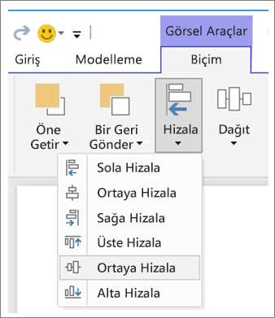

**Şekil 3: Power BI Desktop'taki görselleri hizalama**

Power BI çevrimiçi hizmetinde ve Power BI Desktop'ta tüm görsellere yönelik biçimlendirme bölmesindeki **Genel** sekmesinden görsellerin boyutunu ve konumunu tam olarak denetleyebilirsiniz:

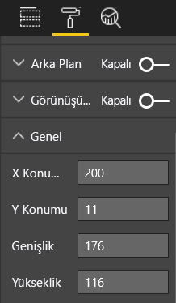

**Şekil 4: Görselinizin tam konumunu belirleme**

Örnek rapor sayfamızda (Şekil 2) 2 kartın ve geniş kenarlığın **X Konumu** 200 olarak ayarlanmıştır.

#### Alana sığdırma
Elinizdeki alanı en iyi şekilde kullanın.  Raporun nasıl görüntüleneceğini/gösterileceğini biliyorsanız tasarım aşamasında bunu aklınızda tutun. Tuvali doldurmak için boş alanı azaltın.  Görsellerin hiçbirinde kaydırma çubuğu görüntülenmemesi için elinizden geleni yapın.  Alanı doldururken görsellerin de sıkışmış gibi görünmesini önleyin.

##### Sayfa boyutunu ayarlama
Sayfa boyutunu küçülttüğünüzde öğeler sayfaya göre daha büyük hale gelir. Bunu yapmak için sayfadaki görsellerin seçimini kaldırın ve biçimlendirme bölgesindeki **Sayfa Boyutu** sekmesini kullanın.  

Burada önce 4:3, ardından da 16:9 boyutunu kullanan bir rapor sayfası gösterilmiştir. Sayfa düzeninin 16:9 boyutuna daha uygun olduğuna dikkat edin. İkinci görseldeki kaydırma çubuğunu kaldırmak için yeterli alan da mevcuttur.

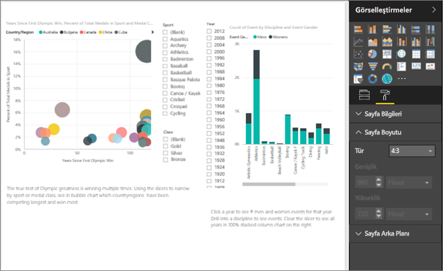

**Şekil 5a: Sayfa boyutu oranı 4:3 olan rapor**

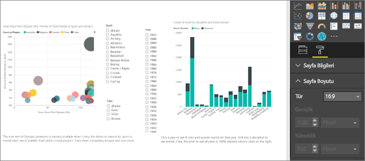

**Şekil 5b: Sayfa boyutu oranı 16:9 olan rapor**

Raporunuz 4:3 mü 16:9 mu yoksa başka bir oranda mı görüntülenecek? Küçük ekran mı yoksa büyük ekran mı kullanılacak? Yoksa mümkün olan tüm oranlar ve boyutlar kullanılsın mı?  Tasarım sırasında bu noktaya dikkat edin.

Örnek rapor sayfası biraz sıkışık görünüyor. Hiçbir görselin seçili olmadığından emin olduktan sonra boya rulosu simgesini seçerek biçimlendirme bölmesini açın. **Sayfa Boyutu** bölümünü genişletip **Yükseklik** değerini 900 yapın.

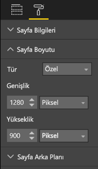

**Şekil 6: Sayfa yüksekliğini artırma**

#### Dağınıklığı azaltma
Sayfadaki öğelerin dağınık olması durumunda rapor ilk bakışta anlaşılamayacak ve kullanıcıların gözünü korkutarak ilgilerini dağıtabilecektir.  Gerekli olmayan tüm öğeleri rapordan kaldırın. Kavrama veya gezinti konusunda yardımcı olmayacak gereksiz öğeler eklemeyin. Bilgiyi mümkün olduğunda açık, hızlı ve anlaşılır bir şekilde sunmanız gerekir.

Edward Tufte, *The Visual Display of Quantitative Information* (Nicel Bilgilerin Gösterimi) kitabında bunu "veri/mürekkep oranı" olarak nitelemiştir.  Kısacası gerekli olmayan her şeyi kaldırın.

Dağınıklık yaratan öğeleri kaldırdığınızda rapor sayfanızda daha fazla boş alan kalacak ve yukarıdaki "Hizalama, sıralama ve yakınlık" bölümünde öğrendiğiniz en iyi yöntemleri uygulamak için daha fazla yeriniz olacaktır.

Gördüğünüz gibi örneğimiz şimdiden daha iyi görünüyor. Dağınıklık yaratan birçok öğeyi kaldırdık ve öğeleri bir arada gruplamak için şekiller ekledik.  Arka plan resmini kaldırdık, gereksiz ok şeklini ve metin kutusunu kaldırdık, görsellerin birini raporun farklı bir sayfasına taşıdık vs. Beyaz (sarı) alanı artırmak için sayfa boyutunu da artırdık.

**Şekil 7: Çirkin raporumuzun dağınıklığı giderildi**

### Hikayeyi tek seferde anlatın
Kilit nokta, önceden bilgi sahibi olmayan birinin, başka bir kişinin anlatmasına gerek kalmadan raporu hızla anlayıp anlamaması olacaktır. Okuyucuların tek bakışta sayfanın ne anlattığını ve her bir grafiğin/tablonun içeriğini hızla kavraması gerekir.   

Raporunuza bakan okuyucuların gözleri ilk olarak bakmalarını istediğiniz öğeye gitmeli, ardından sol-sağ-yukarı-aşağı yönünde ilerlemelidir.  Bu davranışı değiştirmek için metin kutusu etiketi, şekil, kenarlık, boyut ve renk gibi görsel ipuçları ekleyebilirsiniz.  

#### Metin kutuları
Bazen görselleştirme başlıkları yeterince bilgi vermeyebilir.  Raporlarınızı görüntüleyen kişilerle iletişim kurmak için metin kutusu ekleyebilirsiniz.  Metin kutuları; rapor sayfası, bir görsel grubu veya tek bir görsel hakkında bilgi verebilir. Bu kutular sonuçları anlatabilir; bir görselin, görseldeki bileşenlerin veya görseller arasındaki ilişkilerin daha iyi şekilde tanımlanmasını sağlayabilir. Metin kutuları, farklı ölçütlere göre dikkat çekme amacıyla kullanılabilir.

Power BI hizmetinde üst menü çubuğundaki **Metin Kutusu**'nu seçin. (Power BI Desktop uygulamasında şeridin **Ekle** bölümünden **Metin Kutusu**'nu seçin.)

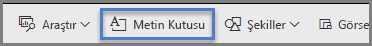

**Şekil 8: Metin kutusu ekleme**

Boş kutuya metin girin ve alttaki denetimleri kullanarak yazı tipini, boyutu, hizalamayı ve diğer ayarları yapılandırın. Kutuyu yeniden boyutlandırmak için tutamaçları kullanın.

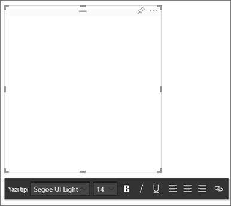

**Şekil 9: Metin kutusunu biçimlendirme**

Aşırıya kaçmayın! Raporda çok fazla metin olması, kullanıcının dikkatini dağıtarak kullanıcıyı görsellerden ayıracaktır. Rapor sayfanızı anlaşılır hale getirmek için çok fazla metin eklemeniz gerektiğini düşünüyorsanız baştan başlayın.  Hikayeyi tek başına anlatan farklı bir görsel seçme olanağınız var mı? Kendi başlığını değiştirerek görseli daha anlaşılır hale getirmeniz mümkün mü?   

#### Metin
Metin stil kılavuzu oluşturun ve raporunuzun tüm sayfalarında aynı stili kullanın. Birkaç farklı yazı tipi, metin boyutu ve renk seçin.  Bu stil kılavuzunu yalnızca metin öğelerine değil, görselleştirmeler içinde yaptığınız yazı tipi seçimlerine de (aşağıdaki Görselleştirmelerin parçası olan başlıklar ve etiketler bölümüne bakın) uygulayın. Kalın metin, italik, büyük boyutlu yazı tipi, renk ve diğer stilleri kullanmak için kurallar belirleyin.  Metinlerin tamamını büyük harfle yazmaktan veya hepsinin altını çizmekten kaçınmaya çalışın.

#### Şekiller
Şekiller de gezinti ve içeriği kavrama konusunda yardımcı olabilir. İlgili bilgileri bir araya toplamak ve önemli verileri vurgulamak için şekilleri, gözü yönlendirmek için de okları kullanın. Şekiller okuyuculara raporunuzun hangi kısmından başlamaları ve nasıl ilerlemeleri gerektiğini anlatır. Bu durum tasarım dünyasında *karşıtlık* olarak adlandırılır.

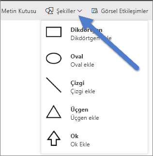

**Şekil 10a: Power BI hizmetindeki şekiller**

**Şekil 10b: Power BI Desktop'taki şekiller**

Örnek sayfamız şimdi nasıl görünüyor?  Şekil 11'de metin biçimlerinin, yazı tiplerinin ve renklerin tutarlı bir şekilde kullanıldığı daha derli toplu bir sayfa gösterilmektedir.  Sol üst köşedeki sayfa başlığı sayfanın içeriği hakkında bilgi vermektedir.

**Şekil 11: Metin kılavuzları uygulanmış ve başlık eklenmiş rapor örneği**

Örnekte okuyucuların ilk baktığı nokta olan sol üst köşeye rapor sayfası başlığı eklenmiştir. Başlığın sayfanın geri kalanından ayrılması için yazı tipi boyutu 28, yazı tipi ise Segoe Bold olarak belirlenmiştir.  Metin stil kılavuzumuzda arka plan, siyah kutucuk, açıklama ve etiket kullanılmaması gerektiği belirtilmiştir ve bu stil mümkün olan (Birleşik harita eksenleri ve etiketleri düzenlenemez) tüm sayfa görsellerine uygulanmıştır.  Ayrıca:

* Kartlar: **Kategori etiketi** Kapalı, **Başlık** Açık olarak belirlenmiş ve 12 punto, siyah, ortalanmış olarak ayarlanmıştır.
* Görsel başlıkları: Açık ise 12 punto ve sola hizalıdır.
* Dilimleyiciler: **Üst Bilgi** Kapalı, **Başlık** Açık durumdadır. **Öğeler** > **Metin** seçeneğini gri ve 10 punto olarak bırakın.
* Dağılım ve sütun grafikleri: X ve Y eksenleri ile kullanılıyorsa X ve Y ekseni başlıkları için siyah yazı tipi kullanılmıştır.

#### Renk
Rengi tutarlılık sağlama amacıyla kullanın.  Aşağıdaki Görsel tasarım ilkeleri bölümünde rengi daha ayrıntılı bir şekilde inceleyeceğiz. Burada okuyucularınızın raporunuzu hızla anlamasını engellememek için renk seçimini bilinçli olarak yapmanız gerektiği anlatılmaktadır.  Çok fazla parlak renk, hisleri kötü yönde etkileyebilir. Bu bölümde daha çok renklerin nasıl kullanılmaması gerektiği anlatılmaktadır.

#### Arka planlar
Rapor sayfalarının arka planını belirlerken raporu gölgede bırakmayan, sayfadaki diğer renklerle çakışmayan veya genelde gözleri zorlamayan renkler seçin. Bazı renklerin belirli anlamlara sahip olduğunu unutmayın.  Örneğin ABD'de rapor içindeki kırmızı renkler "kötü" olarak yorumlanır.

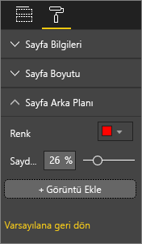

**Şekil 12: Rapor arka planını ayarlama**

Sanat eseri değil işlevsel bir rapor oluşturduğunuzu unutmayın. Rapor öğelerinin okunabilirliğini ve önceliğini geliştiren bir renk seçin.  

Web sayfalarında renk ve görselleştirme kullanımı hakkında yapılan bir çalışma, renkler arasındaki karşıtlığın yüksek olmasının kavramayı geliştirdiğini göstermiştir (The effect of text and background colour on visual search of Web pages (Web sayfalarının görsel taraması üzerinde metnin ve arka plan renginin etkisi) ve **Determining Users' Perception of Web Page Visual Complexity and Aesthetic Characteristics (Kullanıcıların web sayfalarının görsel karmaşıklık ve estetik özellikleri algısını belirleme))**.

Renklerle ilgili en iyi uygulamaların bazılarını aşağıdaki örnek raporumuza (Şekil 20 ve 21) uyguladık. En çok dikkat çeken nokta arka plan renginin siyah olarak değiştirilmiş olmasıdır.  Sarı renk çok parlak olduğundan göz alıyordu.  Ayrıca "Count of athlete name by year and class" grafiğindeki çubukların sarı bölümü, sarı renkli arka planda kayboluyordu.  Siyah (veya beyaz) arka plan en yüksek karşıtlığı sağlar ve görselleri odak noktası haline getirir.

Örnek raporu geliştirmek için gerçekleştirdiğimiz ek adımlar şunlardır:

**Sayfa başlığı**

Arka planı siyah olarak değiştirdiğimizde metin kutusu yalnızca siyah yazı biçimine izin verdiğinden başlık kayboldu.   Bu sorunu gidermek için metin kutusu başlığı ekledik.  Metin kutusu seçili durumdayken metni silin ve Görsel Öğeler sekmesinde **Başlık** seçeneğini Açık duruma getirin. Oku seçerek **Başlık** seçeneklerini genişletin, **Summer Olympic Games** ifadesini **Başlık Metni** alanına girin ve **Yazı tipi rengi** olarak beyazı seçin.

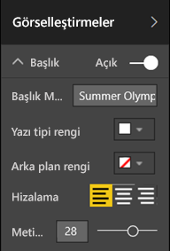

**Şekil 13: Sayfa başlığı ekleme**

**Kartlar**

Kart görselleri için biçimlendirme bölmesini açın (boya rulosu simgesi) ve **Arka plan** seçeneğini Açık olarak ayarlayın. %0 saydamlık değerine sahip beyaz rengi seçin. Ardından **Başlık** seçeneğini Açık duruma getirin, **Yazı tipi rengi** olarak beyazı, **Arka plan rengi olarak da** siyahı seçin.

**Dilimleyiciler**

Bu noktaya kadar iki dilimleyici farklı biçimlere sahipti ancak bunun herhangi bir dayanağı yoktu. İki dilimleyicinin de arka plan rengini açık deniz mavisi olarak değiştirin.  Sayfanın renk paletinde bulunduğu için açık deniz mavisi iyi bir seçenektir. Bunu kartogramda, ağaç haritasında ve sütun grafiğinde görebilirsiniz.

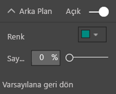

**Şekil 14: Dilimleyici arka plan rengini değiştirme**

Beyaz renkte ince bir kenarlık ekleyin.

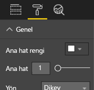

**Şekil 15: Dilimleyiciye kenarlık ekleme**

Gri yazı tipini açık deniz mavisi üzerinde görmek zordur, bu nedenle **Öğeler** rengini beyaz olarak değiştirin.

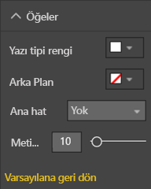

**Şekil 16: Dilimleyici yazı tipi rengini değiştirme**

Son olarak, **Başlık** bölümünde **Yazı tipi rengi** olarak beyazı, **Arka plan rengi** olarak da siyahı seçin.

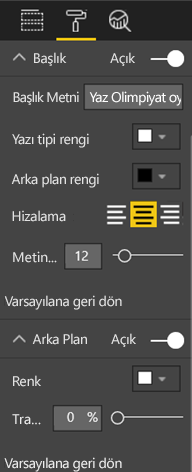

**Şekil 17: Dilimleyici başlığını biçimlendirme**

**Dikdörtgen şekli**

Dikdörtgen de siyah arka planda kayboldu.  Bu sorunu gidermek için şekli seçip **Şekli biçimlendir** bölmesinde **Arka plan** ayarını Açık duruma getirin.

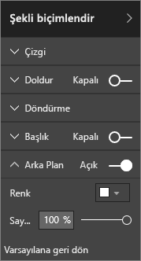

**Şekil 18: Şekli biçimlendirme**

**Sütun grafikleri, kabarcık grafikleri, kartogram ve ağaç haritası**

Rapor sayfasındaki diğer görsellere beyaz arka plan ekleyin. Biçimlendirme bölmesinde **Çizgi** seçeneğini genişletip **Çizgi Rengi** ayarını beyaz, **Ağırlık** ayarını da 3 olarak belirleyin.

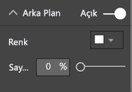

**Şekil 19: Diğer görselleştirmelere beyaz arka plan ekleme**

**Şekil 20: En iyi renk yöntemlerinin uygulanmış olduğu rapor örneği (siyah arka plan)**

**Şekil 21: En iyi renk yöntemlerinin uygulanmış olduğu rapor örneği (beyaz arka plan)**
 

### Estetik
Hizalama, renk, yazı tipi seçimi ve dağınıklık gibi estetik kategorisinde sınıflandırabileceğimiz konuların çoğuna yukarıda değindik.  Ancak rapor tasarımı konusunda ele alınması gereken birkaç en iyi yöntem daha vardır ve bunlar raporun genel görünümüyle ilgilidir.  

Raporunuzun amacının güzel olmak değil işletme ihtiyaçlarına hitap etmek olduğunu unutmayın.  Ancak, özellikle ilk izlenim söz konusu olduğunda göze güzel gelen noktalara yer verilmesi de önemlidir. Nashville danışmanlarından Tony Bodoh bu durumu "Duygular mantıktan yarım saniye önce harekete geçer." sözüyle ifade etmiştir.  Okuyucular raporunuzun ayrıntılarına inmeden önce duygusal düzeyde bir tepki verecektir. Sayfanız düzensiz, karmaşık ve amatör görünüyorsa okuyucunuz hikayesini keşfetmek istemeyebilir.

TDI blog yazarı ve TechTarget sektör analisti Wayne Eckerson bu konuda harika bir benzetme yapmıştır.  Rapor tasarlamak, bir odayı dekore etmeye benzer.  Farklı zamanlarda vazo, kanepe, sehpa ve tablo gibi parçalar satın alırsınız.  Bu eşyaların hepsini ayrı ayrı beğenirsiniz. Seçimlerin her biri kendi başına anlamlı olduğu halde bir araya geldiklerinde birbirleriyle çakışır veya dikkat çekme yarışına girer.

Şu konular üzerinde yoğunlaşın:

* Raporunuz için ortak bir tema veya görünüm oluşturup bunu tüm rapor sayfalarına uygulama
* Görüntüleri ve diğer grafikleri dikkat dağıtmak için değil, gerçek hikayeyi desteklemek için kullanma
* Makalenin bu bölümüne kadar bahsedilen en iyi yöntemlerin tümünü uygulama.

## Görsel tasarım ilkeleri
Rapor öğelerinin, raporun hızla anlaşılmasını sağlayacak şekilde düzenlenmesini kapsayan rapor tasarım ilkelerine göz attık.  Şimdi görsellerle ilgili tasarım ilkelerini inceleyeceğiz.  Bir sonraki bölümde de görsellerin ayrıntısına inerek sık kullanılan bazı görsel türleriyle ilgili en iyi yöntemleri anlatacağız.

Bu bölümde örnek rapor sayfamızı bir kenara bırakıp diğer örneklere göz atacağız.  Görsel tasarım ilkelerini incelemeyi tamamladıktan sonra örnek rapor sayfamıza dönerek öğrendiklerimizi uygulayacağız (adım adım yönergelerle).  

### Planlama: doğru görseli seçme
Bir raporu oluşturmaya başlamadan önce plan yapmanız ne kadar önemliyse her görsel için de plan yapmanız o kadar önemlidir.  Kendinize "Bu görselle nasıl bir hikaye anlatmak istiyorum?" sorusunu sorun. Ardından hikayeyi en iyi anlatacak görsel türünü belirleyin. Satış döngüsü ilerlemesini çubuk grafikle de gösterebilirsiniz ancak şelale veya huni grafiği daha iyi olmaz mı? Bu konuda yardım almak için bu incelemenin sonunda yer alan sık kullanılan türlerle ilgili en iyi yöntemlerin bulunduğu "Görsel türler ve en iyi yöntemler" bölümünü okuyun.  Seçtiğiniz ilk görsel türü en iyi seçenek çıkmazsa şaşırmayın.  Hikayeyi en iyi anlatanı belirlemek için birden fazla görsel türünü deneyin.

Kategorik ve nicelik verileri arasındaki farkı kavrayın ve her bir veri türüne en uygun görsel türlerini öğrenin. Nicel veriler genelde ölçü olarak adlandırılır ve çoğunlukla sayısal verilerdir. Kategorik veriler genelde boyut olarak adlandırılır ve sınıflandırılabilir. Bu durum aşağıdaki "Doğru ölçüyü seçme" bölümünde daha ayrıntılı olarak incelenmiştir.

Yalnızca raporunuzun daha etkileyici görünmesini sağlamak için süslü veya karmaşık görsel türlerini kullanma dürtüsüne kapılmayın. Amacınız hikayenizi en basit şekilde anlatmak olmalıdır. Yatay çubuk grafikler ve çizgi grafikler bilgileri hızla ifade edebilir.  Bunlar sık kullanılan öğeler olduğundan kullanıcılar tarafından kolayca yorumlanabilir.  Ayrıca çoğu kullanıcı soldan sağa ve yukarıdan aşağıya doğru okuduğu için bu iki grafik türündeki verileri taramak ve kavramak kolaydır.

Hikayeyi anlamak için görselinizin kaydırılması gerekiyor mu? Mümkünse kaydırmadan kaçının.  Filtre uygulamayı ve hiyerarşi/ayrıntıya gitme özelliklerini kullanmayı deneyin. Bunlar kaydırma çubuğunu kaldırmanızı sağlamazsa farklı bir görsel türü seçebilirsiniz. Kaydırmadan kaçınma şansınız yoksa yatay kaydırma, dikey kaydırmadan daha iyidir.

Hikayeniz için en iyi görseli seçmiş olsanız da destek almanız gerekebilir.  Etiketler, başlıklar, menüler, renkler ve boyutlar bu konuda size yardımcı olacaktır. Bu tasarım öğelerini aşağıdaki "Tasarım öğeleri" bölümünde inceleyeceğiz.

### Doğru ölçüyü seçme
Görselinizin anlattığı hikaye inandırıcı mı? Önemli mi?  Sırf yapmış olmak için görsel oluşturmayın. Belki verilerinizin ilgi çekici bir hikaye anlatacağını düşünmüştünüz ama durum öyle olmadı. Baştan başlamaktan ve daha çok ilgi çekecek bir hikaye bulmaktan korkmayın. Belki de hikaye vardır ancak farklı bir şekilde ölçülmesi gerekiyordur.

Diyelim ki satış müdürlerinizin başarısını ölçmek istiyorsunuz. Bunun için hangi ölçüyü kullanmanız gerekir?  Bunu en iyi şekilde ölçmek için toplam satış rakamlarına mı, toplam kâra mı, önceki yıldaki büyüme oranına mı yoksa belirli bir hedefi tutturma performansına mı bakmanız gerekir? Sally adlı satış sorumlusu en yüksek kâra sahip olabilir ve toplam kârı satış sorumlularına göre gösterdiğiniz bir çubuk grafikte diğer satış sorumlularına kıyasla bir yıldız gibi parlayabilir.  Ancak Sally'nin satış maliyeti (seyahat giderleri, gönderim masrafları, üretim maliyetleri vs.) yüksekse yalnızca satış rakamlarına bakmak en iyi hikayeyi sunmayacaktır.

#### Gerçeği yansıtın/gerçekleri çarpıtmayın
Gerçeği çarpıtan bir görsel oluşturmak mümkündür. Veri analizi meraklılarının "kötü" görselleri paylaştığı bir web sitesi vardır. Yorumlarda da genelde ilgili görseli oluşturup dağıtan şirketin yarattığı hayal kırıklığı ifade edilmektedir.  Bu yorumlar ilgili şirketin güvenilir olmadığını belirtmektedir.

Bu nedenle, gerçeği kasıtlı olarak çarpıtmayan ve anlatmak istediğiniz hikayeyi ifade etmek için manipüle edilmemiş görseller oluşturun.  Şu örneği inceleyebilirsiniz:

**Şekil 22: Çarpıtılmış gerçeklik grafiği**

Bu örnekte 4 şirket arasında çok büyük bir fark varmış ve CorpB şirketi diğer 3 şirketten daha başarılıymış gibi görünüyor.  Ancak X ekseninin sıfırdan başlamadığına ve şirketler arasındaki farkın muhtemelen hata marjı içinde olduğuna dikkat edin.  Aynı veriler sıfırdan başlayan bir X eksenine yerleştirildiğinde aşağıdaki gibi görünür.

**Şekil 23: Gerçekçi grafik**

Okuyucular genelde X ekseninin sıfırdan başladığını kabul eder. Ekseni sıfırdan başlatmamaya karar verirseniz bunu sonuçları çarpıtmayacak şekilde yapın ve normların dışındaki kullanımı belirtmek için görsel ipucu veya metin kutusu ekleyin.  

### Tasarım öğeleri
Tür ve ölçü seçip görseli oluşturduktan sonra en yüksek verimlilik için ince ayar yapmaya başlayabilirsiniz.  Bu bölüm şunları kapsamaktadır:

* Düzen, boşluk ve boyut
* Metin öğeleri: etiketler, açıklamalar, menüler, başlıklar
* Sıralama
* Görsel etkileşim
* Renk

#### En iyi alan kullanımı için görselleri ayarlama
Birden fazla grafiği bir rapora sığdırmaya çalışıyorsanız veri-mürekkep oranınızı artırmak, verilerinizdeki hikayeyi daha iyi anlatmanıza yardımcı olacaktır. Yukarıda da bahsettiğimiz üzere Edward Tufte'ın öne sürdüğü "veri-mürekkep" oranı, okuyucunun verileri yorumlama olanağını azaltmadan grafikten mümkün olduğunca çok işareti kaldırmaktır.

Aşağıdaki ilk grafik kümesinde gereksiz eksen etiketleri (Jan 2014, Apr 2014 vs.) ve başlıklar ("by Date") vardır. Her grafiğin başlığı da grafiğin üzerindeki ayrılmış yatay alanı kullanmaktadır. Grafik başlıklarını kaldırıp ayrı eksen etiketlerini açarak mürekkeplerin bir kısmını kaldırmış ve alanı daha iyi kullanmış olduk. Daha fazla mürekkep azaltmak ve daha fazla veri alanı açmak için üstteki iki grafiğin eksen etiketlerini kaldırabiliriz.

Vurgulamak istediğiniz belirli dönemler varsa grafiklerin arkasından çizgiler veya dikdörtgenler çizerek okuyucunun gözünü yukarı ve aşağı yönlendirebilir, daha rahat karşılaştırma yapmasını sağlayabilirsiniz.

**Şekil 24: Önce**

**Şekil 25: Sonra**

**Eksen başlıklarını açmak ve kapatmak için**

Görseli seçerek etkin hale getirdikten sonra Biçimlendirme bölmesini açın. **X Ekseni** veya **Y Ekseni** seçeneklerini genişletip **Başlık** kaydırıcısını açık veya kapalı konuma getirin.

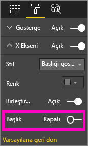

**Şekil 26: Eksen başlıklarını açma ve kapatma**

**Eksen etiketlerini açmak ve kapatmak için**

Görseli seçerek etkin hale getirdikten sonra Biçimlendirme bölmesini açın. **X Ekseni** ve **Y Ekseni** alanlarının yanında kaydırıcılar vardır.  Etiketleri açmak veya kapatmak için kaydırıcıyı sürükleyin.

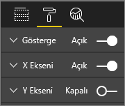

**Şekil 27: Eksen etiketlerini açma ve kapatma**

> [!TIP]
> Y ekseni etiketlerini kapatacağınız senaryolardan biri, **Veri etiketleri** özelliğinin açık olmasıdır.
> 
> 

**Görsel başlıklarını kaldırmak için**

Görseli seçerek etkin hale getirdikten sonra Biçimlendirme bölmesini açın. **Başlık** kaydırıcısını Kapalı konuma getirin.

**Şekil 28: Görsel başlıklarını kaldırma**

Okuyucularınızın raporu nasıl görüntüleyeceğini aklınızda bulundurarak görsellerin ve metnin okunabilecek büyüklükte ve renkte olduğundan emin olun. Sayfadaki görsellerden biri diğerlerine göre daha büyükse okuyucular bunun en önemli görsel olduğunu düşünebilir. Raporunuzun dağınık ve karışık görünmemesi için görseller arasında yeterli boşluk bırakın.  Okuyucularınızın gözlerini yönlendirmeye yardımcı olması için görsellerinizi hizalayın.

**Görsellerin boyutunu değiştirmek için**

Görseli seçip etkin duruma getirin. Boyutunu ayarlamak için tutamaçlardan birini tutup sürükleyin.

**Şekil 29: Görseli yeniden boyutlandırma**

**Görselleri taşımak için**

Görseli seçip etkin duruma getirin. Görselin üst orta kısmındaki kavrama çubuğunu seçip tutarak görseli yeni konumuna taşıyın.

**Şekil 30: Bir görseli taşıma**

#### Görselleştirmelerin parçası olan başlıklar ve etiketler
Başlıkların ve etiketlerin okunaklı ve anlamlı olduğundan emin olun. Başlıklardaki ve etiketlerdeki metinlerin ayırt edici renklerde ve en uygun boyutta olması gerekir (varsayılan gri yerine siyah gibi). Stil kılavuzunu hatırlıyor musunuz (yukarıdaki "Metin" bölümüne bakın)? Renk sayısını ve boyutları sınırlandırın. Çok farklı yazı tipi boyutu ve rengi kullandığınızda sayfanız karışık görünür.  Rapor sayfasındaki tüm görsellerin başlığında aynı yazı tipi rengini ve boyutunu; rapor sayfasındaki tüm başlıklar için de aynı hizalama şeklini kullanın.  

**Biçimlendirme bölmesi**

Aşağıdaki biçimlendirme ayarlarının her biri için boya rulosu simgesini seçerek Biçimlendirme bölmesini açın.

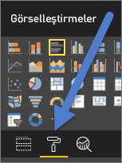

**Şekil 31: Biçimlendirme bölmesini açma**

Ardından, ayarlanacak görsel öğeyi seçin ve Açık ayarının seçildiğinden emin olun. Görsel öğe örnekleri: **X Ekseni**, **Y Ekseni**, **Başlık**, **Veri etiketleri** ve **Açıklama**. Aşağıdaki örnekte **Başlık** öğesi gösterilmektedir.

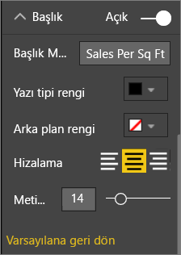

**Şekil 32: Bir görsel başlığını biçimlendirme**

**Metin boyutunu ayarlama**

Başlıkların ve veri etiketlerinin metin boyutu ayarlanabilir ancak bu ayar X veya Y ekseni ve açıklamalar için yapılamaz.  Veri etiketleri için **Birimleri görüntüle** ve **Ondalık Basamaklar** ayarlarıyla oynayarak raporunuzda görüntülenen ayrıntılar için en uygun boyutu belirleyebilirsiniz.   

**Metin hizalamayı ayarlama**

Metin hizalama için sol, sağ ve orta seçeneklerini kullanabilirsiniz.  Bu seçeneklerden birini belirleyip sayfadaki tüm görsellerde aynı ayarı kullanın.  

**Metin konumunu ayarlama**

Bazı Y eksenleri ve açıklama için metin konumu ayarlanabilir.   Hangi seçimi yaparsanız sayfadaki diğer Y eksenleri ve açıklamalarda da aynı ayarı kullanın.

**Başlık ve etiket uzunluğunu ayarlama**

Başlıkların, eksen başlıklarının, veri etiketlerinin ve açıklamaların uzunluğunu ayarlayın. Bu öğelerden herhangi birini görüntülemeye karar verirseniz uzunluk ayarını yaparak (metin boyutuyla birlikte) bilgilerin tamamının görüntülendiğinden emin olabilirsiniz. **Başlık** ve **Açıklama** alanları için **Başlık Metni** ayarı geçerlidir ve görselde görünecek gerçek başlığı buraya girmeniz gerekir. **X Ekseni** ve **Y Ekseni** için **Stil** ayarı geçerlidir ve açılan listeden seçim yapabilirsiniz. **Veri etiketleri** için **Görüntüleme** ve **Ondalık** ayarı kullanılır. **Görüntüleme** açılır menüsünü kullanarak ölçü birimlerini seçebilirsiniz: milyon, bin, yok, otomatik vs. Power BI'da görüntülenecek ondalık basamak sayısını belirlemek için **Ondalık** alanını kullanabilirsiniz.

**Metin rengini ayarlama**

Başlıkların, eksenlerin ve veri etiketlerinin metin rengi ayarlanabilir.  

#### Görselleştirmelerin parçası olmayan başlıklar ve etiketler
Bu yazının önceki bölümlerinde rapor sayfalarına metin kutusu ekleme konusunu ele almıştık. Bazen görselleştirme başlıkları yeterince bilgi vermeyebilir.  Raporlarınızı okuyan kişilere ek bilgi vermek için metin kutusu ekleyebilirsiniz.  
Rapor sayfanızın çok karmaşık veya çok dolu görünmemesi için metin kutularındaki yazı tiplerinin, boyutlarının, renklerin ve hizalamanın tutarlı olmasını sağlayın. Bir metin kutusundaki metne ayar yapmak için metin kutusunu seçerek biçimlendirme menüsünü açın.

**Şekil 33: Metin kutusunda kullanılan yazı tipini biçimlendirme**

#### Sıralama
Daha hızlı öngörü sağlama yöntemlerinden biri, görsellerin sıralamasını ayarlamaktır. Örneğin çubuk grafikleri, çubuklardaki değerlere göre azalan veya artan sırada düzenlemeniz, önemli artış bilgilerini daha fazla alan kullanmaya gerek kalmadan hızla göstermenizi sağlar.

Bir grafiği sıralamak için sağ üst köşesindeki üç nokta (…) simgesini ve ardından **Sırala**'yı seçip sıralama yapmak istediğiniz alanı ve sıralama yönünü belirleyin. Daha fazla bilgi için bkz. [Change how a visual is sorted (Görsellerin sıralama şeklini değiştirme)](power-bi-report-change-sort.md).

#### Grafikler arası etkileşim
Power BI'ın en önemli özelliklerinden biri, grafiklerin birbirleriyle etkileşim kurma şeklini değiştirmenin mümkün olmasıdır.  Grafikler varsayılan olarak çapraz şekilde vurgulanmıştır. Bir veri noktasını seçtiğinizde diğer grafiklerdeki ilgili veriler vurgulanır ve ilgili olmayan veriler soluk hale gelir. Bu davranışı geçersiz kılmak için herhangi bir grafiği gerçek filtre olarak kullanabilir, sayfa alanından tasarruf sağlayabilirsiniz. Bunu yapmak için menü çubuğundaki **Görsel Etkileşimler**'i seçin.

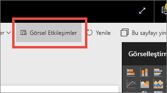

**Şekil 34: Görsel etkileşimler**

Ardından, sayfadaki görsellerin her biri için seçilen görseli filtreleme, vurgulama veya herhangi bir işlem yapmama ayarını yapabilirsiniz. Vurgulama seçeneği tüm görseller için kullanılamaz ve mümkün olmadığında vurgulama denetimi mevcut olmayacaktır. Daha fazla bilgi için bkz. [Visual interactions in Power BI (Power BI'da görsel etkileşimler)](service-reports-visual-interactions.md).

> [!TIP]
> Power BI'ı kullanmaya yeni başlamış olan okuyucular, tıklayarak etkileşim kurma özelliğini ilk bakışta kavrayamayabilir. Okuyucuların tıklayarak daha fazla öngörüye ulaşabileceği noktaları belirtmek için metin kutuları kullanın.
> 
> 

#### Görsellerde renk kullanımı
Bu yazının önceki bölümlerinde, raporda renk kullanmak için plan yapmanın önemini vurgulamıştık. Bu bölümde tekrarlanan noktalar mevcuttur ancak öncelikle görsellerdeki renk kullanımı ele alınacaktır. Burada da aynı ilkeler geçerlidir. Renkleri, raporu bir araya getirmek, önemli verileri vurgulamak ve okuyucunun görseli daha iyi kavramasını sağlamak için kullanın. Çok sayıda farklı rengin kullanılması okuyucunun dikkatini dağıtarak odaklanmasını zorlaştırabilir. Raporun iyi anlaşılması güzel görünmesinden daha önemlidir. Yalnızca içeriğin daha iyi kavranması amacıyla renk ekleyin.

> [!TIP]
> Hedef kitlenizi tanıyın ve belirli renk kurallarını öğrenin.  Örneğin ABD'de yeşil genellikle "iyi", kırmızı ise genellikle "iyi değil" anlamına gelir.
> 
> 

Bu konu başlığı aşağıdaki noktaları kapsayacak şekilde düzenlenmiştir:

1. Veri rengi
2. Veri etiketi rengi
3. Kategorik değerlere uygun renkler
4. Sayısal değerlere uygun renkler

**Renkleri ilgi çekici verileri vurgulama amacıyla kullanma**

Renk kullanmanın en kolay yolu, dikkat çekmek istediğiniz bir veya daha fazla veri noktasının rengini değiştirmektir. Bu örnekte, Olimpiyat oyunlarının 4 yılda bir yerine Kış ve Yaz oyunları şeklinde 2 yılda bir düzenlenmeye başladığı noktada renk değişmektedir.

**Şekil 35: Renkleri hikaye anlatma amacıyla kullanma**

Veri noktası renklerini, biçimlendirme bölmesinin **Veri renkleri** sekmesinden değiştirebilirsiniz. Veri noktalarını birbirinden bağımsız olarak özelleştirmek için **Tümünü göster** ayarının Açık olduğundan emin olun.

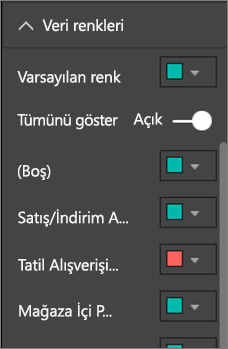

**Şekil 36: Veri noktası renklerini ayarlama**

> [!NOTE]
> Power BI, rapor görsellerinize varsayılan temayı uygular.  Tema renkleri farklılık ve karşıtlık oluşturacak şekilde seçilmiştir. Varsayılan tema paletinden farklı bir renk kullanmak için **Özel renk** seçeneğini belirleyin.
> 
> 

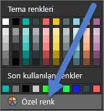

**Şekil 37: Özel renk seçme**

Power BI Desktop'ta ikinci bir seri kullanarak bir çizginin aykırı değerlerini veya belirli bir bölümünü de vurgulayabilirsiniz:

**Şekil 38: Desktop uygulamasında aykırı değerleri çizme**

Burada "Aykırı değerler" serisindeki değerler yalnızca Ağustos ayındaki ortalama sıcaklık 60 derecenin altına indiğinde mevcuttur. Bu sonucu elde etmek için şu formülü kullanan bir DAX hesaplanmış sütunu oluşturulmuştur:

Outliers = if(Editions[Temp]<60, Editions[Temp], BLANK())

Bu örnekte 3 aykırı değer vardır: 1952, 1956 ve 2000.

**Etiket ve başlık renkleri**

Kullanabileceğiniz tüm biçimlendirme seçeneklerini incelediğinizde başlıklara ve açıklamalara renk ekleyebileceğiniz birçok farklı yer olduğunu göreceksiniz. Örneğin veri etiketlerinin ve eksen başlıklarının rengini değiştirebilirsiniz. Dikkatli olun.  Genelde tüm görsel başlıklarında aynı rengin kullanılması tercih edilir.  Bu yazıdaki tüm kılavuzlarda olduğu gibi "oyunun kuralını bozmak" isteyebileceğiniz durumlar ve nedenler vardır ancak kuralları bozacaksanız geçerli bir nedeniniz olduğundan emin olun.

**Kategorik değerlere uygun renkler**

Bir seri içeren grafiklerin açıklama bölümünde genelde kategorik değerler vardır. Örneğin, aşağıdaki açıklamada bulunan her renk, farklı bir Country/Region kategorisini göstermektedir.

**Şekil 39: Varsayılan renkler uygulandı**

Power BI'ın varsayılan olarak kullandığı renkler, farklı kategorik verilerde farklı renkler kullanılmasıyla daha iyi ayrım yapılmasını sağlar. Bazen kullanıcılar bu renkleri kurumsal renk düzenlerine uyacak şekilde değiştirebilir ancak bunun neden olabileceği bazı sorunlar vardır.

**Şekil 40: Tek bir rengin tonları olarak uygulanmış renk**

Tek bir tonun kullanılıp renkler arasındaki yoğunluğun değiştirildiği bu görsel, kategoriler arasında hatalı bir sıralama yapılmasına neden olmuştur. Koyu renkli kabarcıkların açık renkli kabarcıklardan daha yüksek veya daha düşük değere sahip olduğunu ima etmektedir. Bu kategorik değer sıralamasında alfabetik sıra haricinde geçerli bir sıralama mevcut değildir.
Varsayılan renkleri değiştirmek için Biçimlendirme bölmesini açın ve **Veri renkleri**'ni seçin.

**Sayısal değerlere uygun renkler**

Belirli bir sıralamaya veya sayısal değere sahip olan alanlarda veri noktalarının rengini değere göre belirleyebilirsiniz. Bu durum değerlerin verideki dağılımını göstermenin yanı sıra tek grafikte iki değişkeni göstermeyi de sağlar. Örneğin bu grafikte en fazla madalya kazanın Çin olduğu net bir şekilde görünürken Japonya ve Tayland'ın daha fazla sayıda Olimpiyat oyununa katılmış olduğu söylenebilir.

**Şekil 41: Veri noktalarını değere göre renklendirme**

Bu grafiği oluşturmak için Renk doygunluğu alanına bir değer ekleyip Biçimlendirme bölmesinde bu renkleri ayarlayın.

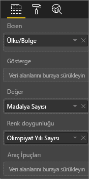

**Şekil 42: Renk doygunluğu alanı ekleme**

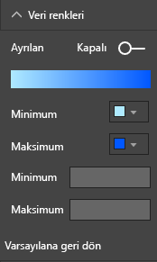

**Şekil 43: Doygunluk için kullanılan renkleri ayarlama**

Renkler, merkezdeki değerin etrafındaki sapmayı vurgulamak için de kullanılabilir. Örneğin pozitif değerleri yeşil, negatif değerleri ise kırmızı renkle gösterebilirsiniz. Pozitif ve negatif değerlere renk atarken kültürel farklılıklara dikkat edin. Her kültürde kırmızı kötü, yeşil de iyi için kullanılmaz!

**Şekil 44: Merkezdeki değerin etrafındaki sapmayı vurgulama amacıyla renk kullanımı**
 

### Görsel tasarım ilkeleri: örnek rapor sayfasına uygulama
Şimdi yukarıda değindiğimiz görsel ilkeleri örnek raporumuza uygulayalım.

Önce

**Şekil 45: Örnek raporumuz (önce)**

Sonra

**Şekil 46: Örnek raporumuz (sonra)**

#### Hangi işlemleri yaptık?
1. Dilimleyici: Sayfa düzeyinde filtre ekleyip yalnızca altın, gümüş ve bronzu seçerek dilimleyicilerdeki boşlukları kaldırdık. **Seçim Denetimleri** ayarını **Tek Seçim** ve **Tümünü Seç** için Kapalı hale getirdik.
2. Kabarcık: Açıklamada çok fazla öğe olduğu için ekranın kaydırılması gerekiyordu.  Açıklamayı kaldırarak **Kategori etiketlerini** etkinleştirdik. Müşteriler ayrıntıları görmek için kabarcıkların üzerine gelebilir. Başlığı kısalttık ve yeterince anlaşılabilir olduğu için "by countryregion" bölümünü kaldırdık. Grafiği daha kolay anlaşılır hale getirmek için iki eksenin de etiketlerini Açık duruma getirdik.
3. Kartogram: Verileri öne çıkarmak için **Veri renklerini** değiştirdik. **Ayrılan** ayarını açıp **Minimum**'u pembe, **Maksimum**'u ise kırmızı olarak ayarladık.
4. Ağaç haritası: Yalnızca ABD için ayarlanmış olan filtreyi kaldırdık. **Veri etiketleri** ayarını 1 ondalık basamak kullanılacak şekilde belirledik. Görsel neredeyse her zaman %33 (Altın/Gümüş/Bronz) değerini verdiğinden çok kullanışlı olmayan Sınıf alanını kullanıyordu.  Farklı ve daha ilgi çekici bir alan olan cinsiyet alanını seçtik. Tasarım amacıyla Aquatics rengini mavi, Athletics rengini ise gri olarak değiştirdik.
5. Üst çubuk grafik: Başlığı kısalttık, veri etiketlerini kaldırdık, açıklama başlığını kapattık. Başlığın kelime sırasını, altındaki grafiğe uyacak şekilde değiştirdik.
6. Alt çubuk grafik: Yukarıdaki grafiğe uyması için yıla göre artan düzende sıraladık. Renkleri sınıfla eşleşecek şekilde değiştirdik. Başlığı değiştirdik. Verilere daha fazla alan açmak için açıklamayı kapattık. Raporda görünmeyecek (görsel etiketlerin okunamayacağı kadar küçük olduğundan) ancak görsel Odak modunda açıldığında gösterilecek veri etiketlerini etkinleştirdik. [Odak modu hakkında bilgi edinin](service-focus-mode.md). **Araç ipuçlarına** Olay Sayısı (Ayrı) ekledik, bu sayede yığılmış sütunların üzerine geldiğinizde araç ipuçlarında ilgili yılda düzenlenen olay sayısı da görüntülenecek.
7. Görsel Etkileşimler: Sürekli toplam oyun ve spor sayısını göstermelerini istediğimiz için iki kartın da etkileşimlerini devre dışı bıraktık.

## Görsel türleri ve en iyi uygulamalar
Power BI içinde birçok görsel türü mevcuttur.  Bunlara Microsoft ve Power BI topluluğundan edinebileceğiniz özel görselleri de eklediğinizde toplam görsel seçeneği sayısı burada yer veremeyeceğimiz kadar çoğalmış olur. Burada en çok kullanılan yerel görsel türlerinin bazılarını ele alacağız.  

### Çizgi grafikler

Çizgi grafikler, zaman içinde değişen verileri incelemenin ideal yollarından biridir.  Verilere tabloda baktığınızda gözlerinizin çıkışlara, inişlere, döngülere ve modellere verdiği hızlı tepkilerden faydalanamamış olursunuz.  
Aşağıdaki örnekte verilen madalya sayısındaki ve bu madalyaları kazanan atlet sayısındaki eğilimler gösterilmiştir.  

**Şekil 47: Çizgi grafikler**

#### En iyi yöntemler
* Çizgi grafiklere bakan kullanıcıların ilk gördüğü şey, eğrinin şeklidir.  Bu da zaman veya dağıtım kategorileri gibi eğriyi mantıklı hale getiren bir X ekseniniz olması gerektiği anlamına gelir.  X eksenine ürün veya coğrafya gibi kategorik alanları yerleştirdiğinizde eğrinin şekli anlamlı bilgiler vermeyeceği için çizgi grafik ilgi çekici olmayacaktır.
* Bunun gibi alt alta birden fazla grafik eklemek isterseniz seriler arasında daha kolay karşılaştırma yapılabilmesi için X eksenlerini hizalayın. Aynı değer aralığının gösterildiğinden emin olmak için filtre kullanın.  Örneğin, tarih aralıklarına bakıyorsanız aynı olduklarından emin olun.  Örnek olarak iki grafikte de 1896 ile 2012 arasını kullanabilirsiniz.
* Alanın tamamını kullanın.  Verileriniz açısından anlamlı oluyorsa Y ekseninin başlangıç ve bitiş noktalarını grafiğinizin altındaki ve üstündeki boş alanı yok edecek ve gerçek veri noktalarına odaklanacak şekilde ayarlayın. Bunu yapmak için boya rulosu simgesini seçerek Biçimlendirme bölmesini açın. **Y Ekseni** alanını genişletip **Başlat** ve **Son** noktalarını belirleyin.
  
  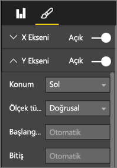
  
  **Şekil 48: Başlangıç ve bitiş noktalarını belirleme**
* Başlat ve Son noktalarını açıkça belirtmenin bir başka nedeni de aynı sayfadaki aynı Y ekseni alanını kullanan iki veya daha fazla grafiği karşılaştırabilmenizdir.  Örneğin, toplam olay sayılarına bakıyorsanız ve Birleşik Krallık rakamları 1 ile 70 arasındayken Avustralya rakamları 1-12 arasındaysa 2 çizgi grafikte çok farklı Y eksenleri (Şekil x) görüntülenecektir. Bu da ilk bakışta karşılaştırma yapmayı zorlaştırır. Bunun yerine grafikleri aynı Y ekseni aralığını (Şekil x) kullanacak şekilde ayarlayın.
  
  
  
  **Şekil 49: Farklı Y eksenlerine sahip çizgi grafikler**
  
  
  
  **Şekil 50: Eşleşen Y eksenlerine sahip çizgi grafikler**

Daha fazla bilgi için bkz.

* [X ve Y eksenlerini özelleştirme](power-bi-visualization-customize-x-axis-and-y-axis.md)
* [Line charts and irregular intervals (Çizgi grafikler ve düzensiz aralıklar)](http://www.perceptualedge.com/articles/visual_business_intelligence/line_graphs_and_irregular_intervals.pdf)
* [Line charts 101 (Çizgi grafikler 101)](http://www.columnfivemedia.com/data-visualization-101-line-charts)

### Çubuk/Sütun Grafikler

Çizgi grafiklerin verilerin zaman içindeki değişimini gösterme alanında standart olması gibi çubuk grafikler de belirli bir değerin farklı kategorilerdeki durumlarını gösterme alanında standarttır.  Çubukları sayıya göre sıralarsanız en yüksek değerleri ve dağılımı kolayca görebilirsiniz.  Yatay çubuk grafikler uzun etiketlerde daha iyi sonuçlar verir.  

**Şekil 51: Yatay çubuk grafik**

#### En iyi yöntemler
* Değerlerin veri etiketlerini görüntüleyin.  Bu sayede belirli değerleri daha kolay tanımlayabilirsiniz. Bunu yapmak için Biçimlendirme bölmesini açın ve **Veri etiketleri** özelliğini Açık olarak ayarlayın.
  
  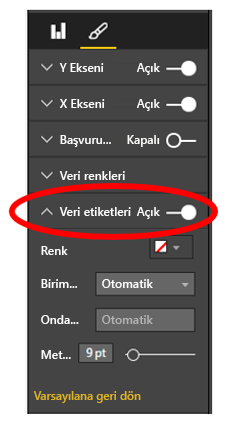
  
  **Şekil 52: Veri etiketlerini etkinleştirme**
* Yukarıdaki çubuk grafik, bir ölçümü diğerleriyle **zaman içindeki tek bir noktada** karşılaştırmak için idealdir.  Yukarıdaki çizgi grafiğin zaman içindeki eğilimi gösterdiği gibi çubuk grafik de tek bir kategori için belirli bir zamandaki eğilimi gösterir.  Çubuk grafiğe baktığımızda İspanya'nın %25 ile dünyadaki en kötü işsizlik oranına sahip olduğunu görebiliriz.
* Bir Çubuk/Sütun grafiğin ayrılan alana sığmaması durumunda Power BI, kaydırma çubukları ekler. Mümkün olduğunda ve mantıklıysa okuyucunun dağılımın tamamını görebilmesi için görselin ve raporun yapısını, grafiğin tamamını gösterecek şekilde ayarlayın.  Maalesef dünya üzerindeki ülkelerin sayısı göz önüne alındığında bu işlemi örneğimizde yapmamız mümkün değildir.
  
  Dahil edilen değerleri sınırlamanın yöntemlerinden biri filtre kullanmaktır. Örneğin, yalnızca işsizlik oranının %20'nin üzerinde olduğu ülkeleri gösteren bir Görsel düzeyi filtresi ekleyebilirsiniz.
* Çubuk/Sütun grafikler detaylandırılabilir (ve ayrıntı azaltılabilir).  Bu, daha fazla alan kaplamadan bir görsele daha fazla bilgi eklemenin en iyi yöntemlerinden biridir.  Aşağıdaki örnekte Regions > Countries hiyerarşisi mevcuttur.  Bölge çubuğuna çift tıkladığınızda o bölgeyi oluşturan ülkeler açılır.  Detaya gitme hakkında daha fazla bilgi için bkz. [Görselleştirmede detaya gitme](power-bi-visualization-drill-down.md).
  
  
  
  **Şekil 53: Detaya gitme**

Çubuk ve Sütun grafikler hakkında daha fazla bilgi için:

* [Bar charts 101 (Çubuk grafikler 101)](http://blog.newscred.com/article/data-visualization-101-bar-charts/3c53044d4add7c31e79a3f80128771f4?page=thankyou)
* [Data Visualization Catalogue: Bar Chart (Veri Görselleştirme Kataloğu: Çubuk Grafik)](http://www.datavizcatalogue.com/methods/bar_chart.html#.VYV-hY3bLJw)
* [Data Visualization Catalogue: Multi-set Bar Chart (Veri Görselleştirme Kataloğu: Çok Kümeli Çubuk Grafik)](http://www.datavizcatalogue.com/methods/multiset_barchart.html#.VYV_gI3bLJw)

### Yığılmış Çubuk/Sütun Grafikler

Çubukta veya sütunda farklı kategorileri yığarak çubuk/sütun grafiklerinize yeni bir boyut ekleyin.  Artık grafik bir eğilim hakkında bilgi vermesinin yanı sıra (yüksekliğe/uzunluğa göre) kategorilerin ilgili eğilim üzerindeki etkilerini de göstermektedir. Aşağıdaki tabloda 2014 yılında geliri 6 milyonun üzerinde olan En iyi futbol takımlarının genel büyümesi gösterilmektedir.

**Şekil 54: Yığılmış sütun grafik**

Bu yığılmış sütun grafik, toplam gelirin zaman içinde arttığını ve Commercial ile Broadcasting kategorilerinin zaman içinde kararlı bir şekilde yükselerek toplam gelir artışı üzerinde pay sahibi olduğunu göstermektedir.  Ancak, bu grafik 3 kategorinin birbiri üzerindeki etkisini karşılaştırmayı zorlaştırmaktadır. Örneğin, Broadcasting veya Match Day ile karşılaştırıldığında Commercial kategorisinin büyümesi ne ölçüdedir?  Bu veriler için daha iyi bir seçenek veya bu verilere eklenebilecek görsel, bir çizgi grafik olacaktır.  

**Şekil 55: Çizgi grafiğe dönüştürme**

Bu çizgi grafikte ticari gelirin en çok arttığını, yayının ve maç gününün de arkasından geldiğini görebilirsiniz.

#### En iyi yöntemler
* Sütunlarda/çubuklarda olduğu gibi yatay veya dikey görüntülemeyi tercih edebilirsiniz.   Uzun etiketleriniz varsa yatay, zaman serisi verileriniz varsa dikey daha iyi bir seçenek olacaktır.  
* Zaman içindeki eğilimleri veya diğer değişiklik modelleri göstermek istiyorsanız yığılmış Çubuk/Sütun grafikleri kullanmayın.  Çizgi grafikler gibi seçenekler işinize daha çok yarayacaktır.
* Dağılımın toplam hacme göre veya toplamın % değeri olarak dağıtılmasını da sağlayabilirsiniz.  
* Few'ın da söylediği gibi *yığılmış çubuk grafiğin parçalarını karşılaştırmak zordur. Parçalar yan yana olsaydı ve tümü aynı taban çizgisinden büyümeye başlasaydı yükseklikleri kolayca karşılaştırılabilirdi ancak birbirinin üzerine yerleştirildiğinde bu iş daha zor hale geliyor. Ayrıca değerin (gelir) aydan aya değiştiğini görmek son derece kolay olsa da değerin (gelir) diğer yerlerde (kategoriler) nasıl değiştiğini görmek oldukça zordur*.  
* Toplamı 100 yapan yüzde değerlerini kullanırken %100 yığılmış grafiklerden faydalanabilirsiniz.  Aşağıdaki örnekte kategorilerin takıma göre ayrılmış halini görüyoruz.  Yüzdeler görecelidir ve tek bakışta desenleri görmemizi sağlar. Örneğin Everton'ın geliri öncelikli olarak Broadcasting (%70'in üzerinde) kaynağından gelirken PSG, gelirinin yalnızca %20'sini Broadcasting kaynağından elde etmektedir.  Yatay görüntüleme seçeneği, takım etiketlerinin sığmasını ve gelir türü etkisini görmeyi kolaylaştırır.
  
  
  
  **Şekil 56: Yatay yığılmış grafik**

Yığılmış grafikler hakkında daha fazla bilgi için:

* [Data Visualization Catalogue: Stacked bar graphs (Veri Görselleştirme Kataloğu: Yığılmış çubuk grafikler)](http://www.datavizcatalogue.com/methods/stacked_bar_graph.html#top)
* [When are 100% stacked bar graphs useful? (%100 yığılmış çubuk grafikler nerelerde kullanılmalıdır?)](http://www.perceptualedge.com/blog/?p=2239)

### Birleşik Çubuk/Sütun Grafikler

Power BI'da sütun ve çizgi grafikleri birleştirerek birleşik haritalar oluşturabilirsiniz. Seçenekler şunlardır: Çizgi ve Yığılmış Sütun grafik ile Çizgi ve Kümelenmiş Sütun grafik. İki ayrı görseli birleştirerek değerli tuval alanından tasarruf sağlayabilirsiniz.

Aşağıdaki iki ekran görüntüsünde öncesi ve sonrası gösterilmektedir.  İlk sayfada iki ayrı görsel vardır: Zaman içindeki nüfusu gösteren Sütun grafik ve zaman içindeki GDP değerini gösteren Çizgi grafik. Bu grafikler aynı X Eksenine (yıl) ve değerlerine (2002 ile 2012 arası) sahip olduğundan Birleşik harita için iyi adaylardır.  Bunları birleştirerek 2 eğilimi tek bir görselde karşılaştırmak istemez misiniz?  Bu 2 grafiği birleştirdiğinizde verileri daha hızlı şekilde karşılaştırabilirsiniz.

Yeni rapor sayfasında tek bir görsel bulunur: çizgi grafik ve yığılmış sütun grafik. Bunun yerine daha basit olarak bir çizgi ve kümelenmiş sütun grafik de oluşturabilirdik.  İki eğilim arasındaki ilişkiyi görmek şimdi daha kolaydır.   2008 yılına kadar nüfus ve GDP verilerinin benzer bir eğilime sahip olduğunu görebiliriz. Ancak, 2009'dan itibaren nüfus artışı düzene girmiş, GDP ise daha dalgalı olmuştur.  

 **Şekil 57: İki ayrı grafik olarak**

 **Şekil 58: Tek bir birleşik harita olarak**

#### En iyi yöntemler
Birleşik haritalar en iyi iki görselin en az bir ekseni ortak olduğunda çalışır.

Eksenlerinizi izleyin! Birleşik haritanızı okumak ve yorumlamak kolay mı?  Yoksa farklı aralıklar ve değerler mi kullanılıyor? Örneğin, sütun grafiğin Y Ekseninin ölçeği, çizgi grafiğin Y Ekseninden çok daha küçükse birleşik harita anlamlı olmayacaktır.  Örneğin, en aşağılardaki üçüncü satıra (açık deniz mavisi rengindeki) bakın.

   

   **Şekil 59: Başarısız çizgi grafik**

Aynı şekilde sütun grafiğinizde ve çizgi grafiğinizde 2 farklı ölçü kullanılıyorsa ve iki eksen oluşturmazsanız birleşik haritanız anlamlı olmayacaktır.  Örnek olarak dolarla yüzde değerlerini karşılaştırmak düşünülebilir. Okuyucunun grafiği anlamasına yardımcı olmak için iki eksen eklemeniz ve eksenlere etiket uygulamanız önerilir.

Bunu yapmak için Biçimlendirme bölmesini açın, **Y Ekseni**'ni genişletin ve **Sonrakini Göster** seçeneğini Açık duruma getirin (açık değilse). Bu ayarı bulmakta zorlanırsanız **Y Eksenini (Sütun)** genişletin ve **Sonrakini göster**'i görene kadar kaydırın. Ayrıca Y Ekseni (Sütun) **Başlık** değerini ve Y Ekseni (Satır) **Başlık** değerini Açık olarak ayarlayın.

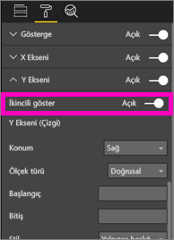

**Şekil 60: İkincil ekseni gösterme**

**Şekil 61: Yerine geçecek birleşik harita oluşturma**

* Çift eksenden faydalanın. Çift eksen farklı değer aralıklarına sahip birden fazla ölçüyü karşılaştırmak için harika bir yoldur. Aynı zamanda iki ölçü arasındaki bağıntıyı tek bir görselde göstermek için de idealdir.

Daha fazla bilgi için:

* [Eğitim: Power BI'daki birleşik harita](power-bi-visualization-combo-chart.md)
* [The danger of dual-scaled Axes in visuals (Görsellerdeki iki ölçekli eksen kullanım tehlikesi)](http://www.perceptualedge.com/articles/visual_business_intelligence/dual-scaled_axes.pdf)

### Dağılım Grafiği

Bazen bir arada görmek istediğimiz çok sayıda farklı değişken bulunabilir. Dağılım grafiği genel durumu görmek için yararlı olabilir.  Dağılım grafikleri, 2 (Dağılım) veya 3 (Kabarcık) nicel ölçü arasındaki ilişkileri görüntüler.  Dağılım grafiğinde her zaman, biri yatay eksende bir sayısal veri kümesi gösteren, diğeri ise dikey eksen üzerinde bir sayısal değer kümesi gösteren iki değer ekseni bulunur. Grafik, X ve Y sayısal değerlerinin kesişim noktalarını görüntüler ve bu değerleri tekli veri noktalarına dönüştürür. Bu veri noktaları, verilere bağlı olarak yatay eksende eşit veya eşit olmayan şekilde dağıtılabilir.

Kabarcık grafiğinde veri noktaları yerine kabarcıklar kullanılır ve kabarcık boyutu verilerin farklı bir boyutunu gösterir.

Aşağıdaki kabarcık grafiği Güney Amerika'yı ele alıp kişi başına GDP (Y Ekseni), GDP toplamı (X Ekseni) ve Güney Amerika ülkesi nüfusunu göstermektedir.  Kabarcıkların boyutu, ilgili ülkenin toplam nüfusunu temsil etmektedir. Brezilya en yüksek nüfusa (kabarcık boyutu) ve Güney Amerika'nın GDP'sinde en yüksek paya (X Ekseninde en uzaktadır) sahiptir.  Ancak Uruguay, Şili ve Arjantin'deki kişi başı GDP değeri Brezilya'dan daha yüksektir (Y Ekseninde daha uzaktadır).

**Şekil 62: Güney Amerika GDP ve nüfus kabarcık grafiği**

Yürütme ekseni eklerseniz Hans Rosling rolüne bürünebilir ve hikayenizi zaman içinde anlatabilirsiniz (https://www.youtube.com/watch?v=PbaDBJWCeD4). Yürütme ekseni eklemek için **Yürütme Ekseni** kutusuna bir tarih saat alanı sürükleyin.

#### En iyi yöntemler
* Dağılım ve Kabarcık grafikler hikaye anlatma konusunda harikadır. Ancak, bu grafikler verileri keşfetmeyi sağlama konusunda o kadar kullanışlı değildir.  Stephen Few, aşağıdaki paragrafta bu noktaya değinmektedir *Bu yaklaşımın gücü hikaye anlatmak için kullanıldığında ortaya çıkar. Rosling'in yorumuyla kabarcıklar etrafta dolanıp değerleri değiştikçe ve görmemizi istediklerini gösterdikçe grafikteki bilgi canlanmaktadır. Diğer taraftan animasyonlu kabarcık grafikleri, verileri kendi kendimize keşfetme ve anlam çıkarma konusunda daha az etkilidir. Rosling'in bu yöntemi hikayeleri yalnızca bilinir hale geldiklerinde söyleme amacıyla keşfetmek için kullanıp kullanmadığı merak konusu. Kabarcıklar hareket ederken birden fazlasını takip edemediğimiz için olan biteni anlama amacıyla animasyonu tekrar tekrar oynatmak zorunda kalabilirsiniz. Seçili kabarcıklara iz ekleyerek bu kabarcıkların ilerledikleri yolun tamamını gözden geçirebiliriz ancak izlerin çok sayıda kabarcığa uygulanması halinde pano hızla dağınık hale gelecektir. Temelde değindiğim nokta bunun inceleme ve çözümleme amacıyla veri görüntülemek için en iyi yöntem olmadığıdır.*
* Hikayeyi anlatmalarına yardımcı olmak için X ve Y eksenleri ekleyin.  Özellikle kabarcık grafiklerinde oynatma sırasında çok fazla bileşen vardır ve etiketler, okuyucunun görseli kavramasına yardımcı olur.
* Görselin daha kolay yorumlanması için veri etiketi ekleyin.  Özellikle Açıklama bölümünde çok sayıda öğe bulunan kabarcık grafiklerinde benzer renkleri ayırt etmek zor olabilir.  Yukarıdaki görselde Suriname, Columbia ve Ecuador'a ait açıklama renkleri birbirine benzerdir.
* Dağılım grafiği oluşturduğunuzda X ve Y eksenindeki verileri yalnızca bir veri noktası mı topluyor? Ya da grafiğiniz tek bir yatay veya dikey çizgi üzerindeki tüm değerleri mi topluyor?  Bu sorunu gidermek için **Ayrıntılar** bölümüne bir alan ekleyerek Power BI'a değerleri nasıl gruplandırması gerektiğini anlatın. Alanın, çizmek istediğiniz her nokta için benzersiz olması gerekir. Yardım için bkz. [Power BI dağılım ve kabarcık grafiği eğitimi](power-bi-visualization-scatter.md).

### Ağaç Haritası Grafikleri

Ağaç haritaları özellikle bir bütünü oluşturan farklı bileşenlerin kategorilere göre gruplayabildiğiniz durumlarda birbirine göre boyutunu göstermek için kullanışlı bir yöntemdir.  Yeni bir işletmeyi çözmeye çalışırken ana bileşenlerin ağaç haritasına sahip olmak, genel dağılımı öğrenme açısından oldukça faydalı olabilir.

Aşağıdaki ilk grafikte Brezilya'nın Güney Amerika'nın GDP'sinin yaklaşık yarısını oluşturduğunu, Venezuela ve Arjantin'in de yaklaşık aynı boyutta olduğunu görebilirsiniz.

Daha geniş bir bağlama sahip olmak ve en çok katkıda bulunan ülkeler hakkında bilgi sahibi olmaya devam etmek istiyorsanız bölgelerin içinde kategori üyelerine (ülkeler) sahip görsel hiyerarşileri oluşturabilirsiniz. İkinci ağaç haritası, bize öncelikle bölgelerin birbirlerine göre boyutunu anlatıp her bölgede en çok katkıda bulunan ülkeleri görmemizi sağlamaktadır. Üç büyük bölge (Avrupa, Asya ve Kuzey Amerika) olduğunu ve bunların içindeki ilk beş ülkeyi/bölgeyi kolayca görebiliyoruz.

Ağaç haritasının en önemli sınırlaması, ilk sıradakilerin arkasındaki farklı dikdörtgenleri karşılaştırma konusunda sınırlı olasılık sunmasıdır.  Genel bakış için iyi bir grafiktir ancak farklı bileşenlerin göreli boyutları hakkında daha fazla fikir sahibi olmak için sütun ve çubuk grafikler daha iyi bir seçenek olacaktır.
  Örneğin ilk ağaç haritasında GDP boyutunun sırası net bir şekilde gösterilmiştir ancak özellikle küçük ve etiketsiz kutular olmak üzere ülkeler arasındaki farkları tanımlamak zordur. Bu veriler için tek bir grup karşılaştırıldığında çubuk veya sütun grafik daha iyi bir seçenek olabilir.

**Şekil 63: Ağaç haritasında Güney Amerika GDP karşılaştırması**

Burada başka bir veri düzeyi olan bölgeyi ekledik ve GDP'nin bölgelere göre dağılımına ek olarak bölgeler üzerindeki etkisini de görebiliyoruz. Bu işlemi ayrıntıların toplamının, toplam düzeyinin gerçek değerini temsil etmediği toplamsal olmayan ölçülerde (ortalamalar gibi) yaparken dikkatli olun.

**Şekil 64: Bölgelere ve ülkelere göre GDP ağaç haritası**

Ağaç haritaları hakkında daha fazla bilgi için aşağıdaki bağlantıları kullanabilirsiniz.

* [Treemaps overview (Ağaç haritalara genel bakış)](http://www.perceptualedge.com/articles/b-eye/treemaps.pdf)
* [Data Visualization Catalogue: Tree maps (Veri Görselleştirme Kataloğu: Ağaç haritalar)](http://www.datavizcatalogue.com/methods/treemap.html#.VYhylI3bL7Y)

### Diğer grafikler
#### Pasta Grafikleri veya Halka Grafikler

Çubuk/sütun/çizgi grafikler çoğu durumda işinizi görecektir. Pasta grafikleri ve halka grafiklerin insanlar tarafından doğru yorumlanmasının zor olduğu ve hatta verilerin çarpıtılabileceği iyi bilinen bir durumdur. Mümkünse bu grafikleri kullanmayın. Stephen Few'ın bu grafiklerin tarihi ve tehlikeleri hakkında harika bir yazısı mevcuttur [Save the Pies for Dessert (Pastayı Yemekten Sonraya Saklayın)]([www.percetualedge.com/articles/08-21-07.pdf](http://www.perceptualedge.com/articles/08-21-07.pdf))

Burada pasta grafiklerinin yararlı olabileceği tek noktanın parça-bütün ilişkilerini karşılaştırmak olduğunu açıklamıştır. Ancak, bu grafiğin %100 yığılmış çubuk grafikten daha iyi olduğu zamanlar yok denecek kadar azdır.

Pasta grafikler hakkında başka bir eğlenceli makale (ve animasyon) için [Darkhorse Analytics sitesini](http://www.darkhorseanalytics.com/blog/salvaging-the-pie) ziyaret edebilirsiniz.

Dilerseniz olaya diğer taraftan bakmak için [Why Tufte is flat-out wrong about pie charts (Tufte'ın pasta grafikler hakkında doğru bildikleri)](http://speakingppt.com/2013/03/18/why-tufte-is-flat-out-wrong-about-pie-charts/) yazısını okuyabilirsiniz

#### Radyal Ölçekler ve KPI'ler

Radyal ölçekler belirli bir hedefe ulaşma durumunu gösteren yararlı bir görseldir ve özellikle yöneticilere yönelik panolarda çok fazla kullanılır. Ancak, bu ölçeklerin iki önemli kusuru vardır. Pasta grafiklerinde olduğu gibi gölgeli alanın açısının tam 180 derecelik yay veya hedef çizgiye kıyasla yorumlanması zordur. Aynı zamanda kullanıcılara tek bir ölçümü göstermek için çok fazla yer kaplar.

İyi alternatiflerden biri basit bir KPI görseli kullanmaktır

KPI'ler aynı miktarda alanda değeri, durumu, hedefi, hedeften sapmayı ve eğilimi gösterir. Hedefe ulaşılmadığında yeşil renk kırmızıya döner ve ara hedeflere ulaşıldıysa sarıya dönebilir. Ölçeğe kıyasla okuması ve yorumlaması çok daha kolaydır.

Daha fazla bilgi için bkz.

* [Eğitim: Power BI'daki radyal ölçek grafikleri](power-bi-visualization-radial-gauge-charts.md)
* [Eğitim: Power BI'daki KPI'ler](power-bi-visualization-kpi.md)

## Sonuç
Şimdi burada öğrendiğiniz en iyi yöntemleri test edebilirsiniz.  İletişim halinde kalın ve kendi en iyi yöntemlerinizi paylaşın. Önerilerimizden farklı fikirleriniz veya "kuralları yıkmak" için iyi bir nedeniniz mi var?  Bunları da öğrenmek isteriz.  

### Kitap önerileri
Ekiplerin görsel tasarım teknikleri üzerinde hakimiyet kurmasına yardımcı olacak birçok iyi kitap mevcuttur. Stephen Few'ın *Information Dashboard Design* (Bilgi Panosu Tasarımı) mutlaka okunması gereken kitaplardandır. Aynı yazarın *Show Me the Numbers* (Bana Sayıları Göster) ve *Now You See It* (Şimdi Görüyorsunuz) kitaplarında daha fazla ayrıntıya yer verilmiştir. Few ve birkaç farklı yazar, söz konusu alanda klasik olarak kabul edilen *The Visual Display of Quantitative Information* (Nicelik Bilgilerinin Görsel Gösterimi) kitabından ilham almıştır. Tufte, *Visual Explanations* (Görsel Açıklamalar), *Envisioning Information* (Bilgileri Görselleştirme) ve *Beautiful Evidence* (Güzel Kanıt) kitaplarının da yazarıdır. Andy Kirk'ün yeni kitabı *Data Visualization: A Handbook for Data Driven Design* (Veri Görselleştirme: Veri tasarımlı tasarım için el kitabı). Önerilen diğer yazarların bazıları: Lachlan James, William McKnight ve Boris Evelson (Forrester), Darkhorse Analytics.

Başka bir sorunuz mu var? [Power BI Topluluğu'na başvurun](http://community.powerbi.com/)

