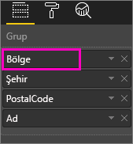
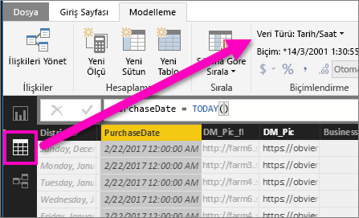

# Power BI'daki görselleştirmelerde detaya gitme
## Detaya gitme bir hiyerarşi gerektirir
Bir görselde hiyerarşi varsa ek ayrıntıları açığa çıkarmak için detaya gidebilirsiniz. Örneğin, Olimpiyat madalyası sayısına spor, disiplin ve etkinlik açısından bakan bir görselleştirmeniz olabilir. Görselleştirme varsayılan olarak madalya sayısını sporlara göre (jimnastik, kayak, su sporları vb.) gösterir. Ancak, bir hiyerarşiye sahip olduğundan, görsel öğelerden (bir çubuk, çizgi veya kabarcık) biri seçildiğinde giderek daha ayrıntılı hale gelen bir resim görüntülenir. Yüzme, atlama ve su topu ile ilgili verileri görmek için **su sporları** öğesini seçin.  Tramplen, kule ve senkronize atlama etkinlikleri ile ilgili ayrıntıları görmek için **atlama** öğesini seçin.

Size ait raporlara hiyerarşiler ekleyebilirsiniz ancak sizinle paylaşılan raporlara ekleyemezsiniz.
Hangi Power BI görselleştirmelerinin bir hiyerarşi içerdiğinden emin değil misiniz?  Bir görselleştirmenin üzerine geldiğinizde üst köşelerde bu detay denetimlerini görüyorsanız görselleştirmenizde hiyerarşi bulunuyor demektir.

    
   

Tarih, benzersiz bir hiyerarşi türüdür. Görselleştirmeye bir tarih alanı eklediğinizde Power BI otomatik olarak yıl, üç ay, ay ve gün içeren bir zaman hiyerarşisi ekler. Daha fazla bilgi için [Görsel hiyerarşiler ve detaya gitme davranışı](guided-learning/visualizations.yml#step-18) makalesine bakın veya aşağıdaki videoyu izleyin.

  <iframe width="560" height="315" src="https://www.youtube.com/embed/MNAaHw4PxzE?list=PL1N57mwBHtN0JFoKSR0n-tBkUJHeMP2cP" frameborder="0" allowfullscreen></iframe>

> [!NOTE]
> Power BI Desktop'ı kullanarak hiyerarşi oluşturmayı öğrenmek için [How to create and add hierarchies (Hiyerarşi oluşturma ve ekleme)](https://youtu.be/q8WDUAiTGeU) videosunu seyredin
> 
> 

## Detaya gitmek için iki yöntem
Görselleştirmenizde detaya gitmenin (ve detaydan çıkmanın) iki farklı yolu bulunur.  Bu makalede her iki yol da açıklanmaktadır. Her iki yöntem de aynı görevi gerçekleştirir, bu nedenle tercih ettiğiniz yöntemi kullanın.

> [!NOTE]
> Birlikte ilerlemek için Power BI hizmetinde [Retail Analysis sample'ı açın](sample-datasets.md) ve **Total Units This Year** (Değerler) özelliğine **Territory**, **City**, **PostalCode** ve **Name** (Grup) açısından bakan bir ağaç haritası oluşturun.  
> 
> 

## Detaya gitmenin 1. yöntemi
Bu yöntemde görselleştirmenin üst köşelerinde görünen detay simgeleri kullanılır.

1. Power BI'da bir raporu [Okuma Görünümü](service-report-open-in-reading-view.md) veya [Düzenleme Görünümü](service-reading-view-and-editing-view.md)'nde açın. Detay için hiyerarşiye sahip bir görselleştirme gerekir. 
   
   Aşağıdaki animasyonda bir hiyerarşi gösterilmektedir.  Görselleştirmede bölge, şehir, posta kodu ve şehir adından oluşan bir hiyerarşi bulunur. Her bölgede bir veya daha fazla şehir, her şehirde bir veya daha fazla posta kodu vb. bulunur. Varsayılan olarak, listede ilk sırada *Territory* göründüğü için görselleştirme yalnızca bölge verilerini görüntüler.
   
   
2. Detaya gitmeyi etkinleştirmek için görselleştirmenin sağ üst köşesindeki ok simgesini seçin. Simge koyu olduğunda detay etkindir. Detayı açmazsanız bir görsel öğe (çubuk veya kabarcık gibi) seçildiğinde rapor sayfasındaki diğer grafiklere çapraz filtreleme uygulanır.    
   
   
3. ***Bir seferde bir alan*** detayına gitmek için görselleştirmenizdeki öğelerden birine tıklayın; diğer bir deyişle, bir çubuk grafikte çubuklardan birine ve bir ağaç haritasında *yapraklardan* birine tıklayın. Detaya gittiğinizde ve detaydan çıktığınızda başlığın değiştiğine dikkat edin. Bu animasyonda "Territory tarafından düzenlenen Total Units This Year" başlığı "Territory ve City tarafından düzenlenen Total Units This Year", "Territory, City ve PostalCode tarafından düzenlenen Total Units This Year", "Territory, City, PostalCode ve Name tarafından düzenlenen Total Units This Year" olarak değişir. Yeniden detaydan çıkmak için aşağıda gösterildiği gibi görselleştirmenin sol üst köşesindeki **Detaydan Çık** simgesini    seçin.
   
   
4. ***Tüm alanlarda aynı anda*** detaya gitmek için görselleştirmenin sol üst köşesindeki çift oku seçin.
   
   
5. Yeniden detaydan çıkmak için görselleştirmenin sol üst köşesindeki yukarı oku seçin.
   
   

## Detaya gitmenin 2. yöntemi
Bu yöntemde üst kısımdaki Power BI menü çubuğundaki **Araştır** açılır menüsü kullanılır.

1. Power BI'da bir raporu [Okuma Görünümü](service-report-open-in-reading-view.md) veya [Düzenleme Görünümü](service-reading-view-and-editing-view.md)'nde açın. Detay için hiyerarşiye sahip bir görselleştirme gerekir. 
   
   Aşağıdaki görüntüde bir hiyerarşi gösterilmektedir.  Görselleştirmede bölge, şehir, posta kodu ve şehir adından oluşan bir hiyerarşi bulunur. Her bölgede bir veya daha fazla şehir, her şehirde bir veya daha fazla posta kodu vb. bulunur. Varsayılan olarak, listede ilk sırada *Territory* göründüğü için görselleştirme yalnızca bölge verilerini görüntüler.
   
   
2. Detaya gitmeyi etkinleştirmek için bir görselleştirmeyi seçerek etkin hale getirin ve Power BI üst menü çubuğunda **Araştır** > **Detaya Git**'i seçin. Görselleştirmenin sağ üst köşesindeki detaya git simgesi siyah bir arka plan olarak değişir.   
   
   
3. Etkinleştirildikten sonra, bir seferde bir alanda detaya gitmek için ağaç haritası yapraklarından birini seçin. Bu örnekte, bu yıl Kuzey Carolina'da şehre göre satılan toplam birimleri görmek için **NC** adlı bölgeyi seçtim.
   
   
4. Tüm alanlarda aynı anda detaya gitmek için **Araştır** > **Sonraki Düzeyi Göster**'i seçin.
   
   
5. Yeniden detaydan çıkmak için **Araştır** > **Detaydan Çık**'ı seçin.
   
   
6. Görseli oluşturmada kullanılan verileri görmek için **Verileri görüntüle**'yi seçin. Veriler görselin altındaki bir bölmede görüntülenir. Siz görseli ayrıntılandırırken bu bölme sabit kalır. Daha fazla bilgi için bkz. [Görseli oluşturmak için kullanılan verileri gösterme](service-reports-show-data.md).

## Önemli noktalar ve sınırlamalar
* Bir görselleştirmeye tarih alanı eklenmesi bir hiyerarşi oluşturmuyorsa "tarih" alanı aslında bir tarih olarak kaydedilmemiş olabilir. Veri kümesi size aitse veri kümesini Power BI Desktop'ta *Veri* görünümünde açın, tarihi içeren sütunu seçin ve Modelleme sekmesinde **Veri Türü**'nü **Tarih** veya **Tarih/Saat** olarak değiştirin. Rapor sizinle paylaşıldıysa değişikliği yapmasını istemek için raporun sahibi ile iletişime geçin.  
  
  

## Sonraki adımlar
[Power BI raporlarındaki görselleştirmeler](power-bi-report-visualizations.md)

[Power BI raporları](service-reports.md)

[Power BI - Temel Kavramlar](service-basic-concepts.md)

Başka bir sorunuz mu var? [Power BI Topluluğu'na başvurun](http://community.powerbi.com/)

