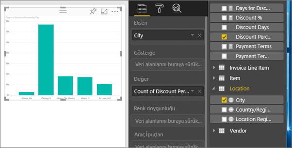
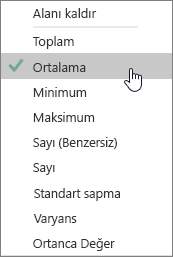
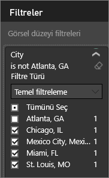
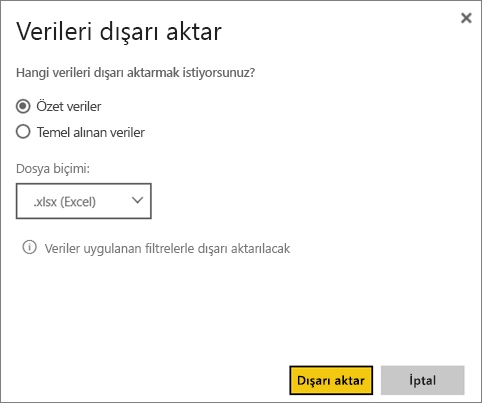

# Görselleştirmelerdeki verileri dışarı aktarma
Bir görselleştirmenin oluşturulması için kullanılan verileri görmek isterseniz [söz konusu verileri Power BI'da görüntüleyebilir](service-reports-show-data.md) veya bir .xlsx ya da .csv dosyası olarak Excel'e aktarabilirsiniz.   

Will raporundaki görselleştirmelerden birindeki verileri dışarı aktarıp, .xlsx dosyası olarak kaydedip dosyayı Excel'de açarken ona eşlik edin. Ardından, videonun altında yer alan adım adım yönergeleri izleyerek bu işlemi kendiniz deneyin.

<iframe width="560" height="315" src="https://www.youtube.com/embed/KjheMTGjDXw" frameborder="0" allowfullscreen></iframe>

## Bir Power BI panosunda bulunan görselleştirmeden
1. Görselleştirmenin sağ üst köşesinde bulunan üç nokta simgesini seçin.
   
    
2. **Verileri dışarı aktar** simgesini seçin.
   
    
3. Veriler bir .csv dosyasına aktarılır. Görsel filtrelenmişse, indirilen veriler de filtrelenmiş olur.
4. Tarayıcınız sizi dosyayı kaydetmeye yönlendirir.  Kaydedilen .csv dosyasını Excel'de açın.
   
    

## Bir raporda bulunan görselleştirmeden
Birlikte ilerleyebilmek için, [Tedarik analizi örneği raporunu](sample-procurement.md) [Düzenleme görünümü](service-reading-view-and-editing-view.md)'nde açın. [Yeni bir boş rapor sayfası ekleyin](power-bi-report-add-page.md). Ardından, aşağıdaki adımları uygulayarak bir toplama ve görsel düzeyi filtresi ekleyin.

1. Yeni bir sütun grafiği oluşturun.  Alanlar bölmesinde, **Location > City** ve **Invoice > Discount Percent** seçeneklerini belirleyin.   
   
    
2. **Discount Percent** için **Sayı** olan toplama işlemini **Ortalama** olarak değiştirin. Değer kutusunda, **Discount Percent**'in (**Sayı Discount Percent** olarak da görünüyor olabilir) sağında bulunan oku seçin ve ardından **Ortalama** seçeneğini belirleyin.
   
    
3. **City**'ye bir filtre ekleyerek **Atlanta**'yı kaldırın.
   
   
   
   Artık dışarı aktarma işlemine yönelik iki seçeneği de denemeye hazırız.
4. Görselleştirmenin sağ üst köşesinde bulunan üç nokta simgesini seçin. **Verileri dışarı aktar** seçeneğini belirleyin.
   
   
5. Görselleştirmeniz bir toplama işlemi içeriyorsa (*ortalama*, **toplam** veya *minimum* olarak değiştirdiğiniz **Sayı** gibi), iki seçeneğe sahip olursunuz: **Özetlenmiş veriler** ve **Temel alınan veriler**. Toplama işlemlerini anlama konusunda yardım için bkz. [Power BI'da toplama işlemleri](service-aggregates.md).
   
    
6. **Özetlenmiş veriler** > **Dışarı Aktar**'ı seçin ve .xlsx veya .csv seçeneğini belirleyin. Power BI, verileri dışarı aktarır.  Görselleştirmeye filtreler uyguladıysanız, dışarı aktarılan veriler de filtrelenmiş olur. **Dışarı Aktar** seçeneğini belirlediğinizde, tarayıcınız sizi dosyayı kaydetmeye yönlendirir. Kaydedilen dosyayı Excel'de açın.
   
   **Özetlenmiş veriler**: Bir toplama işlemi bulunmuyorsa veya bulunmasına rağmen dağılımı tam olarak görmek istiyorsanız bu seçeneği belirleyin. Örneğin, 4 çubuk gösteren bir çubuk grafiğiniz varsa 4 veri satırı elde edersiniz. Özetlenen veriler .xlsx ve .csv olarak kullanılabilir.
   
   Bu örnekte, dışarı aktarma işlemiyle oluşturulmuş Excel dosyasında her şehir için bir satır bulunur. Filtrelediğimiz Atlanta, sonuçlarda yer almaz.  Elektronik tablomuzun ilk satırında, Power BI'daki veriler ayıklanırken kullanılan filtreler gösterilir.
   
   
7. Şimdi de **Temel alınan veriler** > **Dışarı aktar**'ı seçip .xlsx seçeneğini belirlemeyi deneyin. Power BI, verileri dışarı aktarır. Görselleştirmelere filtreler uyguladıysanız, dışarı aktarılan veriler de filtrelenmiş olur. **Dışarı Aktar** seçeneğini belirlediğinizde, tarayıcınız sizi dosyayı kaydetmeye yönlendirir. Kaydedilen dosyayı Excel'de açın.
   
   >[!WARNING]
   >Temel alınan verilerin dışarı aktarılması, kullanıcıların verileri tüm ayrıntılarıyla (verilerdeki tüm sütunlar) görebilmesine olanak sağlar. Power BI hizmeti yöneticileri kuruluşlarında bu özelliği devre dışı bırakamaz. Veri kümesinin sahibiyseniz özel bilgilerin bulunduğu sütunları "gizli" olarak ayarlayabilir ve böylece bu bilgilerin Desktop veya Power BI hizmetindeki Alanlar listesinde gösterilmemesini sağlayabilirsiniz.
   > 
   > 
   
   **Temel alınan veriler**: Görselleştirmenizde bir toplama işlemi bulunuyorsa ve temel alınan tüm bilgileri görmek istiyorsanız bu seçeneği belirleyin. Kısacası, *Temel alınan veriler* seçeneğinin belirlenmesiyle toplama işlemi kaldırılır. **Dışarı Aktar** seçeneğini belirlediğinizde, veriler bir .xlsx dosyası olarak dışarı aktarılır ve tarayıcınız sizi dosyayı kaydetmeye yönlendirir. Kaydedilen dosyayı Excel'de açın.
   
   Bu örnekte bulunan, dışarı aktarmayla oluşturduğumuz Excel dosyasında, veri kümemizdeki her City satırı için bir satır ve söz konusu tek girişe ilişkin indirim yüzdesi gösterilir. Başka bir deyişle, veriler toplanmamış, düzleştirilmiştir. Elektronik tablomuzun ilk satırında, Power BI'daki veriler ayıklanırken kullanılan filtreler gösterilir.  
   
   

## Sınırlamalar ve önemli noktalar
* **Power BI Desktop**'tan bir .csv dosyasına aktarılabilen maksimum satır sayısı 30.000'dir.
* **Power BI hizmetinden** .xlsx'e aktarılabilen maksimum satır sayısı Pro sürüm kullanıcıları için 150.000, Ücretsiz sürüm kullanıcıları için ise 30.000'dir.
* DirectQuery kullanılırken, dışarı aktarılabilen maksimum veri miktarı 16 MB'tır. Bu, özellikle de çok sayıda sütun, sıkıştırılması zor veriler ve dosya boyutunu artırıp dışarı aktarılan satır sayısını düşüren diğer faktörlerin bulunması halinde maksimum sayının altında satırın dışarı aktarılmasına neden olabilir.
* Power BI yalnızca basit toplama işlemlerinin kullanıldığı görsellerde dışarı aktarmayı destekler. Dışarı aktarma işlemi model veya rapor ölçülerinin kullanıldığı görseller için kullanılamaz.
* Şu anda özel görseller ve R görselleri desteklenmemektedir.
* Verileri dışarı aktarma özelliği, kendileriyle paylaşılan bir panoyu kullanmakta olan, kuruluşunuzun dışındaki kullanıcılar tarafından kullanılamaz. 
* .csv dosyasında bir unicode karakter varsa metin Excel'de düzgün bir şekilde görüntülenmeyebilir. Ancak dosyayı Not Defteri'nde açmak yeterli olacaktır. Para birimi simgeleri ve yabancı kelimeler unicode karakterlere örnek olarak verilebilir. Bu soruna yönelik bir geçici çözüm olarak, CSV dosyasını doğrudan açmak yerine Excel'e aktarabilirsiniz. Bunu gerçekleştirmek için:
  
  1. Excel'i açın
  2. **Veri** sekmesinde, **Dış veri al** > **Metinden** seçeneğini belirleyin.
* Power BI yöneticileri verilerin dışarı aktarılmasını devre dışı bırakabilir.

## Sonraki adımlar
[Power BI'daki panolar](service-dashboards.md)  
[Power BI'daki raporlar](service-reports.md)  
[Power BI - Temel Kavramlar](service-basic-concepts.md)

Başka bir sorunuz mu var? [Power BI Topluluğu'na sorun](http://community.powerbi.com/)

