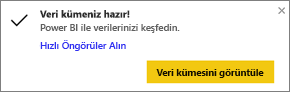
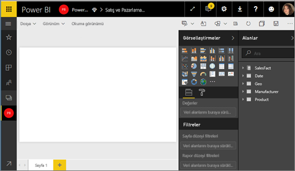
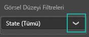
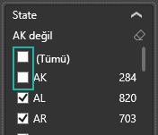
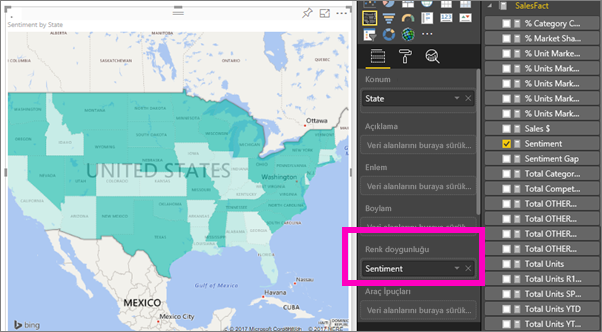

# Power BI'da kartogramlar (koroplet haritalar) (Eğitim)
Bir kartogram, değerlerin bir coğrafya veya bölge üzerinde orantısal olarak nasıl farklılık gösterdiğini görüntülemek için gölgelendirmeyi ya da tonlandırmayı veya desenleri kullanır.  Bu göreli farklılıkları açıktan (daha az sık/daha düşük) koyuya (daha fazla sık/daha yüksek) çeşitlilik gösteren gölgelendirme ile hızlıca görüntüleyin.    

## Bing'e neler gönderilir?
Power BI, varsayılan harita koordinatlarını sağlamak için Bing ile tümleşir (coğrafi kodlama adlı bir işlem). Power BI hizmetinde veya Power BI Desktop'ta bir harita görselleştirmesi oluşturduğunuzda **Konum**, **Enlem** ve **Boylam** demetlerindeki veriler (söz konusu görselleştirmenin oluşturulması için kullanılan) Bing'e gönderilir.

Bing'e gönderilen tüm veriler hakkında daha fazla bilgi ve coğrafi kodlama başarınızı artırmaya yönelik ipuçları için bkz. [Harita görselleştirmeleri için ipuçları ve püf noktaları](power-bi-map-tips-and-tricks.md).

## Kartogram ne zaman kullanılır?
Kartogramlar şu durumlarda kullanım için mükemmel seçimdir:

* bir haritada nicel bilgiler görüntülemek için.
* uzamsal desenleri ve ilişkileri göstermek için.
* verileriniz standartlaştırıldığında.
* sosyoekonomik verilerle çalışırken.
* bölgelerin tanımlanması önemli olduğunda.
* coğrafi konumlarda dağıtıma ilişkin bir genel bakış edinmek için.

## Temel bir kartogram oluşturma
Bu videoda Kim, temel bir harita oluşturup bunu kartograma dönüştürüyor.

<iframe width="560" height="315" src="https://www.youtube.com/embed/ajTPGNpthcg" frameborder="0" allowfullscreen></iframe>

1. Kendi kartogramınızı oluşturmak için Power BI'da oturum açıp **Veri Al \> Örnekler \> Satış ve Pazarlama \> Bağlan** seçeneklerini belirleyerek [Satış ve Pazarlama örneğini indirin](sample-datasets.md).
2. Başarılı iletisi göründüğünde **Veri kümesini görüntüle**'yi seçin. 
   
   
3. Power BI, [Düzenleme Görünümü](service-interact-with-a-report-in-editing-view.md)'nde boş bir rapor tuvali açar.
   
    
4. Alanlar bölmesinde, **Geo** \> **State** alanını seçin.    
   
   
5. [Grafiği](power-bi-report-change-visualization-type.md) kartograma dönüştürün. **State** alanının artık **Konum** kutusunda olduğunu görebilirsiniz. Bing Haritalar, haritayı oluşturmak için **Konum** kutusundaki alanı kullanır.  Konum kutusunda çok sayıda geçerli konum bulunabilir: ülkeler, eyaletler, iller, ilçeler, şehirler, posta kodları vb. Bing Haritalar, dünya genelindeki konumlar için kartogram gölgeleri sağlar. Konum kutusunda geçerli bir giriş olmadan Power BI, kartogramı oluşturamaz.  
   
   
6. Haritayı, yalnızca Kıtasal Amerika Birleşik Devletleri görüntülenecek şekilde filtreleyin.
   
   a.  Görsel Öğeler bölmesinin alt tarafında **Filtreler** alanını bulun.
   
   b.  **State** seçeneğinin üzerine gelin ve genişlet köşeli çift ayracına tıklayın  
   
   
   c.  **Tümü** seçeneğine onay işareti koyun ve **AK** seçeneğinin yanındaki onay işaretini kaldırın.
   
   
7. **SalesFact** \> **Sentiment** seçeneğini belirleyerek **Renk doygunluğu** kutusuna ekleyin. **Renk doygunluğu** kutusundaki alan, harita gölgelendirmesini denetler.  
   
8. Kartogram yeşille gölgelendirilir; açık yeşil daha düşük yaklaşım sayılarını, koyu yeşil ise daha yüksek ve daha pozitif yaklaşımı temsil eder.  Burada Wyoming (WY) eyaletini vurguladım ve Sentiment (Yaklaşım) düzeyinin oldukça iyi (74) olduğunu görüyorum.  
   
9. [Raporu kaydedin](service-report-save.md).

## Vurgulama ve çapraz filtreleme
Filtreler bölmesini kullanmayla ilgili bilgi için bkz. [Bir rapora filtre ekleme](power-bi-report-add-filter.md).

Bir Kartogram'da Konum'un vurgulanması rapor sayfasındaki diğer görselleştirmelere çapraz filtre uygular ve bu, tam tersi için de geçerlidir. 

Birlikte ilerlemek için Kartogramınızı kopyalayıp *Satış ve Pazarlama* raporunun **Sentiment** sayfasına yapıştırın. 

1. Kartogramda bir eyalet seçin.  Bu işlem, sayfadaki diğer görselleştirmeleri vurgular. Örneğin, **Texas** seçildiğinde Sentiment düzeyinin 74 olduğunu, Texas'ın Central District \#23'te olduğunu ve satış hacminin büyük bir kısmının Moderation ve Convenience segmentlerinden geldiğini görüyorum.   
   
2. Çizgi grafikte, **No** ve **Yes** arasında geçiş yapın. Bu, VanArsdel ve VanArsdel'in rakibi için Sentiment değerlerinin gösterilmesine yönelik olarak Kartogramı filtreler.  
   

## Önemli noktalar ve sorun giderme
Belirli durumlarda harita verileri kafa karıştırıcı olabilir.  Örneğin, bir Paris, Fransa mevcuttur ancak Paris, Texas da bulunmaktadır. Coğrafi verileriniz büyük olasılıkla ayrı sütunlarda (şehir adları için bir sütun, eyalet veya il adları için ayrı bir sütun vb.) depolanır, bu nedenle Bing Paris'leri ayırt edemeyebilir. Veri kümeniz zaten enlem ve boylam verileri içeriyorsa Power BI, harita verilerinin anlaşılır hale getirilmesine yardımcı olacak özel alanlara sahiptir. Enlem verilerinizi içeren alanı Görsel Öğeler \> Enlem alanına sürüklemeniz yeterlidir.  Boylam verileriniz için de aynı işlemi yapın.  
 

Power BI Desktop'ta veri kümesini düzenleme izniniz varsa haritalarla ilgili kafa karıştırıcı durumların ele alınmasına yardımcı olabilecek şu videoyu izleyin.

<iframe width="560" height="315" src="https://www.youtube.com/embed/Co2z9b-s_yM" frameborder="0" allowfullscreen></iframe>

Enlem ve boylam verilerine erişiminiz yoksa [veri kümenizi güncelleştirmek için bu yönergeleri uygulayın](https://support.office.com/article/Maps-in-Power-View-8A9B2AF3-A055-4131-A327-85CC835271F7).

Harita görselleştirmeleri hakkında daha fazla yardım için bkz. [Harita görselleştirmeleri için ipuçları ve püf noktaları](power-bi-map-tips-and-tricks.md).

## Sonraki adımlar
[Kartogramı pano kutucuğu olarak ekleme (görseli sabitleme)](service-dashboard-tiles.md)    
 [Bir rapora görselleştirme ekleme](power-bi-report-add-visualizations-i.md)  
 [Power BI'daki görselleştirme türleri](power-bi-visualization-types-for-reports-and-q-and-a.md)    
 [Kullanılan görselleştirme türünü değiştirme](power-bi-report-change-visualization-type.md)      
Başka bir sorunuz mu var? [Power BI Topluluğu'na başvurun](http://community.powerbi.com/)

