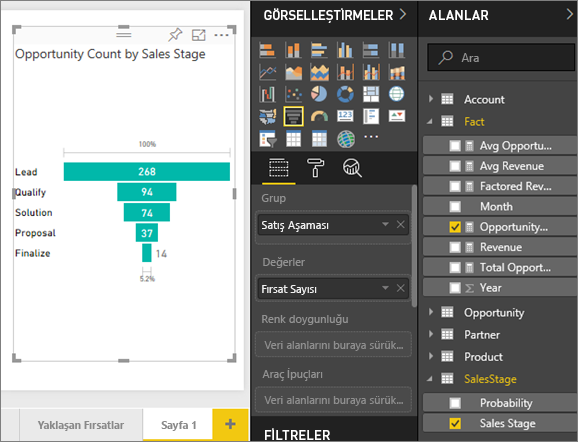
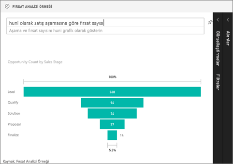

# Huni grafikler
Huni grafik, birbirine bağlı sıralı aşamalara sahip doğrusal süreçleri görselleştirmenize yardımcı olur. Örneğin bir satış hunisi, müşterileri şu aşamalarda takip eder: Aday Müşteri \> Nitelikli Aday Müşteri \> Potansiyel Müşteri \> Sözleşme \> Sonuçlandırma.  Huninin şekli ilk bakışta takip ettiğiniz sürecin ilerleme durumu hakkında bilgi verir.

Huninin her aşaması, toplamın belirli bir yüzdesini temsil eder. Bu nedenle çoğu durumda huni grafik bir huniye benzer. İlk aşama en büyüktür ve sonraki her aşama da bir öncekinden küçüktür.  Armut şeklindeki huni de kullanışlıdır. Süreçte bir sorun olduğunu belirtebilir.  Ancak genellikle ilk aşama olan "giriş" aşaması en büyük olandır.

## Huni grafik kullanım alanları
Huni grafikler aşağıdaki durumlarda harika bir seçimdir:

* veriler sıralı olduğunda ve en az 4 aşama boyunca ilerlediğinde.
* ilk aşamadaki "öğelerin" sayısının son aşamadaki sayıdan büyük olması beklendiğinde.
* potansiyeli (gelir/satış/anlaşma vs.) aşamalara göre hesaplamak için.
* dönüşüm ve elde tutma oranlarını hesaplayıp takip etmek için.
* doğrusal bir süreçteki sorunlu noktaları ortaya çıkarmak için.
* alışveriş sepeti iş akışını takip etmek için.
* tıklama ile yapılan reklam/pazarlama kampanyalarının ilerleme ve başarı durumunu takip etmek için.

## Huni grafiklerle çalışma
Huni grafikler:

* Raporlardan ve Soru-Cevap bölümünden sabitlenebilir.
* Sıralanabilir.
* Çoklu öğe desteği sunar.
* Aynı rapor sayfasındaki diğer görselleştirmeler tarafından vurgulanabilir ve çapraz filtre uygulanabilir.
* Aynı rapor sayfasındaki diğer görselleştirmeleri vurgulamak ve çapraz filtre uygulamak için kullanılabilir.

## Basit bir huni grafik oluşturma
Aşağıdaki videoda Will, Satış ve Pazarlama örneğini kullanarak bir Huni grafik oluşturmaktadır.

<iframe width="560" height="315" src="https://www.youtube.com/embed/qKRZPBnaUXM" frameborder="0" allow="autoplay; encrypted-media" allowfullscreen></iframe>

Artık satış aşamalarındaki fırsat sayılarını gösteren bir huni grafik oluşturabilirsiniz.

Bu yönergelerde Fırsat Analizi Örneği kullanılmaktadır. Yönergeleri takip etmek için Power BI hizmeti (app.powerbi.com) veya Power BI Desktop [örneğini indirin](sample-datasets.md).   

1. [Boş rapor sayfasıyla](power-bi-report-add-page.md) başlayın ve **SalesStage** \> **Sales Stage** alanını seçin. Power BI hizmetini kullanıyorsanız raporu [Düzenleme Görünümü](service-interact-with-a-report-in-editing-view.md)'nde açtığınızdan emin olmanız gerekir.
   
    
2. [Grafiği huniye dönüştürün](power-bi-report-change-visualization-type.md). **Sales Stage** öğesinin **Grup** kutusunda olduğuna dikkat edin. 
3. **Alanlar** bölmesinde **Fact** \> **Opportunity Count** seçimini yapın.
   
    
4. Çubuklardan birinin üzerine geldiğinizde bilgiler görüntülenir.
   
   * Aşamanın adı
   * Bu aşamada olan fırsat sayısı
   * Genel dönüşüm oranı (Aday Müşteri Yüzdesi) 
   * Önceki aşamaya göre (bu örnekte Proposal Stage/Solution Stage) % cinsinden aşamalar arası karşılaştırma (Düşme Oranı olarak da bilinir)
     
     
5. [Huniyi bir pano kutucuğu olarak ekleyin](service-dashboard-tiles.md). 
6. [Raporu kaydedin](service-report-save.md).

## Vurgulama ve çapraz filtreleme
Filtreler bölmesini kullanma hakkında bilgi için bkz. [Bir rapora filtre ekleme](power-bi-report-add-filter.md).

Hunideki bir çubuğun vurgulanması rapor sayfasındaki diğer görselleştirmelere çapraz filtre uygular ve bu, tam tersi için de geçerlidir. Örneği takip etmek için huni grafiğin bulunduğu rapor sayfasına birkaç görsel daha ekleyin.

1. Hunide **Proposal** çubuğunu seçin. Bu işlem ile sayfadaki diğer görselleştirmeler çapraz vurgulanır. Birden fazla seçim yapmak için CTRL tuşunu kullanın.
   
   
2. Görsellerin birbirini çapraz vurgulaması ve çapraz filtrelemesiyle ilgili tercihleri ayarlamak için bkz. [Power BI'daki görsel etkileşimleri](service-reports-visual-interactions.md)

## Soru-Cevap'ta huni grafik oluşturma
Opportunity Analysis Sample panosunu veya Opportunity Analysis Sample veri kümesinden sabitlenmiş olan en az bir görselleştirmeye sahip olan başka bir panoyu seçin.  Soru-Cevap'ta bir soru yazdığınızda Power BI, seçilen panoyla ilişkilendirilmiş olan (kutucukların sabitlenmiş olduğu) tüm veri kümelerinde yanıt arar. Daha fazla bilgi için bkz. [Power BI - temel kavramlar](service-basic-concepts.md).

1. Opportunity Analysis Sample panosunda Soru-Cevap soru kutusuna sorunuzu yazmaya başlayın.
   
   
   
2. Power BI'ın tercih ettiğiniz görselleştirme türünü anlaması için "as funnel" (huni olarak) eklemeyi unutmayın.

## Sonraki adımlar
[Power BI'daki görselleştirme türleri](power-bi-visualization-types-for-reports-and-q-and-a.md)

[Panoya görselleştirme sabitleme](service-dashboard-pin-tile-from-report.md)

[Power BI - Temel Kavramlar](service-basic-concepts.md)

Başka bir sorunuz mu var? [Power BI Topluluğu'na başvurun](http://community.powerbi.com/)

