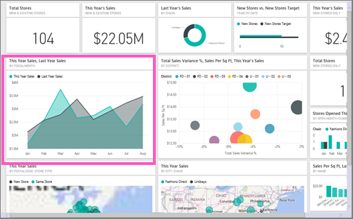
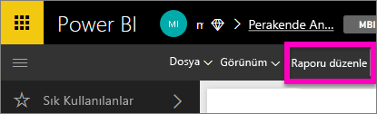
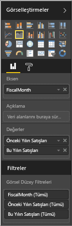
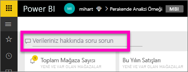
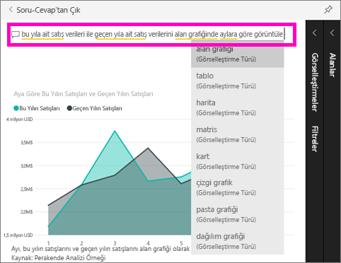

# Power BI Soru-Cevap’ı kullanmaya başlama

Bazen verilerinize ilişkin cevaplar edinmenin en hızlı yolu doğal dil kullanarak bir soru sormaktır.  Bu hızlı başlangıçta aynı görselleştirmeyi oluşturmanın iki farklı yoluna göz atacağız: raporda oluşturma ve Soru-Cevap özelliğini kullanarak soru sorma yoluyla oluşturma. Biz Power BI hizmetini kullanacağız ancak Power BI Desktop kullanıldığında da neredeyse aynı işlem gerçekleştirilir.

Birlikte ilerleyebilmeniz için, düzenleyebileceğiniz bir raporu kullanmanız gerekir. Bu nedenle, Power BI'da bulunan örneklerden birini kullanacağız.

## Rapor düzenleyicisinde görsel oluşturma

1. Power BI çalışma alanınızda **Veri Al** \> **Örnekler** \> **Perakende Analizi Örneği** > **Bağlan**'ı seçin.
   
2. Panoda "This Year's Sales, Last Year's Sales" adlı, hem geçen yıla ait hem de bu yıla ait satış verilerinin yer aldığı bir alan grafiği kutucuğu bulunur.  Bu kutucuğu seçin. Bu kutucuk Soru-Cevap özelliğiyle oluşturulmuşsa kutucuğu seçtiğinizde Soru-Cevap açılır. Ancak bu kutucuk bir raporda oluşturulduğundan raporda, bu görselleştirmeyi içeren sayfa açılır.

    

1. **Raporu düzenle**'yi seçerek raporu Düzenleme Görünümü'nde açın.  Raporun sahibi siz değilseniz Düzenleme görünümünde açma seçeneği sağlanmaz.
   
    
4. Alan grafiğini seçin ve **Alanlar** bölmesinde ayarları gözden geçirin.  Raporu oluşturan kişi bu grafiği, ilgili üç değeri seçip (**Time > FiscalMonth**, **Sales > This Year Sales**, **Sales > Last Year Sales > Değer**) bunları **Eksen** ve **Değerler** kutularında düzenleyerek oluşturmuştur.
   
    

## Aynı görseli Soru-Cevap ile oluşturma

Soru-Cevap özelliğini kullanarak aynı çizgi grafiği nasıl oluşturabiliriz?

1. Perakende Analizi Örneği panosuna geri dönün.
2. Doğal dil kullanarak soru kutusuna aşağıdakine benzer bir soru yazın:
   
   **what were this year sales and last year sales by month as area chart** (bu yıla ait satış verileri ile geçen yıla ait satış verilerini alan grafiğinde aylara göre görüntüle)
   
   Siz sorunuzu yazarken Soru-Cevap özelliği, yanıtınızı görüntülemek üzere en iyi görselleştirmeyi seçer. Siz soruyu değiştirdikçe görselleştirmeler de dinamik olarak değiştirilir. Soru-Cevap özelliği öneriler, otomatik tamamlama ve yazım düzeltmeleri ile sorunuzu biçimlendirmenize de yardımcı olur.
   
   Sorunuzu yazmayı bitirdikten sonra sonuç olarak, raporda gördüğümüz grafiğin aynısını elde edersiniz.  Gördüğünüz gibi bu çok daha hızlı oldu!
   
   
3. Raporlarla çalışırken olduğu gibi Soru-Cevap özelliğini kullanırken de Görsel Öğeler, Filtreler ve Alanlar bölmelerine erişebilirsiniz.  Görselinizi daha fazla araştırmak ve değiştirmek için bu bölmeleri açın.
4. Grafiği panonuza sabitlemek için raptiye simgesini seçin geçin.

## Sonraki adımlar
[Power BI'daki Soru-Cevap](consumer/end-user-q-and-a.md)

[Power BI'daki Soru-Cevap özelliğiyle verilerinizin düzgün çalışmasını sağlama](service-prepare-data-for-q-and-a.md)

Başka bir sorunuz mu var? [Power BI Topluluğu'na başvurun](http://community.powerbi.com/)

