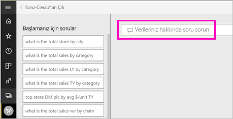
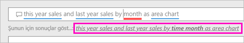
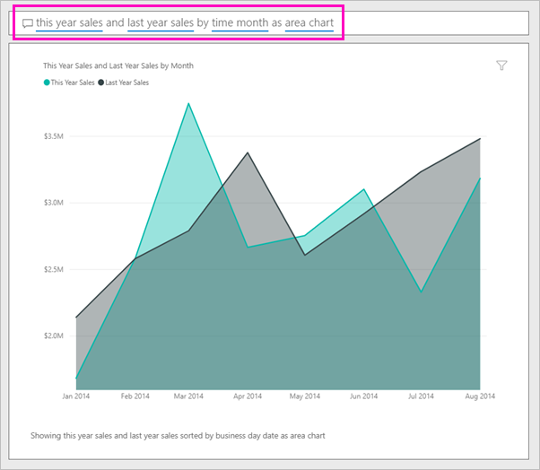

# Power BI soru- cevap ile bir görsel oluşturun

Bazen verilerinize ilişkin cevaplar edinmenin en hızlı yolu doğal dil kullanarak bir soru sormaktır.  Bu makalede, biz aynı görselleştirmeyi oluşturmanın iki farklı yollarına göz atın: ilk olarak, soru- cevap ile soru sorma ve ikinci olarak, Bu raporda oluşturma. Power BI hizmetinde rapor görseli oluşturmak için kullanıyoruz, ancak bu işlemi Power BI Desktop ile neredeyse aynıdır.

Birlikte ilerleyebilmeniz için, düzenleyebileceğiniz bir raporu kullanmanız gerekir. Bu nedenle, Power BI'da bulunan örneklerden birini kullanacağız.

## Soru- cevap ile bir görsel oluşturun

Nasıl soru- cevap'ı kullanarak bu çizgi grafiği oluşturma hakkında çıkacak?

1. Power BI çalışma alanınızda **Veri Al** \> **Örnekler** \> **Perakende Analizi Örneği** > **Bağlan**'ı seçin.

1. Retail Analysis Sample panosunu açın ve imlecinizi soru- cevap bir kutu içinde yerleştirin **verileriniz hakkında soru sorun**.

    

2. Soru- cevap bir kutusu içinde bu soruyu gibi yazın:
   
    **Bu yılın satışları ve geçen yılın satışlarını alan grafiği olarak ay**
   
    Siz sorunuzu yazarken Soru-Cevap özelliği, yanıtınızı görüntülemek üzere en iyi görselleştirmeyi seçer. Siz soruyu değiştirdikçe görselleştirmeler de dinamik olarak değiştirilir. Soru-Cevap özelliği öneriler, otomatik tamamlama ve yazım düzeltmeleri ile sorunuzu biçimlendirmenize de yardımcı olur. Soru- cevap, bir küçük ifade değişiklik önerir: "Bu yılın satışları ve geçen yılın satışları *saat ayı* alan grafiği olarak".  

    

4. Öneriyi kabul etmek için cümle seçin. 
   
   Sorunuzu yazmayı bitirdikten sonra sonuç Panoda gördüğünüz aynı grafiktir.
   
   

4. Grafiği panonuza sabitlemek için raptiye simgesini seçin  dokunun.

## Rapor düzenleyicisinde görsel oluşturma

1. Perakende Analizi Örneği panosuna geri dönün.
   
2. Panoyu aynı alan grafiği kutucuğu, "Last Year Sales ve bu yılın satışları için." içerir.  Bu kutucuğu seçin. Soru- cevap ile oluşturulan kutucuk seçmeyin Bunu seçtiğinizde soru- cevap açılır Rapor, bu görselleştirmeyi içeren sayfa açılır özgün alan grafiği kutucuğu bir raporda oluşturuldu.

    

1. **Raporu düzenle**'yi seçerek raporu Düzenleme Görünümü'nde açın.  Raporun sahibi siz değilseniz Düzenleme görünümünde açma seçeneği sağlanmaz.
   
    
4. Alan grafiğini seçin ve **Alanlar** bölmesinde ayarları gözden geçirin.  Bu üç değere seçerek raporu oluşturan kişi bu grafiği yerleşik (**Last Year Sales** ve **This Year Sales > değer** gelen **satış** tablosunu ve  **FiscalMonth** gelen **zaman** tablo) ve bunları düzenleme **eksen** ve **değerleri** oluşturmuştur.
   
    

    Bunlar aynı görselle sonuçlandı görürsünüz. Gördüğünüz gibi bu çok karmaşık değildi. Ancak soru- cevap ile oluşturmayı daha kolay!

## Sonraki adımlar

- [Pano ve raporlarda soru- cevap kullanma](power-bi-tutorial-q-and-a.md)  
- [Tüketiciler için soru- cevap](consumer/end-user-q-and-a.md)
- [Power BI'daki Soru-Cevap özelliğiyle verilerinizin düzgün çalışmasını sağlama](service-prepare-data-for-q-and-a.md)

Başka bir sorunuz mu var? [Power BI Topluluğu'na başvurun](http://community.powerbi.com/)

