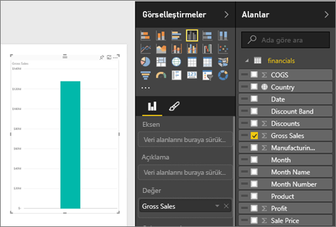
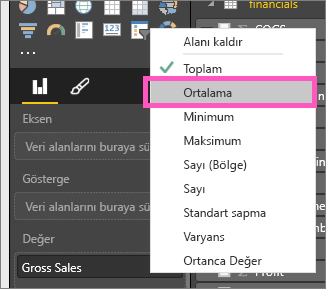
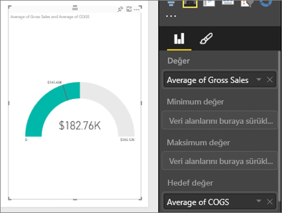
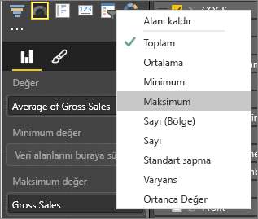
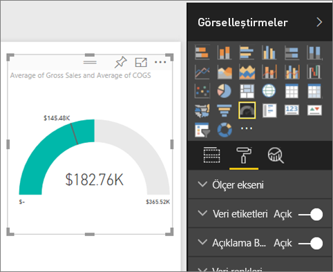
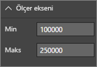
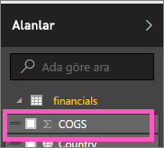
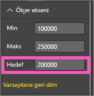

# Power BI'daki radyal ölçer grafikleri (Eğitim)
Radyal ölçerler dairesel bir yay içerir ve belirli bir hedefe/KPI'ye yönelik ilerlemeyi ölçen tek bir değer görüntüler.  Hedef veya hedef değer çizgi (iğne) ile gösterilir. Hedefe yönelik ilerleme gölgelendirme ile gösterilir.  İlerlemeyi gösteren değer ise yayın içinde kalın olarak gösterilir. Olası tüm değerler, minimumdan (en soldaki değer) başlayıp maksimumda (en sağdaki değer) sonlanacak şekilde yay boyunca eşit olarak dağılır.

Aşağıdaki örnekte, Satış ekibimizin aylık ortalama satışlarını izleyen bir araba satıcısı olduğumuzu varsayacağız. Hedefimiz olan 140 değeri siyah bir iğneyle gösterilmektedir.  Mümkün olan minimum ortalama satışı 0, maksimum ortalama satışı ise 200 olarak belirledik.  Mavi gölge, bu ay ortalama yaklaşık 120 satışa ulaştığımızı gösteriyor. Şanslıyız ki hedefimize ulaşmak için bir haftamız daha var.

## Radyal ölçer ne zaman kullanılır?
Radial ölçerler şunlar için harika bir seçimdir:

* bir hedefe yönelik ilerlemeyi göstermek.
* KPI gibi bir yüzde değerini göstermek.
* tek bir ölçünün durumunu göstermek.
* hızlıca taranıp anlaşılabilen bilgiler görüntülemek.

## Basit bir radyal ölçer oluşturma
Bu yönergeler Financial Sample'a yöneliktir. Birlikte ilerleyebilmek için, bilgisayarınıza [örneği indirin](http://go.microsoft.com/fwlink/?LinkID=521962), Power BI'da oturum açın ve **Veri Al \> Dosyalar \>  Yerel Dosya > Aç** yolunu izleyin. 

Alternatif olarak, Will şu tek ölçümlü görselleri oluştururken ona eşlik edebilirsiniz: ölçerler, kartlar ve KPI'ler.

<iframe width="560" height="315" src="https://www.youtube.com/embed/xmja6EpqaO0?list=PL1N57mwBHtN0JFoKSR0n-tBkUJHeMP2cP" frameborder="0" allowfullscreen></iframe>

### 1. Adım: Financial Sample Excel dosyasını açın.
1. [Örnek Financial Excel dosyasını indirin](sample-financial-download.md).
2. **Veri Al \> Dosyalar** seçeneğini belirleyip, dosyayı kaydettiğiniz konuma giderek dosyayı Power BI'da açın. **İçeri aktar**'ı seçin. Financial Sample, çalışma alanınıza bir veri kümesi olarak eklenir.
3. **Financial Sample**'ı seçerek Araştır modunda açın.

### 2. Adım: Brüt Satışı izlemeye yönelik bir ölçer oluşturma
1. **Alanlar** bölmesinde, **Gross Sales** seçeneğini belirleyin.
   
   
2. Toplama işlemini **Ortalama** olarak değiştirin.
   
   
3. Sütun Grafiğini ölçer olarak değiştirmek için ölçer simgesini  seçin.
   
   Varsayılan olarak, Power BI, geçerli değerin (bu örnekte, Ortalama Gross Sales) ölçerin ortasındaki değer olduğunun varsayıldığı bir Ölçer grafiği oluşturur. Ortalama Brüt Satış 182.760 ABD doları olduğundan, başlangıç değeri (Minimum) is 0 olarak, bitiş değeri ise (Maksimum) geçerli değerin iki katı olarak ayarlanır.
   
   

### 3. Adım: Hedef değer belirleme
1. **COGS**'yi **Hedef değer** kutusuna sürükleyin.
2. Toplama işlemini **Ortalama** olarak değiştirin.
   Power BI **$145.48K** olan hedef değerimizi gösteren bir iğne ekler. Hedefimize ulaştığımıza dikkat edin.
   
   
   
   > [!NOTE]
   > Elle de bir hedef değer girebilirsiniz.  Aşağıdaki "Minimum, Maksimum ve Hedef değerleri belirlemek için biçimlendirme seçeneklerini kullanma" bölümüne bakın.
   > 
   > 

### 4. Adım: Maksimum değer belirleme
2. Adımda, Power BI, minimum (başlangıç) ve maksimum (bitiş) değerlerini otomatik olarak belirlemek için Değer alanını kullanmıştır.  Peki ya maksimum değeri kendiniz belirlemek isterseniz?  Mümkün olan maksimum değer olarak geçerli değerin iki katı yerine veri kümenizdeki en yüksek Brüt Satış değerini belirlemek istediğinizi varsayalım. 

1. **Alanlar** listesindeki **Gross Sales** alanını **Maksimum Değer** kutusuna sürükleyin.
2. Toplama işlemini **Maksimum** olarak değiştirin.
   
   
   
   Ölçer, yeni bir bitiş değeriyle (Brüt satıştaki 1,21 milyon değeri) yeniden çizilir.
   
   

### 5. Adım: Raporunuzu kaydetme
1. [Raporu kaydedin](service-report-save.md).
2. [Ölçer grafiğini pano kutucuğu olarak ekleyin](service-dashboard-tiles.md). 

## Minimum, Maksimum ve Hedef değerleri belirlemek için biçimlendirme seçeneklerini kullanma
1. **Max of Gross Sales** alanını **Maksimum değer** kutusundan kaldırın.
2. Boya rulosu simgesini seçerek, biçimlendirme bölmesini açın.
   
   
3. **Ölçer ekseni**'ni genişletin ve **Minimum** ve **Maksimum** değerleri girin.
   
    
4. **COGS**'nin yanındaki onay işaretini kaldırarak geçerli hedef değeri silin.
   
    
5. **Ölçer ekseni**'nin altında **Hedef** alanı göründüğünde, buraya bir değer girin.
   
    
6. İsteğe bağlı olarak, ölçer grafiğinizi biçimlendirmeye devam edebilirsiniz.

## Sonraki adımlar
[Power BI'daki görselleştirme türleri](power-bi-visualization-types-for-reports-and-q-and-a.md)

[Bir rapora görselleştirme ekleme](power-bi-report-add-visualizations-i.md)

[Panoya görselleştirme sabitleme](service-dashboard-pin-tile-from-report.md)

[Power BI - Temel Kavramlar](service-basic-concepts.md)

Başka bir sorunuz mu var? [Power BI Topluluğu'na başvurun](http://community.powerbi.com/)

