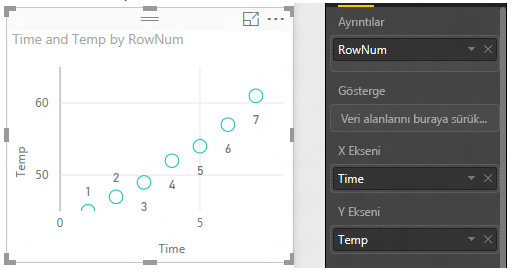
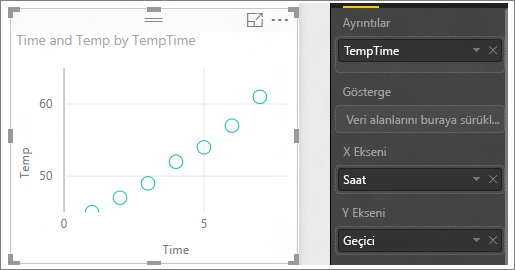

# Power BI'daki dağılım grafikleri ve kabarcık grafikleri (Eğitim)
Dağılım grafiğinde her zaman, biri yatay eksende bir sayısal veri kümesi gösteren, diğeri ise dikey eksen üzerinde bir sayısal değer kümesi gösteren iki değer ekseni bulunur. Grafik, X ve Y sayısal değerlerinin kesişim noktalarını görüntüler ve bu değerleri tekli veri noktalarına dönüştürür. Bu veri noktaları, verilere bağlı olarak yatay eksende eşit veya eşit olmayan şekilde dağıtılabilir.

Kabarcık grafiğinde veri noktaları yerine kabarcıklar kullanılır ve kabarcık *boyutu* verilerin farklı bir boyutunu gösterir.

## Dağılım grafiğinin ve kabarcık grafiğinin kullanım alanları
### Dağılım grafikleri aşağıdaki durumlarda harika bir seçimdir:
* 2 (dağılım) veya 3 (kabarcık) **sayısal** değer arasındaki ilişkiyi göstermek için.
* iki sayı grubunu xy koordinatı üzerinde bir dizi olarak çizmek için.
* yatay eksenin ölçeğini değiştirmek istediğiniz durumlarda çizgi grafiğin yerine    
* yatay ekseni logaritmik ölçeğe dönüştürmek için.
* ikili veya gruplanmış değer kümeleri içeren çalışma sayfası verilerini göstermek için. Dağılım grafiğinde eksenlerin ölçeğini ayrı ayrı ayarlayarak gruplanmış değerlerle ilgili daha fazla bilgiye yer verebilirsiniz.
* doğrusal veya doğrusal olmayan eğilimler, gruplar ve aykırı değerler gibi büyük veri kümelerindeki desenleri göstermek için.
* zamanı dikkate almadan büyük değerli veri noktalarını karşılaştırmak için. Dağılım grafiğine ne kadar çok veri eklerseniz o kadar iyi karşılaştırmalar yapabilirsiniz.

### Kabarcık grafikler aşağıdaki durumlarda harika bir seçimdir:
* verilerinizde her biri değer kümesi içeren 3 veri dizisi varsa.
* finansal verileri sunmak için.  Farklı kabarcık boyutları, belirli değerleri vurgulama açısından kullanışlıdır.
* çeyrek dairelerle birlikte kullanmak için.

## Dağılım grafiği oluşturma
<iframe width="560" height="315" src="https://www.youtube.com/embed/PVcfPoVE3Ys?list=PL1N57mwBHtN0JFoKSR0n-tBkUJHeMP2cP" frameborder="0" allowfullscreen></iframe>

1. Perakende Analizi Örneği'ni [Düzenleme Görünümü](service-interact-with-a-report-in-editing-view.md)'nde açın ve [yeni bir rapor sayfası ekleyin](power-bi-report-add-page.md).
2. Alanlar bölmesinden **Sales** > **Sales Per Sq Ft** ve **Sales** > **Total Sales Variance %** alanlarını seçin.
3. Alanlar bölmesinden **District > District** seçeneğini belirleyin.
   
    
4. Sonucu dağılım grafiğine dönüştürün. Görsel Öğeler bölmesinde Dağılım grafiği simgesini seçin.
   .
5. **District** öğesini **Ayrıntılar** bölmesinden **Açıklama**'ya sürükleyin.
   
    

Şimdi elimizde Y ekseninde Total Sales Variance % verisini, X ekseninde ise Sales Per Square Feet verisini gösteren bir dağılım grafiğimiz var.  Veri noktası renkleri bölgeleri göstermektedir.  Şimdi üçüncü boyutu ekleyelim.

## Kabarcık grafiği oluşturma
1. Alanlar bölmesinden **Sales** > **This Year Sales** > **Değer** öğesini **Boyut** alanına sürükleyin. 
   
   
2. Bir kabarcığın üzerine gelin.  Kabarcığın boyutu **This Year Sales** değerini yansıtır.
   
    
3. İsteğe bağlı olarak [görselleştirme renklerini, etiketlerini, başlıklarını, arka planını ve diğer öğeleri biçimlendirebilirsiniz](service-getting-started-with-color-formatting-and-axis-properties.md).

## Önemli Noktalar ve Sorun Giderme
### **Dağılım grafiğinizde tek bir veri noktası var**
Dağılım grafiğinizde X ve Y eksenindeki tüm değerleri toplayan yalnızca bir veri noktası mı var?  Ya da tek bir yatay veya dikey çizgi üzerindeki tüm değerleri mi topluyor?

**Ayrıntılar** bölümüne bir alan ekleyerek Power BI'a değerleri nasıl gruplandırması gerektiğini anlatın. Alanın, çizmek istediğiniz her nokta için benzersiz olması gerekir.  
Basit bir satır numarası ve kimlik alanı kullanabilirsiniz:

Verilerinizde bu bilgiler yoksa X ve Y değerlerinizden her noktada benzersiz verileri tutacak bir alan oluşturabilirsiniz:

Yeni bir alan oluşturmak için [Power BI Desktop Sorgu Düzenleyicisi'ni kullanarak veri kümenize bir Dizin Sütunu ekleyin](desktop-add-custom-column.md).  Ardından bu sütunu görselleştirmenizin **Ayrıntılar** bölümüne ekleyin.

## Sonraki adımlar
 [Power BI'daki görselleştirme türleri](power-bi-visualization-types-for-reports-and-q-and-a.md)

[Ücretsiz deneyin!](https://powerbi.com/)  

Başka bir sorunuz mu var? [Power BI Topluluğu'na başvurun](http://community.powerbi.com/)

