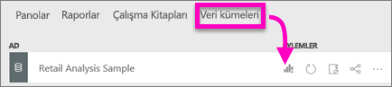
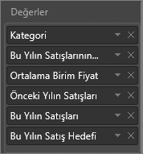
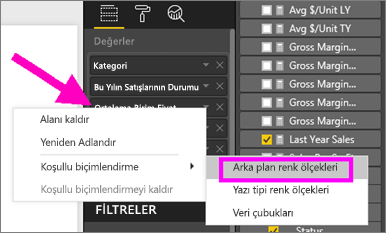
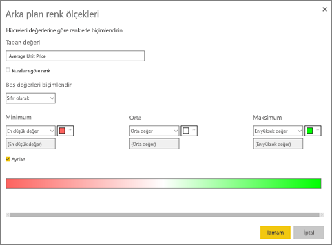
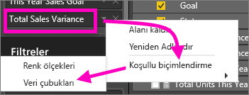
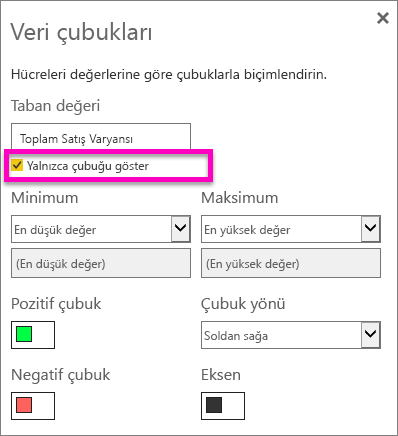

# Power BI rapor ve panolarında tablolarla çalışma (Eğitim)
Tablo, mantıksal satır ve sütun dizilerinde ilgili verileri içeren bir kılavuzdur. Tabloda başlık ve toplam satırı da bulunabilir. Tablolar, tek bir kategoriye ait birden fazla değeri incelediğiniz nicelik karşılaştırmaları için idealdir. Örneğin bu tabloda **Category** için 5 farklı ölçü gösterilmektedir.

## Tablolar ne zaman kullanılır?
Tablolar şunlar için harika seçimdir:

* ayrıntılı verileri ve tam değerleri görüp karşılaştırmak için (görsel gösterimler yerine)
* verileri tablo biçiminde görüntülemek için
* sayısal verileri kategorilere göre ayrılmış şekilde görüntülemek için   

> [!NOTE]
> Bir tabloda çok fazla değer varsa tabloyu matrise dönüştürmeyi ve/veya detaya gitme özelliğini kullanmayı deneyin.
> 
> 

## Tablo oluşturma
Birlikte ilerleyebilmek için Power BI'da oturum açın ve **Veri Al > Örnekler > Perakende Analizi Örneği**'ni seçin. Yukarıdaki resimde görülen ve ürün kategorisine göre satış değerlerini gösteren tabloyu oluşturacağız.

1. **Çalışma alanım** ekranında Veri Kümeleri sekmesini seçin ve sayfayı kaydırarak önceki adımda eklediğiniz Retail Analysis Sample'ı bulun.  **Rapor oluştur** simgesini seçin.
   
    
2. Rapor düzenleyicisinde **Item** > **Category**'yi seçin.  Power BI otomatik olarak tüm kategorileri listeleyen bir tablo oluşturur.
   
    
3. **Sales > Average Unit Price**, **Sales > Last Year Sales** ve **Sales > This Year Sales** öğelerini seçip 3 seçeneği de (Değer, Hedef, Durum) belirleyin.   
4. Görsel Öğeler bölmesinde **Değerler** kutusunu bulun ve değerleri grafiğinizdeki sıralama bu sayfadaki ilk görüntüdeki gibi olana kadar sürükleyip bırakın.  Değerlerinizin aşağıdaki gibi görünmesi gerekir.
   
    
5. Raptiye simgesini seçerek tabloyu panoya sabitleyin  
   
     

## Tabloyu biçimlendirme
Bir tabloyu biçimlendirmek için kullanabileceğiniz birçok farklı yöntem vardır. Burada yalnızca birkaç tanesini inceleyeceğiz. Diğer biçimlendirme seçenekleri hakkında bilgi edinmek için Biçimlendirme bölmesini açıp (boya rulosu simgesi ) kendiniz keşfedebilirsiniz.

* Tablo kılavuzunu biçimlendirmeyi deneyin. Burada mavi dikey kılavuz ekledik, satırlara boşluk ekledik, tablonun ana hatlarını ve metin boyutunu bir miktar artırdık.
  
    
  
    
* Sütun başlıklarında arka plan rengini değiştirdik, ana hat ekledik ve yazı tipi boyutunu artırdık. 
  
    
  
    
* Birkaç ek biçimlendirme sonrasında tablonun son halini aşağıda görebilirsiniz. Çok sayıda biçimlendirme seçeneği olduğundan öğrenmenin en iyi yolu düz tabloyla başlayıp Biçimlendirme bölmesini   açmak ve seçenekleri keşfetmeye başlamaktır. 
  
    

### Koşullu biçimlendirme
Biçimlendirme türlerinden biri de *koşullu biçimlendirmedir* ve Power BI hizmetinde veya Desktop uygulamasında **Görsel Öğeler** bölmesinin **Değerler** kutusundaki alanlara uygulanır. 

Tablolar için koşullu biçimlendirme sayesinde gradyan renklerini kullanma dahil olmak üzere hücre değerlerine göre özel hücre arka plan renkleri ve yazı tipi renkleri belirtebilirsiniz. 

1. Power BI hizmetinin veya Desktop uygulamasının **Görsel Öğeler** bölmesinde, **Değerler** kutusunda yer alan değerlerden biçimlendirmek istediğiniz değerin yanındaki aşağı oku seçin (veya alana sağ tıklayın). Koşullu biçimlendirmeyi yalnızca **Alanlar** kutusunun **Değerler** alanındaki alanlar için yönetebilirsiniz.
   
    
2. **Arka plan renk ölçekleri**'ni seçin. Açılan iletişim kutusunda rengin yanı sıra *Minimum* ve *Maksimum* değerleri yapılandırabilirsiniz. **Ayrılan** kutusunu seçerseniz isteğe bağlı bir *Orta* değer de yapılandırabilirsiniz.
   
    
   
    Şimdi Average Unit Price değerlerine özel biçimlendirme uygulayalım. **Ayrılan**'ı seçin, birkaç renk ekleyin ve **Tamam**'ı seçin. 
   
    
3. Tabloya hem pozitif hem de negatif değerler içeren yeni bir alan ekleyin.  **Sales > Total Sales Variance** öğesini seçin. 
   
    
4. **Total Sales Variance** öğesinin yanındaki aşağı oku seçip **Koşullu biçimlendirme > Veri çubukları** yolunu izleyerek veri çubuğu koşullu biçimlendirmesi ekleyin.
   
    
5. Açılan iletişim kutusunda **Pozitif çubuk** ve **Negatif çubuk** renklerini ayarlayın, **Yalnızca çubuğu göster**'in yanına onay işareti ekleyin ve istediğiniz diğer değişiklikleri yapın.
   
    
   
    **Tamam**'ı seçtiğinizde tabloda sayısal değerler verine veri çubukları gösterilir ve bu sayede tablo daha kolay anlaşılır hale gelir.
   
    
6. Bir görselleştirmedeki koşullu biçimlendirmeyi kaldırmak için alana tekrar sağ tıklayın ve **Koşullu Biçimlendirmeyi Kaldır**'ı seçin.

> [!TIP]
> Koşullu biçimlendirmeye Biçimlendirme bölmesinden (boya rulosu simgesi) de erişebilirsiniz. Biçimlendirmek istediğiniz değeri seçip **Renk ölçekleri** veya **Veri çubukları** seçeneklerini Açık konumuna getirerek varsayılan ayarları uygulayabilir veya **Gelişmiş denetimler**'i seçerek ayarları özelleştirebilirsiniz.
> 
> 

## Tablonun sütun genişliğini ayarlama
Bazen Power BI bir rapordaki veya bir panodaki sütun başlığını kısaltabilir. Sütun adının tamamını göstermek için başlığın sağ tarafındaki boşluğa giderek ikili okun görünmesini bekleyin, ardından seçin ve sürükleyin.

Başka bir sorunuz mu var? [Power BI Topluluğu'na başvurun](http://community.powerbi.com/)

