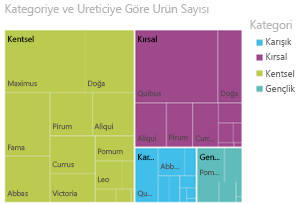
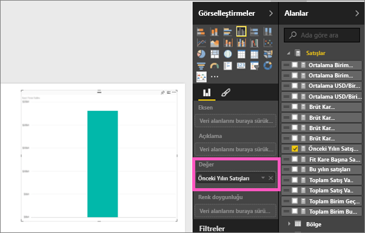
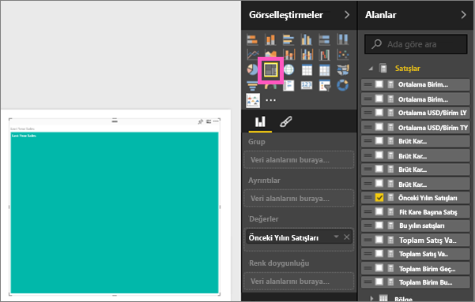
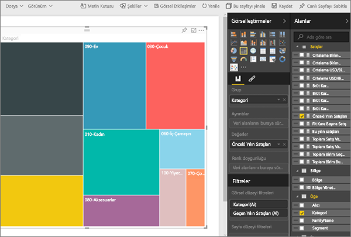
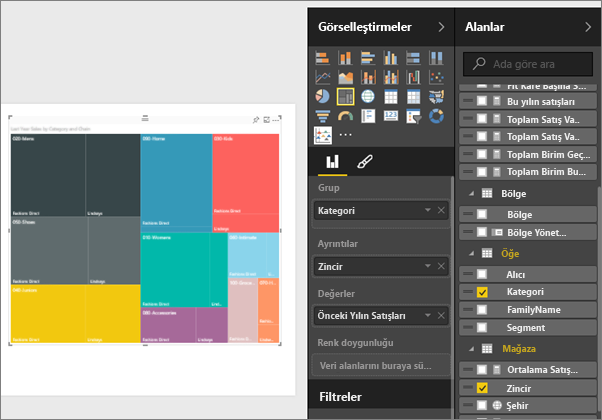
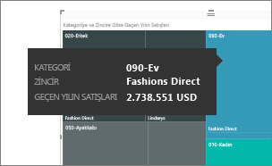
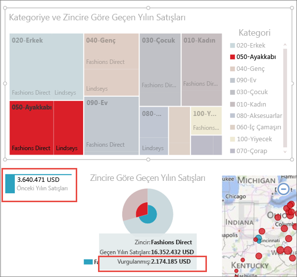

# Power BI'daki ağaç haritaları (Eğitim)
Ağaç haritaları, hiyerarşik verileri iç içe geçmiş dikdörtgenler kümesi şeklinde görüntüler.  Hiyerarşinin her düzeyi başka dikdörtgenler ("yapraklar") içeren renkli bir dikdörtgen (çoğunlukla "dal" olarak adlandırılır) ile gösterilir.  Her dikdörtgenin içindeki alan ölçülen nicel değere göre belirlenir ve dikdörtgenler, boyutları dikkate alınarak sol üstten (en büyük) sağ alta (en küçük) doğru düzenlenir.

Örneğin, satışlarımı çözümleyecek olursam giysi kategorisi için üst tarafta şu dikdörtgenleri (dallar) edinirim: **Urban**, **Rural**, **Youth** ve **Mix**.  Kategori dikdörtgenlerim, söz konusu kategori içindeki giysi üreticileri için daha küçük dikdörtgenler (yapraklar) içerir ve bu küçük dikdörtgenler satış miktarına göre boyutlandırılıp gölgelendirilir.  Yukarıdaki **Urban** dalında, Maximus giysilerinin çoğu satılmış, Natura ve Fama daha az satılmış, Leo ise çok az satılmıştır.  Bu nedenle, Ağaç Haritamın **Urban** dalındaki en büyük dikdörtgen Maximus'un (sol üst köşede), biraz daha küçük dikdörtgenler Natura ve Fama'nın, diğer dikdörtgenlerin çoğu satılan diğer giysilerin, küçük bir dikdörtgen ise Leo'nun olur.  Ayrıca her bir yaprak düğümünün boyutunu ve gölgelendirmesini kıyaslayarak, diğer giysi kategorilerinde satılan öğe sayısı ile karşılaştırma yapabilirim; dikdörtgen ne kadar büyük ve gölgelendirme ne kadar koyu olursa değer o kadar yüksek olur.

## Ağaç haritası ne zaman kullanılır?
Ağaç haritaları aşağıdaki durumlarda kullanım için mükemmel seçimdir:

* büyük miktarlarda hiyerarşik veri görüntüleme.
* çubuk grafik, yüksek miktarlardaki değerleri etkili bir şekilde işleyemediğinde.
* her bir parça ve bütün arasındaki oranları gösterme.
* hiyerarşideki kategorilerin her bir düzeyinde ölçü dağılımının desenini gösterme.
* boyut ve renk kodlaması kullanarak öznitelikleri gösterme.
* desenleri, aykırı değerleri, en önemli katkıda bulunanları ve istisnaları bulma.

## Basit bir ağaç haritası oluşturma
Önce, ağaç haritası oluşturma işleminin gösterildiği bir videoyu izlemek ister misiniz?  Bu videoda 2:10'a atlayarak Amanda'nın ağaç haritası oluşturmasını izleyin.

<iframe width="560" height="315" src="https://www.youtube.com/embed/IkJda4O7oGs" frameborder="0" allowfullscreen></iframe>

Alternatif olarak kendi ağaç haritanızı da oluşturabilirsiniz. Bu yönergelerde Perakende Analizi Örneği kullanılmaktadır. Birlikte ilerleyebilmek için; [örneği indirin](sample-datasets.md), Power BI'da oturum açın ve **Veri Al \> Excel Çalışma Kitabı \> Bağlan \> Retail Analysis Sample**.**xlsx** seçeneklerini belirleyin.

1. Çalışmaya [Düzenleme Görünümü](service-interact-with-a-report-in-editing-view.md)'nde başlayın ve **Sales** > **Last Years Sales** ölçüsünü seçin.   
   
2. Grafiği ağaç haritasına dönüştürün.  
   
3. **Grup** kutusuna **Item** > **Category** alanlarını sürükleyin. Power BI, dikdörtgen boyutunun toplam satışı, rengin ise kategoriyi gösterdiği bir ağaç haritası oluşturur.  Temelde, toplam satışın kategoriye göre boyutunu görsel olarak açıklayan bir hiyerarşi oluşturdunuz.  **Mens** kategorisi en yüksek satışlara sahipken **Hosiery** kategorisi en düşük satışlara sahip.
   
4. Ağaç haritanızı tamamlamak için **Ayrıntılar**'a **Store** > **Chain** alanlarını sürükleyin. Artık geçen yılın satışlarını kategori ve zincire göre karşılaştırabilirsiniz.   
   
   
   > [!NOTE]
   > Renk doygunluğu ve Ayrıntılar aynı anda kullanılamaz.
   > 
   > 
5. **Category**'nin bu kısmı için araç ipucunu göstermek üzere bir **Chain** alanının üzerine gelin.  Örneğin, **040-Juniors** dikdörtgeninde **Lindseys**'in üzerine geldiğinizde Juniors kategorisinin Lindseys kısmına ilişkin araç ipucu görünür.  
   
6. [Ağaç haritasını bir pano kutucuğu olarak ekleyin (görseli sabitleyin)](service-dashboard-tiles.md). 
7. [Raporu kaydedin](service-report-save.md).

## Vurgulama ve çapraz filtreleme
Filtreler bölmesini kullanmayla ilgili bilgi için bkz. [Bir rapora filtre ekleme](power-bi-report-add-filter.md).

Ağaç haritasında Category veya Ayrıntılar vurgulandığında rapor sayfasındaki diğer görselleştirmeler çapraz filtrelenir. (Vurgulamayı değiştirerek farklı sonuçlar elde edebilirsiniz.) Devam etmek için aynı sayfaya bazı görseller ekleyin veya ağaç haritasını kopyalayıp başka görseller içeren bir rapor sayfasına yapıştırın.

1. Ağaç haritasında, bir Category veya Category içinden bir Chain seçin.  Bu işlem ile sayfadaki diğer görselleştirmeler çapraz vurgulanır. Örneğin **050-Shoes** kategorisi seçildiğinde geçen yılki ayakkabı satışının 3.640.471 ABD doları olduğu ve bunun 2.174.185 ABD doları tutarındaki kısmının Fashions Direct'ten geldiği görülür.  
   
2. **Chain tarafından düzenlenen Last Year Sales** pasta grafiğinde, **Fashions Direct** dilimini seçin.  
   
3. Grafiklerin birbirini çapraz vurgulamasını ve çapraz filtrelemesini yönetmek için bkz. [Power BI raporlarındaki görselleştirme etkileşimleri](service-reports-visual-interactions.md)

## Sonraki adımlar
[Power BI'daki raporlar](service-reports.md)  
[Bir rapora görselleştirme ekleme](power-bi-report-add-visualizations-i.md)  
[Power BI'daki görselleştirme türleri](power-bi-visualization-types-for-reports-and-q-and-a.md)
[ Panoya görselleştirme sabitleme](service-dashboard-pin-tile-from-report.md)  
[Power BI - Temel Kavramlar](service-basic-concepts.md)  
[Ücretsiz deneyin!](https://powerbi.com/)

Başka bir sorunuz mu var? [Power BI Topluluğu'na başvurun](http://community.powerbi.com/)  

