# Power BI'daki görselleştirme türleri
## Power BI görselleştirmeleri
Yeni görselleştirmeler ekleyeceğiz, takipte kalın!

İndirip pano ve raporlarınızda kullanabileceğiniz [özel görsellerin](power-bi-custom-visuals.md) bulunduğu [Microsoft AppSource](https://appsource.microsoft.com/marketplace/apps?product=power-bi-visuals)'a göz atın. Buradaki listeye sürekli olarak yeni özel görseller eklenmektedir. Yaratıcılığınızı konuşturmak mı istiyorsunuz? [Kendi görsellerinizi oluşturmayı ve topluluk sitesine eklemeyi öğrenin](developer/office-store.md).  

## Power BI'da kullanılabilen görselleştirmelerin listesi
Tüm bu görselleştirmeler Power BI raporlarına eklenebilir, Soru-Cevap'ta belirtilebilir ve panolara sabitlenebilir.

### Alan grafikleri: Basit (Katmanlı) ve Yığılmış
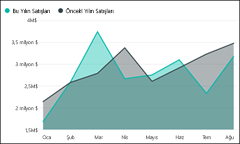

>[!TIP]
>Basit Alan grafiği için çizgi grafik temel alınır ve eksen ile çizgi arasındaki alan doldurulmuştur.

Daha fazla bilgi için bkz. [Eğitim: Basit Alan grafiği](power-bi-visualization-basic-area-chart.md).

### Çubuk grafikler ve sütun grafikleri
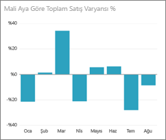 

 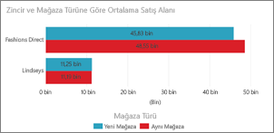

>[!TIP]
>Belirli bir değere farklı kategorilerde bakmak için standart olarak çubuk grafikler kullanılır.

### Kartlar: Çok satırlı kart

### Kartlar: Tek sayı içeren kart
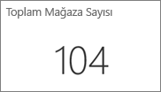

Daha fazla bilgi için bkz. [Kart (büyük sayı kutucuğu) oluşturma](power-bi-visualization-card.md).

### Birleşik haritalar
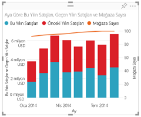

>[!TIP]
>Birleşik haritada sütun grafikleri ile çizgi grafikler birleştirilir. *Çizgi ve Yığılmış Sütun Grafiği* ile *Çizgi ve Kümelenmiş Sütun Grafiği* arasından seçim yapın.

Daha fazla bilgi için bkz. [Eğitim: Power BI'daki birleşik haritalar](power-bi-visualization-combo-chart.md).

### Halka grafikler

>[!TIP]
>Halka grafikler, Pasta grafiklerine benzerdir.  Parçaların bütünle ilişkisini gösterir.

Daha fazla bilgi için bkz. [Eğitim: Power BI'daki halka grafikler](power-bi-visualization-doughnut-charts.md).

### Huni grafikler
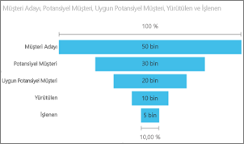

>[!TIP]
>Huniler, aşamalardan oluşan bir işlemin görselleştirilmesine yardımcı olur ve öğe akışı bir aşamadan diğerine sıralı olarak yapılır.  Aşamalar arasında sıralı bir akış olan durumlarda (müşteri adaylarıyla başlayıp satışı tamamlama ile sona eren bir satış işlemi gibi) huni kullanın.

Daha fazla bilgi için bkz. [Eğitim: Power BI'daki Huni Grafikler](power-bi-visualization-funnel-charts.md).

### Ölçek grafikleri
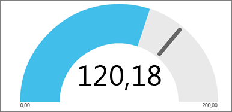

>[!TIP]
>Bir hedef bağlamında geçerli durumu görüntüler.

Daha fazla bilgi için bkz. [Eğitim: Power BI'daki Ölçek Grafikleri](power-bi-visualization-radial-gauge-charts.md).

### KPI'ler
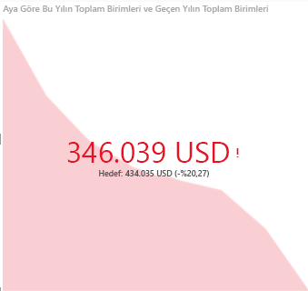

>[!TIP]
>Ölçülebilir bir hedef doğrultusunda ilerleme durumunu görüntüler.

Daha fazla bilgi için bkz. [Eğitim: Power BI'daki KPI'ler](power-bi-visualization-kpi.md).

### Çizgi grafikler
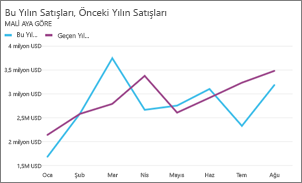

>[!TIP]
>Değerler dizisinin tümünün, genellikle zaman içindeki genel şeklini vurgular.

### Haritalar: Basit haritalar
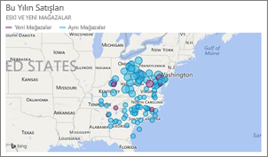

>[!TIP]
>Hem kategorik hem de nicel bilgileri uzamsal konumlar ile ilişkilendirmek için kullanılır.

Daha fazla bilgi için bkz. [Harita görselleri için ipuçları ve püf noktaları](power-bi-map-tips-and-tricks.md).

### Haritalar: ArcGIS haritaları
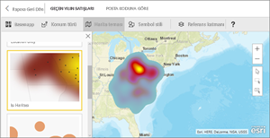

Daha fazla bilgi için bkz. [Eğitim: ArcGIS Maps for Power BI](power-bi-visualization-arcgis.md).

### Haritalar: Doldurulmuş haritalar (Koroplet haritalar)
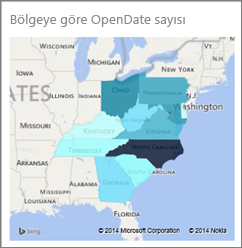

>[!TIP]
>Renk ne kadar yoğunsa değer de o kadar büyüktür.

Daha fazla bilgi için bkz. [Eğitim: Power BI'daki Doldurulmuş Haritalar](power-bi-visualization-filled-maps-choropleths.md).

### Matris
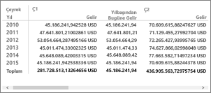

### Pasta grafikleri
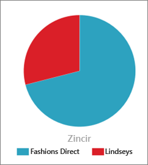

### Dağılım ve Kabarcık grafikleri
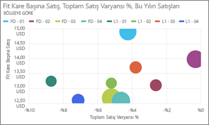

>[!TIP]
>2 (dağılım) veya 3 (kabarcık) nicel ölçü arasındaki ilişkileri (ilişki olup olmadığı, hangi sırada olduğu vb.) görüntüler.

Daha fazla bilgi için bkz. [Eğitim: Power BI'daki dağılım grafikleri](power-bi-visualization-scatter.md).

### Dilimleyiciler
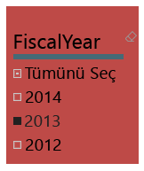

Daha fazla bilgi için bkz. [Eğitim: Power BI'daki dilimleyiciler](power-bi-visualization-slicers.md).

### Tek başına resimler

Daha fazla bilgi için bkz. [Panoya resim pencere öğesi ekleme](service-dashboard-add-widget.md).

### Tablolar
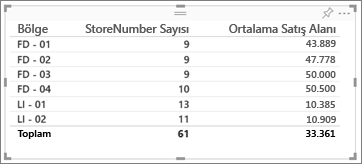

>[!TIP]
>Birçok kategori içeren öğeler arasında nicel karşılaştırmalar yapılacağında kullanışlıdır.

Daha fazla bilgi için bkz. [Power BI'da tablolarla çalışma](power-bi-visualization-tables.md).

### Ağaç Haritalar
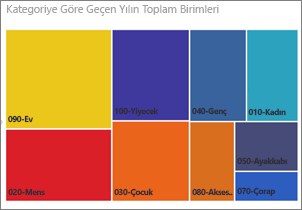

Daha fazla bilgi için bkz. [Eğitim: Power BI'daki ağaç haritalar](power-bi-visualization-treemaps.md).

>[!TIP]
>Değerleri boyut aracılığıyla temsil eden renkli dikdörtgenlerden oluşan grafiklerdir.  Bu grafikler hiyerarşik (ana dikdörtgenlerde iç içe geçmiş dikdörtgenler halinde) olabilir.

### Şelale grafikler

>[!TIP]
>Şelale grafikler, değer eklenip çıkarıldığında değişen toplamı gösterir.

Daha fazla bilgi için bkz. [Eğitim: Power BI'daki şelale grafikler](power-bi-visualization-waterfall-charts.md).

## Soru-Cevap özelliğinin hangi görselleştirmeleri kullanacağını belirtme
Power BI'ın Soru-Cevap özelliğini kullanarak doğal dil sorguları yazarken sorgunuzda görselleştirme türünü belirtebilirsiniz.  Örnek:

"***sales by state as a treemap***" (ağaç haritası olarak eyalete göre satışlar)

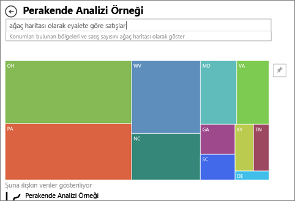

## Sonraki adımlar
[Power BI raporlarındaki görselleştirmeler](power-bi-report-visualizations.md)    
[Doğru görsel başvuruları ile ilgili sqlbi.com sayfası](http://www.sqlbi.com/wp-content/uploads/videotrainings/dashboarddesign/visuals-reference-may2017-A3.pdf)

[Power BI'daki raporlar](service-reports.md)

[Power BI - Temel Kavramlar](service-basic-concepts.md)

Başka bir sorunuz mu var? [Power BI Topluluğu'na başvurun](http://community.powerbi.com/)

