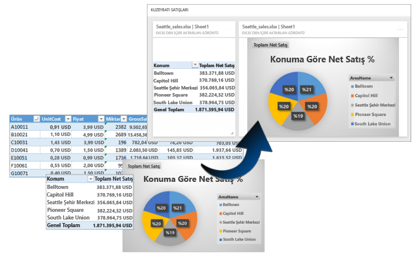
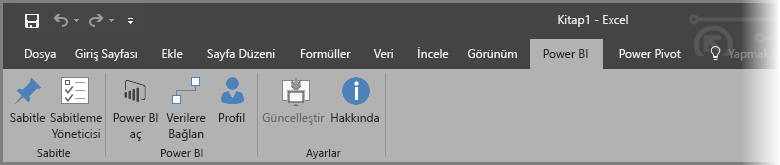
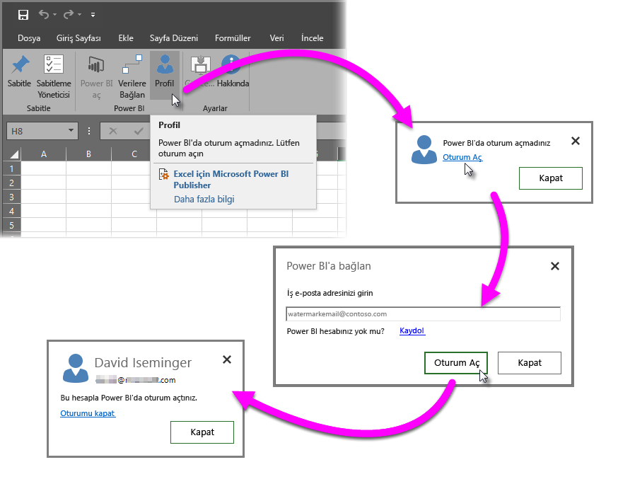
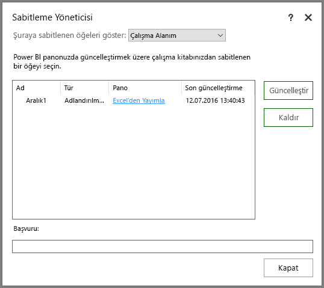
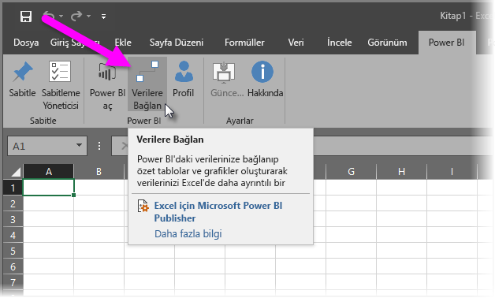
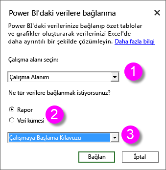
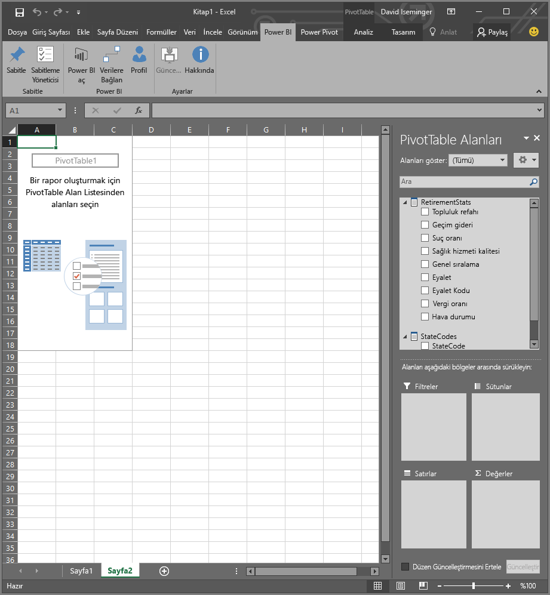
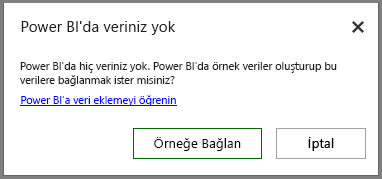

# Excel için Power BI Publisher
Microsoft **Excel için Power BI Publisher** sayesinde PivotTable'lar, grafikler ve aralıklar gibi Excel'deki en önemli öngörülerinizin anlık görüntülerini alabilir ve bunları Power BI panolarına sabitleyebilirsiniz.

Neleri sabitleyebilirsiniz? Bir Excel çalışma sayfasındaki neredeyse her şeyi. Basit bir sayfadaki veya tablodaki hücre aralığını, bir PivotTable veya PivotChart öğesini, çizimleri, resimleri ve metinleri seçebilirsiniz.

Sabitleyemeyeceğiniz öğeler: 3B Haritalar öğelerini veya Power View sayfalarındaki görselleştirmeleri sabitleyemezsiniz. Dilimleyici veya Zaman Çizelgesi filtresi gibi, sabitlenebilen ancak bu işlem için pek kullanışlı olmayan öğeler de vardır.

Excel'den bir öğe sabitlediğinizde Power BI'daki yeni veya mevcut bir panoya yeni kutucuk eklenir. Yeni kutucuk bir anlık görüntüdür, bu nedenle dinamik değildir ancak yine de güncelleştirilebilir. Örneğin önceden sabitlediğiniz bir PivotTable veya grafik üzerinde değişiklik yaparsanız Power BI'daki pano kutucuğu otomatik olarak güncelleştirilmez ancak **Pin Manager**'i kullanarak, sabitlediğiniz öğeleri güncelleştirebilirsiniz. İlerleyen bölümlerde **Pin Manager** hakkında daha fazla bilgi edineceksiniz.

## İndirme ve yükleme
Excel için Power BI Publisher, masaüstü için kullanılan Microsoft Excel 2007 ve sonraki sürümlerine yükleyebileceğiniz bir eklentidir.

[Excel için Power BI Publisher'ı indirin](http://go.microsoft.com/fwlink/?LinkId=715729)

Publisher eklentisini yükledikten sonra Excel'de yeni bir **Power BI** şeridi göreceksiniz. Bu şeridi kullanarak Power BI'da oturum açabilir (veya oturumu kapatabilir), panolara öğe sabitleyebilir ve önceden sabitlediğiniz öğeleri yönetebilirsiniz.

**Excel için Power BI Publisher** eklentisi varsayılan olarak etkindir ancak herhangi bir nedenle Excel'de Power BI Publisher şerit sekmesi görünmüyorsa eklentiyi etkinleştirmeniz gerekir. **Dosya** > **Seçenekler** > **Eklentiler** > **COM Eklentileri**'ne tıklayın. **Microsoft Excel için Power BI Publisher**'ı seçin.

## Panoya aralık sabitleme
Çalışma sayfanızdaki herhangi bir hücre aralığını seçip bu aralığın anlık görüntüsünü Power BI'daki mevcut veya yeni bir panoya sabitleyebilirsiniz. Aynı anlık görüntüyü birden fazla panoya da sabitleyebilirsiniz.

Başlamak için Power BI'da oturum açtığınızdan emin olun.

1. Excel'deki **Power BI** şerit sekmesinden **Profil**'i seçin. Power BI'da zaten oturum açtıysanız, kullanılmakta olan hesabın gösterildiği bir iletişim kutusu açılır. Kullanmak istediğiniz hesap buysa aralığınızı sabitlemek için sonraki adımlara geçebilirsiniz. Farklı bir Power BI hesabı kullanmak istiyorsanız *Oturumu kapat*'ı seçin. Oturum açmadıysanız sonraki adıma geçin (2. Adım).
   
   
2. Oturum açmadıysanız, Excel'deki **Power BI** şerit sekmesinden **Profil**'i seçtiğinizde görünen **Oturum Aç** bağlantısına tıklayın. **Power BI'a bağlan** iletişim kutusuna kullanmak istediğiniz Power BI hesabının e-posta adresini girip **Oturum Aç**'ı seçin.
   
   

Oturum açtıktan sonra bir panoya aralık sabitlemek için aşağıdaki adımları uygulayın:

1. Excel'de **Power BI** şerit sekmesini seçerek **Sabitle** şerit düğmesini görüntüleyin.
2. Excel çalışma kitabınızdan bir aralık seçin.
3. **Power BI** şeridindeki **Sabitle** düğmesine tıklayarak **Panoya sabitle iletişim kutusunu** açın. Henüz yapmadıysanız Power BI'da oturum açmanız istenir. **Çalışma Alanı** açılan listesinden bir çalışma alanı seçin. Aralığı kendi panonuza sabitlemek istiyorsanız **Çalışma Alanım**'ın seçili olduğundan emin olun. Aralığı grup çalışma alanındaki bir panoya sabitlemek istiyorsanız açılan listeden ilgili grubu seçin.
4. *Var olan panoya* sabitleme veya *yeni pano* oluşturma seçeneklerinden birini belirleyin.
5. Seçiminizi panoya sabitlemek için**Tamam**'a tıklayın.
6. **Panoya sabitle** bölümünde, mevcut panolardan birini seçin veya yeni bir pano oluşturun ve **Tamam** düğmesine tıklayın.
   
   

## Panoya Grafik sabitleme
Grafiğe ve ardından Sabitle'ye  tıklamanız yeterlidir.

## Sabitlenen öğeleri yönetme
**Pin Manager**'i kullanarak, Power BI'da bulunan, sabitlenmiş öğelerle ilişkili kutucukları güncelleştirebilirsiniz (yenileyebilirsiniz). Ayrıca Power BI'daki panolara önceden sabitlediğiniz öğeleri de kaldırabilirsiniz.

Panonuzdaki kutucukları güncelleştirmek için **Pin Manager**'da bir veya daha fazla öğe seçip **Güncelleştir** seçeneğini belirleyin.

Excel'deki sabitlenmiş bir öğe ile bir panodaki ilişkili kutucuk arasındaki eşlemeyi kaldırmak için **Kaldır**'ı seçin. **Kaldır**'ı seçtiğinizde Excel çalışma sayfasındaki öğe kaldırılmaz veya panodaki ilgili kutucuk *silinmez*. Bunun yerine, sabitlemeyi (veya *eşlemeyi*) kaldırmış olursunuz. Kaldırılan öğe artık **Pin Manager**'da görünmez. Öğe, yeniden sabitlemeniz halinde yeni bir kutucuk olarak görünür.

Bir panoda yer alan sabitlenmiş öğeyi (kutucuğu) kaldırmak için bu işlemi Power BI'da gerçekleştirmeniz gerekir. Silmek istediğiniz kutucukta, **Menüyü aç** simgesini  ve ardından **Kutucuğu sil**'i  seçin.

## Power BI'daki verilere bağlanma
**Excel için Power BI Publisher** eklentisinin Temmuz 2016 sürümünden itibaren (yukarıda bağlantısı verilen geçerli sürüm dahil olmak üzere) Power BI hizmetindeki verilere doğrudan bağlanabilir ve bu verileri Excel'de PivotTable'lar ve PivotChart'lar kullanarak çözümleyebilirsiniz. Bu özellik en önemli verilerinizi çözümlemenizi sağlamak için Power BI verilerini ve Excel'i birlikte kullanmanızı kolay hale getirir.

Yapılan geliştirmeler aşağıdakileri içerir:

* Power BI'daki verilere bağlanmak için gerekli sürücüler her sürümde otomatik olarak güncelleştirilir. Söz konusu sürücüleri yüklemenize veya yönetmenize gerek yoktur.
* Artık bağlantı oluşturmak için .odc dosyası indirmeniz gerekmez. Kullanmak istediğiniz raporu veya veri kümesini seçtiğinizde **Excel için Power BI Publisher** uygulaması, bağlantıları otomatik olarak oluşturur.
* Artık aynı çalışma kitabında birden fazla bağlantı ve PivotTable oluşturabilirsiniz
* Hata iletileri geliştirildi ve varsayıl Excel iletileri yerine **Excel için Power BI Publisher** uygulamasına özgü iletiler eklendi

### Excel'den Power BI verilerine bağlanma
**Excel için Power BI Publisher** eklentisini kullanarak Power BI verilerine bağlanmak için şu kolay adımları uygulayın:

1. Power BI'da oturum açtığınızdan emin olun. Oturum açma (veya başka bir hesapla oturum açma) adımları bu makalenin önceki bölümlerinde anlatılmıştır.
2. Kullanmak istediğiniz hesapla Power BI oturumu açtıktan sonra Excel'deki **Power BI** şerit sekmesinden **Verilere Bağlan**'ı seçin.
   
   
3. Excel, Power BI'a HTTPS üzerinden bağlanır ve **Power BI'daki verilere bağlanın** iletişim kutusunu görüntüler. Burada, verilerinizi seçmek istediğiniz *çalışma alanını* (aşağıdaki görüntüde bulunan 1 numaralı bölüm), bağlanmak istediğiniz *veri türünü* (**rapor** veya **veri kümesi**) (2) ve bir açılan menü (3) aracılığıyla, bağlantı kurulacak *mevcut raporu veya veri kümesini* seçebilirsiniz.
   
   
4. **Power BI'daki verilere bağlanın** iletişim kutusunda seçimlerinizi yapıp **Bağlan** seçeneğini belirlediğinizde Excel, bir PivotTable hazırlar ve **PivotTable Fields** bölmesini görüntüler. Burada, bağlı Power BI verilerinizdeki alanları seçebilir ve verileri çözümlemenize yardımcı olacak tablolar veya grafikler oluşturabilirsiniz.
   
   

Power BI'da veriniz yoksa Excel bunu algılar ve bağlantı kurup deneme yapmanız için örnek veriler oluşturmayı önerir.

**Excel için Power BI Publisher** eklentisinin bu sürümünde dikkat etmeniz gereken birkaç nokta vardır:

* **Paylaşılan veriler**: Sizinle paylaşılmış olan ancak Power BI'da doğrudan göremediğiniz veriler, **Verilere Bağlan** ekranında görüntülenmez.
* **Şirket içi SSAS**: Seçtiğiniz veri kümesi şirket içi SQL Server Analysis Services (SSAS) hizmetinde oluşturulmuşsa ve Power BI'daki veri kümesi verilere erişmek için DirectQuery kullanıyorsa **Excel için Power BI Publisher** eklentisi, bu verilere şirket içi ağ bağlantısı üzerinden bağlanır ve bağlantıyı Power BI üzerinden *gerçekleştirmez*. Bu nedenle, belirtilen türdeki veri kümelerine bağlanmaya çalışan kullanıcıların şirket içi ağa bağlı olması gerekir ve ilgili verilere erişmeye yönelik kimlik doğrulaması, verilerin depolandığı Analysis Services örneğinde kullanılan kimlik doğrulaması yöntemi kullanılarak gerçekleştirilir.
* **Gerekli sürücüler** - **Excel için Power BI Publisher** eklentisi bu özelliğin çalışması için gereken tüm sürücüleri otomatik olarak yükler. Otomatik olarak yüklenen bu sürücülerin arasında Analysis Services için Excel OLE DB sürücüsü de bulunur. Bu sürücünün kullanıcı tarafından (veya başka bir nedenle) kaldırılması halinde Power BI bağlantısı çalışmaz.
* **Veri kümelerinde ölçüler bulunmalıdır**: Excel'in ölçüleri PivotTable'larda değer olarak kullanması ve verileri doğru şekilde çözümlemesi için veri kümesinde tanımlanmış model ölçülerinin bulunması gerekir. [Ölçüler](desktop-measures.md) hakkında daha fazla bilgi edinin.
* **Grup desteği**: Belirtilen grup dışındaki kullanıcılarla paylaşılan veri kümeleri desteklenmez ve bu veri kümeleriyle bağlantı kurulamaz.
* **Ücretsiz ve Pro abonelikler**: Gruplarla ilgili etkinlikler ücretsiz Power BI sürümü kullanıcıları için desteklenmez ve bu nedenle, söz konusu kullanıcılar, bir grupla paylaşılmış olan veri kümelerini veya raporları kendi çalışma alanlarında göremez.
* **Paylaşılan raporlar veya veri kümeleri**: Sizinle paylaşılmış olan raporlara veya veri kümelerine bağlanılamaz.
* **Veri modelleri yerine tablo kullanma**: Yalnızca Excel'deki tabloların içeri aktarılmasıyla oluşturulmuş olan (veri modeli içermeyen) veri kümeleri ve raporlar şu an için desteklenmemektedir ve bu verilere bağlanılamaz.

İlgi çekici grafikler veya veri aralığı gibi başka görseller oluşturduktan sonra, söz konusu görselleri bu makalenin önceki bölümlerinde anlatılan adımları uygulayarak Power BI'daki bir panoya kolayca sabitleyebilirsiniz.

## İlgili Makaleler
Excel ve Power BI'ı birlikte kullanarak iki uygulamanın da öne çıkan özelliklerini çok çeşitli yollarla kullanabilirsiniz. Daha fazla bilgi için aşağıdaki makalelere göz atın.

* [Excel'de Çözümle](service-analyze-in-excel.md)
* [Excel'de çözümleme ile ilgili sorunları giderme](desktop-troubleshooting-analyze-in-excel.md)

