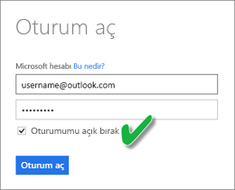

# OneDrive veya SharePoint Online'daki bir .CSV dosyasından oluşturulan veri kümelerini yenileme
## Avantajları nelerdir?
OneDrive veya SharePoint Online'daki bir .csv dosyasıyla bağlantı kurduğunuzda Power BI'da bir veri kümesi oluşturulur. .csv dosyasındaki veriler bu işlemden sonra Power BI'daki veri kümesine aktarılır. Ardından, Power BI otomatik olarak dosyaya bağlanarak, yapılan değişiklikleri Power BI'daki veri kümesine yansıtır. .csv dosyasını OneDrive veya SharePoint Online'da düzenledikten sonra dosyayı kaydetmeniz halinde, yaptığınız değişiklikler genellikle yaklaşık bir saat içinde Power BI'da görüntülenir. Power BI'daki ilgili veri kümesini kullanan görselleştirmeler de otomatik olarak güncelleştirilir.

Dosyalarınız OneDrive İş veya SharePoint Online'daki bir paylaşılan klasörde bulunuyorsa diğer kullanıcılar da aynı dosyanın üzerinde çalışabilir. Yaptığınız değişiklikler, kaydedildikten sonra otomatik olarak ve genellikle bir saat içinde Power BI'da da güncelleştirilir.

Birçok kuruluş her gün veritabanlarının otomatik olarak sorgulandığı ve toplanan verilerin bir .csv dosyasına kaydedildiği işlemler çalıştırmaktadır. Dosya OneDrive veya SharePoint Online'da depolanıyorsa ve her gün farklı adla yeni bir dosya oluşturmak yerine aynı dosyanın üzerine yazılıyorsa, Power BI'da bu dosyaya bağlanabilirsiniz. OneDrive veya SharePoint Online'daki dosya güncelleştirildikten kısa bir süre sonra, ilgili dosyayla bağlantı kuran veri kümeniz de eşitlenir. Veri kümesini kullanan görselleştirmeler de otomatik olarak güncelleştirilir.

## Desteklenenler
Virgülle ayrılmış değer dosyaları basit metin dosyalarıdır, bu nedenle dış veri kaynaklarına ve raporlara yönelik bağlantılar desteklenmez. Virgülle ayrılmış değer dosyasından oluşturulan veri kümelerinde yenileme zamanlayamazsınız. Ancak dosya OneDrive veya SharePoint Online'da bulunduğunda Power BI, dosyada yapılan tüm değişiklikleri yaklaşık bir saatlik aralıklarla otomatik olarak eşitler.

## OneDrive veya OneDrive İş. Fark nedir?
Hem kişisel OneDrive hem de OneDrive İş kullanıyorsanız Power BI'da bağlanmak istediğiniz dosyaları OneDrive İş hesabınızda tutmanız önerilir. Nedeni bu hesaplarda oturum açmak için muhtemelen farklı hesaplar kullanıyor olmanızdır.

Power BI'da oturum açmak için kullandığınız hesap, OneDrive İş'te oturum açmak için kullandığınız hesapla genellikle aynı olduğundan, Power BI'da OneDrive İş'e kesintisiz bir şekilde bağlanabilirsiniz. Ancak kişisel OneDrive hesabınızda oturum açmak için muhtemelen farklı bir [Microsoft hesabı](https://account.microsoft.com) kullanıyorsunuzdur.

Microsoft hesabınızda oturum açtığınızda Oturumumu açık bırak'ı seçmeyi unutmayın. Bu sayede Power BI, veri kümelerinde gerekli güncelleştirmeleri gerçekleştirebilir

Microsoft hesap bilgileriniz değişmiş olabileceğinden OneDrive'daki .csv dosyanızda yaptığınız değişikliklerin Power BI'daki veri kümesiyle eşitlenememesi durumunda, kişisel OneDrive hesabınızdaki dosyaya yeniden bağlanmanız ve verileri tekrar içeri aktarmanız gerekir.

## Bir şeyler ters gittiğinde
OneDrive hesabınızdaki .csv dosyasında bulunan veriler değiştirilmesine rağmen Power BI'da güncelleştirme gerçekleştirilmiyorsa bu, Power BI'ın OneDrive hesabınızla bağlantı kuramamasından kaynaklanıyor olabilir. Dosyaya yeniden bağlanıp içeri aktarma işlemini tekrar gerçekleştirmeyi deneyin. Oturum açmanız istenirse **Oturumumu açık bırak**'ı seçmeyi unutmayın.

## Sonraki adımlar
[Yenileme sorunlarını gidermeye yönelik araçlar](service-gateway-onprem-tshoot.md)
[Yenileme ile ilgili sorun giderme senaryoları](refresh-troubleshooting-refresh-scenarios.md)

Başka bir sorunuz mu var? [Power BI Topluluğu'na sorun](https://community.powerbi.com/)

