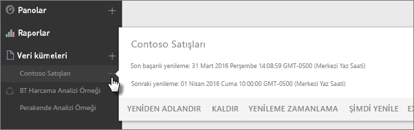
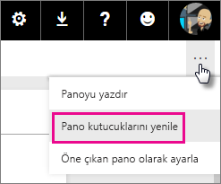
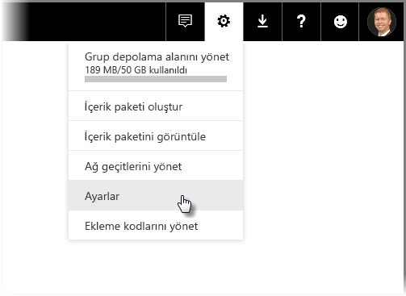
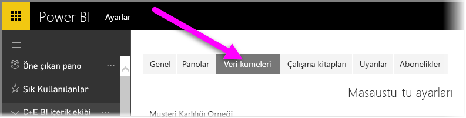
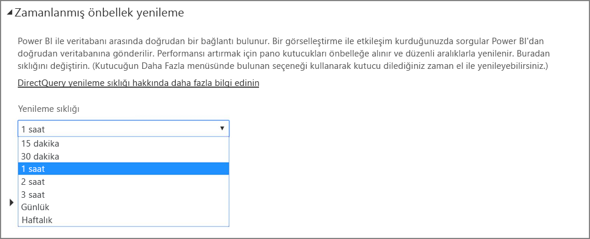

# Power BI'da veri yenileme
Her zaman en son verileri aldığınızdan emin olmak, çoğu zaman doğru kararları vermenizde kritik rol oynar. Büyük ihtimalle daha önce bazı verilere bağlanmak ve verileri karşıya yüklemek için Power BI'da Veri Al seçeneğini kullandınız, bazı raporlar ve bir pano oluşturdunuz. Şimdiyse verilerinizin gerçekten de en iyi ve en güncel durumda olduğundan emin olmak istiyorsunuz.

Çoğu durumda hiçbir şey yapmanız gerekmez. Salesforce veya Marketo içerik paketi gibi bazı veriler sizin için otomatik olarak yenilenir. Bağlantınız canlı bağlantı veya DirectQuery ile kuruluyorsa veriler en güncel duruma getirilecektir. Ancak diğer durumlarda (örneğin dış çevrimiçi ya da şirket içi veri kaynağı ile bağlantı halindeki bir Excel çalışma kitabı veya Power BI Desktop dosyası ile çalışırken) verileri el ile yenilemeniz ya da Power BI hizmetinin sizin adınıza raporlarınızdaki ve panolarınızdaki verileri yenilemesi için bir yenileme zamanlaması ayarlamanız gerekecektir.

Bu ve birkaç başka makale; Power BI hizmetinde veri yenilemenin nasıl çalıştığını, bir yenileme zamanlaması oluşturmanız gereken durumları ve verilerinizi başarıyla yenilemek için ihtiyacınız olanları anlamanız için size yardımcı olmak amacıyla hazırlanmıştır.

## Veri yenilemeyi anlama
Yenilemeyi ayarlamadan önce neyi yenilediğinizi ve verilerinizi nereden aldığınızı anlamanız önemlidir.

*Veri kaynağı*, raporlarınızda ve panolarınızda gördüğünüz verilerin geldiği yerdir; örneğin Google Analytics veya QuickBooks gibi bir çevrimiçi hizmet, Azure SQL Veritabanı gibi bulut ortamındaki bir veritabanı veya kuruluşunuzdaki yerel bir bilgisayar ya da sunucuda bulunan bir veritabanı veya dosya olabilir. Bunların hepsi veri kaynağıdır. Veri kaynağının türü, kaynaktan verilerin nasıl yenilendiğini belirler. Daha sonra [Neler yenilenebilir?](#what-can-be-refreshed) bölümünde her veri kaynağı türü için yenilemeyi daha ayrıntılı şekilde ele alacağız.

*Veri kümesi*, Veri Al seçeneğini kullanarak bir içerik paketine veya dosyaya bağlandığınızda ve bunlardan veri yüklediğinizde ya da canlı bir veri kaynağına bağlandığınızda Power BI'da otomatik olarak oluşturulur. Power BI Desktop ve Excel 2016'da tıpkı Veri Al ile olduğu gibi dosyanızı doğrudan Power BI hizmetinde yayımlayabilirsiniz.

Her durumda, bir veri kümesi oluşturulur ve Power BI hizmetindeki Çalışma Alanım ya da Grup kapsayıcılarında görünür. Bir veri kümesi için **üç nokta (...)** simgesini seçtiğinizde bir rapordaki verileri araştırabilir, ayaları düzenleyebilir ve yenileme ayarlayabilirsiniz.

Bir veri kümesi, bir veya daha fazla veri kaynağından veri alabilir. Örneğin, Power BI Desktop'ı kuruluşunuzdaki bir SQL Veritabanından veri alabilir ve diğer verileri OData akışından çevrimiçi alabilirsiniz. Ardından, dosyayı Power BI hizmetinde yayımladığınızda tek bir veri kümesi oluşturulur ancak hem SQL Veritabanı hem de OData akışına ait veri kaynaklarını içerir.

Bir veri kümesi; veri kaynakları, veri kaynağı kimlik bilgileri ve çoğu durumda veri kaynağından kopyalanan bir alt veri kümesi hakkında bilgiler içerir. Raporlar ve panolarda görselleştirmeler oluşturduğunuzda, veri kümesindeki verileri incelediğinizde veya Azure SQL Veritabanı gibi bir canlı bağlantı olması durumunda veri kümesi, doğrudan veri kaynağından görüntülediğiniz verileri tanımlar. Analysis Services canlı bağlantıları için veri kümesi tanımı, doğrudan Analysis Services kaynağından gelir.

> *Verileri yenilediğinizde veri kaynağınızdan alınıp Power BI'da depolanan veri kümesindeki verileri güncelleştirirsiniz. Bu, artımlı yenileme değil, tam yenilemedir.*
> 
> 

İster Şimdi Yenile kullanarak ister bir yenileme zamanlaması oluşturarak bir veri kümesindeki verileri yenilediğinizde Power BI, veri kümesindeki bilgileri kullanarak kendisi için tanımlanan veri kaynaklarına bağlanır, güncelleştirilen verileri sorgular ve ardından güncelleştirilen verileri veri kümesine yükler. Raporlarınız veya panolarınızda bulunan ve verilere dayanan tüm görselleştirmeler otomatik olarak güncelleştirilir.

Daha fazla ayrıntıya geçmeden önce anlaşılması gereken çok önemli bir husus vardır:

> *Veri kümesini ne kadar sık yenilerseniz yenileyin veya canlı verileri ne kadar sık görüntülerseniz görüntüleyin önce veri kaynağındaki verilerin güncel olması gerekir.*
> 
> 

Çoğu kuruluş, verilerini genellikle akşam olmak üzere günde bir kez işler. Şirket içindeki veritabanına bağlı bir Power BI Desktop dosyasından oluşturulan bir veri kümesi için yenileme zamanlaması oluşturursanız ve BT departmanı akşamları bir kez bu SQL veritabanı üzerinde işlemler yürütürse yalnızca günde bir kez gerçekleştirilmek üzere bir yenileme zamanlaması oluşturmanız gerekir. Örneğin, veritabanı üzerinde işlem yapıldıktan sonra ancak mesai başlamadan önce olacak şekilde. Elbette her zaman bu durum geçerli değildir. Power BI hizmeti; sık sık, hatta gerçek zamanlı olarak güncelleştirilen veri kaynaklarına bağlanma olanakları sağlar.

## Yenileme türleri
Power BI hizmetinde gerçekleşen dört ana yenileme türü vardır. Paket yenileme, model/veri yenileme, kutucuk yenileme ve görsel kapsayıcı yenileme.

### Paket yenileme
Bu, Power BI Desktop veya Excel dosyanızı Power BI hizmeti ve OneDrive veya SharePoint Online arasında eşitler. Bu, orijinal veri kaynağından veri çekmez. Power BI'daki veri kümesi yalnızca OneDrive veya SharePoint Online içindeki dosya ile güncelleştirilecektir.

### Model/veri yenileme
Bu, Power BI hizmetindeki veri kümesini orijinal veri kaynağından elde edilen veriler ile yenileme anlamına gelir. Bu, zamanlanmış yenileme veya şimdi yenile seçeneği kullanılarak gerçekleştirilir. Bu yenileme türü için şirket içi veri kaynaklarına yönelik bir ağ geçidi gerekir.

### Kutucuk yenileme
Kutucuk yenileme, veri değiştikten sonra panoda kutucuk görsellerinin önbelleğini güncelleştirir. On beş dakikada bir gerçekleştirilir. Ayrıca, bir panonun sağ üst bölümündeki **üç nokta (...)** simgesini seçerek ve **Pano kutucuklarını yenile** seçeneğini belirleyerek kutucuk yenileme işlemi yapabilirsiniz.

Genel kutucuk yenileme hataları ile ilgili ayrıntılar için bkz. [Kutucuk hatalarıyla ilgili sorunları giderme](refresh-troubleshooting-tile-errors.md).

### Görsel kapsayıcı yenileme
Görsel kapsayıcı yenileme bir raporda veri değiştikten sonra önbelleğe alınan rapor görsellerini güncelleştirir.

## Ne yenilenebilir?
Power BI'da tipik olarak Veri Al seçeneğini kullanarak yerel bir sürücü, OneDrive veya SharePoint Online'dan bir dosyadan verileri içeri aktarır, Power BI Desktop'tan bir rapor yayımlar veya doğrudan kuruluşunuzdaki bulut ortamında bulunan bir veritabanına bağlanırsınız. Power BI'da neredeyse tüm veriler yenilenebilir ancak yenileme ihtiyacı veri kümenizin nasıl oluşturulduğuna ve bağlı olduğu veri kaynaklarına göre değişir. Veri yenileme açısından her birini inceleyelim.

Daha fazla ayrıntıya geçmeden önce anlaşılması gereken bazı önemli hususlar vardır:

**Otomatik yenileme**: Veri kümesinin düzenli olarak yenilenmesi için herhangi bir kullanıcı yapılandırmasının gerekli olmadığı anlamına gelir. Veri yenileme ayarları Power BI tarafından sizin için yapılandırılır. Çevrimiçi hizmet sağlayıcılar için yenileme genellikle günde bir kez gerçekleşir. OneDrive'dan yüklenen dosyalar için otomatik yenileme, dış veri kaynağından alınmayan veriler için bir saatlik aralıklarla gerçekleşir. Farklı yenileme zamanlaması ayarları yapılandırabilir ve el ile yenileyebilirsiniz ancak büyük olasılıkla buna ihtiyaç duymazsınız.

**Kullanıcı tarafından yapılandırılan el ile veya zamanlanmış yenileme**: Bu, Şimdi Yenile seçeneğini kullanarak bir veri kümesini kendiniz ayarlayabileceğiniz veya bir veri kümesi ayarlarında Yenilemeyi Zamanla seçeneğini kullanarak bir yenilemeye zamanlaması oluşturabileceğiniz anlamına gelir. Bu yenileme türü, dış çevrimiçi ve şirket içi veri kaynaklarına bağlanan Power BI Desktop dosyaları ve Excel çalışma kitapları için gereklidir.

> [!NOTE]
> Zamanlanmış yenileme için bir saat yapılandırdığınızda başlamadan önce bir saate kadar gecikme yaşanabilir.
> 
> 

**Canlı/DirectQuery**: Bu, Power BI ile veri kaynağı arasında canlı bir bağlantı olduğu anlamına gelir. Şirket içi veri kaynakları için Yöneticilerin kurumsal ağ geçidinde bir veri kaynağını yapılandırması gerekecektir ancak kullanıcı etkileşimi gerekmeyebilir.

> [!NOTE]
> Performansı artırmak için, DirectQuery ile bağlı verileri olan panolar otomatik olarak güncelleştirilir. Ayrıca, kutucuktaki **Daha Fazla** menüsünü kullanarak dilediğiniz zaman bir kutucuğu kendiniz yenileyebilirsiniz.
> 
> 

## Yerel dosyalar ve OneDrive veya SharePoint Online'daki dosyalar
Veri yenileme, dış çevrimiçi veya şirket içi veri kaynaklarına bağlanan Power BI Desktop dosyaları ve Excel çalışma kitapları için desteklenir. Bu, yalnızca Power BI hizmetindeki veri kümesi için verileri yeniler. Yerel dosyanızı güncelleştirmez.

Dosyalarınızı OneDrive veya SharePoint Online'da tutmanız ve bunları Power BI hizmetinden bağlamanız büyük bir esneklik sağlar. Ancak bu esneklik aynı zamanda anlaşılmasını çok güç hale getirir. OneDrive veya SharePoint Online'da depolanan dosyalar için zamanlanmış yenileme paket yenilemeden farklıdır. [Yenileme türleri](#types-of-refresh) bölümünden daha fazla bilgi edinebilirsiniz.

### Power BI Desktop dosyası

| **Veri kaynağı** | **Otomatik yenileme** | **Kullanıcı tarafından yapılandırılan el ile veya zamanlanmış yenileme** | **Ağ geçidi gerekli** |
| --- | --- | --- | --- |
| Veri Al (şerittedir) listelenen tüm çevrimiçi veri kaynaklarına bağlanmak ve bunlardan veri sorgulamak üzere kullanılır. |Hayır |Evet |Hayır (aşağıya bakın) |
| Veri Al, canlı bir Analysis Services veritabanına bağlanmak ve veritabanını araştırmak üzere kullanılır. |Evet |Hayır |Evet |
| Veri Al, desteklenen bir şirket içi DirectQuery veri kaynağına bağlanmak ve veri kaynağını araştırmak üzere kullanılır. |Evet |Hayır |Evet |
| Veri Al, bir Azure SQL Veritabanı, Azure SQL Veri Ambarı, Azure HDInsight Spark Hizmeti'ne bağlanmak ve bunlardan veri sorgulamak üzere kullanılır. |Evet |Evet |Hayır |
| Veri Al, Hadoop dosyası (HDFS) ve Microsoft Exchange dışında listelenen tüm şirket içi veri kaynaklarına bağlanmak ve veri kaynaklarından veri sorgulamak üzere kullanılır. |Hayır |Evet |Evet |

> [!NOTE]
> [**Web.Page**](https://msdn.microsoft.com/library/mt260924.aspx) işlevini kullanırken, veri kümesini veya raporunuzu 18 Kasım 2016 tarihinden sonra yeniden yayımladıysanız bir ağ geçidi gereklidir.
> 
> 

Ayrıntılar için bkz. [OneDrive'daki bir Power BI Desktop dosyasından oluşturulan veri kümelerini yenileme](refresh-desktop-file-onedrive.md).

### Excel çalışma kitabı

| **Veri kaynağı** | **Otomatik yenileme** | **Kullanıcı tarafından yapılandırılan el ile veya zamanlanmış yenileme** | **Ağ geçidi gerekli** |
| --- | --- | --- | --- |
| Excel veri modeline yüklenmeyen çalışma sayfasındaki veri tabloları. |Evet, saatlik *(yalnızca OneDrive/SharePoint Online)* |Yalnızca el ile *(yalnızca OneDrive/SharePoint Online)* |Hayır |
| Excel veri modelinde bir tabloyla bağlantılı çalışma sayfasındaki veri tabloları (bağlantılı tablolar). |Evet, saatlik *(yalnızca OneDrive/SharePoint Online)* |Yalnızca el ile *(yalnızca OneDrive/SharePoint Online)* |Hayır |
| Power Query*, listelenen tüm çevrimiçi veri kaynaklarına bağlanmak, veri kaynaklarından veri sorgulamak ve Excel veri modeline veri yüklemek üzere kullanılır. |Hayır |Evet |Hayır |
| Power Query*, Hadoop dosyası (HDFS) ve Microsoft Exchange dışında listelenen tüm şirket içi veri kaynaklarına bağlanmak, veri kaynaklarından veri sorgulamak ve Excel veri modeline veri yüklemek üzere kullanılır. |Hayır |Evet |Evet |
| Power Pivot, listelenen tüm çevrimiçi veri kaynaklarına bağlanmak, veri kaynaklarından veri sorgulamak ve Excel veri modeline veri yüklemek üzere kullanılır. |Hayır |Evet |Hayır |
| Power Pivot, listelenen tüm şirket içi veri kaynaklarına bağlanmak, veri kaynaklarından veri sorgulamak ve Excel veri modeline veri yüklemek üzere kullanılır. |Hayır |Evet |Evet |

*\* Power Query, Excel 2016'da Al ve Dönüştür olarak bilinir.*

Daha ayrıntılı bilgi için bkz. [OneDrive'daki bir Excel çalışma kitabından oluşturulan veri kümelerini yenileme](refresh-excel-file-onedrive.md).

### OneDrive veya SharePoint Online'da virgülle ayrılmış değer (.csv) dosyası

| **Veri kaynağı** | **Otomatik yenileme** | **Kullanıcı tarafından yapılandırılan el ile veya zamanlanmış yenileme** | **Ağ geçidi gerekli** |
| --- | --- | --- | --- |
| Basit virgülle ayrılmış değer |Evet, saatlik |Yalnızca el ile |Hayır |

Daha ayrıntılı bilgi için bkz. [OneDrive'daki bir virgülle ayrılmış değer (.csv) dosyasından oluşturulan veri kümelerini yenileme](refresh-csv-file-onedrive.md).

## İçerik paketleri
Power BI'da iki tür içerik paketi vardır:

**Çevrimiçi hizmetlerden içerik paketleri**: örneğin Adobe Analytics, SalesForce ve Dynamics CRM Online. Çevrimiçi hizmetlerden oluşturulan veri kümeleri otomatik olarak günde bir kez yenilenir. Büyük olasılıkla gerekli olmasa da el ile yenileyebilir veya bir yenileme zamanlaması ayarlayabilirsiniz. Çevrimiçi hizmetler bulut ortamında olduğundan ağ geçidi gerekmez.

**Kurumsal içerik paketleri**: Kuruluşunuzdaki kullanıcılar tarafından oluşturulur ve paylaşılır. İçerik paketi tüketicileri bir yenileme zamanlaması oluşturamaz veya el ile yenileme yapamaz. Yalnızca içerik paketini oluşturan kişi içerik paketindeki veri kümeleri için yenileme ayarlayabilir. Yenileme ayarları veri kümesi ile birlikte devralınır.

### Çevrimiçi hizmetlerden içerik paketleri

| **Veri kaynağı** | **Otomatik yenileme** | **Kullanıcı tarafından yapılandırılan el ile veya zamanlanmış yenileme** | **Ağ geçidi gerekli** |
| --- | --- | --- | --- |
| Veri Al &gt; Hizmetler yolundaki çevrimiçi hizmetler |Evet |Evet |Hayır |

### Kurumsal içerik paketleri
Kurumsal bir içerik paketinde yer alan veri kümelerine ilişkin yenileme özellikleri, veri kümelerine bağlı olarak değişiklik gösterir. Yerel dosyalar, OneDrive veya SharePoint Online ile ilgili yukarıdaki bilgilere bakın.

Daha fazla bilgi için bkz. [Kurumsal içerik paketlerine giriş](service-organizational-content-pack-introduction.md).

## Şirket içi veri kaynaklarına DirectQuery ve canlı bağlantılar
Şirket içi veri ağ geçidi ile Power BI'dan şirket içi veri kaynaklarınıza sorgu iletebilirsiniz. Bir görselleştirme ile etkileşim kurduğunuzda sorgular Power BI'dan doğrudan veritabanına gönderilir. Ardından, güncelleştirilen veri döndürülür ve görselleştirmeler güncelleştirilir. Power BI ve veritabanı arasında doğrudan bağlantı olduğundan yenileme zamanlaması oluşturmanız gerekmez.

Canlı bağlantı kullanarak SQL Service Analysis Services (SSAS) veri kaynağına bağlanırken bir SSAS kaynağına Canlı bağlantı, raporu yüklerken bile DirectQuery'nin aksine önbelleğe karşı çalışabilir. Bu davranış, rapor için yükleme performansını artırır. **Yenile** düğmesini kullanarak SSAS veri kaynağından son verileri isteyebilirsiniz. SSAS veri kaynakları sahipleri, raporların gerektiği şekilde güncelleştirilmesini sağlamak üzere veri kümesi için zamanlanmış önbellek yenileme sıklığını yapılandırabilir. 

Şirket içi veri ağ geçici ile bir veri kaynağını yapılandırırken veri kaynağını zamanlanmış yenileme seçeneği olarak kullanabilirsiniz. Bu, kişisel ağ geçidinin yerini alacaktır.

> [!NOTE]
> Veri kümeniz canlı veya DirectQuery bağlantısı için yapılandırılmışsa veri kümeleri yaklaşık bir saatlik aralıklarla veya veri etkileşimi gerçekleştiğinde yenilenir. *Yenileme sıklığını* Power BI hizmetinde *Zamanlanmış önbellek yenileme* seçeneğinde el ile ayarlayabilirsiniz.
> 
> 

| **Veri kaynağı** | **Canlı/DirectQuery** | **Kullanıcı tarafından yapılandırılan el ile veya zamanlanmış yenileme** | **Ağ geçidi gerekli** |
| --- | --- | --- | --- |
| Analysis Services - Tablo |Evet |Evet |Evet |
| Analysis Services - Çok Boyutlu |Evet |Evet |Evet |
| SQL Server |Evet |Evet |Evet |
| SAP HANA |Evet |Evet |Evet |
| Oracle |Evet |Evet |Evet |
| Teradata |Evet |Evet |Evet |

Daha fazla bilgi için bkz. [Şirket içi veri ağ geçidi](service-gateway-onprem.md)

## Bulut ortamında veritabanları
DirectQuery sayesinde Power BI ve bulut ortamındaki veritabanı arasında doğrudan bir bağlantı bulunur. Bir görselleştirme ile etkileşim kurduğunuzda sorgular Power BI'dan doğrudan veritabanına gönderilir. Ardından, güncelleştirilen veri döndürülür ve görselleştirmeler güncelleştirilir. Üstelik Power BI hizmeti ve veri kaynağı bulutta olduğundan Kişisel Ağ Geçidi gerekmez.

Bir görselleştirmede kullanıcı etkileşimi yoksa veriler yaklaşık olarak bir saatlik aralıklarla otomatik yenilenir. *Zamanlanmış önbellek yenileme* seçeneğini kullanarak yenileme sıklığını değiştirebilir ve yenileme sıklığını belirleyebilirsiniz.

Sıklığı ayarlamak için Power BI hizmetinde sağ üst köşede yer alan **dişli** simgesini ve ardından **Ayarlar** seçeneğini belirleyin.

**Ayarlar** sayfası görüntülenir; bu sayfada sıklığını ayarlamak istediğiniz veri kümesini seçebilirsiniz. Sayfanın üst kısımda yer alan **Veri Kümeleri** sekmesini seçin.

Veri kümesini seçtikten sonra sağ bölmede ilgili veri kümesine ait bir dizi seçenek görüntülenir. DirectQuery/Canlı bağlantı için, aşağıdaki görüntüde gösterildiği şekilde ilişkili açılan menüyü kullanarak yenileme sıklığını 15 dakika yerine haftalık olarak ayarlayabilirsiniz.

| **Veri kaynağı** | **Canlı/DirectQuery** | **Kullanıcı tarafından yapılandırılan el ile veya zamanlanmış yenileme** | **Ağ geçidi gerekli** |
| --- | --- | --- | --- |
| Azure SQL Veri Ambarı |Evet |Evet |Hayır |
| HDInsight'taki Spark Hizmeti |Evet |Evet |Hayır |

Daha fazla bilgi için bkz. [Azure ve Power BI](service-azure-and-power-bi.md).

## Gerçek zamanlı panolar
Gerçek zamanlı panolar, verilerin güncel olduğundan emin olmak için Microsoft Power BI REST API'sini veya Microsoft Stream Analytics'i kullanır. Kullanıcıların gerçek zamanlı panolar için yenilemeyi yapılandırması gerekmediğinden gerçek zamanlı panolar, bu makale kapsamında ele alınmamaktadır.

| **Veri kaynağı** | **Otomatik** | **Kullanıcı tarafından yapılandırılan el ile veya zamanlanmış yenileme** | **Ağ geçidi gerekli** |
| --- | --- | --- | --- |
| Power BI Rest API'si veya Microsoft Stream Analytics ile geliştirilmiş özel uygulamalar |Evet, canlı akış |Hayır |Hayır |

## Zamanlanmış yenileme yapılandırma
Zamanlanmış yenileme yapılandırma konusunda bilgi edinmek için bkz. [Zamanlanmış yenileme yapılandırma](refresh-scheduled-refresh.md)

## Yaygın veri yenileme senaryoları
Bazen Power BI'da veri yenileme ile ilgili bilgi edinmenin en iyi yolu örnekleri incelemektir. Yaygın olarak karşılaşılan veri yenileme senaryolarından bazıları şu şekildedir:

### Veri tabloları içeren Excel çalışma kitabı
Birden fazla veri tablosu içeren bir Excel çalışma kitabınız var ancak bunların hiçbiri Excel veri modeline yüklü değil. Veri Al işlevini kullanarak çalışma kitabını yerel sürücünüzden Power BI'a yükleyip bir pano oluşturuyorsunuz. Daha sonra yerel sürücünüzdeki çalışma kitabı tablolarının bazıları üzerinde değişiklik yapıyorsunuz ve Power BI'daki panonuzu yeni veriler ile güncelleştirmek istiyorsunuz.

Ne yazık ki bu senaryoda yenileme desteklenmez. Panonuzdaki veri kümesini yenilemek için çalışma kitabını yeniden yüklemeniz gerekecektir. Öte yandan, gerçekten harika bir çözüm vardır: Çalışma kitabı dosyanızı OneDrive'a veya SharePoint Online'a koyun!

OneDrive veya SharePoint Online'daki bir dosyaya bağlandığınızda raporlarınız ve panolarınız, verileri dosyadaki şekilde gösterir. Bu durumda, Excel çalışma kitabınızda olduğu şekilde gösterir. Power BI otomatik olarak bir saatlik aralıklarla dosyayı denetler. Çalışma kitabında (OneDrive veya SharePoint Online'daki) değişiklik yaparsanız bu değişiklikler bir saat içinde panonuzda ve raporlarınızda yansıtılır. Hiçbir yenileme ayarlamanız gerekmez. Ancak, güncelleştirmelerinizi Power BI'da hemen görmeniz gerekiyorsa Şimdi Yenile işlevini kullanarak veri kümesini el ile yenileyebilirsiniz.

Daha fazla bilgi için bkz. [Power BI'daki Excel verileri](service-excel-workbook-files.md) veya [OneDrive'daki bir Excel çalışma kitabından oluşturulan veri kümelerini yenileme](refresh-excel-file-onedrive.md).

### Excel çalışma kitabı, şirketinizdeki bir SQL veritabanına bağlanır
Yerel bilgisayarınızda SalesReport.xlsx adlı bir Excel çalışma kitabı olduğunu varsayalım. Şirketinizdeki bir SQL veritabanına bağlanmak ve veri modeline yüklenen satış verileri için sorgulama yapmak üzere Excel'de Power Query kullanıldı. Her sabah, çalışma kitabını açıp PivotTable'larınızı güncelleştirmek için Yenile'ye tıklıyorsunuz.

Satış verilerinizi Power BI'da görmek istediğiniz için yerel sürücünüzden SalesReport.xlsx çalışma kitabına bağlanmak ve bu çalışma kitabını yüklemek üzere Veri Al işlevini kullanıyorsunuz.

Bu durumda, SalesReport.xlsx veri kümesindeki verileri el ile yenileyebilir veya bir yenileme zamanlaması ayarlayabilirsiniz. Veriler aslında şirketinizdeki SQL veritabanından geldiğinden, bir ağ geçidi indirip yüklemeniz gerekir. Ağ geçidini yükleyip yapılandırdıktan sonra SalesReport veri kümesinin ayarlarına gidip veri kaynağında oturum açmanız gerekecektir ancak bunu yalnızca bir kez yapmanız yeterlidir. Ardından, bir yenileme zamanlaması ayarlayarak Power BI hizmetinin otomatik olarak SQL veritabanına bağlanmasını ve güncelleştirilen verileri almasını sağlayabilirsiniz. Raporlarınız ve panolarınız da otomatik olarak güncelleştirilir.

> [!NOTE]
> Bu, yalnızca Power BI hizmetindeki veri kümesinde yer alan verileri güncelleştirir. Yerel dosya, yenilemenin bir parçası olarak güncelleştirilmez.
> 
> 

Daha fazla bilgi için bkz. [Power BI'daki Excel verileri](service-excel-workbook-files.md), [Power BI Gateway - Personal](service-gateway-personal-mode.md), [Şirket içi veri ağ geçidi](service-gateway-onprem.md), [Refresh a dataset created from an Excel workbook on a local drive (Yerel sürücüdeki bir Excel çalışma kitabından oluşturulan veri kümelerini yenileme)](refresh-excel-file-local-drive.md).

### Bir OData akışından alınan veriler ile Power BI Desktop dosyası
Bu durumda, bir OData akışına bağlanmak ve bu akıştan sayım verilerini içeri aktarmak üzere Power BI Desktop'ta Veri Al işlevini kullanırsınız.  Power BI Desktop'ta birden fazla rapor oluşturur, ardından dosyayı WACensus olarak adlandırır ve şirketinizde ortak bir konuma kaydedersiniz. Daha sonra dosyayı Power BI hizmetine yayımlarsınız.

Bu durumda, WACensus veri kümesindeki verileri kendiniz yenileyebilir veya bir yenileme zamanlaması ayarlayabilirsiniz. Veri kaynağındaki veriler bir OData akışından çevrimiçi alındığından bir ağ geçidi yüklemeniz gerekmez ancak WACensus veri kümesinin ayarlarına gidip OData veri kaynağında oturum açmanız gerekecektir. Ardından bir yenileme zamanlaması ayarlayarak Power BI hizmetinin otomatik olarak OData akışına bağlanmasını ve güncelleştirilen verileri almasını sağlayabilirsiniz. Raporlarınız ve panolarınız da otomatik olarak güncelleştirilir.

Daha fazla bilgi için bkz. [Power BI Desktop'tan yayımlama](desktop-upload-desktop-files.md), [Refresh a dataset created from a Power BI Desktop file on a local drive (Yerel sürücüdeki bir Power BI Desktop dosyasından oluşturulan veri kümelerini yenileme)](refresh-desktop-file-local-drive.md), [OneDrive'daki bir Power BI Desktop dosyasından oluşturulan veri kümelerini yenileme](refresh-desktop-file-onedrive.md).

### Kuruluşunuzdaki başka bir kullanıcıdan paylaşılan içerik paketi
Kurumsal bir içerik paketine bağlandınız. Bir pano, çeşitli raporlar ve bir veri kümesi içeriyor.

Bu senaryoda, veri kümesi için yenileme ayarlayamazsınız. İçerik paketini oluşturan veri analisti, kullanılan veri kaynaklarına bağlı olarak veri kümesinin yenilenmesini sağlamaktan sorumludur.

İçerik paketinden aldığınız panolarınız ve raporlarınız güncelleştirilmiyorsa içerik paketini oluşturan veri analisti ile görüşmeniz gerekecektir.

Daha fazla bilgi için bkz. [Kurumsal içerik paketlerine giriş](service-organizational-content-pack-introduction.md), [Kurumsal içerik paketleri ile çalışma](service-organizational-content-pack-copy-refresh-access.md).

### Salesforce gibi bir çevrimiçi hizmet sağlayıcısından içerik paketi
Power BI'da Salesforce gibi bir çevrimiçi hizmet sağlayıcısına bağlanmak ve bu sağlayıcıdan verilerinizi içeri aktarmak üzere Veri Al işlevini kullandınız. Bu durumda yapılacak pek bir işlem yoktur. Salesforce veri kümeniz otomatik olarak günde bir kez yenilenmek üzere zamanlanır. 

Birçok çevrimiçi hizmet sağlayıcısı gibi Salesforce da genellikle geceleri olmak üzere verileri günde bir kez güncelleştirir. Salesforce veri kümenizi el ile yenileyebilir veya bir yenileme zamanlaması ayarlayabilirsiniz. Ancak, Power BI, veri kümesini otomatik olarak yenileyeceğinden raporlarınız ve panolarınız da güncelleştirilecektir.

Daha fazla bilgi için bkz. [Power BI için Salesforce içerik paketi](service-connect-to-salesforce.md).

## Sorun giderme
Bir şeyler ters gittiğinde, sorun genellikle Power BI'ın veri kaynaklarında oturum açamamasından veya veri kümesinin bir şirket içi veri kaynağına bağlanması ve ağ geçidinin çevrimdışı olmasından kaynaklanır. Power BI'ın veri kaynaklarında oturum açabildiğinden emin olun. Bir veri kaynağında oturum açmak için kullandığınız parola değişirse veya Power BI'ın bir veri kaynağındaki oturumu kapanırsa Veri Kaynağı Kimlik Bilgilerini kullanarak veri kaynaklarınızda yeniden oturum açmayı deneyin.

Sorun giderme hakkında daha fazla bilgi için bkz. [Yenileme ile ilgili sorun giderme araçları](service-gateway-onprem-tshoot.md) ve [Yenileme ile ilgili sorun giderme senaryoları](refresh-troubleshooting-refresh-scenarios.md).

## Sonraki adımlar
[Yenileme ile ilgili sorun giderme araçları](service-gateway-onprem-tshoot.md)  
[Yenileme ile ilgili sorun giderme senaryoları](refresh-troubleshooting-refresh-scenarios.md)  
[Power BI Gateway - Personal](service-gateway-personal-mode.md)  
[Şirket içi veri ağ geçidi](service-gateway-onprem.md)  

Başka bir sorunuz mu var? [Power BI Topluluğu'na sorun](http://community.powerbi.com/)

