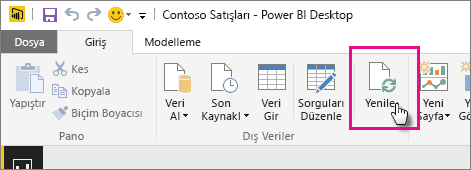
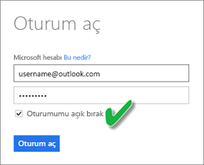

# OneDrive veya SharePoint Online'da depolanan veri kümelerini yenileme
OneDrive veya SharePoint Online gibi bulut depolama alanlarından Power BI hizmetine dosya aktarmak, **Power BI Desktop** uygulamasında yaptığınız çalışmaların Power BI hizmeti ile eşitlenmiş durumda kalmasını sağlamak için mükemmel bir yöntemdir.

## Power BI Desktop dosyalarını OneDrive veya SharePoint Online'da depolamanın avantajları
**Power BI Desktop** dosyalarını OneDrive veya SharePoint Online'da depoladığınızda, dosyanızın modeline yüklediğiniz tüm veriler veri kümesine aktarılır ve dosyada oluşturduğunuz tüm raporlar, Power BI hizmetindeki **Raporlar** bölümüne yüklenir. OneDrive veya SharePoint Online'daki dosyanızda yeni ölçü ekleme, sütun adlarını değiştirme veya görselleştirmeleri düzenleme gibi değişiklikler yaptığınızda bu değişiklikler, kaydedilmelerinin ardından genellikle yaklaşık bir saat içinde Power BI'da da güncelleştirilir.

Giriş şeridinden Yenile'yi seçerek Power BI Desktop'ta tek seferlik el ile yenileme gerçekleştirebilirsiniz. Burada Yenile'yi seçtiğinizde *dosya* modelindeki veriler özgün veri kaynağındaki güncel verilerle yenilenir. Tamamen Power BI Desktop uygulamasından gerçekleştirilen bu yenileme işlemi Power BI'daki el ile veya zamanlanan yenileme işlemlerinden farklıdır ve aradaki farkı kavramak önemlidir.

OneDrive veya SharePoint Online'da bulunan Power BI Desktop dosyanızı içeri aktardığınızda verilerin yanı sıra modelle ilgili diğer bilgiler Power BI'daki veri kümesine yüklenir. Power BI Desktop uygulamasından farklı olarak Power BI hizmetinde, Power BI hizmetindeki raporlarınızın temelini oluşturan, veri kümesindeki verileri yenilemek istersiniz. Veri kaynakları dışarıda olduğu için **Şimdi yenile** işlevini kullanarak veri kümesini el ile yenileyebilir veya **Yenilemeyi Zamanla** özelliğini kullanarak yenileme zamanı ayarlayabilirsiniz.

Veri kümesini yenilediğinizde Power BI güncelleştirilmiş verileri sorgulamak için OneDrive veya SharePoint Online'daki dosyaya bağlanmaz. Veri kümesindeki bilgileri kullanarak, güncelleştirilmiş verileri sorgulamak için doğrudan veri kaynaklarına bağlanır ve bu verileri veri kümesine yükler. Veri kümesindeki yenilenmiş veriler, OneDrive veya SharePoint Online'daki dosyayla eşitlenmez.

## Hangi veri kümeleri desteklenir?
Power BI'da Şimdi Yenile ve Yenilemeyi Zamanla işlemleri, aşağıdaki veri kaynaklarından birine bağlanmak ve bunlardan veri yüklemek için Veri Al/Sorgu Düzenleyicisi seçeneğinin kullanıldığı durumlarda bir yerel sürücüden içeri aktarılan Power BI Desktop dosyalarından oluşturulmuş veri kümeleri için desteklenir:

### Power BI Gateway - Personal
* Power BI Desktop'taki Veri Al ve Sorgu Düzenleyicisi bölümlerinde gösterilen tüm çevrimiçi veri kaynakları.
* Hadoop dosyası (HDFS) ve Microsoft Exchange dışında, Power BI Desktop'taki Veri Al ve Sorgu Düzenleyicisi bölümlerinde gösterilen tüm şirket içi veri kaynakları.

<!-- Refresh Data sources-->
[!INCLUDE [refresh-datasources](./includes/refresh-datasources.md)]

> [!NOTE]
> Power BI'ın şirket içi veri kaynaklarına bağlanması ve veri kümesini yenilemesi için bir ağ geçidinin yüklenmesi ve çalışıyor olması gerekmektedir.
> 
> 

## OneDrive veya OneDrive İş. Fark nedir?
Hem kişisel OneDrive hem de OneDrive İş kullanıyorsanız Power BI'a aktarmak istediğiniz dosyaları OneDrive İş hesabınızda tutmanız önerilir. Nedeni bu hesaplarda oturum açmak için muhtemelen farklı hesaplar kullanıyor olmanızdır.

Power BI'da oturum açmak için kullandığınız hesap, OneDrive İş'te oturum açmak için kullandığınız hesapla genellikle aynı olduğundan, Power BI'da OneDrive İş'e kesintisiz bir şekilde bağlanabilirsiniz. Ancak kişisel OneDrive hesabınızda oturum açmak için muhtemelen farklı bir [Microsoft hesabı](http://www.microsoft.com/account/default.aspx) kullanıyorsunuzdur.

Microsoft hesabınızda oturum açtığınızda Oturumumu açık bırak seçeneğini belirlemeyi unutmayın. Böylece Power BI, Power BI Desktop'taki dosyada yaptığınız tüm güncelleştirmeleri, Power BI'daki veri kümeleriyle eşitleyebilir  
    

Microsoft hesabı kimlik bilgileriniz değiştirilmiş olabileceğinden, OneDrive'daki dosyanızda yaptığınız değişikliklerin Power BI'daki veri kümesi veya raporlarla eşitlenememesi durumunda kişisel OneDrive hesabınızdaki dosyaya yeniden bağlanmanız ve dosyanızı tekrar içeri aktarmanız gerekir.

## Yenileme işlemini nasıl zamanlarım?
Bir yenileme zamanlaması belirlediğinizde, Power BI güncelleştirilen verileri sorgulamak için veri kümesindeki kimlik bilgilerini ve bağlantı bilgilerini kullanarak doğrudan veri kaynaklarına bağlanır ve ardından, güncelleştirilen verileri veri kümesine yükler. Power BI hizmetinde ilgili veri kümesini temel alan rapor ve panolardaki tüm görselleştirmeler de güncelleştirilir.

Yenileme zamanlamasını ayarlama ile ilgili daha fazla bilgi için bkz. [Yenileme Zamanlaması Yapılandırması](refresh-scheduled-refresh.md).

## Bir şeyler ters gittiğinde
Bir şeyler ters gittiğinde, sorun genellikle Power BI'ın veri kaynaklarında oturum açamamasından veya veri kümesi bir şirket içi veri kaynağına bağlandığında ağ geçidinin çevrimdışı olmasından kaynaklanır. Power BI'ın veri kaynaklarında oturum açabildiğinden emin olun. Bir veri kaynağında oturum açmak için kullandığınız parola değişirse veya Power BI'ın bir veri kaynağındaki oturumu kapanırsa Veri Kaynağı Kimlik Bilgilerini kullanarak veri kaynaklarınızda yeniden oturum açmayı deneyin.

OneDrive'da bulunan bir Power BI Desktop dosyasında değişiklik yapıp kaydettiğinizde bu değişiklikler bir saat içinde Power BI'a yansımıyorsa Power BI hizmeti OneDrive hesabınıza bağlanamıyor olabilir. OneDrive'daki dosyaya yeniden bağlanmayı deneyin. Oturum açmanız istenirse Oturumumu açık bırak'ı seçmeyi unutmayın. Power BI, dosyayı eşitlemek üzere OneDrive hesabınıza bağlanamadığı için dosyanızı yeniden içeri aktarmanız gerekir.

**Yenileme hatası bildirim e-postası almak istiyorum** seçeneğinin işaretlenmiş olduğundan emin olun. Bir zamanlanmış yenilemenin başarısız olup olmadığını hemen öğrenmenizde yarar vardır.

## Sorun giderme
Bazen verileri yenileme işlemi beklendiği gibi gitmeyebilir. Bu, genellikle ağ geçidiyle bağlantılı bir sorundan kaynaklanır. Araçlar ve bilinen sorunlara yönelik sorun giderme makalelerine göz atın.

[Şirket içi veri ağ geçidiyle ilgili sorunları giderme](service-gateway-onprem-tshoot.md)

[Power BI Gateway - Personal ile ilgili sorunları giderme](service-admin-troubleshooting-power-bi-personal-gateway.md)

Başka bir sorunuz mu var? [Power BI Topluluğu'na sorun](http://community.powerbi.com/)

